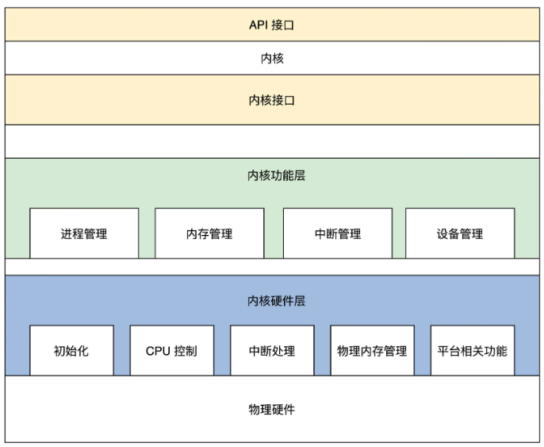
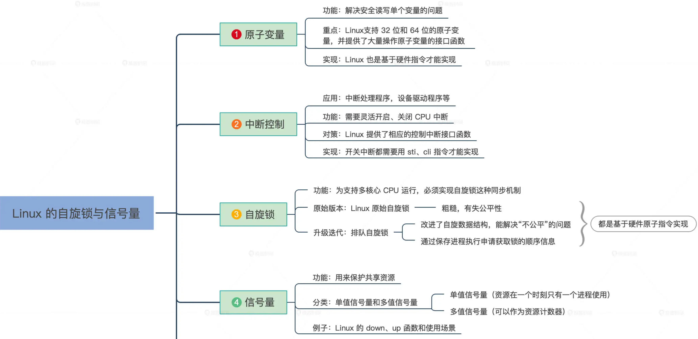
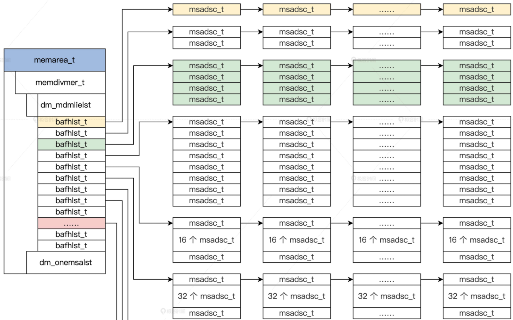
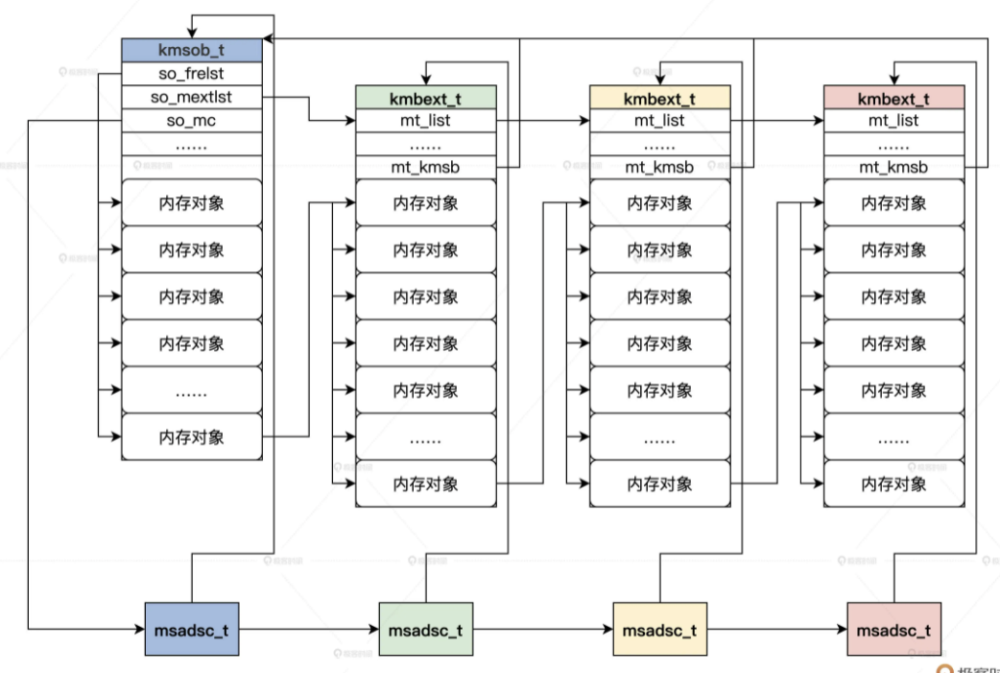

# HuOS: A hybrid kernel designed by me.
## Overview
## [First -- Prototype](./week1/README.md)  
首先借用GRUB实现一个最简单的内核  

## [Second -- Pre-Design](./week2/README.md)
HuOS混合内核架构的整体设计思路：首先它是一个宏内核，但是同时具备有微内核的特点，模块化设计，支持动态可加载和卸载。    
  

## [Third -- Theoretical Background](./week3/README.md)
### Hardware  
#### [X86 CPU执行程序的三种模式](./week3/x86_mode/README.md)  
#### [程序中地址转换的方式](./week3/address_transfer/README.md)  
#### [Cache与内存](./week3/cache%26mem/README.md)
### Synchronization Primitives
#### [并发操作中，解决数据同步的四种方法](./week3/Data_Synchronization/README.md)
#### [Linux下的自旋锁和信号量的实现](./week3/Data_Synchronization/README.md)

## [Forth -- Design(Boot Initialization)](./week4/README.md)
### [Code](./week4/HuOS3.0/)
#### [建立计算机](./week4/Build_Com/README.md)
#### [建造二级引导器](./week4/Build_sec_bootstrap/README.md)
#### [探查和收集信息](./week4/Get_Info/README.md)
#### [实现板级初始化并运行第一个C函数](./week4/init_run_c_code/README.md)

##### [Linux初始化----GRUB与VMLinuz结构](./week4/linux_init1/GRUB_VMLinuz.md)
##### [Linux初始化----从_start到第一个进程](./week4/linux_init2/first_process.md)

## [Fifth -- Design(Memory)](./week5/README.md)
### [Code](./week5/HuOS4.0/)
#### [划分与组织内存](./week5/Divide_Organize_Memory1/README.md)
#### [内存页面初始化](./week5/Divide_Organize_Memory2/README.md)
#### [内存页的分配与释放(内存管理)](./week5/Divide_Organize_Memory3/README.md)

#### [如何管理内存对象](./week5/Manage_Memory_Object/README.md)

#### [如何表示虚拟内存](./week5/virtual_memory/README.md)

