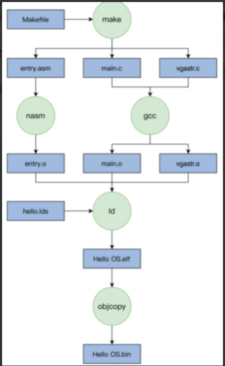
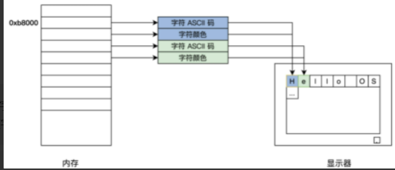
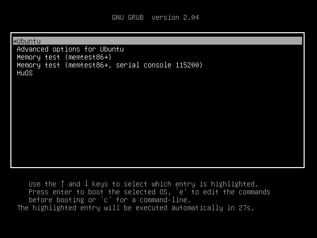

<!-- toc -->
首先借用GRUB来实现一个最简单的内核  

- [启动流程](#启动流程)
- [编译过程](#编译过程)
- [entry.asm](#entryasm)
    - [背景知识](#背景知识)
    - [指令解析](#指令解析)
- [main.c](#mainc)
- [vgastr.c&vgastr.h](#vgastrc--vgastrh)
    - [字符工作模式](#字符工作模式)
- [hello.lds](#hellolds)
- [Makefile](#makefile)
    - [Makefile语法](#makefile语法)
        - [Makefile中的伪目标](#makefile中的伪目标)
        - [Makefile-all](#makefile-all)
        - [Makefile-build](#makefile-build)
    - [文件中的一些执行参数解析](#文件中的一些执行参数解析)
- [实操](#实操)

<!-- tocstop -->
# 启动流程
**PC机加电 -> PC机 BIOS固件 -> 加载可引导设备中的GRUB -> GRUB引导 -> 加载硬盘分区中的HuOS文件 -> HuOS**  

BIOS初始化 CPU、内存及主板平台完后，会加载引导设备中第一个扇区数据到0x7c00地址开始的内存空间，并跳转过去执行指令。  

# 编译过程


# entry.asm
**_start是GRUB引导头，_entry是关掉中断，设定 CPU 的工作模式，初始化 CPU 的寄存器和 C 语言的运行环境。**  
## 背景知识

*NASM编译后的程序文件中的内存地址顺序是.text, .data，用户自定义section。  

*在实模式下，CPU是16位的，意思是，寄存器是16位的，数组总线（data bus）是16位的，但地址总线是20位的。物理内存地址的计算公式是：*物理地址 = 段地址 * 16 + 偏移量*。由于段地址和偏移量都是16位的，能寻址的最大内存地址是1M。  

*在保护模式下，内存地址仍然用“段地址：偏移量”的方式来表示。不过，“段地址”的含义不同于实模式下的“段地址”。在实模式下，段地址是物理地址的高地址部分，具体说，是高16位部分。 **而在保护模式下，段地址是选择子，指向一个结构，这个结构描述了一个内存区域，告知该区域的内存地址从哪里开始，在哪里结束，还告知了这片内存能不能被访问、能不能被读取等数据。** 这个结构组成一个集合，叫GDT，而这个结构叫GDT项，它有一个术语，叫“描述符”。  

*GDT的作用是提供段式存储机制。段式存储机制由段寄存器和GDT共同提供。段寄存器提供段值，即描述符在GDT中的索引，也就是选择子。根据选择子在GDT中找到目标描述符。这个描述符中包含一段内存的初始地址、这段内存的最大地址、这段内存的属性。  
## 指令解析
EQU指令用于定义常量。  

DD声明初始化的数据，用在模块的BSS段中：它们声明未初始化的存储空间。每一个带有单个操作数，用来表明字节数，字数，或双字数或其他的需要保留单位。  

# main.c
用C语言写的，最终它们分别由nasm和GCC编译成可链接模块，由LD链接器链接在一起，形成可执行的程序文件。  

# vgastr.c & vgastr.h
集成在主板的叫集显，做在CPU芯片内的叫核显，独立存在通过PCIE接口连接的叫独显。  

显卡支持的VESA的标准有两种工作模式：字符模式和图形模式，并且为了兼容这种标准会提供一种叫 VGABIOS 的固件程序。  
## 字符工作模式
屏幕分成 24 行，每行 80 个字符，把这（24*80）个位置映射到以 0xb8000 地址开始的内存中，每两个字节对应一个字符，其中一个字节是字符的 ASCII 码，另一个字节为字符的颜色值。  
  

# hello.lds
该文件是一个链接描述文件，指定链接器应如何链接目标文件和库。链接器脚本可用于指定诸如输出文件不同部分的地址或部分出现的顺序之类的内容。  

# Makefile
进行系统编译，即把每个代码模块编译最后链接成可执行的二进制文件。  
## Makefile语法
首先有一个或者多个构建目标称为“target”；目标后面紧跟着用于构建该目标所需要的文件，目标下面是构建该目标所需要的命令及参数。  
* $@ 表示当前目标文件  
* $< 表示第一个依赖文件  
* $? 比目标更新的所有前置条件，之间以空格分隔。比如，规则为 t: p1 p2，其中p2的时间戳比t新，$?就指代p2  
* $^ 表示所有前置条件  
* \$* 指代匹配符\%匹配的部分，比如\%匹配f1.txt中的f1，$*就表示f1(不包含扩展名的目标文件名称)  
### Makefile中的伪目标
除了文件名，目标还可以是某个操作的名字，这称为"伪目标"（phony target）  
```
clean:
      rm *.o
```
上面代码的目标是clean，它不是文件名，而是一个操作的名字，属于"伪目标 "，作用是删除对象文件  
```
$ make  clean
```
但是，如果当前目录中，正好有一个文件叫做clean，那么这个命令不会执行。因为Make发现clean文件已经存在，就认为没有必要重新构建了，就不会执行指定的rm命令。为了避免这种情况，可以明确声明clean是"伪目标"，写法如下。
```
.PHONY: clean
clean:
        rm *.o temp
```
声明clean是"伪目标"之后，make就不会去检查是否存在一个叫做clean的文件，而是每次运行都执行对应的命令。  
如果Make命令运行时没有指定目标，默认会执行Makefile文件的第一个目标。
```
$ make
```
### Makefile all
In this file the all target depends on the clean, build, link, and bin targets, which means that running make all will first clean any existing build artifacts, then build the project, link the object files, and generate the final binary image.  
我理解为伪目标的执行顺序。  

### Makefile build
The build target depends on the object files (entry.o, main.o, vgastr.o), which means that running make build will build these object files.  

## 文件中的一些执行参数解析 
```
nasm -f elf -w-orphan-labels
```
nasm: This is the command to run the Netwide Assembler (NASM), which is a popular assembler for x86 architecture.  

-f elf: This option specifies the output file format. In this case, elf stands for "Executable and Linkable Format," which is a common format for executables on Unix-like systems.  

-w-orphan-labels: This option disables the warning that NASM prints when it encounters a label that is not used by any instruction in the code.  

***
```
gcc -c -Os -std=c99 -m32 -Wall -Wshadow -W -Wconversion -Wno-sign-conversion  -fno-stack-protector -fomit-frame-pointer -fno-builtin -fno-common  -ffreestanding  -Wno-unused-parameter -Wunused-variable
```
-c: This option tells GCC to compile the source code files, but not to run the linker. The resulting object files will be created for each source file.

-Os: This option sets the optimization level to "size," which means that the compiler will try to reduce the size of the generated code at the expense of compilation time and runtime performance.

-std=c99: This option specifies the version of the C standard to be used. In this case, c99 stands for the 1999 version of the ISO C standard.

-m32: This option specifies that the generated code should be 32-bit.

-Wall: This option enables all warning messages.

-Wshadow: This option enables warning messages for variables that shadow other variables with the same name.

-W: This option enables warning messages that are not turned on by -Wall.

-Wconversion: This option enables warning messages for type conversions that may change the value of the expression.

-Wno-sign-conversion: This option disables warning messages for sign conversions.

-fno-stack-protector: This option disables the stack protector feature, which adds extra code to check for buffer overflows and other stack smashing attacks.

-fomit-frame-pointer: This option allows the compiler to omit the frame pointer on machines where doing so does not interfere with debugging.

-fno-builtin: This option disables the use of built-in functions, which are functions that are implemented by the compiler itself rather than in a separate library.

-fno-common: This option disables the treatment of "common" symbols (uninitialized global variables) as "tentative" definitions in C.

-ffreestanding: This option specifies that the code is being compiled for a freestanding environment, which means that it is not being linked against any standard libraries.

-Wno-unused-parameter: This option disables warning messages for unused function parameters.

-Wunused-variable: This option enables warning messages for variables that are defined but not used.  

***
```
ld -s -static -T hello.lds -n -Map HelloOS.map
```
获取目标文件并将它们组合成单个可执行文件、库或另一个目标文件。  

-s This flag tells the linker to strip all symbol information from the output file. This can reduce the size of the output file, but it also makes it difficult to debug or modify the program later.

-static This flag tells the linker to use static linking. When static linking, the linker includes all the object files and libraries that are needed to run the program in the output file. This makes the output file larger, but it also means that the program can be run on a machine that does not have the shared libraries installed.

-T This flag is followed by a file name, in this case "hello.lds". This file is a linker script that specifies how the linker should link the object files and libraries. The linker script can be used to specify things like the addresses of different sections of the output file, or the order in which the sections should appear.

-n This flag tells the linker to not include a symbol table in the output file. This can make the output file smaller, but it also makes it more difficult to debug or modify the program later.

-Map This flag is followed by a file name, in this case "HelloOS.map". This tells the linker to generate a map file with the specified name. The map file contains information about the symbols and sections in the output file, as well as the addresses at which they are located. This can be helpful for debugging or for understanding the layout of the output file.

***
```
objcopy -S -O binary
```
objcopy 是一个用于复制和操作目标文件的实用程序。它可用于从目标文件中提取数据，或通过组合或修改现有目标文件来创建新的目标文件。  

-S This flag tells objcopy to strip all symbol information from the input file. This can reduce the size of the output file, but it also makes it difficult to debug or modify the program later.

-O This flag is followed by a file format name, in this case "binary". This specifies the format of the output file. In this case, the output file will be a raw binary file containing the contents of the input file.

objcopy 可用于将目标文件从一种格式转换为另一种格式，或从目标文件中提取特定数据。例如，您可以使用 objcopy 提取目标文件的代码部分并将其保存到单独的文件中，**或者将 ELF 目标文件转换为可以加载到内存中并由处理器执行的原始二进制文件**。

# 实操
此时通过make已经获得了HuOS.bin文件，但是我们还要让 GRUB 能够找到它，才能在计算机启动时加载它。
GRUB 在启动时会加载一个 grub.cfg 的文本文件，根据其中的内容执行相应的操作，其中一部分内容就是启动项。  
```
#把下面的代码复制，然后插入到/boot/grub/grub.cfg文件末尾  
#然后把HuOS.bin文件复制到/boot/目录下  
#最后重启计算机就可以看到HuOS启动选项了  
menuentry 'HuOS' {
    insmod part_msdos
    insmod ext2
    set root='hd0,msdos5'  #注意boot目录挂载的分区，这是我机器上的情况
    multiboot2 /boot/HelloOS.bin
    boot
}
```  
如果你不知道你的 boot 目录挂载的分区，可以在 Linux 系统的终端下输入命令：df /boot/，就会得到如下结果：
```
文件系统      1K-块       已用      可用     已用%  挂载点 
/dev/sda4    48752308   8087584  38158536   18%     /
```
其中的“sda4”就是硬盘的第四个分区（硬件分区选择 MBR），但是 GRUB 的 menuentry 中不能写 sda4，而是要写'hd0,msdos4'。  

