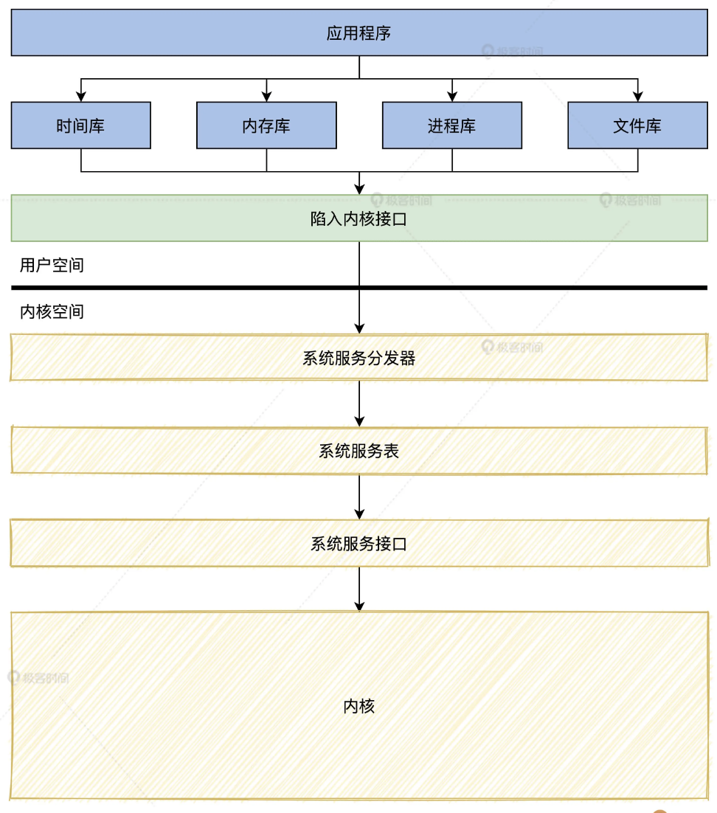
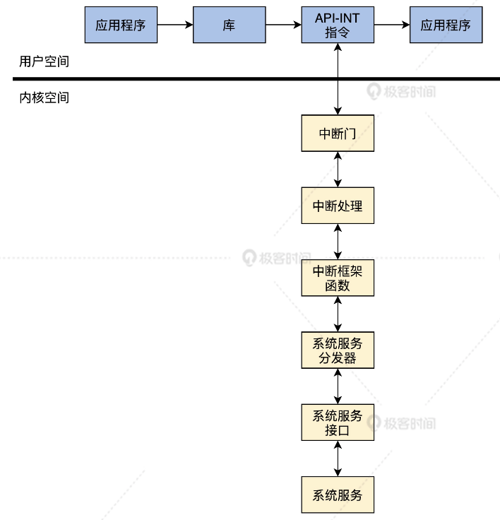

<!-- toc -->
系统已经有内存管理，进程、文件、I/O 了，这些重要的组件已经建立了，也就是说它们可以向应用程序提供服务了。 HuOS 的服务接口也就是系统的API。
- [服务接口的结构](#服务接口的结构)
- [如何进入内核](#如何进入内核)
    - [软中断指令](#软中断指令)
    - [传递参数](#传递参数)
- [系统服务分发器](#系统服务分发器)
    - [实现系统服务分发器](#实现系统服务分发器)
    - [系统服务表](#系统服务表)
- [系统服务实例](#系统服务实例)
    - [时间库](#时间库)
    - [时间 API 接口](#时间-api-接口)
    - [内核态时间服务接口](#内核态时间服务接口)
    - [实现时间服务](#实现时间服务)
    - [系统服务函数的执行过程](#系统服务函数的执行过程)
<!-- tocstop -->

# 服务接口的结构
HuOS 的 API 数量很多，所以我们先来分个类，它们分别是进程类、内存类、文件类和时间类的 API。这些 API 还会被上层 C 库封装，方便应用程序调用。  
  
库函数是对系统服务的封装，有的库函数是直接调用相应的系统服务；还有一些库函数完成的功能不需要调用相应的系统调用，这时前台接待人员也就是“库函数”，可以自行处理。  

# 如何进入内核
应用程序和库函数都在用户空间中，而系统服务却在内核空间中，想要让代码控制流从用户空间进入到内核空间中，如何穿过 CPU 保护模式的“铜墙铁壁”才是关键。  
## 软中断指令
CPU 长模式下如何处理中断的  
设备向 CPU 发送一个中断信号，CPU 接受到这个电子信号后，在允许响应中断的情况下，就会中断当前正在运行的程序，自动切换到相应的 CPU R0 特权级，并跳转到中断门描述符中相应的地址上运行中断处理代码。这里的中断处理代码就是操作系统内核的代码，这样 CPU 的控制权就转到操作系统内核的手中了。  

其实，应用软件也可以给 CPU 发送中断。现代 CPU 设计时都会设计这样一条指令，一旦执行该指令，CPU 就要中断当前正在运行的程序，自动跳转到相应的固定地址上运行代码。当然这里的代码也就是操作系统内核的代码，就这样 CPU 的控制权同样会回到操作系统内核的手中。**因为这条指令模拟了中断的电子信号，所以称为软中断指令。** 在 x86 CPU 上这条指令是 int 指令。例如 int255。int 指令后面需要跟一个常数，这个常数表示 CPU 从中断表描述符表中取得第几个中断描述符进入内核。  
## 传递参数
int解决了应用程序进入操作系统内核函数的底层机制，但是我们还需要解决参数传递的问题。  
_因为你必须要告诉操作系统你要干什么，系统才能做出相应的反馈。比如你要分配内存，分配多大的内存，这些信息必须要以参数的形式传递给操作系统内核。_  

因为应用程序运行在用户空间时，用的是用户栈，当它切换到内核空间时，用的是内核栈。所以参数的传递，就需要硬性地规定一下，要么所有的参数都用寄存器传递，要么所有的参数都保存在用户栈中。  
我们使用 RBX、RCX、RDX、RDI、RSI 这 5 个寄存器来传递参数，事实上一个系统服务接口函数不会超过 5 个参数，所以这是足够的。而 RAX 寄存器中保存着一个整数，称为系统服务号。在系统服务分发器中，会根据这个系统服务号调用相应的函数。（64位 x86）  
_因为 C 编译器不能处理这种参数传递形式，另外 C 编译器也不支持 int 指令，所以要用汇编代码来处理这种问题。_
```c
HuOS16.0/include/libinc/lapinrentry.h

//传递一个参数所用的宏
#define API_ENTRY_PARE1(intnr,rets,pval1) \
__asm__ __volatile__(\
         "movq %[inr],%%rax\n\t"\//系统服务号
         "movq %[prv1],%%rbx\n\t"\//第一个参数
         "int $255 \n\t"\//触发中断
         "movq %%rax,%[retval] \n\t"\//处理返回结果
         :[retval] "=r" (rets)\
         :[inr] "r" (intnr),[prv1]"r" (pval1)\
         :"rax","rbx","cc","memory"\
    )

//传递四个参数所用的宏
#define API_ENTRY_PARE4(intnr,rets,pval1,pval2,pval3,pval4) \
__asm__ __volatile__(\
         "movq %[inr],%%rax \n\t"\//系统服务号
         "movq %[prv1],%%rbx \n\t"\//第一个参数
         "movq %[prv2],%%rcx \n\t"\//第二个参数
         "movq %[prv3],%%rdx \n\t"\//第三个参数
         "movq %[prv4],%%rsi \n\t"\//第四个参数
         "int $255 \n\t"\//触发中断
         "movq %%rax,%[retval] \n\t"\//处理返回结果
         :[retval] "=r" (rets)\
         :[inr] "r" (intnr),[prv1]"g" (pval1),\
         [prv2] "g" (pval2),[prv3]"g" (pval3),\
         [prv4] "g" (pval4)\
         :"rax","rbx","rcx","rdx","rsi","cc","memory"\
    )
```
上述代码中只展示了两个宏。其实是有四个，在代码文件中我已经帮你写好了，主要功能是用来解决传递参数和触发中断问题，并且还需要处理系统返回的结果。这些都是用 C 语言中嵌入汇编代码的方式来实现的。  
下面我们用它来写一个系统服务接口  
```c
//请求分配内存服务
void* api_mallocblk(size_t blksz)
{
    void* retadr;
    //把系统服务号，返回变量和请求分配的内存大小
    API_ENTRY_PARE1(INR_MM_ALLOC,retadr,blksz);
    return retadr;
}
```
上述代码可以被库函数调用，也可以由应用程序直接调用，它用 API_ENTRY_PARE1 宏传递参数和触发中断进入 HuOS 内核，最终将由内存管理模块相应分配内存服务的请求。  

# 系统服务分发器
随着系统功能的增加，系统服务也会增加，但是中断的数量却是有限的，所以我们不能每个系统服务都占用一个中断描述符。  
其实我们可以只使用一个中断描述符，然后通过系统服务号来区分是哪个服务。这其实就是系统服务器分发器完成的工作。  
## 实现系统服务分发器
由中断处理代码调用，在它的内部根据系统服务号来调用相应的服务。  
```c
HuOS16.0/kernel/krlservice.c

sysstus_t krlservice(uint_t inr, void* sframe)
{
    if(INR_MAX <= inr)//判断服务号是否大于最大服务号
    {
        return SYSSTUSERR;
    }
    if(NULL == osservicetab[inr])//判断是否有服务接口函数
    {
        return SYSSTUSERR;
    }
    return osservicetab[inr](inr, (stkparame_t*)sframe);//调用对应的服务接口函数
}
```
先对服务号进行判断，如果大于系统中最大的服务号，就返回一个错误状态表示服务失败。然后判断是否有服务接口函数。最后这两个检查通过之后，就可以调用相应的服务接口了。  
krlservice 函数是谁调用的呢？答案是中断处理的框架函数  
```c
sysstus_t hal_syscl_allocator(uint_t inr,void* krnlsframp)
{
    return krlservice(inr,krnlsframp);
}
```
hal_syscl_allocator 函数则是由我们系统中断处理的第一层汇编代码调用的，这个汇编代码主要是将进程的用户态 CPU 寄存器保存在内核栈中  
```s
HuOS16.0/include/halinc/kernel.inc

%macro  EXI_SCALL  0
  push rbx//保存通用寄存器到内核栈
  push rcx
  push rdx
  push rbp
  push rsi
  push rdi
    //删除了一些代码
  mov  rdi, rax //处理hal_syscl_allocator函数第一个参数inr
  mov rsi, rsp //处理hal_syscl_allocator函数第二个参数krnlsframp
  call hal_syscl_allocator //调用hal_syscl_allocator函数
  //删除了一些代码
  pop rdi
  pop rsi
  pop rbp
  pop rdx
  pop rcx
  pop rbx//从内核栈中恢复通用寄存器
  iretq //中断返回
%endmacro

//HuOS16.0/hal/x86/kernel.asm

exi_sys_call:
  EXI_SCALL
```
上述代码中的 exi_sys_call 标号的地址保存在第 255 个中断门描述符中。这样执行了 int $255 之后，CPU 就会自动跳转到 exi_sys_call 标号处运行，从而进入内核开始运行，最终调用 krlservice 函数，开始执行系统服务。  
## 系统服务表
系统服务表能在 krlservice 函数中根据服务号，**调用相应系统服务表中相应的服务入口函数。定义为全局函数指针数组类型。**  
```c
HuOS16.0/kernel/krlglobal.c

typedef struct s_STKPARAME
{
    u64_t gs;
    u64_t fs;
    u64_t es;
    u64_t ds;
    u64_t r15;
    u64_t r14;
    u64_t r13;
    u64_t r12;
    u64_t r11;
    u64_t r10;
    u64_t r9;
    u64_t r8;
    u64_t parmv5;//rdi;
    u64_t parmv4;//rsi;
    u64_t rbp;
    u64_t parmv3;//rdx;
    u64_t parmv2;//rcx;
    u64_t parmv1;//rbx;
    u64_t rvsrip;
    u64_t rvscs;
    u64_t rvsrflags;
    u64_t rvsrsp;
    u64_t rvsss;
}stkparame_t;
//服务函数类型
typedef sysstus_t (*syscall_t)(uint_t inr,stkparame_t* stkparm);
//HuOS16.0/kernel/krlglobal.c
KRL_DEFGLOB_VARIABLE(syscall_t,osservicetab)[INR_MAX]={};
```
执行 int 指令后 CPU 会进入中断处理流程。中断处理流程的第一步就是把 CPU 的寄存器压入内核栈中，前面系统传递参数正是通过寄存器传递的，而寄存器的值就保存在内核栈中。所以我们需要定义一个 stkparame_t 结构，用来提取内核栈中的参数。  
接着是第二步，我们可以查看一下 hal_syscl_allocator 函数的第二个参数，正是传递的 RSP 寄存器的值，只要把这个值转换成 stkparame_t 结构的地址，就能提取内核栈中的参数了。但是目前 osservicetab 数组中为空，什么也没有，这是因为我们还没有实现相应服务接口函数。下面我们就来实现它。  

# 系统服务实例
## 时间库
应用程序开发者往往不是直接调用系统 API（应用程序编程接口，我们称为服务接口），而是经常调用某个库来达到目的。  
```c
HuOS16.0/lib/libtime.c

//时间库函数
sysstus_t time(times_t *ttime)
{
    sysstus_t rets = api_time(ttime);//调用时间API
    return rets;
}
```
time 库函数非常简单，就是对系统 API 的封装、应用程序需要传递一个 times_t 结构的地址，这是这个系统 API 的要求， 这个结构也是由系统定义的  
```c
typedef struct s_TIME
{
    uint_t      year;
    uint_t      mon;
    uint_t      day;
    uint_t      date;
    uint_t      hour;
    uint_t      min;
    uint_t      sec;
}times_t;
```
上述结构中定义了年、月、日、时、分、秒。系统内核会将时间信息填入这个结构中，然后返回，这样一来，时间数据就可以返回给应用程序了。  
## 时间 API 接口
在库中需要调用时间 API 接口，因为库和 API 接口函数不同层次的，有时应用程序也会直接调用 API 接口函数，所以我们要分为不同模块。  
```c
HuOS16.0/lib/lapitime.c

sysstus_t api_time(buf_t ttime)
{
    sysstus_t rets;
    API_ENTRY_PARE1(INR_TIME,rets,ttime);//处理参数，执行int指令 
    return rets;
}
```
INR_TIME 是系统服务号，它经过 API_ENTRY_PARE1 宏处理，把 INR_TIME 和 ttime、rets 关联到相应的寄存器。最后就是执行 int 指令进入内核，开始运行时间服务代码。  
## 内核态时间服务接口
执行 int 指令后，就进入了内核模式下开始执行内核代码了。系统服务分发器会根据服务号从系统服务表中取出相应的函数并调用。这里取用的自然就是时间服务的接口函数。  
```c
HuOS16.0/kernel/krltime.c

sysstus_t krlsvetabl_time(uint_t inr, stkparame_t *stkparv)
{
    if (inr != INR_TIME)//判断是否时间服务号
    {
        return SYSSTUSERR;
    }
    //调用真正时间服务函数
    return krlsve_time((time_t *)stkparv->parmv1);
}
```
krlsvetabl_time 函数一定要放在系统服务表中才可以，系统服务表其实是个函数指针数组。虽然前面已经提过了，但是那时 osservicetab 数组是空的，现在我们要把 krlsvetabl_time 函数放进去  
```c
KRL_DEFGLOB_VARIABLE(syscall_t, osservicetab)[INR_MAX] = {
    NULL, krlsvetabl_mallocblk,//内存分配服务接口
    krlsvetabl_mfreeblk, //内存释放服务接口
    krlsvetabl_exel_thread,//进程服务接口
    krlsvetabl_exit_thread,//进程退出服务接口
    krlsvetabl_retn_threadhand,//获取进程id服务接口
    krlsvetabl_retn_threadstats,//获取进程状态服务接口
    krlsvetabl_set_threadstats,//设置进程状态服务接口
    krlsvetabl_open, krlsvetabl_close,//文件打开、关闭服务接口
    krlsvetabl_read, krlsvetabl_write,//文件读、写服务接口
    krlsvetabl_ioctrl, krlsvetabl_lseek,//文件随机读写和控制服务接口
    krlsvetabl_time //获取时间服务接口
};
```
这样就能调用到 krlsvetabl_time 函数完成服务功能了。  
## 实现时间服务
上面我们只实现了时间服务的接口函数，这个函数还需要调用真正完成功能的函数  
```c
HuOS16.0/kernel/krltime.c

sysstus_t krlsve_time(time_t *time)
{
    if (time == NULL)//对参数进行判断
    {
        return SYSSTUSERR;
    }
    ktime_t *initp = &osktime;//操作系统保存时间的结构
    cpuflg_t cpufg;
    krlspinlock_cli(&initp->kt_lock, &cpufg);//加锁
    time->year = initp->kt_year;
    time->mon = initp->kt_mon;
    time->day = initp->kt_day;
    time->date = initp->kt_date;
    time->hour = initp->kt_hour;
    time->min = initp->kt_min;
    time->sec = initp->kt_sec;//把时间数据写入到参数指向的内存
    krlspinunlock_sti(&initp->kt_lock, &cpufg);//解锁
    return SYSSTUSOK;//返回正确的状态
}
```
krlsve_time 函数，只是把系统的时间数据读取出来，写入用户应用程序传入缓冲区中，由于 osktime 这个结构实例会由其它代码自动更新，所以要加锁访问。  
## 系统服务函数的执行过程
从库函数到进入中断再到系统服务分发器，最后到系统服务函数的全过程  
  
应用程序在用户空间中运行，调用库函数，库函数调用 API 函数执行 INT 指令，进入中断门，从而运行内核代码。最后内核代码一步步执行了相关服务功能，返回到用户空间继续运行应用程序。  

int 指令后面的常数能不能大于 255，为什么？  
x86 CPU 最大支持 256 个中断源（即中断号：0~255）  