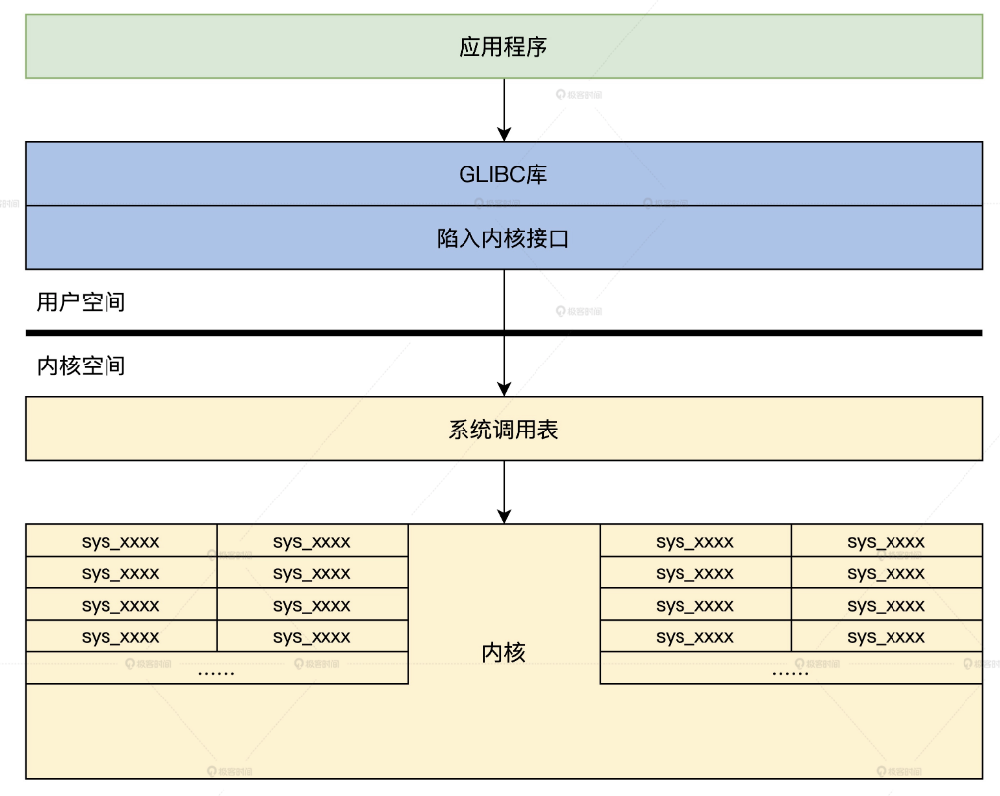
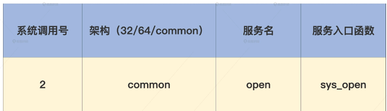
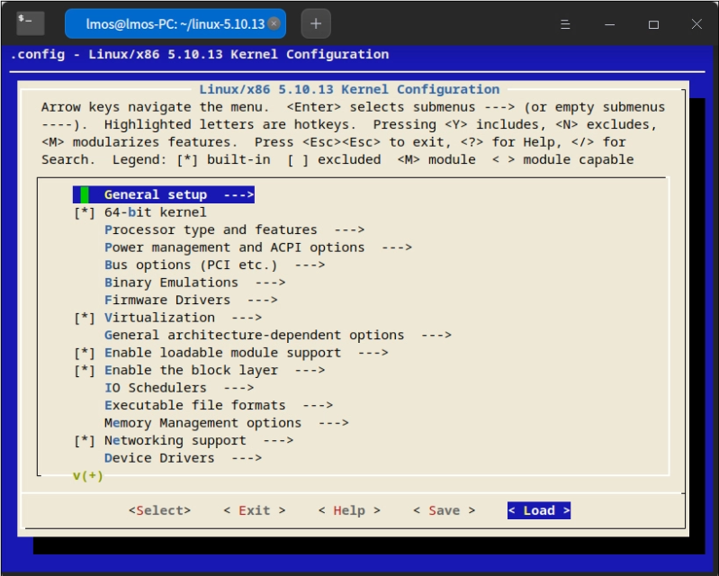

<!-- toc -->
如何实现系统API
- [Linux 内核 API 接口的架构](#linux-内核-api-接口的架构)
- [Linux 内核有多少 API 接口](#linux-内核有多少-api-接口)
- [Linux 系统调用表](#linux-系统调用表)
- [Linux 系统调用实现](#linux-系统调用实现)
    - [下载 Linux 源码](#下载-linux-源码)
    - [定义系统调用](#定义系统调用)
    - [编译 Linux 内核](#编译-linux-内核)
    - [编写应用测试](#编写应用测试)
<!-- tocstop -->

# Linux 内核 API 接口的架构
Linux 内核也是一样，应用程序会调用库函数，在库函数中调用 API 入口函数，触发中断进入 Linux 内核执行系统调用，完成相应的功能服务。在 Linux 内核之上，使用最广泛的 C 库是 glibc。  
open 库函数（glibc 虽然开源了，但是并没有在 Linux 内核代码之中）  
```c
//glibc/intl/loadmsgcat.c
#ifdef _LIBC
# define open(name, flags)  __open_nocancel (name, flags)
# define close(fd)      __close_nocancel_nostatus (fd)
#endif
//glibc/sysdeps/unix/sysv/linux/open_nocancel.c
int __open_nocancel (const char *file, int oflag, ...)
{
  int mode = 0;
  if (__OPEN_NEEDS_MODE (oflag))
    {
      va_list arg;
      va_start (arg, oflag);//解决可变参数
      mode = va_arg (arg, int);
      va_end (arg);
    }
  return INLINE_SYSCALL_CALL (openat, AT_FDCWD, file, oflag, mode);
}
//glibc/sysdeps/unix/sysdep.h
//这是为了解决不同参数数量的问题
#define __INLINE_SYSCALL0(name) \
  INLINE_SYSCALL (name, 0)
#define __INLINE_SYSCALL1(name, a1) \
  INLINE_SYSCALL (name, 1, a1)
#define __INLINE_SYSCALL2(name, a1, a2) \
  INLINE_SYSCALL (name, 2, a1, a2)
#define __INLINE_SYSCALL3(name, a1, a2, a3) \
  INLINE_SYSCALL (name, 3, a1, a2, a3)
#define __INLINE_SYSCALL_NARGS_X(a,b,c,d,e,f,g,h,n,...) n
#define __INLINE_SYSCALL_NARGS(...) \
  __INLINE_SYSCALL_NARGS_X (__VA_ARGS__,7,6,5,4,3,2,1,0,)
#define __INLINE_SYSCALL_DISP(b,...) \
  __SYSCALL_CONCAT (b,__INLINE_SYSCALL_NARGS(__VA_ARGS__))(__VA_ARGS__)
#define INLINE_SYSCALL_CALL(...) \
  __INLINE_SYSCALL_DISP (__INLINE_SYSCALL, __VA_ARGS__)

//glibc/sysdeps/unix/sysv/linux/sysdep.h
//关键是这个宏
/*
这是一个宏，用于执行一个内部系统调用。name 是系统调用的名称，nr 是系统调用号，args... 是系统调用的参数列表。它会将系统调用的名称和参数传递给一个以 internal_syscall##nr 为名的函数，并执行这个函数来进行系统调用。
*/
#define INLINE_SYSCALL(name, nr, args...)       \
  ({                  \
    long int sc_ret = INTERNAL_SYSCALL (name, nr, args);    \
    __glibc_unlikely (INTERNAL_SYSCALL_ERROR_P (sc_ret))    \
    ? SYSCALL_ERROR_LABEL (INTERNAL_SYSCALL_ERRNO (sc_ret))   \
    : sc_ret;               \
  })

/*这是一个宏，用于执行一个内联的系统调用。它使用 INTERNAL_SYSCALL 宏来进行系统调用，然后对系统调用的返回值进行处理。如果系统调用返回一个错误码，它会跳转到标签 SYSCALL_ERROR_LABEL 处；否则，返回系统调用的结果。*/
#define INTERNAL_SYSCALL(name, nr, args...)       \
  internal_syscall##nr (SYS_ify (name), args)
/*这也是一个宏，用于执行一个内部系统调用，类似于 INTERNAL_SYSCALL。但是，它允许直接指定系统调用号 number，而不是通过 name 来获取系统调用号。*/
#define INTERNAL_SYSCALL_NCS(number, nr, args...)     \
  internal_syscall##nr (number, args)

//这是需要6个参数的宏
#define internal_syscall6(number, arg1, arg2, arg3, arg4, arg5, arg6) \
({                  \
    unsigned long int resultvar;          \
    TYPEFY (arg6, __arg6) = ARGIFY (arg6);        \
    TYPEFY (arg5, __arg5) = ARGIFY (arg5);        \
    TYPEFY (arg4, __arg4) = ARGIFY (arg4);        \
    TYPEFY (arg3, __arg3) = ARGIFY (arg3);        \
    TYPEFY (arg2, __arg2) = ARGIFY (arg2);        \
    TYPEFY (arg1, __arg1) = ARGIFY (arg1);        \
    register TYPEFY (arg6, _a6) asm ("r9") = __arg6;      \
    register TYPEFY (arg5, _a5) asm ("r8") = __arg5;      \
    register TYPEFY (arg4, _a4) asm ("r10") = __arg4;     \
    register TYPEFY (arg3, _a3) asm ("rdx") = __arg3;     \
    register TYPEFY (arg2, _a2) asm ("rsi") = __arg2;     \
    register TYPEFY (arg1, _a1) asm ("rdi") = __arg1;     \
    asm volatile (              \
    "syscall\n\t"             \
    : "=a" (resultvar)              \
    : "0" (number), "r" (_a1), "r" (_a2), "r" (_a3), "r" (_a4),   \
      "r" (_a5), "r" (_a6)            \
    : "memory", REGISTERS_CLOBBERED_BY_SYSCALL);      \
    (long int) resultvar;           \
})
```
可以清楚地看到，open 只是宏，实际工作的是 __open_nocancel 函数，其中会用 INLINE_SYSCALL_CALL 宏经过一系列替换，最终根据参数的个数替换成相应的 internal_syscall##nr 宏。  
比如有 6 个参数，就会替换成 internal_syscall6。其中 number 是系统调用号，参数通过寄存器传递的。但是这里我们没有发现 int 指令，这是因为这里用到的指令是最新处理器为其设计的系统调用指令 syscall。这个指令和 int 指令一样，都可以让 CPU 跳转到特定的地址上，只不过不经过中断门，系统调用返回时要用 sysexit 指令。  
  

# Linux 内核有多少 API 接口
具体我们需要对 Linux 代码进行编译，在编译的过程中，根据 syscall_32.tbl 和 syscall_64.tbl 生成自己的 syscalls_32.h 和 syscalls_64.h 文件。  
生成方式在 arch/x86/entry/syscalls/Makefile 文件中。这里面会使用两个脚本，即 syscallhdr.sh、syscalltbl.sh，它们最终生成的 syscalls_32.h 和 syscalls_64.h 两个文件中就保存了系统调用号和系统调用实现函数之间的对应关系，在里面可以看到 Linux 内核的系统调用号，即 API 号。  
```c
//linux/arch/x86/include/generated/asm/syscalls_64.h
__SYSCALL_COMMON(0, sys_read)
__SYSCALL_COMMON(1, sys_write)
__SYSCALL_COMMON(2, sys_open)
__SYSCALL_COMMON(3, sys_close)
__SYSCALL_COMMON(4, sys_newstat)
__SYSCALL_COMMON(5, sys_newfstat)
__SYSCALL_COMMON(6, sys_newlstat)
__SYSCALL_COMMON(7, sys_poll)
__SYSCALL_COMMON(8, sys_lseek)
//……
__SYSCALL_COMMON(435, sys_clone3)
__SYSCALL_COMMON(436, sys_close_range)
__SYSCALL_COMMON(437, sys_openat2)
__SYSCALL_COMMON(438, sys_pidfd_getfd)
__SYSCALL_COMMON(439, sys_faccessat2)
__SYSCALL_COMMON(440, sys_process_madvise)
//linux/arch/x86/include/generated/uapi/asm/unistd_64.h
#define __NR_read 0
#define __NR_write 1
#define __NR_open 2
#define __NR_close 3
#define __NR_stat 4
#define __NR_fstat 5
#define __NR_lstat 6
#define __NR_poll 7
#define __NR_lseek 8
//……
#define __NR_clone3 435
#define __NR_close_range 436
#define __NR_openat2 437
#define __NR_pidfd_getfd 438
#define __NR_faccessat2 439
#define __NR_process_madvise 440
#ifdef __KERNEL__
#define __NR_syscall_max 440
#endif
```
已经定义了 __NR_syscall_max 为 440，这说明 Linux 内核一共有 441 个系统调用，而系统调用号从 0 开始到 440 结束，所以最后一个系统调用是 sys_process_madvise。其实，__SYSCALL_COMMON 除了表示系统调用号和系统调用函数之间的关系，还会在 Linux 内核的系统调用表中进行相应的展开。  

# Linux 系统调用表
Linux 内核有 400 多个系统调用，它使用了一个函数指针数组，存放所有的系统调用函数的地址，通过数组下标就能索引到相应的系统调用。这个数组叫 sys_call_table，即 Linux 系统调用表。  
__SYSCALL_COMMON 首先会替换成 __SYSCALL_64，因为我们编译的 Linux 内核是 x86_64 架构的  
```c
#define __SYSCALL_COMMON(nr, sym) __SYSCALL_64(nr, sym)
//第一次定义__SYSCALL_64
#define __SYSCALL_64(nr, sym) extern asmlinkage long sym(unsigned long, unsigned long, unsigned long, unsigned long, unsigned long, unsigned long) ;

#include <asm/syscalls_64.h>//第一次包含syscalls_64.h文件，其中的宏会被展开一次，例如__SYSCALL_COMMON(2, sys_open)会被展开成：extern asmlinkage long sys_open(unsigned long, unsigned long, unsigned long, unsigned long, unsigned long, unsigned long) ;
//取消__SYSCALL_64定义
#undef __SYSCALL_64
//第二次重新定义__SYSCALL_64; 将系统调用函数名 sym 和对应的系统调用号 nr 组成一个数组项，用于初始化系统调用表。
#define __SYSCALL_64(nr, sym) [ nr ] = sym,

//表示一个不存在的系统调用函数 sys_ni_syscall。这个函数通常被用作默认的系统调用函数，即当用户调用了不存在的系统调用时，会调用这个函数进行默认处理。
extern asmlinkage long sys_ni_syscall(unsigned long, unsigned long, unsigned long, unsigned long, unsigned long, unsigned long);
//这是一个系统调用表，用于存储系统调用函数的指针。它是一个数组，其中每个元素对应一个系统调用号，存储着对应系统调用函数的指针。这个数组的大小是 __NR_syscall_max + 1，其中 __NR_syscall_max 表示最大的系统调用号。
//这是对系统调用表的初始化，默认将所有的系统调用函数指针设置为指向 sys_ni_syscall 函数，即默认系统调用函数。
const sys_call_ptr_t sys_call_table[] ____cacheline_aligned = {
    [0 ... __NR_syscall_max] = &sys_ni_syscall,//默认系统调用函数，什么都不干
#include <asm/syscalls_64.h>//包含前面生成文件 这次是为了生成每个系统调用的具体定义，即将每个系统调用的函数指针赋值为实际的系统调用函数。
//第二次包含syscalls_64.h文件，其中的宏会被再展开一次，例如__SYSCALL_COMMON(2, sys_open)会被展开成：[2] = sys_open, 用于初始化这个数组，即表示数组的第二个元素填入sys_open
};
int syscall_table_size = sizeof(sys_call_table);//系统调用表的大小
```
上述代码中，通过两次包含 syscalls_64.h 文件，并在其中分别定义不同的 __SYSCALL_64 宏，完成了系统调用函数的申明和系统调用表的初始化。  

sys_call_table 数组，第一次全部初始化为默认系统调用函数 sys_ni_syscall，这个函数什么都不干，这是为了防止数组有些元素中没有函数地址，从而导致调用失败。这在内核中是非常危险的。  
_这在内核编码中并不罕见，考虑到内核编程代码的安全性，加一道防线可以有备无患。_  

# Linux 系统调用实现
我们为现有的 Linux 写一个系统调用。这个系统调用的功能并不复杂，就是返回你机器的 CPU 数量，即你的机器是多少核心的处理器。  
## 下载 Linux 源码
去内核官网下载，或者你也可以到 GitHub 上 git clone 一份内核代码。  
```c
git clone git://git.kernel.org/pub/scm/linux/kernel/git/stable/linux-stable.git/
```
## 申明系统调用
由一个 makefile 在编译 Linux 系统内核时调用了一个脚本，这个脚本文件会读取另一个叫 syscall_64.tbl 文件，根据其中信息生成相应的文件 syscall_64.h。  
```c
//linux-5.10.13/arch/x86/entry/syscalls/syscall_64.tbl
0  common  read      sys_read
1  common  write      sys_write
2  common  open      sys_open
3  common  close      sys_close
4  common  stat      sys_newstat
5  common  fstat      sys_newfstat
6  common  lstat      sys_newlstat
7  common  poll      sys_poll
8  common  lseek      sys_lseek
9  common  mmap      sys_mmap
10  common  mprotect    sys_mprotect
11  common  munmap      sys_munmap
12  common  brk          sys_brk
//……
435  common  clone3      sys_clone3
436  common  close_range    sys_close_range
437  common  openat2      sys_openat2
438  common  pidfd_getfd    sys_pidfd_getfd
439  common  faccessat2    sys_faccessat2
440  common  process_madvise    sys_process_madvise
```
上面这些代码可以分成四列，分别是系统调用号、架构、服务名，以及其相对应的服务入口函数。例如open  
  
那我们要如何申明自己的系统调用呢？第一步就需要在 syscall_64.tbl 文件中增加一项  
```c
441  common  get_cpus    sys_get_cpus
```
我们自己的系统调用的系统调用号是 441，架构是 common ，服务名称是 get_cpus，服务入口函数则是 sys_get_cpus。请注意系统调用号要唯一，不能和其它系统调用号冲突。  
sys_get_cpus 函数在 syscalls.h 文件中申明  
```c
//linux-5.10.13/include/linux/syscalls.h
asmlinkage long sys_get_cpus(void);
```
下面我们就去定义这个系统调用的服务入口函数。  
## 定义系统调用
为了降低工程复杂度，我们不打算新建一个 C 模块文件，而是直接在 Linux 内核代码目录下挑一个已经存在的 C 模块文件，并在其中定义我们自己的系统调用函数。  
定义一个系统调用函数，需要使用专门的宏。根据参数不同选用不同的宏。对于我们这个无参数的系统调用函数，应该使用 SYSCALL_DEFINE0 宏来定义  
```c
//linux-5.10.13/include/linux/syscalls.h
#ifndef SYSCALL_DEFINE0
#define SYSCALL_DEFINE0(sname)                  \
    SYSCALL_METADATA(_##sname, 0);              \
    asmlinkage long sys_##sname(void);          \
    ALLOW_ERROR_INJECTION(sys_##sname, ERRNO);      \
    asmlinkage long sys_##sname(void)
#endif /* SYSCALL_DEFINE0 */
//linux-5.10.13/kernel/sys.c
SYSCALL_DEFINE0(get_cpus)
{
    return num_present_cpus();//获取系统中有多少CPU
}
```
SYSCALL_DEFINE0 会将 get_cpus 转换成 sys_get_cpus 函数。这个函数中，调用了一个 Linux 内核中另一个函数 num_present_cpus，从名字就能推断出作用了，它负责返回系统 CPU 的数量。 这正是我们要达到的结果。这个结果最终会返回给调用这个系统调用的应用程序。  
## 编译 Linux 内核
这跟编写内核模块还是不一样的。编写内核模块，我们只需要把内核模块动态加载到内核中，就可以直接使用了。  
系统调用发生在内核中，与内核是一体的，它无法独立成为可以加载的内核模块。所以我们需要重新编译内核，然后使用我们新编译的内核。  
要编译内核首先是要配置内核，内核的配置操作非常简单，我们只需要源代码目录下执行“make menuconfig”指令，就会出现如下所示的界面。  
  
_图中这些菜单都可以进入子菜单或者手动选择。但是手动选择配置项非常麻烦且危险，如果不是资深的内核玩家，不建议手动配置！_  

但是我们可以选择加载一个已经存在的配置文件，这个配置文件可以加载你机器上 boot 目录下的 config 开头的文件，加载之后选择 Save，就能保存配置并退出以上界面。  
然后输入如下指令，等待机器自行完成编译  
```s
make -j8 bzImage && make -j8 modules
```
上述代码指令干了哪些事儿呢？我来说一说，首先要编译内核，然后再编译内核模块，j8 表示开启 8 线程并行编译，这个你可以根据自己的机器 CPU 核心数量进行调整。  
编译过程结束之后就可以开始安装新内核了，在源代码目录下，执行如下指令  
```s
sudo make modules_install && sudo make install
```
上述代码指令先安装好内核模块，然后再安装内核，最后会调用 update-grub，自动生成启动选项，重启计算机就可以选择启动我们自己修改的 Linux 内核了。  
## 编写应用测试
```c
#include <stdio.h>
#include <unistd.h>
#include <sys/syscall.h>
int main(int argc, char const *argv[])
{
    //syscall就是根据系统调用号调用相应的系统调用
    long cpus = syscall(441);
    printf("cpu num is:%d\n", cpus);//输出结果
    return 0;
}
```
我们没有写库代码，而是直接使用 syscall 函数。这个函数可以根据系统调用号触发系统调用，根据上面定义，441 正是对应咱们的 sys_get_cpus 系统调用。  

请说说 syscall 指令和 int 指令的区别，是什么？  
**syscall是64位调用方式，int是32位调用方式。只不过syscall调用不经过中断门，系统调用返回时要用 sysexit 指令**  