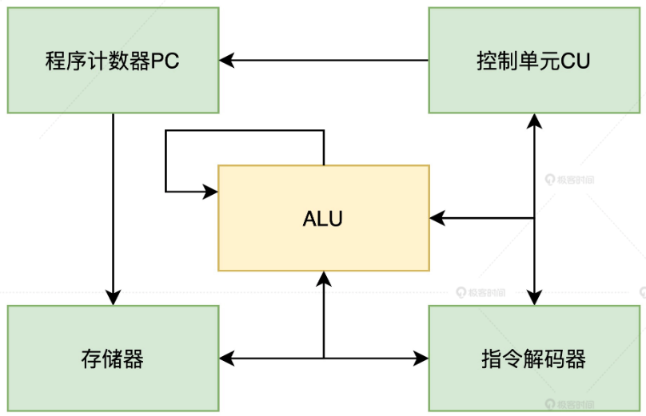
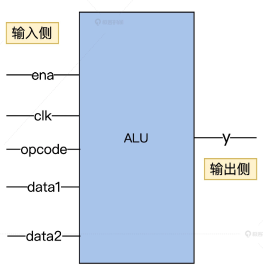
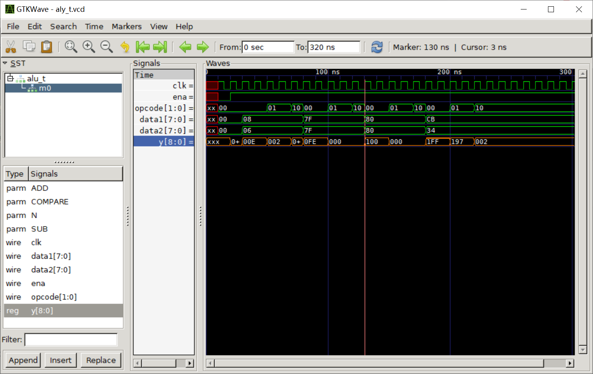
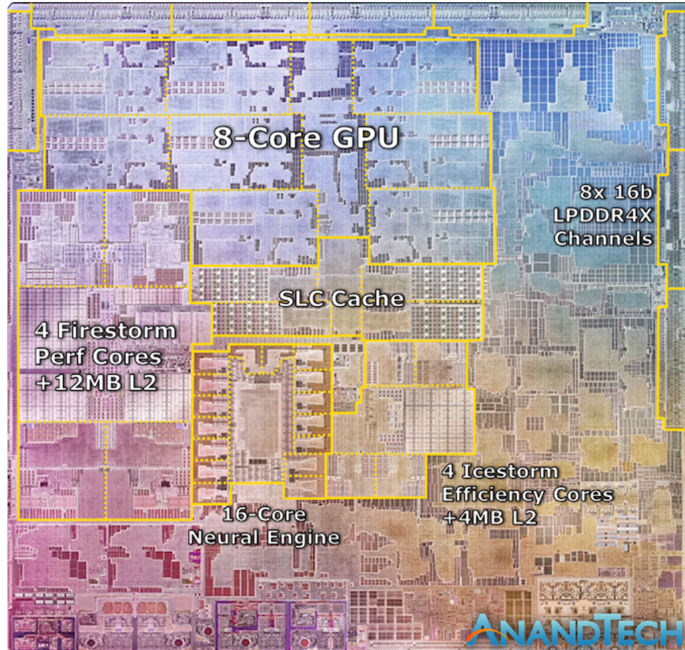

<!-- toc -->
苹果的M1芯片因何而快？
- [CPU 的原理初探](#cpu-的原理初探)
    - [ALU 的需求梳理与方案设计](#alu-的需求梳理与方案设计)
    - [自己动手用 Verilog 实现一个 ALU](#自己动手用-verilog-实现一个-alu)
    - [验证测试 ALU](#验证测试-alu)
- [现代 CPU 加速的套路](#现代-cpu-加速的套路)
    - [更多的硬件指令](#更多的硬件指令)
    - [通过缓存来提高数据装载效率](#通过缓存来提高数据装载效率)
    - [多核心 CPU](#多核心-cpu)
    - [超线程](#超线程)
- [谈谈指令集](#谈谈指令集)
    - [CISC](#cisc)
    - [RISC](#risc)
- [ARM 与 M1 芯片](#arm-与-m1-芯片)
<!-- tocstop -->

# CPU 的原理初探
不同架构的 CPU，具体设计还是有很大差异的。为了方便理解保留了 CPU 里的共性部分，抽象出了 CPU 的最小组成架构。  
  
可以把 CPU 运行过程抽象成这样 6 步  
1. 众所周知，CPU 的指令是以二进制形式存储在存储器中的（这里把寄存器、RAM 统一抽象成了存储器），所以当 CPU 执行指令的时候，第一步就要先从存储器中取出（fetch）指令。
2. CPU 将取出的指令通过硬件的指令解码器进行解码。
3. CPU 根据指令解码出的功能，决定是否还要从存储器中取出需要处理的数据。
4. 控制单元（CU）根据解码出的指令决定要进行哪些相应的计算，这部分工作由算术逻辑单元（ALU）完成。
5. 控制单元（CU）根据前边解码出的指令决定是否将计算结果存入存储器。
6. 修改程序计数器（PC）的指针，为下一次取指令做准备，以上整体执行过程由控制单元（CU）在时钟信号的驱动之下，周而复始地有序运行。
## ALU 的需求梳理与方案设计
使用 Verilog 语言实现一个可以运行简单计算的 ALU，从而对 CPU 具体模块的设计与实现加深一下认知。  
1. 首先最简单的 ALU 这个模块的核心需求是什么？  
对两个 N 位的二进制数进行加减、比较运算。  
_为啥没有乘除？还记得学生时代初学乘除法的时候，老师也同样先简化为加减法，方便我们理解。
这里也一样，因为乘除也可以转换为循环的加减运算，比如 2*3 可以转换成 2+2+2，6/2 可以转换成 6-2-2-2。所以，只需要实现了加减运算之后，我们就可以通过软件操作 CPU，让它实现更复杂的运算了，这也正是软件扩展硬件能力的魅力。_
  
这五根输入引脚的作用分别是：  
* ena：表示使能信号，它的取值是 0 或 1 可以分别控制 ALU 关闭或开启。  
* clk：表示时钟信号，时钟信号也是 01 交替运行的方波，时钟信号会像人的心跳一样驱动 ALU 的电路稳定可靠地运行。  
* opcode：表示操作码，取值范围是 00、01、10 这三种值，用来区分这一次计算到底是加法、减法还是比较运算
* data1、data2：表示参与运算的两个 N 位数据总线。  
* 输出侧的 y，它表示输出结果，如果是加减运算，则直接输出运算后的数值，而比较运算，则要输出 0、1、2，分别表示等于、大于、小于。  
## 自己动手用 Verilog 实现一个 ALU
Verilog 是一种优秀的硬件描述语言，它可以用类似 C 语言的高级语言设计芯片，从而免去了徒手画门电路的烦恼。  
开发之前，需要先进行一些准备工作，安装 VSCode 的 Verilog 语言支持插件、iverilog、gtkwave。  
```verilog
alu.v

/*----------------------------------------------------------------
Filename: alu.v
Function: 设计一个N位的ALU(实现两个N位有符号整数加 减 比较运算)
-----------------------------------------------------------------*/
module alu(ena, clk, opcode, data1, data2, y);
    //定义alu位宽
    parameter N = 32; //输入范围[-128, 127]
    
    //定义输入输出端口
    input ena, clk;
    input [1 : 0] opcode;
    input signed [N - 1 : 0] data1, data2; //输入有符号整数范围为[-128, 127] 
    output signed [N : 0] y; //输出范围有符号整数范围为[-255, 255]
    
    //内部寄存器定义
    reg signed [N : 0] y;
    
    //状态编码
    parameter ADD = 2'b00, SUB = 2'b01, COMPARE = 2'b10;
    
    //逻辑实现
    always@(posedge clk)
    begin
        if(ena)
        begin
            casex(opcode)
                ADD: y <= data1 + data2; //实现有符号整数加运算
                SUB: y <= data1 - data2; //实现有符号数减运算
                COMPARE: y <= (data1 > data2) ? 1 : ((data1 == data2) ? 0 : 2); //data1 = data2 输出0; data1 > data2 输出1; data1 < data2 输出2;
                default: y <= 0;
            endcase
        end
    end
endmodule
```
## 验证测试 ALU
```v
alu_t.v

/*------------------------------------
Filename: alu_t.v
Function: 测试alu模块的逻辑功能的测试用例
------------------------------------*/
`timescale 1ns/1ns
`define half_period 5
module alu_t(y);
    //alu位宽定义
    parameter N = 32;
    
    //输出端口定义
    output signed [N : 0] y;
    
    //寄存器及连线定义
    reg ena, clk;
    reg [1 : 0] opcode;
    reg signed [N - 1 : 0] data1, data2;
    
    //产生测试信号
    initial
    begin
        $dumpfile("aly_t.vcd");
        $dumpvars(0,alu_t);
        $display("my alu test");
        //设置电路初始状态
        #10 clk = 0; ena = 0; opcode = 2'b00;
            data1 = 8'd0; data2 = 8'd0;
        #10 ena = 1;
        
        //第一组测试
        #10 data1 = 8'd8; data2 = 8'd6; //y = 8 + 6 = 14
        #20 opcode = 2'b01; // y = 8 - 6 = 2
        #20 opcode = 2'b10; // 8 > 6 y = 1
        
        //第二组测试
        #10 data1 = 8'd127; data2 = 8'd127; opcode = 2'b00; //y = 127 + 127 = 254
        #20 opcode = 2'b01; //y = 127 - 127 = 0
        #20 opcode = 2'b10; // 127 == 127 y = 0
        
        //第三组测试
        #10 data1 = -8'd128; data2 = -8'd128; opcode = 2'b00; //y = -128 + -128 = -256
        #20 opcode = 2'b01; //y = -128 - (-128) = 0
        #20 opcode = 2'b10; // -128 == -128 y = 0
        
        //第四组测试
        #10 data1 = -8'd53; data2 = 8'd52; opcode = 2'b00; //y = -53 + 52 = -1
        #20 opcode = 2'b01; //y = -53 - 52 = -105
        #20 opcode = 2'b10; //-53 < 52 y = 2
        
        #100 $finish;
    end
    
    //产生时钟
    always #`half_period clk = ~clk;
    
    //实例化
    alu m0(.ena(ena), .clk(clk), .opcode(opcode), .data1(data1), .data2(data2), .y(y));
endmodule
```
dumpfile command is used to specify the name of a file to which simulation data should be written  
dumpvars command, which specifies the variables that should be written to the file  
8'd0 an 8-bit unsigned integer with a value of 0. d indicates that it is an unsigned decimal integer  
#10 a <= b 指定 b 的值应在延迟 10 个时间单位后分配给 a。#20 c <= d 指定 d 的值应在延迟 20 个时间单位后赋给 c。  
#delay 中使用的时间单位的确切含义取决于使用它们的上下文。它们可能表示纳秒、皮秒或其他时间单位，具体取决于设计中指定的时间尺度。  

在这个测试用例中，我们构造了一些测试数据来验证 ALU 模块功能是否正常，接下来我们就可以使用下面的命令对 verilog 源码进行语法检查，并生成可执行文件。  
```c
iverilog -o my_alu alu_t.v alu.v
```
生成了可执行文件之后，我们可以使用 vvp 命令生成.vcd 格式的波形仿真文件。  
```c
vvp my_alu
```
接下来，我们再把生成好的波形文件 aly_t.vcd 拖入 gtkwave 中，就能看到 ALU 模块仿真出的波形图了。  

_难道 verilog 不支持像 C 语言一样动态调试每一行代码吗？为什么要仿真出波形文件呢？_  
其实 verilog 当然是支持动态调试的，只不过因为硬件芯片在实际运行过程中，有很多逻辑单元都可以并行，如果仅仅依靠动态调试来分析是很困难的。  

  

# 现代 CPU 加速的套路
真实的工业级 CPU 如何解决问题，看看它们是如何做到动辄几 GHZ 的超高性能的。  
## 更多的硬件指令
真实的 CPU 还会实现乘法、除法、逻辑运算、浮点数运算等等很多硬件指令。这样就可以在一个时钟周期内实现更多的功能，从而提高效率。  
## 通过缓存来提高数据装载效率
现代计算机体系中，由于磁盘、RAM、CPU 寄存器之间的读写性能开销差别是非常大的，所以在现代 CPU 在设计的时候会在 CPU 内设计多级缓存，从而提高指令读写的速度。-----L1 Cache, L2 Cache  
## 流水线乱序执行与分支预测
我们发现，前面抽象出的 CPU 运行的 6 个步骤其实是串行执行的，而现实世界却不一样，其实计算机内的很多算法可以并行执行的。  
既然提到了并行，不难联想到我们之前讲的多线程技术。但是多线程开发显然需要对程序做出更多优秀的设计，才能充分利用多核的性能，想要实现比较困难。那么有没有办法，在不改造程序的前提下充分利用多核的资源呢？答案就是用空间资源换时间。硬件层面把程序由解码器电路拆解成多步，调度到 CPU 的不同核心上并行、乱序执行。---流水线  
比如，加法器在做加法运算的同时，乘法器不应该被闲置，应该也可以执行一些乘法指令。这样我们就可以把程序切分成多个可以并行运行的指令，以此来大幅提升性能了。当然，形成流水线之后，理想情况就是所有被切分出来的指令都是正确的，这样就可以并行运算了。可惜事情并没有那么简单，因为我们的程序有可能走入了其他分支，后面的运算要依赖前边的结果才能运行。这时候，我们就需要引入分支预测器这个电路，尽可能猜对后面要执行的指令，这样正确切分指令从而提高并行度。  
但一旦分支预测器预测失败，就需要重新刷新流水线，让指令顺序执行，这显然就会增加额外的时钟开销，造成性能损失。不过好消息是目前的分支预测器的准确率已经可以达到 90% 以上了。  
## 多核心 CPU
单核心下的 CPU 遇到了工艺等各种原因造成的瓶颈，很难再有更高的性能提升了。工程师又想到了提高并行度的经典套路，将多个 CPU 核心集成到了一颗芯片上。这时候每个 CPU 都有独立的 ALU、寄存器、L1-L3 多级缓存，但多个核心共用了同一条内存总线来操作内存。  
_隐约感觉到哪里有些不妥：内存中的数据被缓存到了 CPU 的多级缓存中，CPU 的多个核心是并行操作数据的，这时如果没有额外的设计的保障机制，就很可能导致并行读写数据引起的数据一致性问题，也就是出现脏数据。_  
为了解决缓存一致性问题，工程师们又发明出了 MESI、MOESI 等缓存一致性协议来解决这个问题。  
## 超线程
其实大部分指令在执行的过程中都不一定会占用所有的芯片资源的。所以，出于尽可能的“压榨”硬件资源的考量，工程师们又设计了额外的逻辑处理单元用来保证多个可执行程序可以共享同一个 CPU 内的资源。当然，如果两个程序同时操作同一个资源（如某一个加法器）的时候，也是需要暂停一个程序进行避让的。  

# 谈谈指令集
从前面 ALU 的设计过程中，我们发现如果设计一个芯片模块，首先是要根据分析的需求抽象出对应的 opcode 等指令，而众多约定好的指令则构成了这款芯片的指令集。  
**常见的 CPU 指令集**  
## CISC
复杂指令集 Complex Instruction Set Computer 简写为 CISC，其实计算机早期发展的时候还是比较粗暴的，后来大家发现，让硬件实现更多指令可以有效降低软件运行时间，就疯狂地给硬件芯片设计工程师提需求。于是越来越多的奇奇怪怪的指令被加入了 CPU，最后指令不但越来越多，还越来越复杂。  
并且为了实现这些指令不但占用了大量的硬件资源，而且长度还不一致，这些都给以后的扩展以及性能优化挖了不少的坑。  
## RISC
精简指令集 Reduced Instruction Set Computer，简写为 RISC。经历了 CISC 指令集带来的问题，研究人员就对现代计算机运行的指令做了统计和分析，结果发现大部分的程序在大部分情况下，都在运行一小部分指令。所以工程师就提出了一个大胆的假设，我们通过少部分相对简短且长度统一的指令集来替代 CISC，这样同样能满足所有程序的需求。  

# ARM 与 M1 芯片
ARM是一个精简指令集的 CPU。早期很多 CPU 都是封闭的，要想设计一款新的 CPU 只能从头设计，这显然需要极高的成本投入。这时候 ARM 公司就抓住了市场痛点，ARM 公司只做指令集和 CPU 的设计，然后付费授权（当然，授权费还是挺贵的）给各个厂商，由厂商根据自己的需求再去定制和生产。  
苹果的 M1 芯片也是基于 ARM 架构的，它采用了 AArch64 架构的 ARMv8-A 指令集，是由台积电采用 5nm 工艺代工生产的，在芯片内集成了 160 亿个晶体管。显然，它在继承了 ARM 优点的同时，还能享受到更先进的芯片制程带来的高性能与低功耗。而仅仅单纯继承 ARM 的优势其实还是不够的，因此 M1 芯片还额外引入了如增加解码器电路、统一内存架构、MCU 等多种优化方式来进行设计。  
**M1具体是如何做的：**  
解码器和 CPU 指令的缓冲空间大小会影响 CPU 的程序并行计算能力。因此，苹果工程师在设计的时候，将解码器增加到了 8 个（而 AMD、Intel 的解码器一般只有 4 个）。同时，M1 芯片的指令缓冲空间也比常见的 CPU 大了 3 倍。  

为啥 X86 系列的 CPU 不能多增加点解码器呢？  
其实这就是 ARM 的 RISC 指令集的优势了。因为在 ARM 中，每条指令都是 4 个字节解码器，进行切分处理很容易；而 X86 的每条指令长度可以是 1 到 15 字节。这就导致了解码器不知道下一条指令是从哪里开始的，需要实际分析每条指令才可以，这就增加了解码器电路的复杂度。  

有了提高并行能力的基础，多核心也是必须的。M1 芯片内包含了 4 个 3.2GHz 的高性能 Firestorm 核心和 4 个 0.6～2.064 GHz 的低功耗 Icestorm 核心，这也为 M1 芯片在各种功耗下进行并行计算提供了基础。  
  
可以发现 M1 芯片还集成了苹果自行设计的 8 个 GPU 核心。  

高通之类的芯片也集成了 GPU 呀，这里有什么区别呢？  
其实这里引入了统一内存（Unified memory）的设计。  
传统的做法是如果 CPU 要和 GPU 之间传输数据，需要通过 PCIe 总线在 CPU 和 GPU 的存储空间内来回传递。这就好比你有两个水杯，但互相倒水只能靠一个很细的吸管。而统一内存则是可以让 CPU 和 GPU 等组件共享同一块内存空间，这时候 CPU 要想传递数据，只需要写入内存之后通知 GPU 说：“嗨，哥们儿，你要的数据在某个地址空间，你自己直接用就好了。”这样就避免了通过 PCIe 总线传递数据的开销。  

严格讲，M1 芯片其实并不是 CPU。M1 芯片其实是包含了 CPU、GPU、IPU、DSP、NPU、IO 控制器、网络模块、视频编解码器、安全模块等很多异构的处理器共同组成的系统级（SOC）芯片。  

既然 SOC 的思路这么好，传统厂商为什么没有跟进呢？  
原因在于商业模式不同，传统厂商生产 CPU，但 GPU、网卡、主板等模块是交由其他厂商生产，最终由专门的公司组装成一台计算机才对外销售。而 Apple 为代表的厂商的业务模式则是自己就有全产业链的整合能力，可以直接设计、交付整机。所以，不同的业务模式最终催生出了不同技术的方案。  

Verilog教程:https://www.zhihu.com/column/c_1117750063287488512