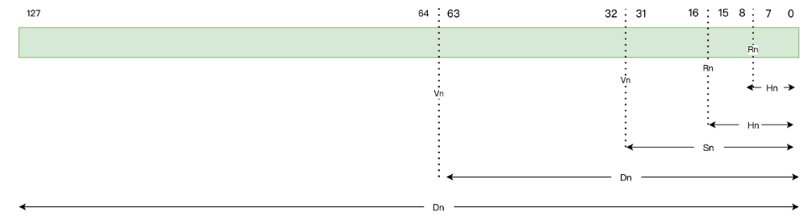
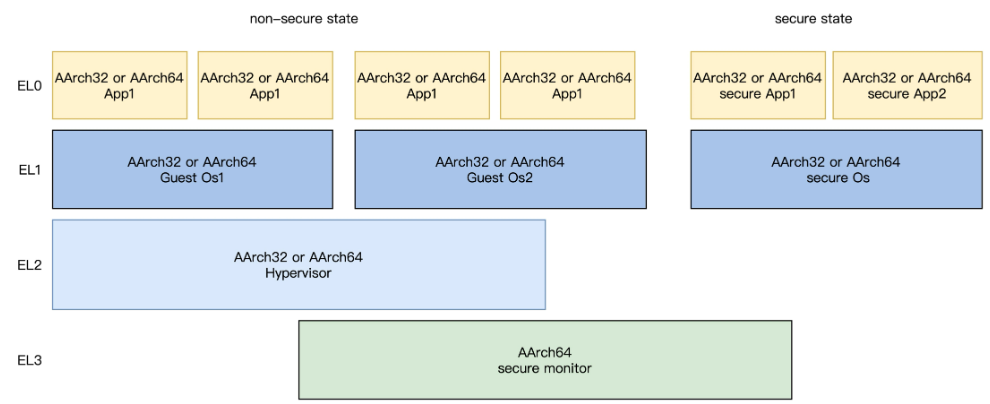

<!-- toc -->
今天，Andriod+ARM 已经成了移动领域的霸主，这与当年的 Windows+Intel 何其相似。之前我们已经在 Intel 的 x86 CPU 上实现了 HuOS，这次看看ARM 的 AArch64 体系结构，扩展一下视野。
- [什么是 AArch64 体系](#什么是-aarch64-体系)
- [AArch64 体系的寄存器](#aarch64-体系的寄存器)
    - [通用寄存器 R0-R30](#通用寄存器-r0-r30)
    - [特殊寄存器](#特殊寄存器)
    - [系统寄存器](#系统寄存器)
- [ARM-A Arch64 体系下 CPU 的工作模式](#arm-a-arch64-体系下-cpu-的工作模式)
    - [工作模式分类](#工作模式分类)
    - [处理器如何切换工作模式](#处理器如何切换工作模式)
- [AArch64 体系如何处理中断](#aarch64-体系如何处理中断)
    - [异常和中断](#异常和中断)
    - [中断处理](#中断处理)
    - [中断向量表](#中断向量表)
- [AArch64 体系如何访问内存](#aarch64-体系如何访问内存)
    - [AArch64 体系下的地址空间](#aarch64-体系下的地址空间)
    - [AArch64 体系下地址映射和转换](#aarch64-体系下地址映射和转换)
<!-- tocstop -->

# 什么是 AArch64 体系
ARMv8 是首款支持 64 位指令集的 ARM 处理器架构，它兼容了 ARMv7 与之前处理器的技术基础，同样它也兼容现有的 A32（ARM 32bit）指令集，还扩充了基于 64bit 的 AArch64 架构。ARMv8一共定义了三种架构:  
1. ARMv8-A（Application）架构，支持基于内存管理的虚拟内存系统体系结构（VMSA），支持 A64、A32 和 T32 指令集，主打高性能，在我们的移动智能设备中广泛应用。
2. ARMv8-R（Real-time）架构，支持基于内存保护的受保护内存系统架构（PMSA），支持 A32 和 T32 指令集，一般用于实时计算系统。
3. ARMv8-M（Microcontroller 架构），是一个压缩成本的嵌入式架构，而且需要极低延迟中断处理。它支持 T32 指令集的变体，主打低功耗，一般用于物联网设备。

AArch64，它只是 ARMv8-A 架构下的一种执行状态，“64”表示内存或者数据都保存在 64 位的寄存器中，并且它的基本指令集可以用 64 位寄存器进行数据运算处理。  

# AArch64 体系的寄存器
一款处理器要运行程序和处理数据，必须要有一定数量的寄存器。特别是基于 RISC（精简指令集）架构的 ARM 处理器，寄存器数量非常之多，因为大量的指令操作的就是寄存器。
1. 通用寄存器
2. 特殊寄存器
3. 系统寄存器
## 通用寄存器 R0-R30
通用寄存器（general-purpose registers）一共为 31 个，从 R0 到 R30，这个 31 个寄存器可以作为全 64 位使用，也可以只使用其中的低 32 位。  
全 64 位的寄存器以 x0 到 x30 名称进行引用，用于 32 位或者 64 位的整数运算或者 64 位的寻址；低 32 位寄存器以 W0 到 W30 名称进行引用，只能用于 32 位的整数运算或者 32 位的寻址。  
  
通用寄存器中还有 32 个向量寄存器（SIMD），编号从 V0 到 V31。因为向量计算依然是数据运算类的，所以要把它们归纳到通用寄存器中。每个向量寄存器都是 128 位的，但是它们可以单独使用其中的 8 位、16 位、32 位、64 位，它们的访问方式和索引名称如下所示。  
*Q0 到 Q31 为一个 128-bit 的向量寄存器 ；  
*D0 到 D31 为一个 64-bit 的向量寄存器；  
*S0 到 S31 为一个 32-bit 的向量寄存器；  
*H0 到 H31 为一个 16-bit 的向量寄存器；  
*B0 到 B31 为一个 8-bit 的向量寄存器；  
  
## 特殊寄存器
特殊寄存器（spseical registers）比通用寄存器稍微复杂一些，它还可以细分，包括程序计数寄存器（PC），栈指针寄存器（SP），异常链接寄存器（ELR_ELx），程序状态寄存器（PSTATE、SPSR_ELx）等。  
  
**PC 寄存器**  
保存当前指令地址的 64 位程序计数器，指向即将要执行的下一条指令，CPU 正是在这个寄存器的指引下，一条一条地运行代码指令。在 ARMv7 上，PC 寄存器就是通用寄存器 R15，而在 ARMv8 上，PC 寄存器不再是通用寄存器，不能直接被修改，只可以通过隐式的指令来改变，例如 PC-relative load。  
  
**SP 寄存器**  
SP 是 64 位的栈指针寄存器，可以通过 WSP 寄存器访问低 32 位，在指令中使用 SP 作为操作数，表示使用当前栈指针。C 语言调用函数和分配局部变量都需要用栈，栈是一种后进先出的内存空间，而 SP 寄存器中保存的就是栈顶的内存地址。  
  
**ELR_ELx 异常链接寄存器**  
每个异常状态下都有一个 ELR_EL 寄存器，ELR_ELx 寄存器是异常综合寄存器或者异常状态寄存器 ，负责保存异常进入 Elx 的地址和发生异常的原因等信息。  
该寄存器只有 ELR_EL1、ELR_EL2、ELR_EL3 这几种，没用 ELR_EL0 寄存器，因为异常不会 routing(target) 到 EL0。例如：16bit 指令的异常、32bit 指令的异常、simd 浮点运算的异常、MSR/MRS 的异常。  
  
**PSTATE**  
PSTATE 不是单独的一个寄存器，而是保存当前 PE（Processing Element）状态的一组寄存器统称，其中可访问寄存器有：NZCV、DAIF、CurrentEL（）、SPSel。这些属于 ARMv8 新增内容，在 64bit 下可以代替 CPSR（32 位系统下的 PE 信息）。  
```c
type ProcState is (
// PSTATE.{N, Z, C, V}： 条件标志位，这些位的含义跟之前AArch32位一样，分别表示补码标志，运算结果为0标志，进位标志，带符号位溢出标志
bits (1) N, // Negative condition flag
bits (1) Z, // Zero condition flag
bits (1) C, // Carry condition flag
bits (1) V, // oVerflow condition flag
// D表示debug异常产生，比如软件断点指令/断点/观察点/向量捕获/软件单步 等；
// A, I, F表示异步异常标志，异步异常会有两种类型：一种是物理中断产生的，包括SError（系统错误类型，包括外部数据终止），IRQ或者FIQ；
// 另一种是虚拟中断产生的，这种中断发生在运行在EL2管理者enable的情况下：vSError，vIRQ，vFIQ；
bits (1) D, // Debug mask bit [AArch64 only]
bits (1) A, // Asynchronous abort mask bit
bits (1) I, // IRQ mask bit
bits (1) F, // FIQ mask bit
// 异常发生的时候，通过设置MDSCR_EL1.SS 为 1启动单步调试机制；
bits (1) SS, // Software step bit
// 异常执行状态标志，非法异常产生的时候，会设置这个标志位，
bits (1) IL, // Illegal execution state bit
bits (2) EL, // Exception Level (see above)
// 表示当前ELx 所运行的状态，分为AArch64和AArch32:
bits (1) nRW, // not Register Width: 0=64, 1=32
// 某个ELx 下的堆栈指针，EL0下就表示sp_el0；
bits (1) SP, // Stack pointer select: 0=SP0, 1=SPx [AArch64 only]
)
```
程序在运行中，处理大量数据，无非是进行各种数学运算，而数学运算的结果往往有各种状态，如进位、结果为 0、结果是负数等，还有程序的运行状态，是否允许中断，CPU 的工作模式，这些信息都保存在程序状态寄存器中，即 PSTATE 中。  
**SPSR_ELx 程序状态寄存器**  
但是当 CPU 处理异常时，进程相应的 ELx 状态不同，就要把 PSTATE 状态信息保存在 ELx 状态下对应的 SPSR_ELx 寄存器中  
  
## 系统寄存器
ARM 的 CPU 上还有一些系统寄存器，用于访问系统配置。  
在 EL0 状态下，大多数系统寄存器是不可访问的，但是部分系统寄存器可以在 EL0 状态下进行访问，比如 Cache ID 寄存器（用于 EL0 状态下缓存管理）、调试寄存器（用于代码调试，如 MDCCSR_EL0、DBGDTR_EL0 等）、性能监控寄存器和时钟寄存器等。  

# ARM-A Arch64 体系下 CPU 的工作模式
AArch64、AArch32 体系都是简称，从严格意义上说，它们应该是处理器的两种执行方式或者状态。AArch64 体系执行 A64 指令集，这个指令集是全 64 位的；AArch32 体系则可以执行 A32 指令集和 T32 指令集  
## 工作模式分类
x86 CPU 的工作模式和 ARM 的 CPU 的工作差别很大，x86 CPU 的工作模式，包括特权级、处理器位宽、内存的访问与保护。  
ARM 的 CPU 一共有 7 种不同工作模式。在 7 种模式中，除了用户模式之外的模式，被统称为 Privileged Modes(特权模式)。  
特权模式下，除系统模式之外的其他五种模式就是异常模式。异常模式一般是在用户的应用程序发生中断异常时，随着特定的异常而进入的，比如之前我们讲过的硬件中断和软件中断，每种异常模式都有对应的一组寄存器，用来保证用户模式下的状态不被异常破坏。这样可以大大减小处理异常的时间，因为不用保存大量用户态寄存器。  
  
用户模式中得代码执行流 切换到特权模式下，其代码就可以访问全部的系统资源了，代码也可以随时进行处理器模式的切换。而且只有在特权模式下，CPU 的部分内部寄存器才可以被读写。这里的代码就是指内核代码。  
其次，系统模式也是特权模式，代码也是可以访问全部系统资源，也可以随时进行处理器模式的切换，主要供操作系统任务使用。系统模式和用户模式可以访问到的寄存器是同一套的，区别就是它是特权模式，不受用户模式的限制，一般系统模式用于调用操作系统的系统任务。  
## 处理器如何切换工作模式
工作模式切换大概分两种情况，一是软件控制，通过修改相应的寄存器或者执行相应的指令；二是当外部中断或是异常发生时，也会导致 CPU 工作模式的切换。  
那么当 CPU 发生中断或者异常时，CPU 进入相应的异常模式时，以下工作由 CPU 自动完成。  
1. 在异常模式的 R14 中，保存前一个工作模式里，下一条即将执行的指令地址；
2. 将 CPSR 的值复制到异常模式的 SPSR 中；
3. 将 CPSR 的工作模式设为该异常模式对应的工作模式；
4. 令 PC 值等于这个异常模式在异常向量表中的地址，即跳转去执行异常向量表中的相应指令。

处理完中断或者异常，就需要从中断或者异常中返回到发生中断或者异常的位置，继续执行程序。这个从异常工作模式退回到之前的工作模式时，需要由软件来完成后面这两项工作。  
1. 将异常模式的 R14 减去一个适当的值（4 或 8）后，赋给 PC 寄存器；
2. 将异常模式 SPSR 的值赋给 CPSR；

# AArch64 体系如何处理中断
## 异常和中断
Exception 和 Interrupt 的执行机制都是一样的，只是触发方式有区别。  
这里的异常，切入的视角是处理器被动接收到了异常。异常通常表现为错误，比如 CPU 执行了未知指令，但 CPU 明显不能执行这个指令，所以就会产生错误。再比如说，CPU 访问了不能访问的内存，这也是错误的。你会发现，共同点是异常都是同步的，不修改程序下次同样会发生。  
而中断对应的视角是处理器主动申请，你可以当作是异步的异常，因外部事件产生。中断分为三种，它们分别是 IRQ、FIQ 和 SError。IRQ、FIQ 通常是连接到外部中断信号，当外部设备发出中断信号时，CPU 就能对此作出响应并处理外部设备需要完成的操作。  
## 中断处理
了解中断处理之前，首先要搞明白异常级别。全局 ARMV8-A 体系结构中，定义了四个异常级别（Exception Level）从 EL0 到 El3，每个异常级别的权限不同，类似于 x86 CPU 的 R3～R0 特权级。  
不过 ARMV8-A 体系结构下 EL0 为最低权限模式，也就是对应用户态，处理的是应用程序；EL1 处理的是 OS 内核层，对应的是内核态；EL2 是 Supervisor 模式，处理的则是可以跑多个虚拟 OS 内核的管理软件，对应的是虚拟机管理态，它是可选的，如 Hypervisor 用于和 virtualization 扩展；EL3 运行的是安全管理（Secure Monitor），处理的是监控态，用于 security 扩展。  
  

中断或者异常发生时，EL 级别的切换，这里分为两种情况：  
第一种是高级别向低级别切换，这种方式通过修改 PSTATE 寄存器中的值来实现，EL 异常级别就保存在这个寄存器中；  
第二种是低级别向高级别切换，通过触发中断或者异常的方式进行切换的。  

_在这两种切换过程中，如果高级的状态是 AArch64，低级的可以是 AArch64 或者 AArch32，也就是可以向下兼容；如果高级的是 AArch32，那么低级的也一定要是 AArch32。_  

当一个中断或者异常触发后，CPU 的操作流程如下：
1. 更新 SPSR_ELx 寄存器，即当前的 PSTATE 寄存器的信息存储在 SPSR_ELx 寄存，以便中断结束时恢复到 PSTATE 寄存器。
2. 更新 PSTATE 寄存器以反映新的处理器状态，这个过程中，中断级别可能会发生变化。
3. 发生中断时的下一条指令地址存储在 ELR_ELx 寄存器中，以便中断返回后，能继续运行。
4. 当中断处理完成后，由高级别返回低级别时，需要使用 ERET 指令返回。

  
## 中断向量表
中断或者异常发生后，CPU 进行相应的操作后，必须要跳转到相应的地址开始运行相应的代码，进行中断或者异常的处理，这个地址就是中断向量。由于有多个中断或者异常，于是就形成了中断向量表。  
在 AArch64 中，每个中断或者异常触发时会产生 EL 级别切换。通常在 EL0 级别调用 svc 指令，触发一个同步异常，CPU 则会切换到 EL1 级别；如果在 EL0 级别来了一个 IRQ 或 FIQ，就会触发一个异步中断，CPU 会根据 SCR 寄存器中的中断配置来决定切换 EL1 或 EL2 或 EL3 级别，同时也会区分 EL 级别使用的是 AArch64，还是 AArch32 的指令集。  
  
上表中分了四个小表，小表中的每一个 entry 由不同的中断的类型（IRQ，FIQ，SError，Synchronous）决定。具体使用哪一个小表由以下几个条件决定。  
* 如果中断发生在同一中断级别，并且使用的栈指针是 SP_EL0，则使用 SP_EL0 这张表。
* 如果中断发生在同一中断级别，并且使用的栈指针是 SP_EL1/2/3，则使用 SP_EL 这张表。
* 如果中断发生在较低的中断级别，使用的小表则为下一个较低级别（AArch64 或 AArch32）的执行状态。

# AArch64 体系如何访问内存
访问内存有两大关键，一是寻址，这表现为内存的地址空间；第二个关键点是内存空间的保护，即内存地址的映射和转换。  
## AArch64 体系下的地址空间
对于工作在 AArch64 体系下的 CPU 来说，没有启动 MMU 的情况下，ARM 的 CPU 发出的地址，就是物理地址直接通过这个寻址内存空间。  
_别以为 AArch64 体系下有 64 位的寄存器，能发出 64 位的地址，就一定能寻址 64 位地址空间的内存。其实实际只能使用 52 位或者 48 位的地址，这里我们只讨论使用 48 位地址的情况。_  
如果启用了 MMU，那么 CPU 会通过虚拟地址寻址，MMU 负责将虚拟地址转换为物理地址，进而访问实际的物理地址空间。  
  
如果 CPU 发出的虚拟地址在 0x0～0x0000ffffffffffff 范围内，MMU 就会使用 TTBR0_ELx 寄存器指向的地址转换表进行物理地址的转换；如果 CPU 发出的虚拟地址在 0xffff000000000000～0xffffffffffffffff，MMU 使用 TTBR1_ELx 寄存器指向的地址转换表进行物理地址的转换。  
## AArch64 体系下地址映射和转换
以往的经验来看，这里肯定是有一张把虚拟地址转化为物理地址的表，给出一个虚拟地址，通过查表就可以查到物理地址。  
但是实际过程却不是这么简单，在这里通常要有一个多级的查表过程。  

MMU 将虚拟地址映射到物理地址是以页（Page）为单位的，ARMv8 架构的 AArch64 体系可以支持 48 位虚拟地址，并配置成 4 级页表（4K 页），或者 3 级页表（64K 页）。例如，虚拟地址 0xb7001000~0xb7001fff 是一个页，可能被 MMU 映射到物理地址 0x2000~0x2fff，物理内存中的一个物理页面也称为一个页框（Page Frame）。  

MMU 执行地址转换 4K 页表的情况下，虚拟地址转换物理地址的逻辑图。  
  
首先要将 64 位的虚拟内存分成多个位段，这些位段就是用来索引不同级别页表中的 entry 的。  

MMU 具体操作一共分五步:  
第一步从虚拟地址位段[47:39]开始，用来索引 0 级页表，0 级页表的物理基地址存放在 TTBR_ELx 寄存器中，以虚拟地址位段[47:39]为索引，找到 0 级页表中的某个 entry，该 entry 会返回 1 级页表的基地址。  
第二步，接着之前找到的 1 级页表的基地址，现在可以用虚拟地址位段[38:30]索引到 1 级页表的某个 entry，该 entry 在 4KB 页表情况下，返回的是 2 级页表的基地址。  
然后到了第三步，有了 2 级页表基地址，就可以用虚拟地址位段[29:21]作为索引找到 2 级页表中的某个 entry，该 entry 返回 3 级页表的基地址。  
再然后是第四步，有了 3 级页表基地址，则用虚拟地址位段[20:12]作为索引找到 3 级页表中的某个 entry，该 entry 返回的是物理内存页面的基地址。  
最后一步，我们得到物理内存页面基地址，用虚拟地址剩余的位段[11:0]作为索引，就能访问到 4KB 大小的物理内存页面内的某个字节了。  

这个过程从 TTBR_ELx 寄存器开始到 0 级页表，接着到 1 级页表，然后到 2 级页表，再然后到 3 级页表，最终到物理页面，CPU 一次寻址，其实是五次访问物理内存。**这个过程完全是由硬件处理的，每次寻址时 MMU 就自动完成前面这五步。**  

多级页表的优势在于它可以在保持低内存开销的同时实现高级别的内存管理功能。它允许系统通过在虚拟内存空间中分配内存来支持大量的进程，而无需真正地为每个进程分配物理内存。这样，系统就可以在内存不足的情况下，将不常使用的内存页转存到磁盘上，以便为当前需要的进程分配内存。  
另外，多级页表还允许系统对内存进行细粒度的权限控制。每个页表项都可以指定该页的访问权限，从而可以防止进程访问不属于它的内存地址。  