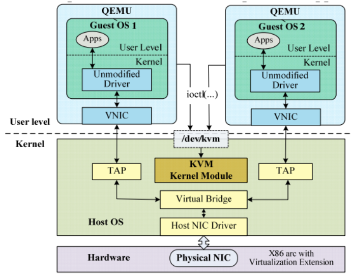

<!-- toc -->
随着云计算、大数据和分布式技术的演进，我们需要在一台服务器上虚拟化出更多虚拟机，还要让这些虚拟机能够弹性伸缩，实现跨主机的迁移。  
云虚拟主机的核心技术——KVM 虚拟化技术。  
- [理解虚拟化的定义](#理解虚拟化的定义)
- [虚拟化的核心思想](#虚拟化的核心思想)
    - [例子](#例子)
- [KVM 架构梳理](#kvm-架构梳理)
- [KVM核心原理](#KVM核心原理)
    - [CPU 虚拟化原理](#cpu-虚拟化原理)
    - [内存虚拟化原理](#内存虚拟化原理)
    - [I/O 虚拟化原理](#io-虚拟化原理)
- [KVM 关键代码走读](#kvm-关键代码走读)
    - [创建虚拟机](#创建虚拟机)
    - [创建 vCPU](#创建-vcpu)
    - [vCPU 运行](#vcpu-运行)
    - [内存虚拟化](#内存虚拟化)
    - [I/O 虚拟化](#io-虚拟化)
- [EPT和影子页表有什么区别](#ept和影子页表有什么区别)
<!-- tocstop -->

# 理解虚拟化的定义
虚拟化的本质是一种资源管理的技术，它可以通过各种技术手段把计算机的实体资源（如：CPU、RAM、存储、网络、I/O 等等）进行转换和抽象，让这些资源可以重新分割、排列与组合，实现最大化使用物理资源的目的。  

# 虚拟化的核心思想
操作系统的设计很高明，已经帮我们实现了单机的资源配置需求，具体就是在一台物理机上把 CPU、内存资源抽象成进程，把磁盘等资源抽象出存储、文件、I/O 等特性，方便之后的资源调度和管理工作。  
但随着时间的推移，我们做个统计就会发现，其实现在的 PC 机平常可能只有 50% 的时间处于工作状态，剩下的一半时间都是在闲置资源，甚至要被迫切换回低功耗状态。这显然是对资源的严重浪费。根据我们的工程经验，但凡遇到不太好解决的问题，我们就可以考虑抽象出一个新的层次来解决。于是我们在已有的 OS 经验之上，进行了后面这样的设计。  
  
可以看出最大的区别就是后者额外引入了一个叫 Hypervisor/Virtual Machine Monitor（VMM）的层。在这个层里面我们就可以做一些“无中生有”的事情，向下统一管理和调度真实的物理资源，向上“骗”虚拟机，让每个虚拟机都以为自己都独享了独立的资源。（访问资源的截获与重定向）  
## 例子
  
首先要像咸阳方向伪造一切正常的假象（让被虚拟化的机器看起来和平常一样），其次还要把真正核心的权限获取到手（Hypervisor/VMM 要想办法调度真正的物理资源）。  

这个瞒天过海的目标其实有几种实现方式:  
一种思路是赵高一个人全权代理，全部模拟和代理出所有的资源（软件虚拟化技术），另一种思路是朝中有人（胡亥）配合赵高控制、调度各种资源的使用，真正执行的时候，再转发给胡亥去处理（硬件虚拟化技术）。  
如果是前者，显然赵高会消耗大量资源，并且还可能会遇到一些安全问题，所以他选择了后者。历史总是惊人地相似，在软件虚拟化遇到了无法根治的性能瓶颈和安全等问题的时候，软件工程师就开始给硬件工程师提需求了，**需求背后的核心想法是这样的：能不能让朝中有人，有问题交给他，软件中间层只管调度资源之类的轻量级工作呢？**-----KVM架构  

# KVM 架构梳理
计算机最重要几种资源分别是：计算（CPU）、存储（RAM、ROM），以及为了连接各种设备抽象出的 I/O 资源。  
所以 Intel 分别设计出了 VT-x 指令集、VT-d 指令集、VT-c 指令集等技术来实现硬件虚拟化，让 CPU 配合我们来实现这个目标  
  
_ioctl允许用户空间程序通过文件描述符与设备或套接字通信，以执行特定的控制操作，这些操作通常不属于常规的读取和写入。它可以用于与设备驱动程序通信，设置设备参数，查询设备状态，以及进行其他底层设备操作。_

首先，客户机（咸阳）看到的硬件资源基本都是由 Hypervisor（赵高）模拟出来的。当客户机对模拟设备进行操作时，命令就会被截获并转发给实际设备 / 内核模块（胡亥）去处理。  
通过这种架构设计 Hypervisor 层，最终实现了把一个客户机映射到宿主机 OS 系统的一个进程，而一个客户机的 vCPU 则映射到这个进程下的独立的线程中。同理，I/O 也可以映射到同一个线程组内的独立线程中。  

# KVM核心原理
要实现成功的虚拟化，核心是要对资源进行“欺上瞒下”。而对应到我们计算机内的最重要的资源，可以简单抽象成为三大类，分别是：CPU、内存、I/O。  
## CPU 虚拟化原理
Intel 定义了 Virtual Machine Extension（VMX）这个处理器特性，也就是传说中的 VT-x 指令集，开启了这个特性之后，就会存在两种操作模式。它们分别是：根操作（VMX root operation）和非根操作（VMX non-root operation）。  

我们之前说的 Hypervisor/VMM，其实就运行在根操作模式下，这种模式下的系统对处理器和平台硬件具有完全的控制权限。  

客户软件（Guest software）包括虚拟机内的操作系统和应用程序，则运行在非根操作模式下。当客户软件执行一些特殊的敏感指令或者一些异常（如 CPUID、INVD、INVEPT 指令，中断、故障、或者一些寄存器操作等）时，则会触发 VM-Exit 指令切换回根操作模式，从而让 Hypervisor/VMM 完全接管控制权限。  
下面这张图画出了模式切换的过程，想在这两种模式之间切换，就要通过 VM-Entry 和 VM-Exit 实现进入和退出。而在这个切换过程中，你要留意一个非常关键的数据结构，它就是 VMCS（Virtual Machine Control Structure）数据结构控制  
  
## 内存虚拟化原理
内存虚拟化的核心目的是“骗”客户机，给每个虚拟客户机都提供一个从 0 开始的连续的物理内存空间的假象，同时又要保障各个虚拟机之间内存的隔离和调度能力。  
_我们之前实现实现虚拟内存的时候，也是在“骗”应用程序每个程序都有连续的物理内存，为此还设计了一大堆“转换表”的数据结构和转换、调度机制。_  

其实内存虚拟化也借鉴了相同的思想，只不过问题更复杂些，因为我们发现我们的内存从原先的虚拟地址、物理地址突然变成了后面这四种内存地址。  
1. 客户机虚拟地址 GVA（Guest Virtual Address）
2. 客户机物理地址 GPA（Guest Physical Address）
3. 宿主机虚拟地址 HVA（Host Virtual Address）
4. 宿主机物理地址 HPA（Host Physical Address）

转换时的映射关系表是少不掉的。确实，早期我们主要是基于影子页表（Shadow Page Table）来进行转换的，缺点就是性能有不小的损耗。所以，后来 Intel 在硬件上就设计了 EPT（Extended Page Tables）机制，用来提升内存地址转换效率。  
_虚拟内存是一种操作系统功能，它允许程序访问比实际物理内存更多的内存空间。当程序需要更多内存时，虚拟内存系统会将一些不常使用的内存页面转储到硬盘上，以便为程序提供更多的物理内存。这样，程序就可以像使用物理内存一样使用虚拟内存。_  
## I/O 虚拟化原理
I/O 虚拟化是基于 Intel 的 VT-d 指令集来实现的，这是一种基于 North Bridge 北桥芯片（或 MCH）的硬件辅助虚拟化技术。  

南桥和北桥是电脑系统中的两个基本部件，它们负责连接计算机中心处理器（CPU）和其他硬件之间的数据传输。  
南桥，也称为主板芯片组或主板控制器，是计算机系统的核心部分。它负责将 CPU 和其他硬件，如内存、硬盘驱动器和显卡，连接在一起。南桥还负责处理 CPU 和其他硬件之间的数据流动。  
北桥，也称为总线桥或 I/O 控制器，负责连接 CPU 和 I/O 设备，如键盘、鼠标和显示器。北桥负责处理 I/O 设备和 CPU 之间的数据流动。  
总的来说，南桥负责连接 CPU 和主板上的硬件，而北桥负责连接 CPU 和外部设备。  

运用 VT-d 技术，虚拟机得以使用基于直接 I/O 设备分配方式，或者用 I/O 设备共享方式来代替传统的设备模拟 / 额外设备接口方式，不需要硬件改动，还省去了中间通道和 VMM 的开销，从而大大提升了虚拟化的 I/O 性能，让虚拟机性能更接近于真实主机。  

# KVM 关键代码走读
## 创建虚拟机
虚拟机初始化的入口部分  
```c
virt/kvm/kvm_main.c:

static int kvm_dev_ioctl_create_vm(void)
{
  int fd;
  struct kvm *kvm;

   kvm = kvm_create_vm(type);
   if (IS_ERR(kvm))
           return PTR_ERR(kvm);
    //在代码中可能存在两个不同的错误检查或操作，需要用到变量 r 来保存结果。
	//初始化 kvm_coalesced_mmio_ring 结构,用于在虚拟化环境中合并多个内存映射输入/输出（MMIO）操作。kvm_coalesced_mmio_ring 结构，允许将多个连续的 MMIO 操作合并为单个事件，从而减少转换次数。
   r = kvm_coalesced_mmio_init(kvm);
	//获取一个未使用的文件描述符（fd），并将其与指定的文件关联
   r = get_unused_fd_flags(O_CLOEXEC);

         /*生成kvm-vm控制文件*/
   file = anon_inode_getfile("kvm-vm", &kvm_vm_fops, kvm, O_RDWR);

  return fd;
}
```
创建 KVM 中内存、I/O 等资源相关的数据结构并进行初始化。  
```c
virt/kvm/kvm_main.c:
static struct kvm *kvm_create_vm(void)
{
  int r, i;
  struct kvm *kvm = kvm_arch_create_vm();

    /*设置kvm的mm结构为当前进程的mm,然后引用计数为1*/
  kvm->mm = current->mm;
  kvm_eventfd_init(kvm);  //初始化 kvm 结构中的事件通知机制
  mutex_init(&kvm->lock);
  mutex_init(&kvm->irq_lock);
  mutex_init(&kvm->slots_lock);
  refcount_set(&kvm->users_count, 1);
  INIT_LIST_HEAD(&kvm->devices);
  INIT_HLIST_HEAD(&kvm->irq_ack_notifier_list);

  r = kvm_arch_init_vm(kvm, type); //执行特定于体系结构的初始化步骤。
  r = hardware_enable_all() //用于启用所有可用的硬件。

  //循环初始化 kvm 的所有总线
  for (i = 0; i < KVM_NR_BUSES; i++) {
    rcu_assign_pointer(kvm->buses[i],kzalloc(sizeof(struct kvm_io_bus), GFP_KERNEL));
  }
  kvm_init_mmu_notifier(kvm); //初始化 kvm 的内存管理单元（MMU）通知机制

  /*把kvm链表加入总链表*/
  list_add(&kvm->vm_list, &vm_list);
  return kvm;
}
```
结合代码我们看得出，初始化完毕后会将 KVM 加入到一个全局链表头。这样, 我们后面就可以通过这个链表头，遍历所有的 VM 虚拟机了。  
## 创建 vCPU
创建 VM 之后，接下来就是创建我们虚拟机赖以生存的 vCPU 了。在虚拟化环境中，每个虚拟机都有自己的 vCPU，与物理 CPU 分离。  
```c
virt/kvm/kvm_main.c:
static int kvm_vm_ioctl_create_vcpu(struct kvm *kvm, u32 id)
{
  int r;
  struct kvm_vcpu *vcpu, *v;
  /*调用相关cpu的vcpu_create 通过arch/x86/x86.c 进入vmx.c*/
  vcpu = kvm_arch_vcpu_create(kvm, id);

  /*调用相关cpu的vcpu_setup*/
  r = kvm_arch_vcpu_setup(vcpu);

  /*判断是否达到最大cpu个数*/
  mutex_lock(&kvm->lock);
  if (atomic_read(&kvm->online_vcpus) == KVM_MAX_VCPUS) {
    r = -EINVAL;
    goto vcpu_destroy;
  }
  kvm->created_vcpus++;
  mutex_unlock(&kvm->lock);

  /*生成kvm-vcpu控制文件*/
  /* Now it's all set up, let userspace reach it */
  kvm_get_kvm(kvm);
  r = create_vcpu_fd(vcpu);

  kvm_get_kvm(kvm);
  r = create_vcpu_fd(vcpu);
  if (r < 0) {
    kvm_put_kvm(kvm);
    goto unlock_vcpu_destroy;
  }

  kvm->vcpus[atomic_read(&kvm->online_vcpus)] = vcpu;
  /*
   * Pairs with smp_rmb() in kvm_get_vcpu.  Write kvm->vcpus
   * before kvm->online_vcpu's incremented value.
  */
  smp_wmb();
  atomic_inc(&kvm->online_vcpus);

  mutex_unlock(&kvm->lock);
  kvm_arch_vcpu_postcreate(vcpu);
}
```
首先在第 7 行的 kvm_arch_vcpu_create() 函数内进行 vcpu_vmx 结构的申请操作，然后还对 vcpu_vmx 进行了初始化。在这个函数的执行过程中，同时还会设置 CPU 模式寄存器（MSR 寄存器）。  
接下来，我们会分别为 guest 和 host 申请页面，并在页面里保存 MSR 寄存器的信息。最后，我们还会申请一个 vmcs 结构，并调用 vmx_vcpu_setup 设置 vCPU 的工作模式，这里就是实模式。  
## vCPU 运行
```c
arch/x86/kvm/x86.c:
static int vcpu_run(struct kvm_vcpu *vcpu)
{
        int r;
        struct kvm *kvm = vcpu->kvm;
        for (;;) {
    /*vcpu进入guest模式*/
                if (kvm_vcpu_running(vcpu)) {
                   r = vcpu_enter_guest(vcpu);
                } else {
                        r = vcpu_block(kvm, vcpu);
                }
                kvm_clear_request(KVM_REQ_PENDING_TIMER, vcpu);

    /*检查是否有阻塞的时钟timer*/
                if (kvm_cpu_has_pending_timer(vcpu))
                        kvm_inject_pending_timer_irqs(vcpu);

    /*检查是否有用户空间的中断注入*/
                if (dm_request_for_irq_injection(vcpu) &&
                        kvm_vcpu_ready_for_interrupt_injection(vcpu)) {
                        r = 0;
                        vcpu->run->exit_reason = KVM_EXIT_IRQ_WINDOW_OPEN;
                        ++vcpu->stat.request_irq_exits;
                        break;
                }
                kvm_check_async_pf_completion(vcpu);

    /*是否有阻塞的signal*/
                if (signal_pending(current)) {
                        r = -EINTR;
                        vcpu->run->exit_reason = KVM_EXIT_INTR;
                        ++vcpu->stat.signal_exits;
                        break;
                }
    /*执行一个调度*/
                 if (need_resched()) {
                         cond_resched();
                 }
        }
```
**VM-Exit、VM-Entry 指令进入、退出的本质其实是就是通过 vcpu_enter_guest 进入 / 退出 vCPU，在根模式之间来回切换、反复横跳的过程。**
## 内存虚拟化
在 vcpu 初始化的时候，会调用 kvm_init_mmu 来设置虚拟内存初始化。在这里会有两种不同的模式，一种是基于 EPT 的方式，另一种是基于影子页表实现的 soft mmu 方式。  
```c
arch/x86/kvm/mmu/mmu.c
void kvm_init_mmu(struct kvm_vcpu *vcpu, bool reset_roots)
{
  ......
  /*嵌套虚拟化，我们暂不考虑了 */
        if (mmu_is_nested(vcpu))
                init_kvm_nested_mmu(vcpu);
        else if (tdp_enabled)
                init_kvm_tdp_mmu(vcpu);
        else
                init_kvm_softmmu(vcpu);
}
```
## I/O 虚拟化
I/O 虚拟化其实也有两种方案，一种是全虚拟化方案，一种是半虚拟化方案。区别在于全虚拟化会在 VM-exit 退出之后把 IO 交给 QEMU 处理，而半虚拟化则是把 I/O 变成了消息处理，从客户机（guest）机器发消息出来，宿主机（由 host）机器来处理。  
```c
arch/x86/kvm/vmx.c:
static int handle_io(struct kvm_vcpu *vcpu)
{
        unsigned long exit_qualification;
        int size, in, string;
        unsigned port;

        exit_qualification = vmcs_readl(EXIT_QUALIFICATION);
        string = (exit_qualification & 16) != 0;

        ++vcpu->stat.io_exits;

        if (string)
                return kvm_emulate_instruction(vcpu, 0) == EMULATE_DONE;

        port = exit_qualification >> 16;
        size = (exit_qualification & 7) + 1;
        in = (exit_qualification & 8) != 0;

        return kvm_fast_pio(vcpu, size, port, in);
}
```
完整的 KVM 代码，可以到官方仓库搜索。(https://github.com/torvalds/linux)  

# EPT和影子页表有什么区别
EPT（Extended Page Tables）和影子页表（Shadow Page Tables）都是虚拟化技术中用于实现内存虚拟化的重要概念，它们有以下区别：

EPT（Extended Page Tables）：
EPT 是 Intel VT-x 技术中的一种硬件辅助虚拟化功能，用于实现虚拟机内存的访问权限管理。EPT 允许虚拟机使用自己的页表，并将虚拟地址直接映射到物理地址。EPT 在虚拟机执行期间，通过硬件提供的页表转换功能，将虚拟地址转换为物理地址。这样，虚拟机可以自行管理和控制自己的内存访问，而不需要与宿主操作系统进行频繁的页表切换。

影子页表（Shadow Page Tables）：
影子页表是另一种内存虚拟化技术，主要用于实现全虚拟化。在全虚拟化中，虚拟机操作系统运行在虚拟机监视器（Hypervisor）的管理下，虚拟机操作系统并不知道自己运行在虚拟化环境中。为了使虚拟机操作系统正常工作，虚拟机监视器需要维护一个影子页表。影子页表是虚拟机监视器为每个虚拟机所维护的一份拷贝，其中包含虚拟机的虚拟地址到物理地址的映射关系。当虚拟机操作系统试图修改自己的页表时，实际上是修改了影子页表，虚拟机监视器会捕获这个修改，并根据影子页表来维护真实的物理内存映射。

总结：
EPT 是 Intel VT-x 技术中的硬件辅助虚拟化功能，用于虚拟机内存访问权限管理，允许虚拟机使用自己的页表。而影子页表是全虚拟化中的一种技术，用于维护虚拟机的虚拟地址到物理地址的映射关系，虚拟机操作系统修改自己的页表时，实际上是修改了影子页表。两者的目的都是为了实现虚拟化环境下的内存管理和隔离。