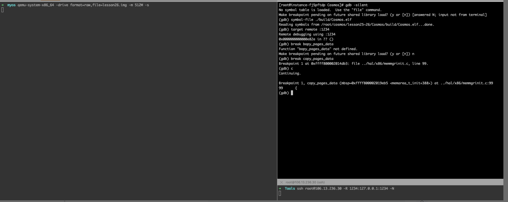
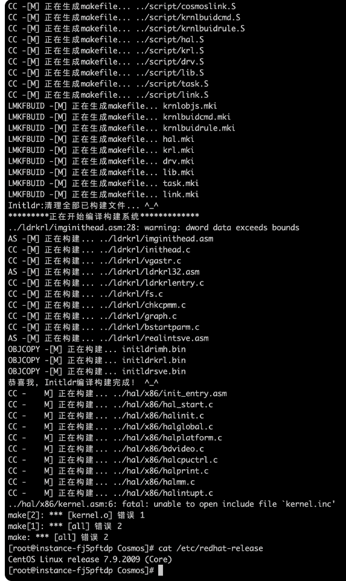
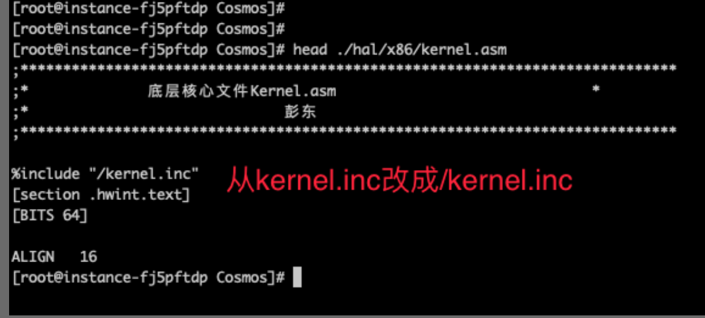
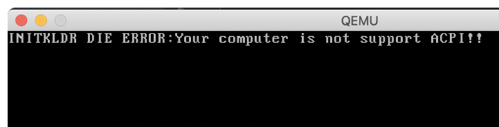
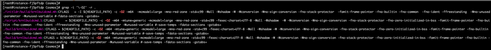
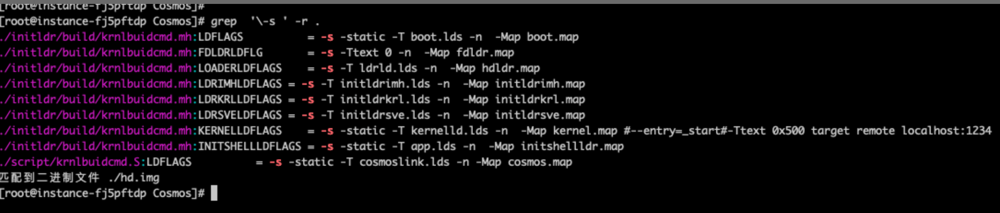
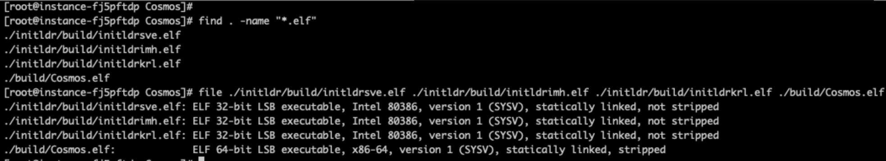
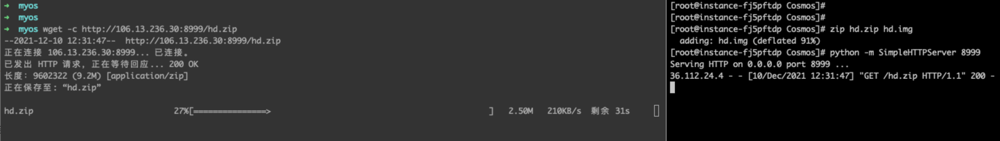

<!-- toc -->
https://aeneag.xyz/articles/2022/05/07/1651914235439.html
- [HuOS调试思路](#HuOS调试思路)
- [制作“带调试符号的 elf 文件"的详细步骤](#制作带调试符号的-elf-文件的详细步骤)
    - [修复两个 bug](#修复两个-bug)
    - [修改“编译选项"](#修改编译选项)
    - [编译生成“带调试符号的 elf 文件"](#编译生成带调试符号的-elf-文件)
    - [重新制作 hd.img](#重新制作-hdimg)
    - [打包传输 hd.img 到 mac](#打包传输-hdimg-到-mac)
- [如何通过动态调试验证 grub 镜像文件的加载过程](#如何通过动态调试验证-grub-镜像文件的加载过程)
    - [分析过程](#分析过程)
- [魔改](#魔改)
- [参考资料](#参考资料)
<!-- tocstop -->

# HuOS调试思路
虽然我们可以在代码中打印日志，但这种方式效率不高，因为每次都需要编写代码、重新编译运行。我更喜欢用 GDB 和 QEMU 动态调试 Cosmos。  
使用 GDB 在 Cosmos 内核函数下了断点，并且断点生效。如果我想观察 copy_pages_data 的逻辑，就只需要在单步调试过程中观察内存的变化，这样就能知道 copy_pages_data 建立的页表数据长什么样子。  
  
总的来说，想要动态调试，我们首先需要编译一个带调试符号的 elf 文件出来，然后更新 hd.img 镜像文件。  
接着我们用 QEMU 启动内核  
```s
  ➜  myos qemu-system-x86_64 -drive format=raw,file=hd.img -m 512M -cpu kvm64,smep,smap -s    // 一定要加-s参数，此参数可以打开调试服务。
```
最后，我们用 GDB 加载调试符号并调试  
```s
  (gdb) symbol-file ./initldr/build/initldrkrl.elf    // 加载调试符号，这样才能在显示源码、可以用函数名下断点
  Reading symbols from /root/cosmos/lesson13/Cosmos/initldr/build/initldrkrl.elf...done.
  (gdb) target remote :1234   // 连接qemu-system-x86_64 -s选项打开的1234端口进行调试
  Remote debugging using :1234
  0x000000000000e82e in ?? ()
```
https://github.com/leveryd/cosmos-debug-file  

# 制作“带调试符号的 elf 文件"的详细步骤
在制作“带调试符号的 elf 文件”时，Cosmos 和 Linux 内核有些不同，下面我就详细说明一下。  
先说说整体思路：通过修改编译选项，即可生成“带调试符号的 elf 文件”。然后再生成 Cosmos.eki 内核文件，最后替换 hd.img 镜像文件中的 Cosmos.eki 文件。这样，我们就可以用“带调试符号的 elf 文件”和 hd.img 来调试代码了。  
## 修复两个 bug
第一个问题是：编译第十三课的代码时遇到一个报错，报错截图如下。  
  
解决办法很简单：将 kernel.asm 文件中的“kernel.inc”修改成“/kernel.inc”，你可以对照后面的截图看一下。  
  
第二个问题是第二十六课遇到的运行时报错，如下图所示。  
  
因为 acpi 是和“电源管理”相关的模块，这里并没有用到，所以我们可以注释掉 initldr/ldrkrl/chkcpmm.c 文件中的 init_acpi 函数调用。  
## 修改“编译选项"
修复 bug 后，我们虽然能够成功编译运行，但是因为文件没有调试符号，所以我们在 GDB 调试时无法对应到 c 源码，也无法用函数名下断点。因此，我们需要通过修改编译选项来生成带调试符号的 elf 文件。  

**为了编译出带调试符号的执行文件，需要对编译脚本做两处修改:**  
第一处修改，GCC 的-O2参数要修改成O0 -g参数：-O0是告诉 GCC 编译器，在编译时不要对代码做优化，这么做的原因是避免在 GDB 调试时源码和实际程序对应不上的情况；-g参数是为了告诉编译器带上调试符号。  
第二处修改，去掉 ld 的-s参数：-s是告诉 ld 程序链接时去掉所有符号信息，其中包括了调试符号。  
  
  
使用 sed 命令，即可批量将-O2 参数修改成-O0 -g ，代码如下：  
```s
  [root@instance-fj5pftdp Cosmos]# sed -i 's/-O2/-O0 -g/' ./initldr/build/krnlbuidcmd.mh ./script/krnlbuidcmd.S ./build/krnlbuidcmd.mki ./build/krnlbuidcmd.mk
  [root@instance-fj5pftdp Cosmos]# sed -i 's/-Os/-O0 -g/' ./initldr/build/krnlbuidcmd.mh ./script/krnlbuidcmd.S ./build/krnlbuidcmd.mki ./build/krnlbuidcmd.mk
  [root@instance-fj5pftdp Cosmos]# grep -i '\-O2' -r .
```
使用 sed 命令批量去掉 ld 的-s参数，代码如下：  
```s
  [root@instance-fj5pftdp Cosmos]# sed -i 's/-s / /g' ./initldr/build/krnlbuidcmd.mh ./script/krnlbuidcmd.S ./build/krnlbuidcmd.mki ./build/krnlbuidcmd.mk
  [root@instance-fj5pftdp Cosmos]# grep '\-s ' -r .
```
完成上面的操作以后，编译选项就修改好了。  

sed：是一个流编辑器，用于对文本进行处理和转换。  
-i：是 sed 命令的一个选项，表示直接在原始文件上进行编辑（in-place）。使用 -i 选项后，sed 命令将会直接修改指定文件，而不是将结果输出到标准输出。  
's/-s / /g'：是 sed 命令的操作指令，它用于进行文本替换。  
s：表示进行替换操作。  
/-s /：是一个正则表达式，表示要匹配的模式。在这里，它匹配所有出现的 -s 字符串（其中空格表示一个空格字符）。
/ /：是替换的目标字符串。在这里，它将 -s 字符串替换为空格，即删除 -s 字符串。  
g：是一个选项，表示进行全局替换。如果没有 g 选项，sed 只会替换每行中第一个匹配的字符串，而加上 g 选项后，会替换所有匹配的字符串。  

## 编译生成“带调试符号的 elf 文件"
我们修复 bug 和修改编译选项后，执行make就可以编译出带有调试符号的 elf 文件，如下图：这里的“not stripped”就表示文件带有调试符号。  
  
1. Cosmos.elf：当需要调试“内核代码”时，可以在 GDB 中执行symbol-file ./initldr/build/Cosmos.elf加载调试符号。
2. initldrkrl.elf：当需要调试“二级加载器代码”时，可以在 GDB 中执行symbol-file ./initldr/build/initldrkrl.elf加载调试符号。

symbol-file：是 GDB 命令，用于加载调试符号文件。  
./initldr/build/Cosmos.elf：是指定的调试符号文件路径。在这里，./initldr/build/Cosmos.elf 是一个 ELF 格式的可执行文件（或目标文件），它包含了程序的代码和数据以及调试符号信息。  

## 重新制作 hd.img
最后一步，我们需要重新制作 hd.img，这样 VBox 或者 QEMU 就能运行我们重新生成的 Cosmos 内核。  
整个过程很简单，分两步。首先生成 Cosmos.eki，这里需要注意的是，font.fnt 等资源文件要拷贝过来。  
```s
  [root@instance-fj5pftdp build]# pwd
  /root/cosmos/lesson25~26/Cosmos/initldr/build
  [root@instance-fj5pftdp build]# cp ../../build/Cosmos.bin ./
  [root@instance-fj5pftdp build]# cp ../../release/font.fnt ../../release/logo.bmp ../../release/background.bmp ./
  [root@instance-fj5pftdp build]# ./lmoskrlimg -m k -lhf initldrimh.bin -o Cosmos.eki -f initldrkrl.bin initldrsve.bin Cosmos.bin background.bmp font.fnt logo.bmp
  文件数：6
  映像文件大小：5169152
```
然后更新 hd.img，替换其中的 Cosmos.eki。  
```s
  [root@instance-fj5pftdp build]# pwd
  /root/cosmos/lesson25~26/Cosmos/initldr/build
  [root@instance-fj5pftdp build]# mount ../../hd.img /tmp/     #这样做的目的是将镜像文件中的内容暂时挂载到系统的某个目录，以便进行文件的复制和修改。
  [root@instance-fj5pftdp build]# cp Cosmos.eki /tmp/boot/
  cp：是否覆盖"/tmp/boot/Cosmos.eki"？ y
  [root@instance-fj5pftdp build]# umount /tmp/
  [root@instance-fj5pftdp build]#
```
完成上面的操作以后，hd.img 就制作好了。现在我们可以用 hd.img 和之前生成的 elf 文件来调试代码。  
## 打包传输 hd.img 到 mac
因为我是在云上购买的 Linux 虚拟机上调试 Mac 上 QEMU 运行的 Cosmos 内核，所以我需要把 Linux 上制作的 hd.img 传输到 Mac。你可以根据自己的实际情况设置传输地址。  
  

# 如何通过动态调试验证 grub 镜像文件的加载过程
接下来，我就给你分享个比较简单的案例，你只需要看到几行汇编代码，就能解决一些学习中的小疑问。  
先交代下问题背景。在学习课程中的“初始化”部分时，我有两个疑问：  
1. 代码从 grub 到 Cosmos 项目时，第一条指令是什么？这条指令被加载到哪里执行？
2. 此时 CPU 是实模式还是保护模式？

## 分析过程
```s
  [root@instance-fj5pftdp Cosmos]# od -tx4 ./initldr/build/Cosmos.eki | head -3
  0000000 909066eb 1badb002 00010003 e4514ffb
  0000020 04000004 04000000 00000000 00000000
  0000040 04000068 90909090 e85250d6 00000000
```
_od是一个 Unix 命令，用于将文件或其他数据以指定的格式输出。它可以用来查看文件的二进制内容，方便调试程序或研究文件格式。_  
_-tx4选项指定输出格式为四个字节的十六进制数。_  

根据 11 | 设置工作模式与环境（中）：建造二级引导器课程中说的 GRUB 头结构，结合上面的 Cosmos.eki 文件头信息，我们很容易就能知道，_start符号地址是0x04000000,_entry符号地址是0x04000068。  
所以，可以猜测：grub 程序会加载 cosmos.eki 到0x04000000位置，然后跳到0x04000000执行，再从0x04000000 jmp 到0x04000068。  
我们可以使用 GDB 调试验证是否符合这个猜测  
```s
  [root@instance-fj5pftdp Cosmos]# gdb -silent
  (gdb) target remote :1234
  Remote debugging using :1234
  0x0000000000008851 in ?? ()
  (gdb) b *0x04000000
  Breakpoint 1 at 0x4000000
  (gdb) b *0x04000068
  Breakpoint 2 at 0x4000068
  (gdb) c
  Continuing.

  Breakpoint 1, 0x0000000004000068 in ?? ()
  (gdb) x /3i $rip    // 和imginithead.asm文件内容可以对应上
  => 0x4000068:    cli
     0x4000069:    in     al,0x70
     0x400006b:    or     al,0x80
  (gdb) x /10x 0x4000000  // 和cosmos.eki文件头可以对应上
  0x4000000:    0x909066eb  0x1badb002  0x00010003  0xe4514ffb
  0x4000010:    0x04000004  0x04000000  0x00000000  0x00000000
  0x4000020:    0x04000068  0x90909090  0xe85250d6  0x00000000
  (gdb) info r cr0
  cr0            0x11    [ PE ET ]
```
1234 是 QEMU（Quick Emulator）用于调试的默认端口号。在使用 GDB 进行远程调试时，QEMU 作为 GDB 服务器运行，监听在端口号 1234 上，等待 GDB 连接。  
QEMU 是一个开源的虚拟化软件，可以模拟多种体系结构的处理器和硬件设备，从而在宿主操作系统上运行虚拟机。在进行嵌入式系统开发或低级别程序调试时，通常可以使用 QEMU 来模拟目标硬件环境，并通过 GDB 进行远程调试。在 QEMU 中，通过使用以下命令启动 GDB 服务器，将 QEMU 与 GDB 连接起来：  
qemu-system-arch -s -S ...  
其中，arch 是要模拟的处理器架构（如x86、ARM等）。选项 -s 表示启动 GDB 服务器，而选项 -S 则表示在启动时暂停 CPU 的执行，等待 GDB 连接。  
一旦 QEMU 作为 GDB 服务器运行并监听在端口号 1234 上，我们可以使用 GDB 的 target remote 命令连接到该端口，从而进行远程调试。例如：  
(gdb) target remote :1234  
通过这样的设置，GDB 就可以与运行在 QEMU 虚拟机中的目标程序进行通信，进行远程调试操作。因此，1234 端口号是 QEMU 默认用于远程调试的端口。当然，如果需要，也可以通过命令行参数 -gdb tcp::port 来指定其他端口号。  


(gdb) x /3i $rip是 gdb 中的一条命令，它用于查看当前指令指针（Instruction Pointer，简称 RIP）所指向的指令。/3i选项指定输出三条指令。  
x是 gdb 中的一条命令，用于查看内存中的数据。/10x选项指定输出十个十六进制数。例如，使用以下命令可以查看地址0x4000000开始的十个十六进制数：  
注意：使用 x 命令前，需要确保已经设置好程序断点，并且程序已经运行到断点处。否则，可能会出现无法访问内存的错误。  

info r是 gdb 中的一条命令，用于查看当前程序执行时寄存器的值。cr0是指 CPU 的控制寄存器 0（Control Register 0）。  
在 x86 架构的 CPU 中，控制寄存器是一种特殊的寄存器，用于控制 CPU 的工作模式和功能。其中，控制寄存器 0（CR0）是最重要的控制寄存器，用于控制 CPU 的基本功能，如保护模式的开关、编程模式的选择等。  
The value 0x11 indicates that the PE and ET bits are set, which means that the program is being run in protected mode and that the processor is using the internal (on-chip) timer.  
使用 info r 命令前，需要确保已经设置好程序断点，并且程序已经运行到断点处。  

***
通过 GDB 可以看到，程序不是在0x04000000断点暂停，而是直接在0x04000068 断点暂停，说明第一条指令不是 _start 符号位置而是 _entry 符号位置。到 _entry 时，cr0 的 pe=1，这表明此时保护模式已经打开了。  
经过前面的调试，我得到了最后的结论：第一条指令是 _entry 符号位置，地址是0x04000068。到0x04000068这一条指令时，CPU 已经是保护模式了。  
***

如果大家按照作者的详细步骤操作时出现如下之类的问题：  
warning: No executable has been specified and target does not support determining executable automatically. Try using the "file" command. /etc/gdb/gdbinit:3: Error in sourced command file: Remote 'g' packet reply is too long (expected 308 bytes, got 608 bytes):   0000000000000000685301020080ffff0000000000000000ac2d00020080fffffe000000000000000000000000000000b0ff08000080ffff88ff08000080ffffff0000000000000000000000000000000000000000000000b025010000000000000000000000000000000000000000000000000000000000685301020080ffffe52d00020080ffff4600200008000000100000001000  
这个问题是GDB调试64位Kernel时才有的，解决的方法是在进行gdb操作前先在(gdb)后面执行如下语句：  
(gdb) set architecture i386:x86-64:intel  
(gdb) target remote:1234 Remote debugging using :1234  
(gdb) symbol-file Cosmos/build/Cosmos.elf Reading symbols from Cosmos/build/Cosmos.elf...  
(gdb) b *0x04000000 Breakpoint 1 at 0x4000000  
(gdb) b *0x04000068 Breakpoint 3 at 0x4000068  
(gdb) c Continuing.  

# 魔改
还给系统添加了一个 shell 上的简易计算器，主函数如下。  
```c
int cal_main(hand_t *hand)
{
    //定义并初始化一些变量
    int input = 1;
    memset((void*)&calbuff, 0, sizeof(shellkbbuff_t));
    int(*p[5])(int, int) = { 0, Add, Sub, Mul, Div };//函数指针数组
    int kbcode;
    while (1)//循环
    {
cal_st:
        menu();
        printf("     请选择：");
        for(;;){//这个循环是获取键盘数据
            kbcode = read_keyboard_code(*hand);
            if(32 <= kbcode && 127 >= kbcode){
                input = kbcode - 48;
                gl_fl =  input;
                printf("%d\n", input);
                if(!input)break;
                if(input < 0 || input > 4){
cal_err:                    
                    printf("\n     input err,please restart input !\n");
                    goto cal_st;
                }               
                if (input >= 1 && input <= 4){
                    calc(p[input],hand);//计算函数     
                    goto cal_st;
                }
            }
            if(0x103 == kbcode){
                goto cal_err;
            }
        }
        break;
    }
    printf("     exit!");
    return 0;
}
```

# 参考资料
提供两个参考资料。关于 GDB 的使用，你可以参考 100 个 GDB 小技巧(https://wizardforcel.gitbooks.io/100-gdb-tips/content/index.html)。关于 QEMU、GCC、ld 等命令参数的含义，你可以参考 man 手册(https://www.mankier.com/1/qemu)。在提供一些其他的实例(https://mp.weixin.qq.com/mp/appmsgalbum?__biz=MzkyMDIxMjE5MA==&action=getalbum&album_id=2147374170542833668&scene=173&from_msgid=2247484665&from_itemidx=1&count=3&nolastread=1#wechat_redirect)。


