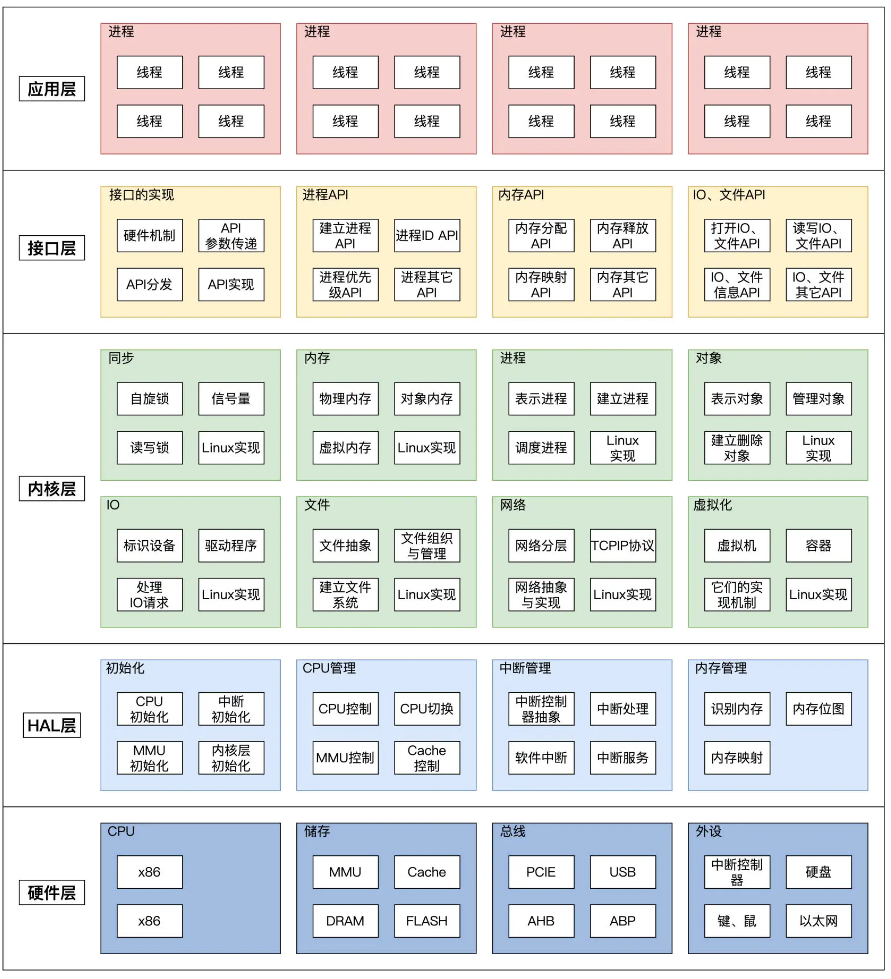

此章节为总结和一些调试技巧部分：   
### Summarize
HuOS设计的目标是在彻底抛弃目前计算机体系中积累的软硬件体系中的诸多历史包袱后，引入现代化的工程思想进行重新设计与实现。从而使得操作系统、芯片可以具有更高的模块化、低耦合、以及更强的可复用性和可扩展能力。  
  

#### [Dynamic debugging](./Dynamic_debugging/README.md)