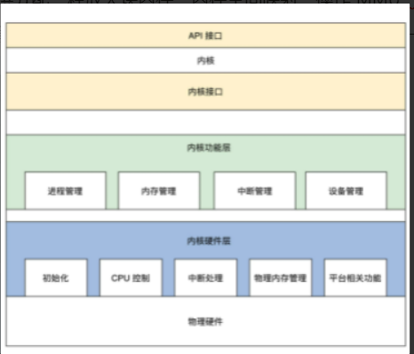

<!-- toc -->
整体的设计思路与概念

- [经典内核架构](#经典内核结构)
    - [宏内核架构](#宏内核架构)
    - [微内核架构](#微内核架构)
        - [分离硬件相关性](#分离硬件相关性hal层arh层)
    - [HuOS的混合内核架构](#huos的内核架构混合内核架构)
- [已成熟的内核结构](#已成熟的内核结构)
<!-- tocstop -->

# 经典内核结构
## 宏内核架构
宏内核就是把诸如管理进程的代码、管理内存的代码、管理各种 I/O 设备的代码、文件系统的代码、图形系统代码以及其它功能模块的代码经过编译，最后链接在一起，形成一个大的可执行程序。这个大程序里有实现支持这些功能的所有代码，向用户应用软件提供一些接口即系统API函数。  

并不是它们有层次关系，仅仅表示它们链接在一起  
## 微内核架构
提倡内核功能尽可能少：仅仅只有进程调度、处理中断、内存空间映射、进程间通信等功能。

这样的内核是不能完成什么实际功能的，开发者们把实际的进程管理、内存管理、设备管理、文件管理等服务功能，做成一个个**服务进程**。微内核定义了一种良好的进程间通信的机制——**消息**。  

微内核的 API（应用程序接口）相当少，极端情况下仅需要两个，一个接收消息的 API 和一个发送消息的 API。

### 分离硬件相关性（HAL层/Arh层）
把操作硬件和处理硬件功能差异的代码抽离出来，形成一个独立的软件抽象层，对外提供相应的接口。  

将进程切换的代码放在一个独立的层中实现，比如硬件平台相关层，当操作系统要运行在不同的硬件平台上时，就只是需要修改硬件平台相关层中的相关代码，这样操作系统的移植性就大大增强了。
## HuOS的内核架构(混合内核架构)
### 内核接口层
	1. 定义了一套 UNIX 接口的子集，我们出于学习和研究的目的，使用 UNIX 接口的子集，优点之一是接口少，只有几个，并且这几个接口又能大致定义出操作系统的功能。

	2. 这套接口的代码，就是检查其参数是否合法，如果参数有问题就返回相关的错误，接着调用下层完成功能的核心代码。
### 内核功能层
	1. 进程管理，主要是实现进程的创建、销毁、调度进程，当然这要设计几套数据结构用于表示进程和组织进程，还要实现一个简单的进程调度算法。

	2. 内存管理，在内核功能层中只有内存池管理，分两种内存池：页面内存池和任意大小的内存池。

	3. 中断管理，这个在内核功能层中非常简单：就是把一个中断回调函数安插到相关的数据结构中，一旦发生相关的中断就会调用这个函数。

	4. 设备管理，需要用一系列的数据结构表示驱动程序模块、驱动程序本身、驱动程序创建的设备，最后把它们组织在一起，还要实现创建设备、销毁设备、访问设备的代码，这些代码最终会调用设备驱动程序，达到操作设备的目的。
### 内核硬件层
	1. 初始化，初始化代码是内核被加载到内存中最先需要运行的代码，例如初始化少量的设备、CPU、内存、中断的控制、内核用于管理的数据结构等。

	2. CPU 控制，提供 CPU 模式设定、开、关中断、读写 CPU 特定寄存器等功能的代码。

	3. 中断处理，保存中断时机器的上下文，调用中断回调函数，操作中断控制器等。

	4. 物理内存管理，提供分配、释放大块内存，内存空间映射，操作 MMU、Cache 等。

	5. 平台其它相关的功能，有些硬件平台上有些特殊的功能，需要额外处理一下
  
此操作系统内核没有任何设备驱动程序，把文件系统、网络组件、其它功能组件作为虚拟设备交由设备管理，比如需要文件系统时就写一个文件系统虚拟设备的驱动，完成文件系统的功能，需要网络时就开发一个网络虚拟设备的驱动，完成网络功能。

这些驱动一旦被装载，就是内核的一部分了，并不是像微内核一样作为服务进程运行。这又吸取了宏内核的优势，代码高度耦合，性能强劲。

# 已成熟的内核结构
**Linux-GNU 宏内核**  

**Darwin-XNU mac与ios 微内核（Mach）架构 Mach和BSD双内核的微内核架构**  

**Window NT 混合内核**  
内核相较于linux来说小，但是仍有一些模块在内核，也有相当多的模块在用户态。  
  
HAL 层上是定义了一个小内核。小内核之上是各种内核组件，微软称之为内核执行体，它们完成进程、内存、配置、I/O 文件缓存、电源与即插即用、安全等相关的服务。所有的设备驱动和文件系统都由 I/O 管理器统一管理，驱动程序可以堆叠形成 I/O 驱动栈，功能请求被封装成 I/O 包，在栈中一层层流动处理。

