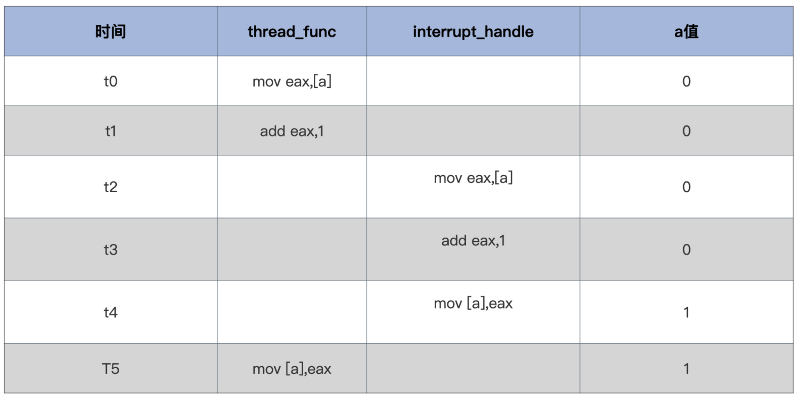

<!-- toc -->
从原子变量到中断到自旋锁最后到信号量，后面的都是用来弥补前一个的缺点。
- [问题场景](#问题)
- [解决方案1：原子操作--单体变量](#方案1----原子操作)
    - [代码解析](#代码解析)
    - [Linux的原子变量](#linux的原子变量)
    - [原子变量的不足](#原子变量的不足)
- [解决方案2：中断--复杂变量](#方案2----中断)
    - [Linux的中断](#linux控制中断)
    - [中断的不足](#中断的不足)
- [解决方案3：自旋锁--协调多核心CPU](#自旋锁----协调多核心cpu)
    - [Linux自旋锁](#linux自旋锁)
        - [Linux原始自旋锁](#linux原始自旋锁)
        - [Linux排队自旋锁](#linux排队自旋锁)
    - [自旋锁的不足](#自旋锁的不足)
- [解决方案4：信号量--CPU时间管理](#信号量)
    - [等待,互斥,唤醒](#等待互斥唤醒即重新激活等待的代码执行流)
    - [Linux信号量](#linux信号量)
    - [Linux读写锁](#linux读写锁)
- [补充](#补充)
<!-- tocstop -->

# 问题
一个线程中的函数和中断处理函数
```
int a = 0;
void interrupt_handle()
{
    a++;
}
void thread_func()
{
    a++;
}
```
通常编译器会把 a++ 语句翻译成这 3 条指令。
1. 把 a 加载某个寄存器中。
2. 这个寄存器加 1。
3. 把这个寄存器写回内存。

会导致的冲突问题:


# 方案1 -- 原子操作
x86 平台支持很多原子指令，我们只需要直接应用这些指令，比如原子加、原子减，原子读写等，用汇编代码写出对应的原子操作函数就行了。  
```
//定义一个原子类型
typedef struct s_ATOMIC{
    volatile s32_t a_count; //在变量前加上volatile，是为了禁止编译器优化，使其每次都从内存中加载变量
}atomic_t;
//原子读
static inline s32_t atomic_read(const atomic_t *v)
{        
        //x86平台取地址处是原子
        return (*(volatile u32_t*)&(v)->a_count);
}
//原子写
static inline void atomic_write(atomic_t *v, int i)
{
        //x86平台把一个值写入一个地址处也是原子的 
        v->a_count = i;
}
//原子加上一个整数
static inline void atomic_add(int i, atomic_t *v)
{
        __asm__ __volatile__("lock;" "addl %1,%0"
                     : "+m" (v->a_count)
                     : "ir" (i));
}
//原子减去一个整数
static inline void atomic_sub(int i, atomic_t *v)
{
        __asm__ __volatile__("lock;" "subl %1,%0"
                     : "+m" (v->a_count)
                     : "ir" (i));
}
//原子加1
static inline void atomic_inc(atomic_t *v)
{
        __asm__ __volatile__("lock;" "incl %0"
                       : "+m" (v->a_count));
}
//原子减1
static inline void atomic_dec(atomic_t *v)
{
       __asm__ __volatile__("lock;" "decl %0"
                     : "+m" (v->a_count));
}

```
有了这些原子操作函数之后 ，前面场景中的代码就变成下面这样了：无论有没有中断，或者什么时间来中断，都不会出错。
```
atomic_t a = {0};
void interrupt_handle()
{
    atomic_inc(&a);
}
void thread_func()
{
    atomic_inc(&a);
}
```
## 代码解析
加上 lock 前缀的 addl、subl、incl、decl 指令都是原子操作，lock 前缀表示锁定总线。  
GCC 设计了一种特有的嵌入方式，它规定了汇编代码嵌入的形式和嵌入汇编代码需要由哪几个部分组成，例如:
```
__asm__ __volatile__(代码部分:输出部分列表: 输入部分列表:损坏部分列表);
```
1. 汇编代码部分，这里是实际嵌入的汇编代码。
2. 输出列表部分，让 GCC 能够处理 C 语言左值表达式与汇编代码的结合。
3. 输入列表部分，也是让 GCC 能够处理 C 语言表达式、变量、常量，让它们能够输入到汇编代码中去。
4. 损坏列表部分，告诉 GCC 汇编代码中用到了哪些寄存器，以便 GCC 在汇编代码运行前，生成保存它们的代码，并且在生成的汇编代码运行后，恢复它们（寄存器）的代码。

它们之间用冒号隔开，如果只有汇编代码部分，后面的冒号可以省略。但是有输入列表部分而没有输出列表部分的时候，输出列表部分的冒号就必须要写。
```
static inline void atomic_add(int i, atomic_t *v) 
{         
    __asm__ __volatile__("lock;" "addl %1,%0" : "+m" (v->a_count) : "ir" (i)); } 
    //"lock;" "addl %1,%0" 是汇编指令部分，%1,%0是占位符，它表示输出、输入列表中变量或表态式，占位符的数字从输出部分开始依次增加，这些变量或者表态式会被GCC处理成寄存器、内存、立即数放在指令中。 单核心 CPU 是不需要 lock 前缀的，只要在多核心 CPU 下才需要加上 lock 前缀。
    //: "+m" (v->a_count) 是输出列表部分，“+m”表示(v->a_count)和内存地址关联 
    //: "ir" (i) 是输入列表部分，“ir” 表示i是和立即数或者寄存器关联
```
## Linux的原子变量
```
typedef struct {
    int counter;
} atomic_t;//常用的32位的原子变量类型
#ifdef CONFIG_64BIT
typedef struct {
    s64 counter;
} atomic64_t;//64位的原子变量类型
#endif
```
并且要用 Linux 专门提供的接口函数去操作来保证原子性
```
//原子读取变量中的值
static __always_inline int arch_atomic_read(const atomic_t *v)
{
    return __READ_ONCE((v)->counter);
}
//原子写入一个具体的值
static __always_inline void arch_atomic_set(atomic_t *v, int i)
{
    __WRITE_ONCE(v->counter, i);
}
//原子加上一个具体的值
static __always_inline void arch_atomic_add(int i, atomic_t *v)
{
    asm volatile(LOCK_PREFIX "addl %1,%0"
             : "+m" (v->counter)
             : "ir" (i) : "memory");
}
//原子减去一个具体的值
static __always_inline void arch_atomic_sub(int i, atomic_t *v)
{
    asm volatile(LOCK_PREFIX "subl %1,%0"
             : "+m" (v->counter)
             : "ir" (i) : "memory");
}
//原子加1
static __always_inline voi arch_atomic_inc(atomic_t *v)
{
    asm volatile(LOCK_PREFIX "incl %0"
             : "+m" (v->counter) :: "memory");
}
//原子减1
static __always_inline void arch_atomic_dec(atomic_t *v)
{
    asm volatile(LOCK_PREFIX "decl %0"
             : "+m" (v->counter) :: "memory");
}
```
__READ_ONCE，__WRITE_ONCE 两个宏是对代码封装并利用 GCC 的特性对代码进行检查，把让错误显现在编译阶段。其中的“volatile int *”是为了提醒编译器：这是对内存地址读写，不要有优化动作，每次都必须强制写入内存或从内存读取。
```
#define __READ_ONCE(x) (*(const volatile __unqual_scalar_typeof(x) *)&(x))
#define __WRITE_ONCE(x, val) do {*(volatile typeof(x) *)&(x) = (val);} while (0)
//__unqual_scalar_typeof表示声明一个非限定的标量类型，非标量类型保持不变。说人话就是返回x变量的类型，这是GCC的功能，typeof只是纯粹返回x的类型。
//如果 x 是int类型则返回“int” 
#define __READ_ONCE(x) (*(const volatile int *)&(x))
#define __WRITE_ONCE(x, val) do {*(volatile int *)&(x) = (val);} while (0) 
```
## 原子变量的不足
原子操作只适合于单体变量，如整数。操作系统的数据结构有的可能有几百字节大小，其中可能包含多种不同的基本数据类型。这显然用原子操作无法解决。

# 方案2 -- 中断（Ring0）
x86 CPU 上关闭、开启中断有专门的指令，即 cli、sti 指令，它们主要是对 CPU 的 eflags 寄存器的 IF 位（第 9 位）进行清除和设置，CPU 正是通过此位来决定是否响应中断信号。
```
//关闭中断
void hal_cli()
{
    __asm__ __volatile__("cli": : :"memory");
}
//开启中断
void hal_sti()
{
    __asm__ __volatile__("sti": : :"memory");
}
//使用场景
void foo()
{
    hal_cli();
    //操作数据……
    hal_sti();
}
void bar()
{
    hal_cli();
    //操作数据……
    hal_sti();
}
```
**问题：看似完美地解决了问题，其实有重大缺陷，hal_cli()，hal_sti()，无法嵌套使用**
```
void foo()
{
    hal_cli();
    //操作数据第一步……
    hal_sti();
}
void bar()
{
    hal_cli();
    foo();
    //操作数据第二步……
    hal_sti();
}
```
bar 函数在关中断下调用了 foo 函数，foo 函数中先关掉中断，处理好数据然后开启中断，回到 bar 函数中，bar 函数还天真地以为中断是关闭的，接着处理数据，以为不会被中断抢占。  
**解决方法:**  
在关闭中断函数中先保存 eflags 寄存器，然后执行 cli 指令，在开启中断函数中直接恢复之前保存的 eflags 寄存器就行了。
```
typedef u32_t cpuflg_t;
static inline void hal_save_flags_cli(cpuflg_t* flags)
{
     __asm__ __volatile__(
            "pushfl \t\n" //把eflags寄存器压入当前栈顶
            "cli    \t\n" //关闭中断
            "popl %0 \t\n"//把当前栈顶弹出到flags为地址的内存中        
            : "=m"(*flags)
            :
            : "memory"
          );
}
/*
1. 先在栈上保存eflags；如果函数嵌套前中断已经关闭，这里保存了关闭的状态，后续用这个eflags值恢复也是中断的状态，保持不变;
2. 再关中断：这个改变了目前的eflags的IF标志位，但不是栈上的; 
3. 然后把栈上保存的eflags保存到内存的某个地址，用于后续恢复;
*/
static inline void hal_restore_flags_sti(cpuflg_t* flags)
{
    __asm__ __volatile__(
              "pushl %0 \t\n"//把flags为地址处的值寄存器压入当前栈顶
              "popfl \t\n"   //把当前栈顶弹出到eflags寄存器中
              :
              : "m"(*flags)
              : "memory"
              );
}
hal_restore_flags_sti() 函数的执行，是否开启中断完全取决于上一次在内存中存储的 eflags 寄存器的值
```
这样，无论函数嵌套调用多少层都没有问题。  
## Linux控制中断
多个中断处理程序需要访问一些共享数据，一个中断程序在访问数据时必须保证自身（中断嵌套）和其它中断处理程序互斥，否则就会出错。再比如，设备驱动程序在设置设备寄存器时，也必须让 CPU 停止响应中断。  
```
//实际保存eflags寄存器，把eflags寄存器的值保存到flags变量中
//"="符号表示%0是一个输出变量。它的值将被保存到flags变量中。
//"r"符号表示%0是一个"通用"寄存器，可以用于任何目的。
//"m"符号表示%0是一个内存地址。
extern __always_inline unsigned long native_save_fl(void){
    unsigned long flags;
    asm volatile("# __raw_save_flags\n\t"
                 "pushf ; pop %0":"=rm"(flags)::"memory");
    return flags;
}
//实际恢复eflags寄存器，把flags变量中的值保存到eflags寄存器中
extern inline void native_restore_fl(unsigned long flags){
    asm volatile("push %0 ; popf"::"g"(flags):"memory","cc");
}
//实际关中断
static __always_inline void native_irq_disable(void){
    asm volatile("cli":::"memory");
}
//实际开启中断
static __always_inline void native_irq_enable(void){
    asm volatile("sti":::"memory");
}
```
arch层（architecture layer）：这一层是系统架构的最底层，它提供了与硬件相关的操作接口。  
raw层（raw layer）：这一层是arch层的上一层，它提供了更高层次的抽象，并把硬件相关的操作转换成更通用的操作。  
arch_local_irq_disable、arch_local_irq_enable、arch_local_save_flags 和 arch_local_irq_restore四个函数分别调用了native_irq_disable、native_irq_enable、native_save_fl和native_restore_fl
```
//arch层关中断
static __always_inline void arch_local_irq_disable(void){
    native_irq_disable();
}
//arch层开启中断
static __always_inline void arch_local_irq_enable(void){ 
    native_irq_enable();
}
//arch层保存eflags寄存器
static __always_inline unsigned long arch_local_save_flags(void){
    return native_save_fl();
}
//arch层恢复eflags寄存器
static  __always_inline void arch_local_irq_restore(unsigned long flags){
    native_restore_fl(flags);
}
//实际保存eflags寄存器并关中断
static __always_inline unsigned long arch_local_irq_save(void){
    unsigned long flags = arch_local_save_flags();
    arch_local_irq_disable();
    return flags;
}
```
raw_local_irq_disable：调用arch_local_irq_disable函数，用于关闭中断。  
raw_local_irq_enable：调用arch_local_irq_enable函数，用于开启中断。  
raw_local_irq_save：调用arch_local_irq_save函数，用于保存eflags寄存器并关闭中断。  
raw_local_irq_restore：调用arch_local_irq_restore函数，用于恢复eflags寄存器。  
raw_local_save_flags：调用arch_local_save_flags函数，用于保存eflags寄存器。  
```
//raw层关闭开启中断宏
#define raw_local_irq_disable()     arch_local_irq_disable()
#define raw_local_irq_enable()      arch_local_irq_enable()
//raw层保存恢复eflags寄存器宏
#define raw_local_irq_save(flags)           \
    do {                        \
        typecheck(unsigned long, flags);    \
        flags = arch_local_irq_save();      \
    } while (0)
    
#define raw_local_irq_restore(flags)            \
    do {                        \
        typecheck(unsigned long, flags);    \
        arch_local_irq_restore(flags);      \
    } while (0)
    
#define raw_local_save_flags(flags)         \
    do {                        \
        typecheck(unsigned long, flags);    \
        flags = arch_local_save_flags();    \
    } while (0)
```
通用层的宏：local_irq_enable、local_irq_disable、local_irq_save和local_irq_restore。这些宏分别是对raw_local_irq_enable、raw_local_irq_disable、raw_local_irq_save和raw_local_irq_restore的封装。
```
//通用层接口宏 
#define local_irq_enable()              \
    do { \
        raw_local_irq_enable();         \
    } while (0)

#define local_irq_disable()             \
    do {                        \
        raw_local_irq_disable();        \
    } while (0)

#define local_irq_save(flags)               \
    do {                        \
        raw_local_irq_save(flags);      \
    } while (0)

#define local_irq_restore(flags)            \
    do {                        \
        raw_local_irq_restore(flags);       \
    } while (0)
```
## 中断的不足
控制中断，看似解决了问题，那是因为以前是单 CPU，同一时刻只有一条代码执行流，除了中断会中止当前代码执行流，转而运行另一条代码执行流（中断处理程序），再无其它代码执行流。这种情况下只要控制了中断，就能安全地操作全局数据。  
但是现在情况发生了改变，CPU 变成了多核心，或多 CPU，同一时刻下系统中存在多条代码执行流，控制中断只能控制本地 CPU 的中断，无法控制其它 CPU 核心的中断。所以，原先通过控制中断来维护全局数据安全的方案失效了，这就需要自旋锁登场了。  

# 自旋锁 -- 协调多核心CPU
首先读取锁变量，判断其值是否已经加锁，如果未加锁则执行加锁，然后返回，表示加锁成功；如果已经加锁了，就要返回第一步继续执行后续步骤。必须保证读取锁变量和判断并加锁的操作是原子执行的。  
x86 CPU 给我们提供了一个原子交换指令，xchg，它可以让寄存器里的一个值跟内存空间中的一个值做交换。例如，让 eax=memlock，memlock=eax 这个动作是原子的，不受其它 CPU 干扰。  
```
//自旋锁结构
typedef struct
{
     volatile u32_t lock;//volatile可以防止编译器优化，保证其它代码始终从内存加载lock变量的值 
} spinlock_t;
//锁初始化函数
static inline void x86_spin_lock_init(spinlock_t * lock)
{
     lock->lock = 0;//锁值初始化为0是未加锁状态
}
//加锁函数
static inline void x86_spin_lock(spinlock_t * lock)
{
    __asm__ __volatile__ (
    "1: \n"
    "lock; xchg  %0, %1 \n"//把值为1的寄存器和lock内存中的值进行交换
    "cmpl   $0, %0 \n" //用0和交换回来的值进行比较
    "jnz    2f \n"  //不等于0则跳转后面2标号处运行
    "jmp 3f \n"     //若等于0则跳转后面3标号处返回
    "2:         \n" 
    "cmpl   $0, %1  \n"//用0和lock内存中的值进行比较
    "jne    2b      \n"//若不等于0则跳转到前面2标号处运行继续比较  
    "jmp    1b      \n"//若等于0则跳转到前面1标号处运行，交换并加锁
    "3:  \n"     :
    : "r"(1), "m"(*lock));  //%1是通用寄存器，值为1
}
//解锁函数
static inline void x86_spin_unlock(spinlock_t * lock)
{
    __asm__ __volatile__(
    "movl   $0, %0\n"//解锁把lock内存中的值设为0就行
    :
    : "m"(*lock));
}
```
此时**如果一个CPU获取自旋锁后发生中断，中断代码里也尝试获取自旋锁，那么自旋锁永远不会被释放，发生死锁**，优化成关中断下获取自旋锁，以及恢复中断状态释放自旋锁
```
//代码构成了一个死循环，目的是获取锁。在第一次执行时，如果lock变量为0，就跳出循环，否则继续循环。每次循环都会把1赋值给lock变量，然后再和lock变量原来的值比较。如果lock变量原来的值为0，就意味着当前已经获取到了锁，此时会跳出循环。
static inline void x86_spin_lock_disable_irq(spinlock_t * lock,cpuflg_t* flags)
{
    __asm__ __volatile__(
    "pushfq                 \n\t"    //当前eflags寄存器值入栈
    "cli                    \n\t"    //关中断，eflags IF=0
    "popq %0                \n\t"    //栈顶值弹出到%0(flags)
    "1:                     \n\t"    
    "lock; xchg  %1, %2     \n\t"    //lock xchg，表示在执行这条指令时不允许其他CPU访问内存。xchg交换%1和%2的值，%1和%2是两个输入变量，在这里分别对应1和lock变量,lock = 1
    "cmpl   $0,%1           \n\t"    
    "jnz    2f              \n\t"    
    "jmp    3f              \n"      //比较%1和0，如果%1(r)不等于0，就跳转到2f,%1等于0，就跳转到3f
    "2:                     \n\t"    
    "cmpl   $0,%2           \n\t"    //比较%2和0，如果%2(lock)不等于0，就跳转到2b
    "jne    2b              \n\t"
    "jmp    1b              \n\t"
    "3:                     \n"     
    :"=m"(*flags)                    // %0
    : "r"(1), "m"(*lock));           // %1 %2
}
static inline void x86_spin_unlock_enabled_irq(spinlock_t* lock,cpuflg_t* flags)
{
    __asm__ __volatile__(
    "movl   $0, %0\n\t"
    "pushq %1 \n\t"
    "popfq \n\t"
    :
    : "m"(*lock), "m"(*flags));
}
```
## Linux自旋锁
同一时刻，只有获取了锁的进程才能使用共享资源。Linux 有多种自旋锁，我们这里只介绍两种，原始自旋锁和排队自旋锁。  
### Linux原始自旋锁
值为 1 代表锁未被占用，为 0 或者负数则表示被占用  
```
//最底层的自旋锁数据结构
typedef struct{
volatile unsigned long lock;//真正的锁值变量，用volatile标识
}spinlock_t;
```
自旋锁接口  
spin_lock_string、spin_unlock_string 两个宏，定义了获取、释放自旋锁的汇编指令。spin_unlock_string 只是简单将锁值变量设置成 1，表示释放自旋锁，spin_lock_string 中并没有使用 xchg 指令，而是使用了 decb 指令，这条指令也能原子地执行减 1 操作。开始锁值变量为 1 时，执行 decb 指令就变成了 0，0 就表示加锁成功。如果小于 0，则表示有其它进程已经加锁了，就会导致循环比较。
```
#define spin_unlock_string \  
    "movb $1,%0" \ //写入1表示解锁
    :"=m" (lock->lock) : : "memory"
#define spin_lock_string \
  "\n1:\t" \  
    "lock ; decb %0\n\t" \ //原子减1
  "js 2f\n" \    //当结果小于0则跳转到标号2处，表示加锁失败
    ".section .text.lock,\"ax\"\n" \ //重新定义一个代码段，这是优化技术，避免后面的代码填充cache，因为大部分情况会加锁成功，链接器会处理好这个代码段的
  "2:\t" \  
    "cmpb $0,%0\n\t" \  //和0比较
    "rep;nop\n\t" \  //空指令
    "jle 2b\n\t" \   //小于或等于0跳转到标号2
    "jmp 1b\n" \   //跳转到标号1  
    ".previous"
//获取自旋锁
static inline void spin_lock(spinlock_t*lock){
    __asm__ __volatile__(
    spin_lock_string
    :"=m"(lock->lock)::"memory"
    );
}
//释放自旋锁
static inline void spin_unlock(spinlock_t*lock){
__asm__ __volatile__(
    spin_unlock_string
    );
}
```
### Linux排队自旋锁
很有可能最后来的进程最先获取自旋锁 L，这对其它等待的进程极其不公平，为了解决获取自旋锁的公平性，Linux 开发出了排队自旋锁。Linux重新定义了自旋锁的数据结构    
Linux 为了避免差异性，在 spinlock_t 结构体中包含了 raw_spinlock_t，而在 raw_spinlock_t 结构体中并没使用 next 和 owner 字段，而是在代码中直接操作 slock 的高 16 位和低 16 位来实现的  
```
//RAW层的自旋锁数据结构
typedef struct raw_spinlock{
    unsigned int slock;//真正的锁值变量
}raw_spinlock_t;
//最上层的自旋锁数据结构
typedef struct spinlock{
    struct raw_spinlock rlock;
}spinlock_t;
//Linux没有这样的结构，这只是为了描述方便
typedef struct raw_spinlock{
    union {
        unsigned int slock;//真正的锁值变量
        struct {
        u16 owner;
        u16 next;
        }
    }
}raw_spinlock_t;
```
slock 域被分成两部分，分别保存锁持有者和未来锁申请者的序号。只有 next 域与 owner 域相等时，才表示自旋锁处于未使用的状态（此时也没有进程申请该锁）。  
每个进程都有一个序号，从 0 开始递增。当一个进程想要获得这个锁时，它会原子地将 next 域加 1，并返回这个值作为自己的序号。如果这个进程的序号等于当前的 owner 域值，那么它就获得了这个锁。如果不是，那么这个进程会一直循环检查 owner 域是否等于自己的序号。当一个进程释放锁时，它会原子地将 owner 域加 1，下一个进程就可以通过检查 owner 域是否等于自己的序号来获得这个锁。这样，进程将会按照申请顺序依次获得排队自旋锁。  
```
static inline void __raw_spin_lock(raw_spinlock_t*lock){
int inc = 0x00010000;
int tmp;
__asm__ __volatile__(
"lock ; xaddl %0, %1\n" //将inc和slock交换，然后 inc=inc+slock
                        //相当于原子读取next和owner并对next+1 -> 0x0001 0000前四个字节是1
//前16位指的是next，后16位指owner，抢锁的话是增加next，释放锁是增加owner，next和owner相等则可以进行下步操作
"movzwl %w0, %2\n\t"//将inc的低16位做0扩展后送tmp tmp=(u16)inc
"shrl $16, %0\n\t" //将inc右移16位 inc=inc>>16，也就是将owner取出
"1:\t"
"cmpl %0, %2\n\t" //比较inc和tmp，即比较next和owner 
"je 2f\n\t" //相等则跳转到标号2处返回
"rep ; nop\n\t" //空指令
"movzwl %1, %2\n\t" //将slock的低16位做0扩展后送tmp 即tmp=owner
"jmp 1b\n" //跳转到标号1处继续比较
"2:"
:"+Q"(inc),"+m"(lock->slock),"=r"(tmp)   //"+Q"(inc)表示inc是一个输入，输出的变量，在函数调用前被加载到寄存器中，函数调用后被保存回内存。"+m"(lock->slock)表示lock->slock是一个输入，输出的内存变量，在函数调用前从内存加载到寄存器中，函数调用后被保存回内存。"=r"(tmp)表示tmp是一个输出的寄存器变量，在函数调用后被保存到内存中。
::"memory","cc"
);
}
#define UNLOCK_LOCK_PREFIX LOCK_PREFIX
static inline void __raw_spin_unlock(raw_spinlock_t*lock){
__asm__ __volatile__(
UNLOCK_LOCK_PREFIX"incw %0"//将slock的低16位加1 即owner+1
:"+m"(lock->slock)
::"memory","cc");
}
```
当一个进程发现另一个进程已经拥有自己所请求的自旋锁时，就自愿放弃，转而做其它别的工作  
```
static inline int __raw_spin_trylock(raw_spinlock_t*lock){
    int tmp;
    int new;
    asm volatile(
    "movl %2,%0\n\t"     //tmp=slock
    "movl %0,%1\n\t"     //new=tmp
    "roll $16, %0\n\t"   //tmp循环左移16位，即next和owner交换了
    "cmpl %0,%1\n\t"     //比较tmp和new即（owner、next）？=（next、owner）
    "jne 1f\n\t"         //不等则跳转到标号1处 
    "addl $0x00010000, %1\n\t"     //相当于next+1
    "lock ; cmpxchgl %1,%2\n\t"    //new和slock交换比较    
    "1:"
    "sete %b1\n\t"        //new = eflags.ZF位，ZF取决于前面的判断是否相等
    "movzbl %b1,%0\n\t"   //tmp = new
    :"=&a"(tmp),"=Q"(new),"+m"(lock->slock)
    ::"memory","cc");
    return tmp;
}
// _raw_spin_trylock 函数返回1，那么 _spin_trylock 函数就会调用 spin_acquire 函数来记录自旋锁的依赖关系，并返回 1；否则，它会调用 preempt_enable 函数恢复抢占，并返回 0。
int __lockfunc _spin_trylock(spinlock_t*lock){ 
    preempt_disable();
    if(_raw_spin_trylock(lock)){
        spin_acquire(&lock->dep_map,0,1,_RET_IP_);
        return 1;
    }
    preempt_enable();
    return 0;
}
#define spin_trylock(lock) __cond_lock(lock, _spin_trylock(lock))
```
_cond_lock 只用代码静态检查工作，_spin_trylock 返回 1 表示尝试加锁成功，可以安全的地问共享资源了；返回值为 0 则表示尝试加锁失败，不能操作共享资源。
```
spin_acquire(&lock->dep_map,0,1,_RET_IP_);
```
参数 lock->dep_map 指定了要记录依赖关系的自旋锁的依赖关系映射（dependency map）。参数 0 和 1 分别指定了依赖关系的类型和深度，具体含义取决于这两个参数的值。最后，参数 _RET_IP_ 指定了调用者的返回地址（return address），这在跟踪自旋锁的依赖关系时可能会用到。  
简单来说，spin_acquire 函数会在自旋锁的依赖关系映射中记录一条新的依赖关系，这条依赖关系描述了自旋锁的使用者、使用者的调用位置以及依赖关系的类型和深度。这有助于跟踪自旋锁的使用情况，并在发生死锁时帮助分析问题。
## 自旋锁的不足
无论是原子操作，还是自旋锁，都不适合长时间等待的情况，因为有很多资源（数据）它有一定的时间性，你想去获取它，CPU 并不能立即返回给你，而是要等待一段时间，才能把数据返回给你。这种情况，用自旋锁来同步访问这种资源，会是对 CPU 时间的巨大浪费。因此出现了另一种同步机制，既能对资源数据进行保护（同一时刻只有一个代码执行流访问），又能在资源无法满足的情况下，让 CPU 可以执行其它任务--信号量。  

# 信号量 -- CPU时间管理
信号量是一种用于资源互斥或者进程间同步的机制。  
微信等待你从键盘上的输入信息，然后把这个信息发送出去。  
**实现方法**  
1. 一块内存，相当于缓冲区，用于保存键盘的按键码。  
2. 需要一套控制机制，比如微信读取这个缓冲区，而该缓冲区为空时怎么处理；该缓冲区中有了按键码，却没有代码执行流来读取，又该怎么处理。  

**期望**  
1. 当微信获取键盘输入信息时，发现键盘缓冲区中是空的，就进入等待状态。
2. 同一时刻，只能有一个代码执行流操作键盘缓冲区。
3. 当用户按下键盘时，我们有能力把按键码写入缓冲区中，并且能看一看微信或者其它程序是否在等待该缓冲区，如果是就重新激活微信和其它的程序，让它们重新竞争读取键盘缓冲区，如果竞争失败依然进入等待状态。
## 等待、互斥、唤醒（即重新激活等待的代码执行流）
这个数据结构至少需要一个变量来表示互斥，比如大于 0 则代码执行流可以继续运行，等于 0 则让代码执行流进入等待状态。还需要一个等待链，用于保存等待的代码执行流
```
#define SEM_FLG_MUTEX 0
#define SEM_FLG_MULTI 1
#define SEM_MUTEX_ONE_LOCK 1
#define SEM_MULTI_LOCK 0
//等待链数据结构，用于挂载等待代码执行流（线程）的结构，里面有用于挂载代码执行流的链表和计数器变量
typedef struct s_KWLST
{   
    spinlock_t wl_lock;
    uint_t   wl_tdnr;
    list_h_t wl_list;
}kwlst_t;
//信号量数据结构
typedef struct s_SEM
{
    spinlock_t sem_lock; //维护sem_t自身数据的自旋锁
    uint_t sem_flg;      //信号量相关的标志
    sint_t sem_count;    //信号量计数值
    kwlst_t sem_waitlst; //用于挂载等待代码执行流（线程）结构
}sem_t;
```
信号量在使用之前需要先进行初始化。这里假定信号量数据结构中的 sem_count 初始化为 1，sem_waitlst 等待链初始化为空。  
**第一步，获取信号量**
1. 首先对用于保护信号量自身的自旋锁 sem_lock 进行加锁。
2. 对信号值 sem_count 执行“减 1”操作，并检查其值是否小于 1。
3. 上步中检查 sem_count 如果小于 1，就让进程进入等待状态并且将其挂入 sem_waitlst 中，然后调度其它进程运行。否则表示获取信号量成功。当然最后别忘了对自旋锁 sem_lock 进行解锁。

**第二步，代码执行流开始执行相关操作，例如读取键盘缓冲区**

**第三步，释放信号量**
1. 首先对用于保护信号量自身的自旋锁 sem_lock 进行加锁。
2. 对信号值 sem_count 执行“加 1”操作，并检查其值是否大于 0。
3. 上步中检查 sem_count 值如果大于 1，就执行唤醒 sem_waitlst 中进程的操作，并且需要调度进程时就执行进程调度操作，不管 sem_count 是否大于 1（通常会大于 1）都标记信号量释放成功。当然最后别忘了对自旋锁 sem_lock 进行解锁。
```
//获取信号量
void krlsem_down(sem_t* sem)
{
    cpuflg_t cpufg;
start_step:    
    krlspinlock_cli(&sem->sem_lock,&cpufg);
    if(sem->sem_count<1)
    {//如果信号量值小于1,则让代码执行流（线程）睡眠
        krlwlst_wait(&sem->sem_waitlst);
        krlspinunlock_sti(&sem->sem_lock,&cpufg);
        krlschedul();//切换代码执行流，下次恢复执行时依然从下一行开始执行，所以要goto开始处重新获取信号量
        goto start_step; 
    }
    sem->sem_count--;//信号量值减1,表示成功获取信号量
    krlspinunlock_sti(&sem->sem_lock,&cpufg);
    return;
}
//释放信号量
void krlsem_up(sem_t* sem)
{
    cpuflg_t cpufg;
    krlspinlock_cli(&sem->sem_lock,&cpufg);
    sem->sem_count++;//释放信号量
    if(sem->sem_count<1)
    {//如果小于1,则说数据结构出错了，挂起系统
        krlspinunlock_sti(&sem->sem_lock,&cpufg);
        hal_sysdie("sem up err");
    }
    //唤醒该信号量上所有等待的代码执行流（线程）
    krlwlst_allup(&sem->sem_waitlst);
    krlspinunlock_sti(&sem->sem_lock,&cpufg);
    krlsched_set_schedflgs();
    return;
}
```
## Linux信号量
信号量能保证资源在一个时刻只有一个进程使用，这是单值信号量。初始值为1。  
也可以作为资源计数器，比如一种资源有五份，同时最多可以有五个进程，这是多值信号量。初始值为5。  
信号量的值为正的时候。所申请的进程可以锁定使用它。若为 0，说明它被其它进程占用，申请的进程要进入睡眠队列中，等待被唤醒。
```
struct semaphore{
    raw_spinlock_t lock;//保护信号量自身的自旋锁
    unsigned int count;//信号量值
    struct list_head wait_list;//挂载睡眠等待进程的链表
};
```
互斥锁是用来保护临界区（critical section）的，它可以保证在任意时刻，只有一个线程能够访问临界区。而信号量是用来维护计数器的，它可以用来限制进程或线程对共享资源的访问，以保证在任意时刻只有计数器允许的数量的进程或线程能够访问共享资源。  
Linux 源代码的 kernel/printk.c 中，使用宏 DEFINE_SEMAPHORE 声明了一个单值信号量 console_sem，也可以说是互斥锁，它用于保护 console 驱动列表 console_drivers 以及同步对整个 console 驱动的访问。  
其中定义了**宏 down_console_sem() 来获得信号量 console_sem，宏 up_console_sem() 来释放信号量 console_sem。**（宏的核心主要是调用了信号量的接口函数 down、up 函数）console_lock 和 console_unlock 函数是用于互斥访问 console 驱动的。  
```
#define down_console_sem() do { \
    down(&console_sem);\
} while (0)

static void __up_console_sem(unsigned long ip) {
    up(&console_sem);
}
#define up_console_sem() __up_console_sem(_RET_IP_)
//加锁console
void console_lock(void)
{
    might_sleep();
    down_console_sem();//获取信号量console_sem
    if (console_suspended)
        return;
    console_locked = 1;
    console_may_schedule = 1;
}
//解锁console
void console_unlock(void)
{
    static char ext_text[CONSOLE_EXT_LOG_MAX];
    static char text[LOG_LINE_MAX + PREFIX_MAX];
    //……删除了很多代码
    up_console_sem();              //释放信号量console_sem
    raw_spin_lock(&logbuf_lock);   //Linux排队自旋锁
    //……删除了很多代码   
}
```
一个进程进入了 __down 函数中，设置了一个不可中断的等待状态，然后执行了 schedule_timeout 函数。这个执行了进程的调度器，就直接调度到别的进程运行了。这时，这个进程就不会返回了，直到下一次它被 up 函数唤醒。执行了 wake_up_process 函数以后，重新调度它就会回到 schedule_timeout 函数下一行代码，沿着调用路经返回，最后从 __down 函数中出来，即进程睡醒了。
```
//进入睡眠等待
static noinline void __sched __down(struct semaphore *sem)
{
    __down_common(sem, TASK_UNINTERRUPTIBLE, MAX_SCHEDULE_TIMEOUT);
}

//__down_common函数是向下和向上的辅助函数。它处理让进程进入睡眠状态的逻辑，以及当信号量可用时唤醒它的逻辑
static inline int __sched __down_common(struct semaphore *sem, long state,long timeout)
{
    struct semaphore_waiter waiter;      //把waiter加入sem->wait_list的头部
    waiter.task = current;               //current表示当前进程，即调用该函数的进程
    waiter.up = false;
    for (;;) {
        if (signal_pending_state(state, current))
            goto interrupted;
        if (unlikely(timeout <= 0))
            goto timed_out;
        __set_current_state(state);           //设置当前进程的状态，进程睡眠，即先前__down函数中传入的TASK_UNINTERRUPTIBLE：该状态是等待资源有效时唤醒（比如等待键盘输入、socket连接、信号（signal）等等），但不可以被中断唤醒
        raw_spin_unlock_irq(&sem->lock);      //释放在down函数中加的锁
        timeout = schedule_timeout(timeout);  //真正进入睡眠
        raw_spin_lock_irq(&sem->lock);        //进程下次运行会回到这里，所以要加锁
        if (waiter.up)
            return 0;
    }
 timed_out:
    list_del(&waiter.list);
    return -ETIME;
 interrupted:
    list_del(&waiter.list);
    return -EINTR;
    //为了简单起见处理进程信号（signal）和超时的逻辑代码已经删除
}

//获取信号量
void down(struct semaphore *sem)
{
    unsigned long flags;
    //对信号量本身加锁并关中断，也许另一段代码也在操作该信号量
    raw_spin_lock_irqsave(&sem->lock, flags);
    if (likely(sem->count > 0))
        sem->count--;//如果信号量值大于0,则对其减1
    else
        __down(sem);//否则让当前进程进入睡眠
    raw_spin_unlock_irqrestore(&sem->lock, flags);
}

//实际唤醒进程 
static noinline void __sched __up(struct semaphore *sem)
{
    struct semaphore_waiter *waiter = list_first_entry(&sem->wait_list, struct semaphore_waiter, list);
    //获取信号量等待链表中的第一个数据结构semaphore_waiter，它里面保存着睡眠进程的指针
    list_del(&waiter->list);
    waiter->up = true;
    wake_up_process(waiter->task);//唤醒进程重新加入调度队列
}

//释放信号量
void up(struct semaphore *sem)
{
    unsigned long flags;
    //对信号量本身加锁并关中断，也许另一段代码也在操作该信号量
    raw_spin_lock_irqsave(&sem->lock, flags);
    if (likely(list_empty(&sem->wait_list)))
        sem->count++;//如果信号量等待链表中为空，则对信号量值加1
    else
        __up(sem);//否则执行唤醒进程相关的操作
    raw_spin_unlock_irqrestore(&sem->lock, flags);
}
```
```
down -> __down -> __down_common
up -> __up
```
## Linux读写锁
读写锁也称为共享 - 独占（shared-exclusive）锁，当读写锁用读取模式加锁时，它是以共享模式上锁的，当以写入修改模式加锁时，它是以独占模式上锁的（互斥）。  
操作系统中共享数据的操作基本都是在读取。每次读取都加锁的话太浪费时间，会降低进程的运行效率。所以在读取数据的时候不用加锁了，而是可以共享的访问，只有涉及到对共享数据修改的时候，才需要加锁互斥访问。
读取的时候不能写入，写入的时候不能读取，而且读取和写入操作在竞争锁的时候，写会优先得到锁  
1. 当共享数据没有锁的时候，读取的加锁操作和写入的加锁操作都可以满足。
2. 当共享数据有读锁的时候，所有的读取加锁操作都可以满足，写入的加锁操作不能满足，读写是互斥的。
3. 当共享数据有写锁的时候，所有的读取的加锁操作都不能满足，所有的写入的加锁操作也不能满足，读与写之间是互斥的，写与写之间也是互斥的。
***
Linux 中的读写锁本质上是自旋锁的变种。
1. 获取读锁时，锁值变量 lock 计数减去 1，判断结果的符号位是否为 1。若结果符号位为 0 时，获取读锁成功，即表示 lock 大于 0。
2. 获取读锁时，锁值变量 lock 计数减去 1，判断结果的符号位是否为 1。若结果符号位为 1 时，获取读锁失败，表示此时读写锁被修改数据的进程占有，此时调用 __read_lock_failed 失败处理函数，循环测试 lock+1 的值，直到结果的值大于等于 1。
3. 获取写锁时，锁值变量 lock 计数减去 RW_LOCK_BIAS_STR，即 lock-0x01000000，判断结果是否为 0。若结果为 0 时，表示获取写锁成功。
4. 获取写锁时，锁值变量 lock 计数减去 RW_LOCK_BIAS_STR，即 lock-0x01000000，判断结果是否为 0。若结果不为 0 时，获取写锁失败，表示此时有读取数据的进程占有读锁或有修改数据的进程占有写锁，此时调用 __write_lock_failed 失败处理函数，循环测试 lock+0x01000000，直到结果的值等于 0x01000000。
```
                        -> 符号位=0 -> 读锁成功,lock>0
-> 获取读锁 -> lock-1 -> 
                        -> 符号位=1 -> 读锁失败 -> __read_lock_failed -> 循环测试 lock+1 的值,直到大于1

                                                        -> =0 -> 获取写锁成功 
-> 获取写锁 -> lock-RW_LOCK_BIAS_STR(lock-0x01000000) ->
                                                        -> !=0 -> 获取写锁失败 -> __write_lock_failed ->  循环测试lock+0x01000000 的值,直到lock等于0x01000000
```
在读写锁中，有一个偏差值决定当前持有的锁是用于读还是写。偏置值通常设置为可由用于表示锁定值的类型表示的最大值。在这种情况下，锁定值是一个整数，0x01000000 是一个 24 位整数可以表示的最大值。通过将初始锁值设置为这个最大值，可以确保锁最初是偏向于读者的。这样可以让多个读者并发获取锁，而写者则要等到所有读者都释放锁后才能获取锁。
```
//读写锁初始化锁值
#define RW_LOCK_BIAS     0x01000000

//读写锁的底层数据结构
typedef struct{
    unsigned int lock;
}arch_rwlock_t;

//释放读锁 
static inline void arch_read_unlock(arch_rwlock_t *rw){ 
    asm volatile(
        LOCK_PREFIX"incl %0"     //原子对lock加1
        :"+m"(rw->lock)::"memory");
}

//释放写锁
static inline void arch_write_unlock(arch_rwlock_t *rw){
    asm volatile(
        LOCK_PREFIX"addl %1, %0"//原子对lock加上RW_LOCK_BIAS
        :"+m"(rw->lock):"i"(RW_LOCK_BIAS):"memory");
}

//获取写锁失败时调用
ENTRY(__write_lock_failed)
    //(%eax)表示由eax指向的内存空间是调用者传进来的 
    2:LOCK_PREFIX addl  $ RW_LOCK_BIAS,(%eax)
    1:rep;nop//空指令
    cmpl $RW_LOCK_BIAS,(%eax)
    //不等于初始值则循环比较，相等则表示有进程释放了写锁
    jne   1b
    //执行加写锁
    LOCK_PREFIX subl  $ RW_LOCK_BIAS,(%eax)
    jnz 2b //不为0则继续测试，为0则表示加写锁成功
    ret //返回
ENDPROC(__write_lock_failed)
//获取读锁失败时调用
ENTRY(__read_lock_failed)
    //(%eax)表示由eax指向的内存空间是调用者传进来的 
    2:LOCK_PREFIX incl(%eax)//原子加1
    1:  rep; nop//空指令
    cmpl  $1,(%eax) //和1比较 小于0则
    js 1b //为负则继续循环比较
    LOCK_PREFIX decl(%eax) //加读锁
    js  2b  //为负则继续加1并比较，否则返回
    ret //返回
ENDPROC(__read_lock_failed)

//获取读锁
static inline void arch_read_lock(arch_rwlock_t*rw){
    asm volatile(
        LOCK_PREFIX" subl $1,(%0)\n\t"//原子对lock减1
        "jns 1f\n"//不为小于0则跳转标号1处，表示获取读锁成功
        "call __read_lock_failed\n\t"//调用__read_lock_failed
        "1:\n"
        ::LOCK_PTR_REG(rw):"memory");
}

//获取写锁
static inline void arch_write_lock(arch_rwlock_t*rw){
    asm volatile(
        LOCK_PREFIX"subl %1,(%0)\n\t"//原子对lock减去RW_LOCK_BIAS
        "jz 1f\n"//为0则跳转标号1处
        "call __write_lock_failed\n\t"//调用__write_lock_failed
        "1:\n"
        ::LOCK_PTR_REG(rw),"i"(RW_LOCK_BIAS):"memory");
}
```
实际操作时不是直接使用上面的函数和数据结构，而是使用 Linux 提供的标准接口，如 read_lock、write_lock 等。  
Linux 读写锁的原理本质是基于计数器，初始值为 0x01000000，获取读锁时对其减 1，结果不小于 0 则表示获取读锁成功，获取写锁时直接减去 0x01000000。读写锁其实是带计数的特殊自旋锁，能同时被多个读取数据的进程占有或一个修改数据的进程占有，但不能同时被读取数据的进程和修改数据的进程占有。

# 补充
"pushfq"是64位架构下使用的指令，"pushfl"是32位架构下使用的指令。  
锁有两个核心点，一个是原子操作，另一个则是中断。通过原子操作来实现临界区标志位的改变，关闭中断来避免CPU中途离开导致数据同步失败问题。  
自旋锁(spinlock)是锁的最小原型，其它锁都是以它为基础来实现的，自旋锁的实现也颇为简单，只需一个简单的原子标志位就可以实现了，当然还要妥善管理中断。
spinlock 不会让出 CPU 执行权，而 sleeplock 则是在 spinlock 的基础上，增加 sleep 功能。信号量 sem 也是 sleeplock 的一种。但更为精致，通过等待队列来记录加锁失败的执行体，并后续通过一定的策略来选择唤醒。  
**使用自旋锁和信号量的代码例子**
```
  spinlock_t lock;
  x86_spin_lock_init(&lock);
  // 加锁，如果加锁成功则进入下面代码执行
  // 否则，一直自旋，不断检查 lock 值为否为 0
  x86_spin_lock_disable_irq(&lock);
  // 处理一些数据同步、协同场景
  doing_something();
  // 解锁
  x86_spin_unlock_enabled_irq(&lock);


  sem_t sem;
  x86_sem_init(&sem);
  // 加锁，减少信号量，如果信号量已经为 0
  // 则加锁失败，当前线程会改变为 sleeping 状态
  // 并让出 CPU 执行权
  krlsem_down(&sem);
  // 处理一些数据同步、协同场景
  do_func();
  // 解锁，增加信号量，唤醒等待队列中的其它线程（若存在）
  krlsem_up(&sem);
```
锁一般用来做线程间或进程间的互斥操作  
信号量一般用来做线程间或进程间资源同步操作，比如资源的占用和释放等  
eflags寄存器不能用mov访问


