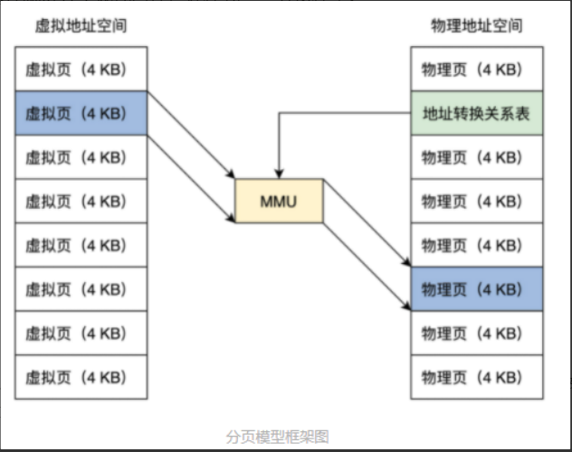

<!-- toc -->
- [虚拟地址](#虚拟地址)
- [物理地址](#物理地址)
- [虚拟地址和物理地址的转换](#虚拟地址和物理地址的转换)
    - [MMU](#mmu)
    - [MMU页表](#mmu页表)
    - [开启MMU](#开启mmu)
    - [MMU地址转换失败](#mmu地址转换失败)
- [保护模式和长模式下的分页](#保护模式和长模式下的分页)
    - [保护模式](#保护模式)
    - [长模式](#长模式)
<!-- tocstop -->

# 虚拟地址
问：如何让多个程序运行但没有地址冲突，不会互相读写各自的内存空间，解决内存容量问题，解决相同程序运行的不同计算机内存大小不一致的问题。

答：让所有的程序都各自享有一个从 0 开始到最大地址的空间，这个地址空间是独立的，是该程序私有的，其它程序不能访问该地址空间，这个地址空间和其它程序和具体计算机无关。

objdump工具反汇编二进制文件的第一列就是虚拟地址，第三列是程序指令，指令中的数据都是虚拟地址。这个地址是由链接器产生的。

# 物理地址
被地址译码器等电子器件变成的电子信号，放在地址总线上，地址总线电子信号的各种组合就可以选择到内存的储存单元了。但是地址总线上的信号（即物理地址），也可以选择到别的设备中的储存单元，如显卡中的显存、I/O 设备中的寄存器、网卡上的网络帧缓存器。

# 虚拟地址和物理地址的转换
硬件MMU模块+软件列表  
  
虚拟地址空间和物理地址空间都分成同等大小的块，也称为页，按照虚拟页和物理页进行转换。根据软件配置不同，这个页的大小可以设置为 4KB、2MB、4MB、1GB。地址关系转换表中，只要存放虚拟页地址对应的物理页地址就行了。  

## MMU
接收虚拟地址和地址关系转换表，输出物理地址。实模式不可开启。  
  
保护模式的内存模型是分段模型，它并不适合于 MMU 的分页模型，所以我们要使用保护模式的平坦模式，这样就绕过了分段模型，即虚拟地址等于线性地址。但是长模式没有线性地址的概念，图中的线性地址即为物理地址。  
## MMU页表
页表中并不存放虚拟地址和物理地址的对应关系，只存放物理页面的地址，MMU 以虚拟地址为索引去查表返回物理页面地址，而且页表是分级的，总体分为三个部分：一个顶级页目录，多个中级页目录，最后才是页表。  
  
一个虚拟地址被分成从左至右四个位段。第一个位段索引顶级页目录中一个项，该项指向一个中级页目录，然后用第二个位段去索引中级页目录中的一个项，该项指向一个页目录，再用第三个位段去索引页目录中的项，该项指向一个物理页地址，最后用第四个位段作该物理页内的偏移去访问物理内存。  
## 开启MMU
1. 使 CPU 进入保护模式或者长模式  
2. 准备好页表数据，这包含顶级页目录，中间层页目录，页表，假定我们已经编写了代码，在物理内存中生成了这些数据  
3. 把顶级页目录的物理内存地址赋值给 CR3 寄存器   
```
mov eax, PAGE_TLB_BADR ;页表物理地址 
mov cr3, eax
```
4. 设置 CPU 的 CR0 的 PE 位为 1，这样就开启了 MMU  
```
;开启 保护模式和分页模式 
mov eax, cr0 
bts eax, 0   ;CR0.PE =1 
bts eax, 31  ;CR0.P = 1 
mov cr0, eax
```
## MMU地址转换失败
页表项中的数据为空，用户程序访问了超级管理者的页面，向只读页面中写入数据。这些都会导致 MMU 地址转换失败。  
失败了既不能放行，也不是 reset，MMU 执行的操作如下：
1. MMU 停止转换地址。
2. MMU 把转换失败的虚拟地址写入 CPU 的 CR2 寄存器。
3. MMU 触发 CPU 的 14 号中断，使 CPU 停止执行当前指令。
4. CPU 开始执行 14 号中断的处理代码，代码会检查原因，处理好页表数据返回。
5. CPU 中断返回继续执行 MMU 地址转换失败时的指令。

# 保护模式和长模式下的分页
## 保护模式
只有 32 位地址空间，最多 4GB-1 大小的空间。保护模式下的分页大小通常是 4KB 和 4MB 大小的页。分页大小的不同，会导致虚拟地址位段的分隔和页目录的层级不同，但虚拟页和物理页的大小始终是等同的。  
***
**4KB**  
只有一级页目录，其中包含 1024 个条目 ，每个条目指向一个页表，每个页表中有 1024 个条目。其中一个条目就指向一个物理页，每个物理页 4KB。这正好是 4GB 地址空间。

  
页目录项、页表项都是 4 字节 32 位，1024 个项(一个项32位4字节)(即1024*4=4096=4kb)正好是 4KB（一个页），因此它们的地址始终是 4KB 对齐的，所以低 12 位才可以另作它用，形成了页面的相关属性，如是否存在、是否可读可写、是用户页还是内核页、是否已写入、是否已访问等。  
***
**4MB**  
32 位虚拟地址被分为两个位段：页表索引、页内偏移，只有一级页目录，其中包含 1024 个条目。其中一个条目指向一个物理页，每个物理页 4MB，正好为 4GB 地址空间。  

  
指向一个 4KB 大小的页表，这个页表依然要 4KB 地址对齐，其中包含 1024 个页表项。  
4MB 大小的页面下，页表项还是 4 字节 32 位，但只需要用高 10 位来保存物理页面的基地址就可以。因为每个物理页面都是 4MB，所以低 22 位始终为 0，为了兼容 4MB 页表项低 8 位和 4KB 页表项一样，只不过第 7 位变成了 PS 位，且必须为 1，而 PAT 位移到了 12 位。  

## 长模式
长模式下的虚拟地址必须等于线性地址且为 64 位。长模式下的分页大小通常为 4KB 大小的页和 2MB 大小的页。  
**4KB**  
64 位虚拟地址被分为 6 个位段，分别是：保留位段，顶级页目录索引、页目录指针索引、页目录索引、页表索引、页内偏移，顶级页目录、页目录指针、页目录、页表各占有 4KB 大小，其中各有 512 个条目，每个条目 8 字节 64 位大小。  
512 * 512 * 512 * 512 * 4KB = 2^48，刚好是 48 位地址总线的寻址范围（X86 CPU 并没有实现 64 位地址总线，只实现了 48 位。虚拟地址 48 到 63 这 16 位是根据第 47 位来决定的，47 位为 1，它们就为 1，反之为 0，这是因为 x86 CPU 并没有实现全 64 位的地址总线，而是只实现了 48 位）。  


  
**4MB**  
保留位段、顶级页目录索引、页目录指针索引、页目录索引，页内偏移，顶级页目录、页目录指针、页目录各占有 4KB 大小，其中各有 512 个条目，每个条目 8 字节 64 位大小  
  
放弃了页表项，然后把虚拟地址的低 21 位作为页内偏移，21 位正好索引 2MB 大小的地址空间。  
  
  

