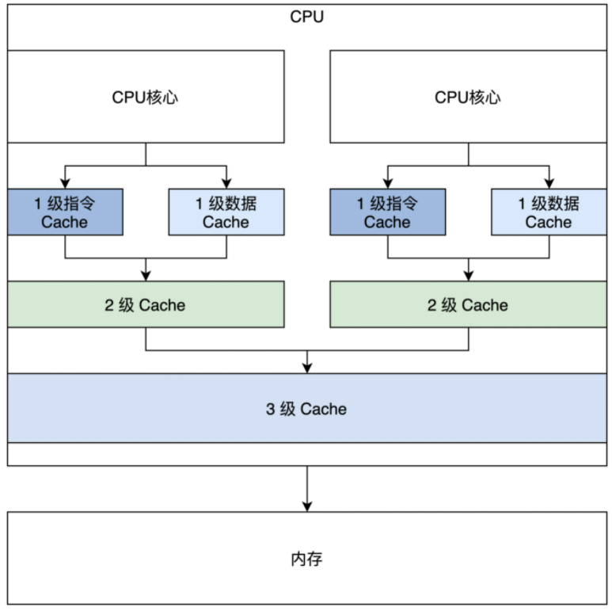
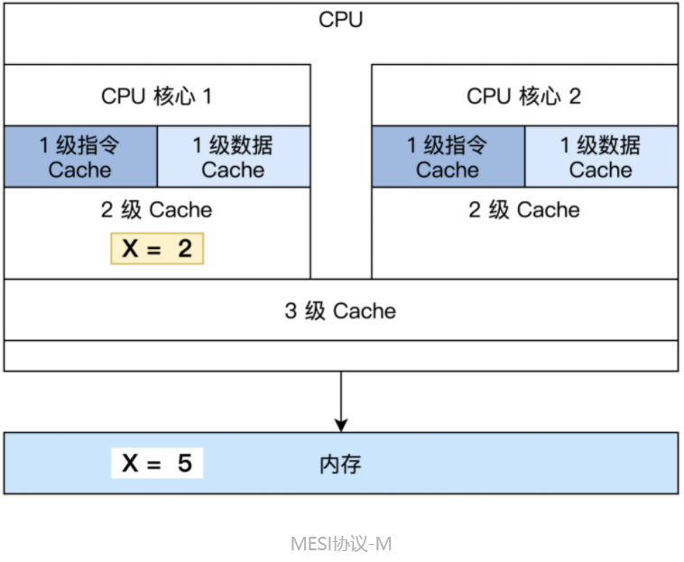
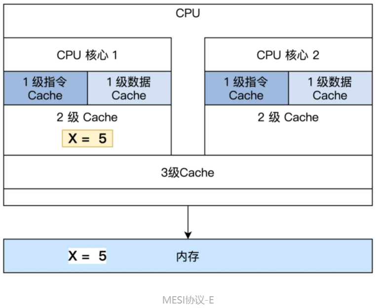
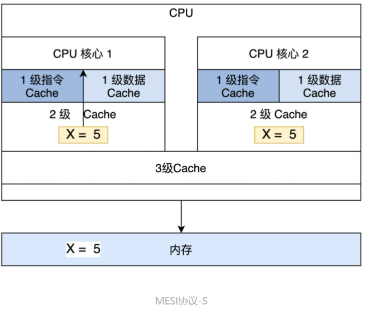

<!-- toc -->
- [内存](#内存)
- [Cache](#cache)
    - [Cache工作流程](#cache工作流程)
    - [Cache带来的问题](#cache带来的问题)
        - [MESI协议](#mesi协议)
    - [开启Cache](#开启cache)
- [获取内存视图](#获取内存视图)
- [补充](#补充)
<!-- tocstop -->

# 内存
DRAM，即动态随机存储器，存储单元是由电容和相关元件做成的，电容存储电荷的多、少代表数字信号 0 和 1。  
控制内存刷新和内存读写的是内存控制器，而内存控制器集成在北桥芯片中。传统方式下，北桥芯片存在于系统主板上，而现在由于芯片集成度越来越高，所以北桥芯片被就集成到 CPU 芯片中了，同时这也大大提升了 CPU 访问内存的性能。  

# Cache
Cache 主要由高速的静态储存器、地址转换模块和 Cache 行替换模块组成。  
Cache 会把自己的高速静态储存器和内存分成大小相同的行，一行大小通常为 32 字节或者 64 字节。Cache 和内存交换数据的最小单位是一行，为方便管理，在 Cache 内部的高速储存器中，多个行又会形成一组。除了正常的数据空间外，Cache 行中还有一些标志位，如脏位、回写位，访问位等，这些位会被 Cache 的替换模块所使用。
## Cache工作流程
访问cache是已经经过MMU转换的物理地址，物理地址会依据cache的工作模式分为不同的段。  
1. CPU 发出的地址由 Cache 的地址转换模块分成 3 段：组号，行号，行内偏移。
2. Cache 会根据组号、行号查找高速静态储存器中对应的行。如果找到即命中，用行内偏移读取并返回数据给 CPU，否则就分配一个新行并访问内存，把内存中对应的数据加载到 Cache 行并返回给 CPU。**写入操作则比较直接，分为回写和直通写，回写是写入对应的 Cache 行就结束了，直通写则是在写入 Cache 行的同时写入内存。**
3. 如果没有新行了，就要进入行替换逻辑，即找出一个 Cache 行写回内存，腾出空间，替换行有相关的算法，替换算法是为了让替换的代价最小化。例如，找出一个没有修改的 Cache 行，这样就不用把它其中的数据回写到内存中了，还有找出存在时间最久远的那个 Cache 行，因为它大概率不会再访问了。
## cache带来的问题
  
这是一颗最简单的双核心 CPU，它有三级 Cache，第一级 Cache 是指令和数据分开的，第二级 Cache 是独立于 CPU 核心的，第三级 Cache 是所有 CPU 核心共享的。  
将一级Cache分成指令Cache和数据Cache可以提高一级Cache的命中率。因为CPU在执行程序时，对指令的访问次数要远远大于对数据的访问次数。所以，将指令Cache和数据Cache分开，可以使得指令Cache的命中率更高，从而提高CPU的性能。  
**一致性问题**  
1. 一个 CPU 核心中的指令 Cache 和数据 Cache 的一致性问题。
2. 多个 CPU 核心各自的 2 级 Cache 的一致性问题。
3. CPU 的 3 级 Cache 与设备内存，如 DMA、网卡帧储存，显存之间的一致性问题。  
### MESI协议
定义了 4 种基本状态：即修改（Modified）、独占（Exclusive）、共享（Shared）和无效（Invalid）。  
1. M 修改（Modified）：当前 Cache 的内容有效，数据已经被修改而且与内存中的数据不一致，数据只在当前 Cache 里存在。比如说，内存里面 X=5，而 CPU 核心 1 的 Cache 中 X=2，Cache 与内存不一致，CPU 核心 2 中没有 X。

2. E 独占（Exclusive）：当前 Cache 中的内容有效，数据与内存中的数据一致，数据只在当前 Cache 里存在；类似 RAM 里面 X=5，同样 CPU 核心 1 的 Cache 中 X=5（Cache 和内存中的数据一致），CPU 核心 2 中没有 X。

3. S 共享（Shared）：当前 Cache 中的内容有效，Cache 中的数据与内存中的数据一致，数据在多个 CPU 核心中的 Cache 里面存在。例如在 CPU 核心 1、CPU 核心 2 里面 Cache 中的 X=5，而内存中也是 X=5 保持一致。

4. 无效（Invalid）：当前 Cache 无效。前面三幅图 Cache 中没有数据的那些，都属于这个情况。
## 开启Cache
在 x86 CPU(默认关闭) 上开启 Cache 需要将 CR0 寄存器中 CD、NW 位同时清 0 即可。CD=1 时表示 Cache 关闭，NW=1 时 CPU 不维护内存数据一致性。所以 **CD=0、NW=0** 的组合才是开启 Cache 的正确方法。  
```
mov eax, cr0
;开启 CACHE    
btr eax,29 ;CR0.NW=0
btr eax,30  ;CR0.CD=0
mov cr0, eax
```

# 获取内存视图
给出一个物理地址并不能准确地定位到内存空间，内存空间只是映射物理地址空间中的一个子集，物理地址空间中可能有空洞，有 ROM，有内存，有显存，有 I/O 寄存器，所以获取内存有多大没用，关键是要获取哪些物理地址空间是可以读写的内存。  
BIOS 提供的实模式下中断服务，就是 int 指令后面跟着一个常数的形式。由于 PC 机上电后由 BIOS 执行硬件初始化，中断向量表是 BIOS 设置的，所以执行中断自然执行 BIOS 服务。这个中断服务是 int 15h，但是它需要一些参数，就是在执行 int 15h 之前，对特定寄存器设置一些值。  
```
_getmemmap:
  xor ebx,ebx ;ebx设为0
  mov edi,E80MAP_ADR ;edi设为存放输出结果的1MB内的物理内存地址
loop:
  mov eax,0e820h ;eax必须为0e820h
  mov ecx,20 ;输出结果数据项的大小为20字节：8字节内存基地址，8字节内存长度，4字节内存类型
  mov edx,0534d4150h ;edx必须为0534d4150h
  int 15h    ;执行中断
  jc error   ;如果flags寄存器的C位置1，则表示出错
  add edi,20 ;更新下一次输出结果的地址
  cmp ebx,0 ;如ebx为0，则表示循环迭代结束
  jne loop  ;还有结果项，继续迭代
    ret
error:   ;出错处理
```
在迭代中执行中断，每次中断都输出一个 20 字节大小数据项，最后会形成一个该数据项（结构体）的数组，可以用 C 语言结构表示
```
#define RAM_USABLE 1 //可用内存
#define RAM_RESERV 2 //保留内存不可使用
#define RAM_ACPIREC 3 //ACPI表相关的
#define RAM_ACPINVS 4 //ACPI NVS空间
#define RAM_AREACON 5 //包含坏内存
typedef struct s_e820{
    u64_t saddr;    /* 内存开始地址 */
    u64_t lsize;    /* 内存大小 */
    u32_t type;    /* 内存类型 */
}e820map_t;
```
# 补充
**如何写出让 CPU 跑得更快的代码？**  
1. 程序80%的时间在运行20%或更少的代码，针对热代码进行优化。  
2. 遵从数据访问的局部性法则，按数据存放顺序访问内存效率远高于乱序访问内存效率，也就是尽量帮助CPU做好数据Cache的预测工作。同样根据Cache大小，做好数据结构的优化工作，进行数据压缩或数据填充，也是提升Cache效率的好方式；
3. 遵从指令访问的局部性法则，减少跳转指令，同样是尽量帮助CPU做好数据Cache的预测工作；现代CPU都有一些预测功能【如分支预测】，利用好CPU的这些功能，也会提升Cache命中率；
4. 避免计算线程在多个核心之间漂移，避免缓存重复加载，可以绑定核心【物理核即可，不用到逻辑核】，提高效率；
5. 去除伪共享缓存：在多核环境下，减少多个核心对同一区域内存的读写并发操作，减少内存失效的情况的发生；
6. 合理提高进程优先级，减少进程间切换，可以变相提供Cache提速的效果
7. 关闭Swap，可以变相提供内存提速、Cache提速的效果；