<!-- toc -->

- [X86的三种执行模式](#x86的三种模式)
    - [实模式](#实模式)
    - [保护模式](#保护模式)
        - [保护模式的平坦模型](#保护模式的平坦模型分页)
        - [切换到保护模式](#实模式切换到保护模式)
    - [长模式](#长模式-64位)
        - [切换到长模式](#切换到长模式)
    - [分段和分页的区别](#分段和分页的区别)
- [中断](#中断)
    - [实模式](#实模式2)
    - [保护模式](#保护模式2)
    - [长模式](#长模式2)

<!-- tocstop -->

# X86的三种模式
实模式、保护模式、长模式
## 实模式 16位
直接执行指令的真实功能，另一方面是发往内存的地址是真实的，对任何地址不加限制地发往内存。  
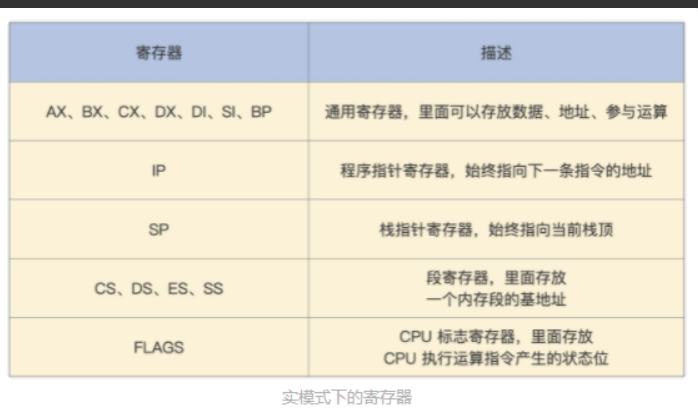
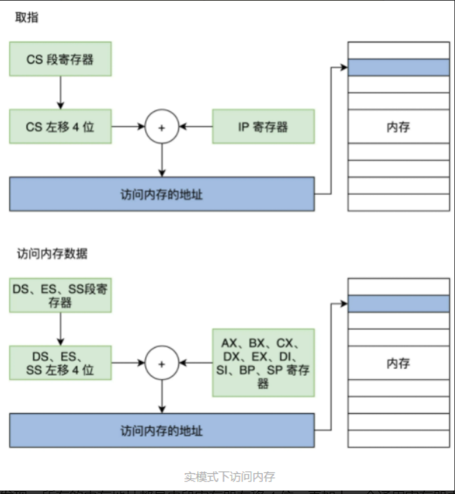  
代码段是由 CS 和 IP 确定的，而栈段是由 SS 和 SP 段确定的。  
所有的内存地址都是由段寄存器左移 4 位，再加上一个通用寄存器中的值或者常数形成地址，然后由这个地址去访问内存。这就是**分段内存管理模型**。  
左移四位是由于16位时寻址能力不足，所以要借助额外的寄存器进行1M空间的寻址。
## 保护模式 32位
可访问的指令和资源，分为4级。内存的访问靠**特权级和段描述符结合**来进行访问: R0>R1>R2>R3
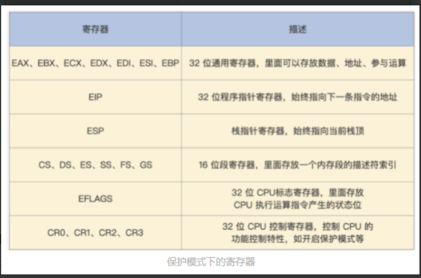
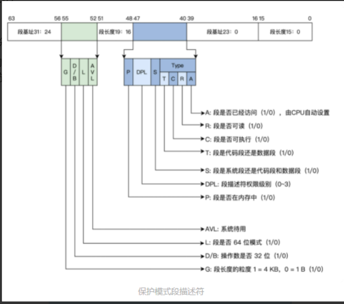  
多个段描述符在内存中形成全局段描述符表，该表的基地址和长度由 CPU 和 GDTR 寄存器指示。  
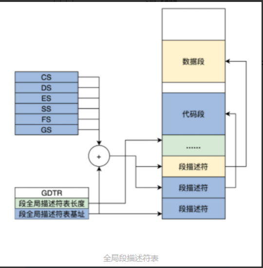  
CS、DS、ES、SS、FS、GS 这些段寄存器，里面存放的不是一个内存段的描述符索引，其实它们是由影子寄存器、段描述符索引、描述符表索引、权限级别组成的。
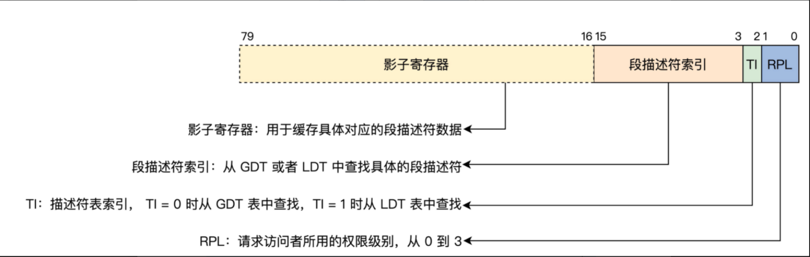  
影子寄存器是靠硬件来操作的，对系统程序员不可见，是硬件为了减少性能损耗而设计的一个段描述符的高速缓存，不然每次内存访问都要去内存中查表，那性能损失是巨大的，影子寄存器也正好是 64 位，里面存放了 8 字节段描述符数据。(类似一个缓存结构存储了段描述符数据)  
低三位之所以能放 TI 和 RPL，是因为段描述符 8 字节对齐，每个索引低 3 位都为 0。  
### 保护模式的平坦模型(分页)
x86CPU不能直接使用分页模型，但是我们可以简化设计，来使分段成为一种“虚设”，这就是保护模式的平坦模型。
CPU 32 位的寄存器最多只能产生 4GB 大小的地址，而一个段长度也只能是 4GB，所以我们把所有段的基地址设为 0，段的长度设为 0xFFFFF，段长度的粒度设为 4KB，这样所有的段都指向同一个（0~4GB-1）字节大小的地址空间。（0xFFFFF个4kb大小的段）
### 实模式切换到保护模式
全局段描述符表
```
GDT_START: 
knull_dsc: dq 0 
kcode_dsc: dq 0x00cf9e000000ffff 
kdata_dsc: dq 0x00cf92000000ffff 
GDT_END: 
GDT_PTR: 
GDTLEN dw GDT_END-GDT_START-1 
GDTBASE dd GDT_START
```
加载设置 GDTR 寄存器，使之指向全局段描述符表（GDT）
```
lgdt [GDT_PTR]
```
设置CR0寄存器，开启保护模式
```
;开启 PE 
mov eax, cr0 
bts eax, 0 ; CR0.PE =1 //bts指令的意思是bit test and set 位测试并设置 在此处的作用是：判断eax与0，若eax == 0：bts会将CF = 1，并将eax置位（置位的意思就是设置为1） 然后把CR0的最低位设为1之后，就表示开启了保护模式
mov cr0, eax
```
进行长跳转，加载 CS 段寄存器，即段选择子
```
jmp dword 0x8 :_32bits_mode  ;_32bits_mode为32位代码标号即段偏移
```
0x8为选择子,用0x8的高13位0x1在GDT中索引，也就是GDT中的第1个段描述符(0000 0000 0000 1000 选择子的后三位0被用来其他用途，只选择去掉后三位0以后的) 索引GDT中第二条数据，加载CS。
## 长模式 64位
CPU 不再对段基址和段长度进行检查（交给MMU），只对 DPL 进行相关的检查，这个检查流程和保护模式下一样。当描述符中的 L=1，D/B=0 时，就是 64 位代码段，DPL 还是 0~3 的特权级。然后有多个段描述在内存中形成一个全局段描述符表，同样由 CPU 的 GDTR 寄存器指向。  
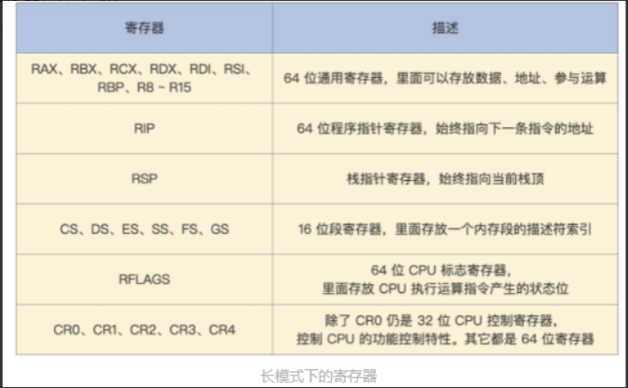
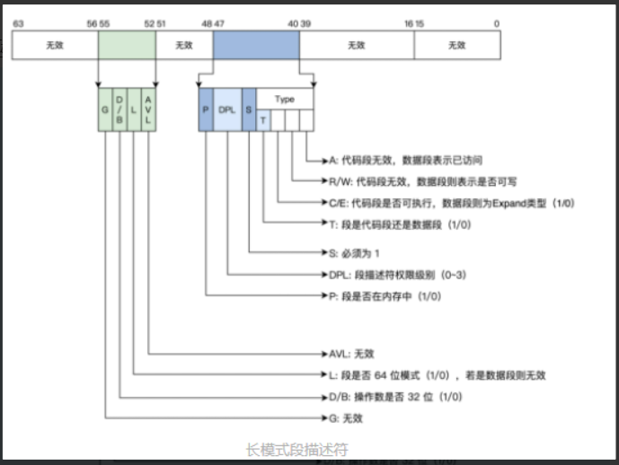  
长模式段描述符表
```
ex64_GDT: 
null_dsc: dq 0 
;第一个段描述符CPU硬件规定必须为0 
c64_dsc:dq 0x0020980000000000 ;64位代码段 
;无效位填0 
;D/B=0,L=1,AVL=0 
;P=1,DPL=0,S=1 
;T=1,C=0,R=0,A=0 
d64_dsc:dq 0x0000920000000000 ;64位数据段 
;无效位填0 
;P=1,DPL=0,S=1 
;T=0,C/E=0,R/W=1,A=0 
eGdtLen equ $ - null_dsc ;GDT长度 
eGdtPtr:dw eGdtLen - 1 ;GDT界限 
dq ex64_GDT
```
CPL<中断门DPL but CPL≥目标段DPL(CPL访问时的权限)  
### 切换到长模式
1.准备长模式全局描述符表:
```
ex64_GDT: 
null_dsc: dq 0 
;第一个段描述符CPU硬件规定必须为0 
c64_dsc:dq 0x0020980000000000 ;64位代码段
d64_dsc:dq 0x0000920000000000 ;64位数据段
eGdtLen equ $ - null_dsc ;GDT长度 
eGdtPtr:dw eGdtLen - 1 ;GDT界限 
dq ex64_GDT
```
2.准备长模式下的 MMU 页表，这个是为了开启分页模式，**切换到长模式必须要开启分页**，因为长模式下已经不对段基址和段长度进行检查了，那么长模式下内存地址空间的保护则交给了 MMU，MMU 依赖页表对地址进行转换，页表有特定的格式存放在内存中，其地址由 CPU 的 CR3 寄存器指向。
```
mov eax, cr4 
bts eax, 5 ;CR4.PAE = 1 
mov cr4, eax ;开启 PAE 
mov eax, PAGE_TLB_BADR ;页表物理地址 
mov cr3, eax
```
3.加载 GDTR 寄存器，使之指向全局段描述表  
```
lgdt [eGdtPtr]
```
4.开启长模式，要同时开启保护模式和分页模式，在实现长模式时定义了 MSR 寄存器，需要用专用的指令 rdmsr、wrmsr 进行读写，IA32_EFER 寄存器的地址为 0xC0000080，它的第 8 位决定了是否开启长模式。
```
;开启 64位长模式 
mov ecx, IA32_EFER 
rdmsr 
bts eax, 8  ;IA32_EFER.LME =1 
wrmsr 
;开启 保护模式和分页模式 
mov eax, cr0 
bts eax, 0  ;CR0.PE =1 
bts eax, 31 
mov cr0, eax
```
5.进行跳转，加载 CS 段寄存器，刷新其影子寄存器
```
jmp 08:entry64 ;entry64为程序标号即64位偏移地址
```
和切换保护模式的流程差不多，只是需要准备的段描述符有所区别，还有就是要注意同时开启保护模式和分页模式。  
## 分段和分页的区别
分段更加灵活，因为它可以将内存空间划分成任意大小的段，而分页则只能将内存空间划分成相同大小的页。此外，分页的内存管理更加简单，因为它只需要维护一个页表就可以了，而分段则需要维护一个段表。另外，分页的内存利用率更高，因为它可以将内存中的碎片整理成若干个大小相同的页，而分段则可能存在大量的内存碎片。

分段系统需要维护一个段表，这个段表中包含了每个段的信息，包括段的起始地址、段的大小等。这个段表是需要占用内存空间的，因此会对内存利用率造成一定的影响。其次，分段系统还会产生内存碎片，即内存空间中的空隙。这些空隙可能是由于程序退出或者被杀死导致的，也可能是因为程序动态申请内存空间失败而产生的。这些内存碎片无法被利用，会导致内存利用率下降。


有时候页可能并不能满足程序的需要。比如，程序需要连续的一大块内存空间，而这个内存空间可能跨越了多个页。这时候，就需要使用段描述符来管理内存空间。

# 中断
## 实模式2
中断控制器触发或者CPU执行INT指令。  
在实模式下它的实现过程是先保存 CS 和 IP 寄存器，然后装载新的 CS 和 IP 寄存器。  
为了实现中断，就需要在内存中放一个中断向量表，这个表的地址和长度由 CPU 的特定寄存器 IDTR 指向。实模式下，表中的一个条目由代码段地址和段内偏移组成。有了中断号以后，CPU 就能根据 IDTR 寄存器中的信息，计算出中断向量中的条目，进而装载 CS（装入代码段基地址）、IP（装入代码段内偏移）寄存器，最终响应中断。  
## 保护模式2
保护模式下的中断要权限检查，还有特权级的切换，所以就需要扩展中断向量表的信息，即每个中断用一个中断门描述符来表示。  
段内偏移是指程序访问内存时使用的偏移量，它表示程序要访问的内存地址相对于段基址的偏移量。  
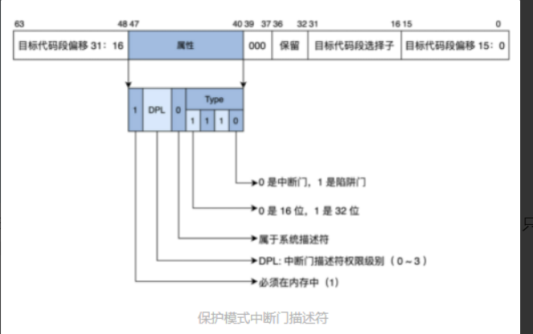   
保护模式要实现中断，也必须在内存中有一个中断向量表，同样是由 IDTR 寄存器指向。
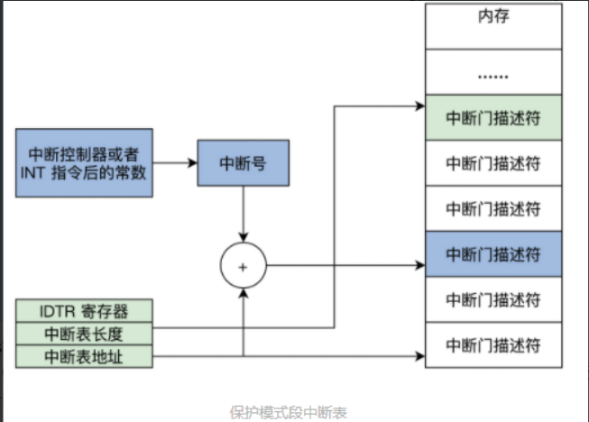   
做完这一系列优先级和权限检查之后，CPU 才会加载中断门描述符中目标代码段选择子到 CS 寄存器中，把目标代码段偏移加载到 EIP 寄存器中。
## 长模式2
中断门描述符  
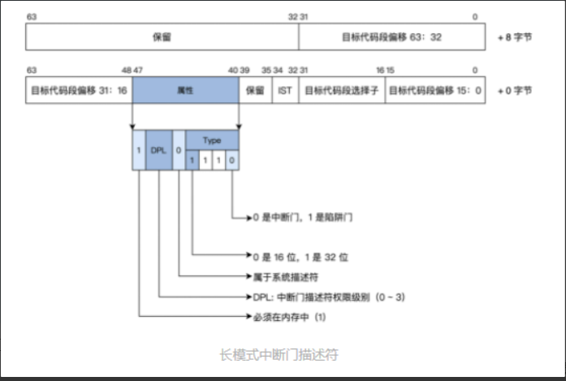  
长模式也同样在内存中有一个中断门描述符表，只不过表中的条目（如上图所示）是 16 字节大小，最多支持 256 个中断源，对中断的响应和相关权限的检查和保护模式一样。  


