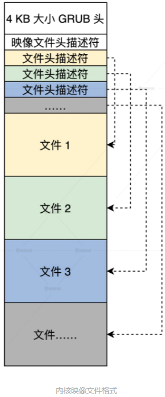
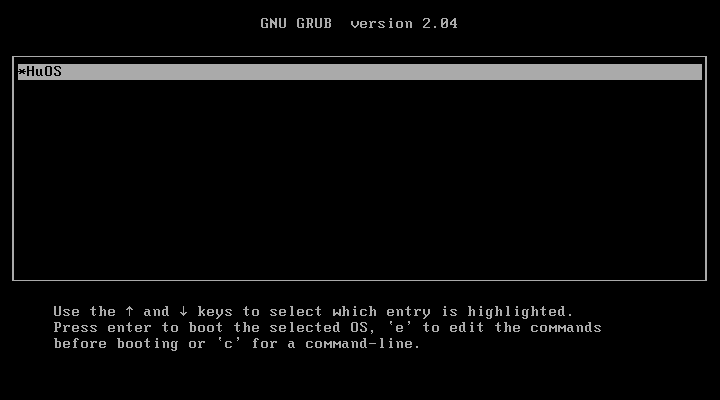

<!-- toc -->
建立计算机
- [内核映像格式](#内核映像格式)
- [准备虚拟机](#准备虚拟机)
    - [生产虚拟硬盘](#生产虚拟硬盘)
    - [格式化虚拟硬盘（在硬盘上建立文件系统）](#格式化虚拟硬盘在硬盘上建立文件系统)
- [安装GRUB](#安装grub)
    - [转换虚拟硬盘格式](#转换虚拟硬盘格式)
- [补充](#补充)
<!-- tocstop -->

# 内核映像格式
一个内核工程有多个文件，如果让grub只加载一个总文件要把多个文件变成一个文件就需要封装，即把多个文件组装在一起形成一个内核映像文件，其中包含二级引导器的模块，内核模块，图片和字库文件。  
内核映像文件并不等于内核，内核是在运行时进行操作的程序，而内核映像文件只是一个静态的文件。  
**GRUB 通过4KB的GRUB 头来识别映像文件。**  
  
另外，根据映像文件头描述符和文件头描述符里的信息，这一小段代码还可以解析映像文件中的其它文件。  
../HuOS1.0/initldr/include/ldrtype.h
```
//映像文件头描述符
typedef struct s_mlosrddsc
{
    u64_t mdc_mgic;    //映像文件标识
    u64_t mdc_sfsum;   //未使用
    u64_t mdc_sfsoff;  //未使用
    u64_t mdc_sfeoff;  //未使用
    u64_t mdc_sfrlsz;  //未使用
    u64_t mdc_ldrbk_s; //映像文件中二级引导器的开始偏移
    u64_t mdc_ldrbk_e; //映像文件中二级引导器的结束偏移
    u64_t mdc_ldrbk_rsz;  //映像文件中二级引导器的实际大小
    u64_t mdc_ldrbk_sum;  //映像文件中二级引导器的校验和
    u64_t mdc_fhdbk_s;    //映像文件中文件头描述的开始偏移
    u64_t mdc_fhdbk_e;    //映像文件中文件头描述的结束偏移
    u64_t mdc_fhdbk_rsz;  //映像文件中文件头描述的实际大小
    u64_t mdc_fhdbk_sum;  //映像文件中文件头描述的校验和
    u64_t mdc_filbk_s;    //映像文件中文件数据的开始偏移
    u64_t mdc_filbk_e;    //映像文件中文件数据的结束偏移
    u64_t mdc_filbk_rsz;  //映像文件中文件数据的实际大小
    u64_t mdc_filbk_sum;  //映像文件中文件数据的校验和
    u64_t mdc_ldrcodenr;  //映像文件中二级引导器的文件头描述符的索引号
    u64_t mdc_fhdnr;   //映像文件中文件头描述符有多少个
    u64_t mdc_filnr;   //映像文件中文件头有多少个
    u64_t mdc_endgic;  //映像文件结束标识
    u64_t mdc_rv;      //映像文件版本
}mlosrddsc_t;

#define FHDSC_NMAX 192 //文件名长度
//文件头描述符
typedef struct s_fhdsc
{
    u64_t fhd_type;      //文件类型
    u64_t fhd_subtype;   //文件子类型
    u64_t fhd_stuts;     //文件状态
    u64_t fhd_id;        //文件id
    u64_t fhd_intsfsoff; //文件在映像文件位置开始偏移
    u64_t fhd_intsfend;  //文件在映像文件的结束偏移
    u64_t fhd_frealsz;   //文件实际大小
    u64_t fhd_fsum;      //文件校验和
    char  fhd_name[FHDSC_NMAX];//文件名
}fhdsc_t
```
有了映像文件格式，我们还要有个打包映像的工具
```
lmoskrlimg -mk -lhf GRUB头文件 -o 映像文件 -f 输入的文件列表
-m 表示模式 只能是k内核模式
-lhf 表示后面跟上GRUB头文件
-o 表示输出的映像文件名 
-f 表示输入文件列表
例如：lmoskrlimg -m k -lhf grubhead.bin -o kernel.img -f file1.bin file2.bin file3.bin file4.bin
```
二级引导器通常位于硬盘的第一个扇区，即磁盘引导扇区（Disk Boot Sector）。当计算机启动时，BIOS 会读取磁盘引导扇区中的二级引导器，并将其载入内存。二级引导器随后会检测硬盘上的操作系统，并将操作系统载入内存，启动操作系统。

# 准备虚拟机
大多数虚拟机都是用文件来模拟硬盘的，即主机系统（HOST OS 即你使用的物理机系统 ）下特定格式的文件，虚拟机中操作系统的数据只是写入了这个文件中。  
## 生产虚拟硬盘
mount 命令只能识别在纯二进制文件上建立的文件系统，mount 无法识别虚拟机生成的硬盘文件。  
用 Linux 下的 dd 命令（用指定大小的块拷贝一个文件，并在拷贝的同时进行指定的转换）生成 100MB 的纯二进制的文件（就是 1～100M 字节的文件里面填充为 0 ）  
```
dd bs=512 if=/dev/zero of=hd.img count=204800

;bs:表示块大小，这里是512字节
;if：表示输入文件，/dev/zero就是Linux下专门返回0数据的设备文件，读取它就返回
;of：表示输出文件，即我们的硬盘文件。
;count：表示输出多少块
```
## 格式化虚拟硬盘（在硬盘上建立文件系统）
1. 把虚拟硬盘文件变成 Linux 下的回环设备，让 Linux 以为这是个设备。用 losetup 命令，将 hd.img 变成 Linux 的回环设备  
（在 Linux 下文件可以是设备，设备可以是文件）(回环设备可以把文件虚拟成 Linux 块设备，用来模拟整个文件系统，让用户可以将其看作硬盘、光驱或软驱等设备，并且可用 mount 命令挂载当作目录来使用。)
```
sudo losetup /dev/loop14 hd.img
可以用命令sudo losetup /dev/loopn来试哪个回环设备是没有被用过（这里的n其实就是你需要试的数字，0不行就1，1不行就2，一直试）
```
2. 用 Linux 下的 mkfs.ext4 命令格式化这个 /dev/loop14 回环块设备，在里面建立 EXT4 文件系统。
```
sudo mkfs.ext4 -q /dev/loop14
```
3. 用 Linux 下的 mount 命令，将 hd.img 文件当作块设备，把它挂载到事先建立的 hdisk 目录下，并在其中建立一个 boot，这也是后面安装 GRUB 需要的。
```
sudo mount -o loop ./hd.img ./hdisk/ ;挂载硬盘文件
sudo mkdir ./hdisk/boot/ ;建立boot目录
```

# 安装GRUB
**正常安装系统的情况下，Linux 会把 GRUB 安装在我们的物理硬盘上，可是我们现在要把 GRUB 安装在我们的虚拟硬盘上**。而且我们的操作系统还没有安装程序。所以，我们得利用一下手上 Linux（HOST OS），通过 GRUB 的安装程序，把 GRUB 安装到指定的设备上（虚拟硬盘）。  
1. 
```
第一步挂载虚拟硬盘文件为loop14回环设备
sudo losetup /dev/loop14 hd.img
sudo mount -o loop ./hd.img ./hdisk/ ;挂载硬盘文件
第二步安装GRUB
sudo grub-install --boot-directory=./hdisk/boot/ --force --allow-floppy /dev/loop14
；--boot-directory 指向先前我们在虚拟硬盘中建立的boot目录。
；--force --allow-floppy ：指向我们的虚拟硬盘设备文件/dev/loop14
```
2. 现在 /hdisk/boot/ 目录下多了一个 grub 目录，表示我们的 GRUB 安装成功。请注意，这里还要在 /hdisk/boot/grub/ 目录下建立一个 grub.cfg 文本文件，GRUB 正是通过这个文件内容，查找到我们的操作系统映像文件的。
```
menuentry 'HuOS' {
insmod part_msdos
insmod ext2
set root='hd0,msdos1'       #我们的硬盘只有一个分区所以是'hd0,msdos1'
multiboot2 /boot/HuOS.eki   #加载boot目录下的HuOS.eki文件
boot #引导启动
}
set timeout_style=menu
if [ "${timeout}" = 0 ]; then
  set timeout=10      #等待10秒钟自动启动
fi
#如果HuOS加载成功，但是提示'hd0,msdos1'错误，则重新制作镜像，并且修改grub.cfg里的这行为'hd0,msdos1'为'hd0'即可。
```
## 转换虚拟硬盘格式
目前纯二进制格式只能被我们使用的 Linux 系统识别，但不能被虚拟机本身识别，但是我们最终目的却是让这个虚拟机加载这个虚拟硬盘，从而启动其中的由我们开发的操作系统。  
虚拟机提供了专用的转换格式的工具  
```
VBoxManage convertfromraw ./hd.img --format VDI ./hd.vdi
;convertfromraw 指向原始格式文件
；--format VDI  表示转换成虚拟需要的VDI格式
```
目前配置好了虚拟机，手动建造了硬盘，并在其上安装了 GRUB，到这里我们运行测试环境已经准备好了。  
## 安装虚拟硬盘
生成了 VDI 格式的虚拟硬盘，然而虚拟硬盘必须要安装虚拟机才可以运行。配置虚拟硬盘分两步：第一步，配置硬盘控制器，我们使用 SATA 的硬盘，其控制器是 intelAHCI；第二步，挂载虚拟硬盘文件。  
```
#第一步 SATA的硬盘其控制器是intelAHCI
VBoxManage storagectl HuOS --name "SATA" --add sata --controller IntelAhci --portcount 1
#第二步
VBoxManage closemedium disk ./hd.vdi #删除虚拟硬盘UUID并重新分配
#将虚拟硬盘挂到虚拟机的硬盘控制器
VBoxManage storageattach HuOS --storagectl "SATA" --port 1 --device 0 --type hdd --medium ./hd.vdi
```
```
VBoxManage startvm HuOS #启动虚拟机
```
  
将vdi文件通过starwind转换为vmdk文件，这样就可通过vmware打开了


# 补充
如果虚拟机使用的不是VirtualBox， 面是vmware，在生成hd.img后，可以使用starwindconverter工具（网上下载，WIN下运行），这个工具可以把img转换为各种格式，比如vmware的vmdk文件。然后vmware创建一个新的虚拟机，硬盘选择这个vmdk文件，就可以加载HuOS了。  
避免套娃：在你的虚拟机，也就是Ubuntu环境下，完成hd.img的创建，文件系统的格式化，grub的安装后，生成最终的hd.img文件。然后把hd.img文件通过命令变成vdi文件即可。然后在你的WIN主机环境下，新建一个虚拟机，加载vdi即可。  