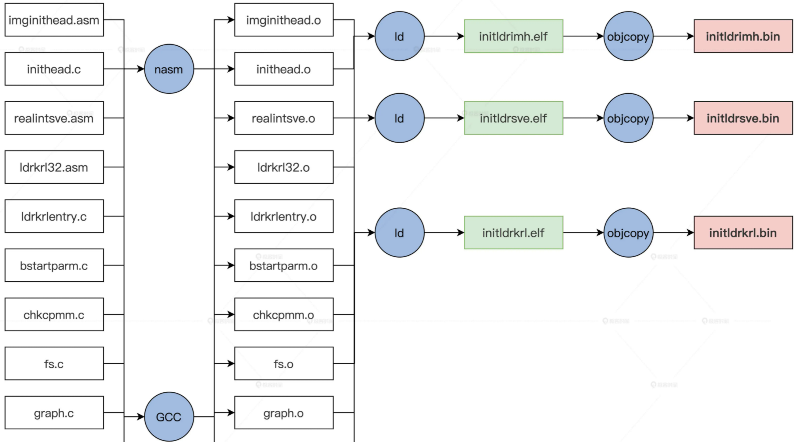

<!-- toc -->
二级引导器是操作系统的先驱，需要收集机器信息，确定计算机能不能运行目标操作系统，对 CPU、内存、显卡进行一些初级的配置，放置好内核相关的文件。
- [设计机器信息结构](#设计机器信息结构)
- [规划二级引导器](#规划二级引导器)
- [制作Grub头](#制作grub头)
  - [imginithead.asm](#imginitheadasm)
  - [inithead.c](#initheadc)
- [进入二级引导器](#进入二级引导器)
  - [ldrkrl32.asm](#ldrkrl32_1asm)
- [调用BIOS中断](#调用bios中断)
  - [ldrkrl32.asm](#ldrkrl32asm)
  - [realintsve.asm](#realintsveasm)
- [二级引导器主函数](#二级引导器主函数)
  - [ldrkrlentry.c](#ldrkrlentryc)
<!-- tocstop -->

# 设计机器信息结构
刚加电的时候会执行BIOS中的启动代码，然后加载grub到0x7C00的位置并跳转到grub。grub中会切换为保护模式，这个时候已经能访问4GB空间了。grub会加载内核映像文件并启动操作系统。  
BIOS（以及引导器） -> 0x7c00grub -> protect mode -> 二级引导器 -> 内核映像文件&内核  
设计一个数据结构存储二级引导器收集到的信息，这个结构放在内存 1MB 的地方。  
../HuOS1.0/initldr/include/ldrtype.h
```
typedef struct s_MACHBSTART
{
    u64_t   mb_krlinitstack;  //内核栈地址
    u64_t   mb_krlitstacksz;  //内核栈大小
    u64_t   mb_imgpadr;       //操作系统映像
    u64_t   mb_imgsz;         //操作系统映像大小
    u64_t   mb_bfontpadr;     //操作系统字体地址
    u64_t   mb_bfontsz;       //操作系统字体大小
    u64_t   mb_fvrmphyadr;    //机器显存地址
    u64_t   mb_fvrmsz;        //机器显存大小
    u64_t   mb_cpumode;       //机器CPU工作模式
    u64_t   mb_memsz;         //机器内存大小
    u64_t   mb_e820padr;      //机器e820数组地址
    u64_t   mb_e820nr;        //机器e820数组元素个数
    u64_t   mb_e820sz;        //机器e820数组大小
    //……
    u64_t   mb_pml4padr;      //机器页表数据地址
    u64_t   mb_subpageslen;   //机器页表个数
    u64_t   mb_kpmapphymemsz; //操作系统映射空间大小
    //……
    graph_t mb_ghparm;        //图形信息
}__attribute__((packed)) machbstart_t;
```
# 规划二级引导器

这些文件在编译之后会形成三个文件  

  
这最后三个文件用我们前面说的映像工具打包成映像文件
```
lmoskrlimg -m k -lhf initldrimh.bin -o HuOS.eki -f initldrkrl.bin initldrsve.bin
```
lmoskrlimg：Linux 命令行下的打包映像的工具  
-m k likely specifies the mode, in this case "k"  
-lhf is an option that is not clear    
initldrimh.bin is likely a file that is used as input for the image creation process  
-o HuOS.eki specifies the output file name as "HuOS.eki"  
-f initldrkrl.bin initldrsve.bin specifies additional files that are used as input for the image creation process  

# 制作Grub头
我们的 GRUB 头有两个文件组成，一个 imginithead.asm 汇编文件，它有两个功能，既能让 GRUB 识别，又能设置 C 语言运行环境，用于调用 C 函数；第二就是 inithead.c 文件，它的主要功能是查找二级引导器的核心文件——initldrkrl.bin，然后把它放置到特定的内存地址上。  
## imginithead.asm
**初始化 CPU 的寄存器，加载 GDT，切换到 CPU 的保护模式**  
```
分段管理(GDT)可以把虚拟地址转换成线性地址，而分页管理可以进一步将线性地址转换成物理地址。  
（根据段选择子找到）段基指 + 偏移地址 => 线性地址  
线性地址 （通过页表） => 物理地址  
```
**首先是 GRUB1 和 GRUB2 需要的两个头结构**  
```
MBT_HDR_FLAGS  EQU 0x00010003
MBT_HDR_MAGIC  EQU 0x1BADB002  ;多引导协议头魔数
MBT2_MAGIC  EQU 0xe85250d6     ;第二版多引导协议头魔数
global _start                  ;导出_start符号
extern inithead_entry          ;导入外部的inithead_entry函数符号

[section .text]                ;定义.start.text代码节
[bits 32]                      ;汇编成32位代码
_start:
  jmp _entry                   ;关中断

align 4
mbt_hdr:
  dd MBT_HDR_MAGIC
  dd MBT_HDR_FLAGS
  dd -(MBT_HDR_MAGIC+MBT_HDR_FLAGS)
  dd mbt_hdr
  dd _start
  dd 0
  dd 0
  dd _entry
; Grub所需要的头

ALIGN 8
mbhdr:
  DD  0xE85250D6
  DD  0
  DD  mhdrend - mbhdr
  DD  -(0xE85250D6 + 0 + (mhdrend - mbhdr))
  DW  2, 0
  DD  24
  DD  mbhdr
  DD  _start
  DD  0
  DD  0
  DW  3, 0
  DD  12
  DD  _entry 
  DD  0  
  DW  0, 0
  DD  8
mhdrend:
; Grub2所需要的头，包含两个头是为了同时兼容GRUB、GRUB2
```
此代码中的“ALIGN 8”表示以下数据应按 8 字节对齐。意味着后面数据的起始地址应该是 8 的倍数。这样做通常是为了提高性能，因为它可以提高内存访问效率。  
_start是GRUB引导头，_entry是关掉中断，设定 CPU 的工作模式，初始化 CPU 的寄存器和 C 语言的运行环境  
**然后是关中断并加载 GDT**  
```
_entry:
  ;关中断
  cli           
  ;关不可屏蔽中断
  in al, 0x70 
  or al, 0x80  
  out 0x70,al
  ;加载GDT地址到GDTR寄存器
  lgdt [GDT_PTR] 
  jmp dword 0x8 :_32bits_mode ；长跳转刷新CS影子寄存器，中断时保存当前代码段寄存器（CS register）的值的寄存器
  ;………………
;CPU 工作模式所需要的数据
;GDT全局段描述符表
GDT_START:
knull_dsc: dq 0
kcode_dsc: dq 0x00cf9e000000ffff
kdata_dsc: dq 0x00cf92000000ffff
k16cd_dsc: dq 0x00009e000000ffff  ;16位代码段描述符
k16da_dsc: dq 0x000092000000ffff  ;16位数据段描述符
GDT_END:

GDT_PTR:
GDTLEN  dw GDT_END-GDT_START-1    ;GDT界限
GDTBASE  dd GDT_START
```
GDT 代表全局描述符表。 它是 x86 兼容处理器使用的一种数据结构，用于定义系统使用的各种内存段的特性。 处理器使用 GDT 来确定每个内存段所允许的特权级别和访问类型。 GDT 通常位于内存中的特定地址，该地址由操作系统在系统初始化期间设置。 然后这个地址通过寄存器传递给处理器，处理器使用这个地址访问 GDT。  
**最后是初始化段寄存器和通用寄存器、栈寄存器，这是为了给调用 inithead_entry 这个 C 函数做准备**
```
_32bits_mode：
  mov ax, 0x10
  mov ds, ax
  mov ss, ax
  mov es, ax
  mov fs, ax
  mov gs, ax
  xor eax,eax
  xor ebx,ebx
  xor ecx,ecx
  xor edx,edx
  xor edi,edi
  xor esi,esi
  xor ebp,ebp
  ;初始化栈，C语言需要栈才能工作
  xor esp,esp
  mov esp,0x7c00        ;设置栈顶为0x7c00
  call inithead_entry   ;调用inithead_entry函数在inithead.c中实现
  jmp 0x200000          ;跳转到0x200000地址
```
## inithead.c
**上述代码的最后调用了 inithead_entry 函数，这个函数另外在 inithead.c 中实现**
```
/*../HuOS1.0/initldr/include/ldrtype.h*/
/*用于对GIC（全局中断控制器）进行控制的常量*/
#define MDC_ENDGIC 0xaaffaaffaaffaaff
#define MDC_RVGIC 0xffaaffaaffaaffaa
/*驱动程序和映像文件在物理内存中的位置*/
#define REALDRV_PHYADR 0x1000
#define IMGFILE_PHYADR 0x4000000
/*内核映像在物理内存中的位置*/
#define IMGKRNL_PHYADR 0x2000000
/*映像文件的物理地址*/
#define LDRFILEADR IMGFILE_PHYADR
/*偏移量*/
#define MLOSDSC_OFF (0x1000)
/*指向一个结构体的指针，可能是内存描述符，并且它的地址是映像文件地址加上偏移量*/
#define MRDDSC_ADR (mlosrddsc_t*)(LDRFILEADR+0x1000)  //0x1000的偏移量就是4kb，也就是映像中的Grub头

/*inithead.c*/
void inithead_entry()
{
    write_realintsvefile();
    write_ldrkrlfile();
    return;
}

//写initldrsve.bin文件到特定的内存中
void write_realintsvefile()
{
    fhdsc_t *fhdscstart = find_file("initldrsve.bin");
    if (fhdscstart == NULL)
    {
        error("not file initldrsve.bin");
    }
    //m2mcopy 函数负责把映像文件复制到具体的内存空间里(驱动程序的物理地址)
    /*
      fhd_intsfsoff:文件在映像文件位置开始偏移
      fhd_frealsz:文件实际大小
    */
    m2mcopy((void *)((u32_t)(fhdscstart->fhd_intsfsoff) + LDRFILEADR),
            (void *)REALDRV_PHYADR, (sint_t)fhdscstart->fhd_frealsz);
    return;
}

//写initldrkrl.bin文件到特定的内存中
void write_ldrkrlfile()
{
    fhdsc_t *fhdscstart = find_file("initldrkrl.bin");
    if (fhdscstart == NULL)
    {
        error("not file initldrkrl.bin");
    }
    m2mcopy((void *)((u32_t)(fhdscstart->fhd_intsfsoff) + LDRFILEADR),
            (void *)ILDRKRL_PHYADR, (sint_t)fhdscstart->fhd_frealsz);
    return;
}

//在映像文件中查找对应的文件
//find_file 函数负责扫描映像文件中的文件头描述符，对比其中的文件名，然后返回对应的文件头描述符的地址，这样就可以得到文件在映像文件中的位置和大小了
fhdsc_t *find_file(char_t *fname)
{
    mlosrddsc_t *mrddadrs = MRDDSC_ADR;
    /*
      mdc_fhdnr:映像文件中文件头描述符有多少个
      mdc_filnr:映像文件中文件头有多少个
    */
    if (mrddadrs->mdc_endgic != MDC_ENDGIC ||
        mrddadrs->mdc_rv != MDC_RVGIC ||
        mrddadrs->mdc_fhdnr < 2 ||
        mrddadrs->mdc_filnr < 2)
    {
        error("no mrddsc");
    }
    s64_t rethn = -1;  //s64_t是signed long long, 是一种64位整型，最大值为9223372036854775807，最小值为-9223372036854775808
    /*mdc_fhdbk_s:映像文件中文件头描述的开始偏移; 此为找到第一个文件描述符的位置fhdscstart*/
    fhdsc_t *fhdscstart = (fhdsc_t *)((u32_t)(mrddadrs->mdc_fhdbk_s) + LDRFILEADR);
    for (u64_t i = 0; i < mrddadrs->mdc_fhdnr; i++)
    {
        if (strcmpl(fname, fhdscstart[i].fhd_name) == 0)
        {
            rethn = (s64_t)i;
            goto ok_l;
        }
    }
    rethn = -1;
ok_l:
    if (rethn < 0)
    {
        error("not find file");
    }
    return &fhdscstart[rethn];
}
```
mlosrddsc_t是映像文件头描述符，fhdsc_t是文件头描述符[见week4/Build_Com](../Build_Com/README.md)  
根据文件偏移量找文件是从映像文件的物理地址开始，但是通过mlosrddsc_t操作映像文件中的内容需要跳过4kb的grub头。  


# 进入二级引导器
## ldrkrl32_1.asm
GRUB 头在 imghead.asm 中，最后一条指令“jmp 0x200000”，这一跳就进入了二级引导器的主模块了。20000此时是物理地址，是在 inithead.c 中由 write_ldrkrlfile() 函数放置的 **initldrkrl.bin 文件**。  
由于模块的改变，还需要写一小段汇编代码，建立 initldr32.asm（配套代码库中对应 ldrkrl32.asm）文件，**要把 GDT、IDT，寄存器这些东西重新初始化**，最后再去调用二级引导器的主函数 ldrkrl_entry  
```
_entry:
  cli
  lgdt [GDT_PTR]；加载GDT地址到GDTR寄存器
  lidt [IDT_PTR]；加载IDT地址到IDTR寄存器
  jmp dword 0x8 :_32bits_mode；长跳转刷新CS影子寄存器
_32bits_mode:
  mov ax, 0x10  ; 数据段选择子(目的)
  mov ds, ax
  mov ss, ax
  mov es, ax
  mov fs, ax
  mov gs, ax
  xor eax,eax
  xor ebx,ebx
  xor ecx,ecx
  xor edx,edx
  xor edi,edi
  xor esi,esi
  xor ebp,ebp
  xor esp,esp
  mov esp,0x90000 ；使得栈底指向了0x90000
  call ldrkrl_entry ；调用ldrkrl_entry函数
  xor ebx,ebx
  jmp 0x2000000 ；跳转到0x2000000的内存地址
  jmp $
GDT_START:
knull_dsc: dq 0
kcode_dsc: dq 0x00cf9a000000ffff ;a-e
kdata_dsc: dq 0x00cf92000000ffff
k16cd_dsc: dq 0x00009a000000ffff ;16位代码段描述符
k16da_dsc: dq 0x000092000000ffff ;16位数据段描述符
GDT_END:
GDT_PTR:
GDTLEN  dw GDT_END-GDT_START-1  ;GDT界限
GDTBASE  dd GDT_START

IDT_PTR:
IDTLEN  dw 0x3ff
```

# 调用BIOS中断
此时不急着去写 ldrkrl_entry 函数，因为后面的**获得内存布局信息和设置显卡图形模式**这些功能都依赖于 BIOS 提供中断服务。  
**在 C 代码中调用 BIOS 中断是不可能的，因为 C 语言代码工作在 32 位保护模式下，BIOS 中断工作在 16 位的实模式。因为gcc目前版本只支持32位的。**  
C 语言环境下调用 BIOS 中断，需要处理的问题如下：  
1. 保存 C 语言环境下的 CPU 上下文 ，即保护模式下的所有通用寄存器、段寄存器、程序指针寄存器，栈寄存器，把它们都保存在内存中。
2. 切换回实模式，调用 BIOS 中断，把 BIOS 中断返回的相关结果，保存在内存中。
3. 切换回保护模式，重新加载第 1 步中保存的寄存器。这样 C 语言代码才能重新恢复执行。
## ldrkrl32.asm
**保存 C 语言环境下的 CPU 上下文 ，即保护模式下的所有通用寄存器、段寄存器、程序指针寄存器，栈寄存器，把它们都保存在内存中**
```
realadr_call_entry:
  pushad     ;保存通用寄存器
  push    ds
  push    es
  push    fs ;保存4个段寄存器
  push    gs
  call save_eip_jmp ;调用save_eip_jmp 
  pop  gs
  pop  fs
  pop  es      ;恢复4个段寄存器
  pop  ds
  popad       ;恢复通用寄存器
  ret
save_eip_jmp:
  pop esi  ;弹出call save_eip_jmp时保存的eip到esi寄存器中， 
  mov [PM32_EIP_OFF],esi ;把eip保存到特定的内存空间中,EIP寄存器里存储的是CPU下次要执行的指令的地址。
  mov [PM32_ESP_OFF],esp ;把esp保存到特定的内存空间中,始终指向栈顶
  jmp dword far [cpmty_mode];长跳转这里表示把cpmty_mode处的第一个4字节装入eip，把其后的2字节装入cs
cpmty_mode:
  dd 0x1000
  dw 0x18
  jmp $
```
```
jmp dword far [cpmty_mode] ;长跳转这里表示把cpmty_mode处的第一个4字节装入eip，把其后的2字节装入cs
也就是把 0x18：0x1000 装入到 CS：EIP 中。这个 0x18 就是段描述索引，它正是指向 GDT 中的 16 位代码段描述符；EIP 0x1000 代表目标代码的段偏移地址
```
所以在这个地址上，我们必须放一段代码指令，不然 CPU 跳转到这里将没指令可以执行，那样就会发生错误。因为这是一个 16 位代码，所以我们需要新建立一个文件 realintsve.asm
## realintsve.asm
**切换回实模式，调用 BIOS 中断，把 BIOS 中断返回的相关结果，保存在内存中**  
BIOS中断的操作在func_table里面的具体函数中  
```
[bits 16]
_start:
_16_mode:
  mov  bp,0x20 ;0x20是指向GDT中的16位数据段描述符 
  mov  ds, bp
  mov  es, bp
  mov  ss, bp
  mov  ebp, cr0
  and  ebp, 0xfffffffe
  mov  cr0, ebp ；CR0.P=0 关闭保护模式
  jmp  0:real_entry ；刷新CS影子寄存器，真正进入实模式
real_entry:
  mov bp, cs
  mov ds, bp
  mov es, bp
  mov ss, bp ；重新设置实模式下的段寄存器 都是CS中值，即为0 
  mov sp, 08000h ；设置栈
  mov bp,func_table
  add bp,ax
  call [bp] ；调用函数表中的汇编函数，ax是C函数中传递进来的
  cli
  call disable_nmi
  mov  ebp, cr0
  or  ebp, 1
  mov  cr0, ebp ；CR0.P=1 开启保护模式
  jmp dword 0x8 :_32bits_mode
```
**切换回保护模式，重新加载第 1 步中保存的寄存器。这样 C 语言代码才能重新恢复执行**
```
[BITS 32]
_32bits_mode:
  mov bp, 0x10
  mov ds, bp
  mov ss, bp；重新设置保护模式下的段寄存器0x10是32位数据段描述符的索引
  mov esi,[PM32_EIP_OFF]；加载先前保存的EIP
  mov esp,[PM32_ESP_OFF]；加载先前保存的ESP
  jmp esi ；eip=esi 回到了realadr_call_entry函数中

func_table:  ;函数表
  dw _getmmap ；获取内存布局视图的函数
  dw _read ；读取硬盘的函数
    dw _getvbemode ；获取显卡VBE模式 
    dw _getvbeonemodeinfo ；获取显卡VBE模式的数据
    dw _setvbemode ；设置显卡VBE模式

上述的代码的流程是这样的：首先从 _16_mode: 标号处进入实模式，然后根据传递进来（由 ax 寄存器传入）的函数号，到函数表中调用对应的函数，里面的函数执行完成后，再次进入保护模式，加载 EIP 和 ESP 寄存器从而回到 realadr_call_entry 函数中。GDT 还是 imghead.asm 汇编代码文件中的 GDT，这没有变，因为它是由 GDTR 寄存器指向的。
```
上面的代码我们只要将它编译成 16 位的二进制的文件，并把它放在 0x1000 开始的内存空间中就可以了。这样在 realadr_call_entry 函数的最后，就运行到这段代码中来了。  
之前 write_realintsvefile() 函数会把映像文件中的 initldrsve.bin 文件写入到特定的内存地址空间中，而 initldrsve.bin 正是由上面的 realintsve.asm 文件编译而成的。  

# 二级引导器主函数
## ldrkrlentry.c
```
void ldrkrl_entry()
{
    init_bstartparm();  //收集机器环境信息的主函数
    return;
}
```
上述代码中的 ldrkrl_entry() 函数在 initldr32.asm 文件（配套代码库中对应 ldrkrl32.asm）中被调用，从那条 call ldrkrl_entry 指令开始进入了 ldrkrl_entry() 函数，在其中调用了 init_bstartparm() 函数，这个函数我们还没有实现，但通过名字我们不难推测，它是负责处理开始参数的。