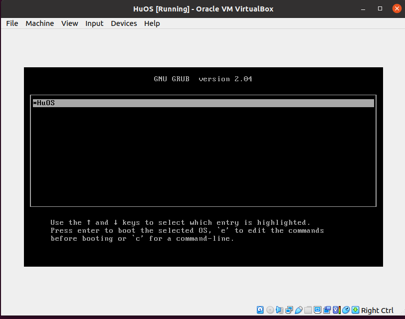
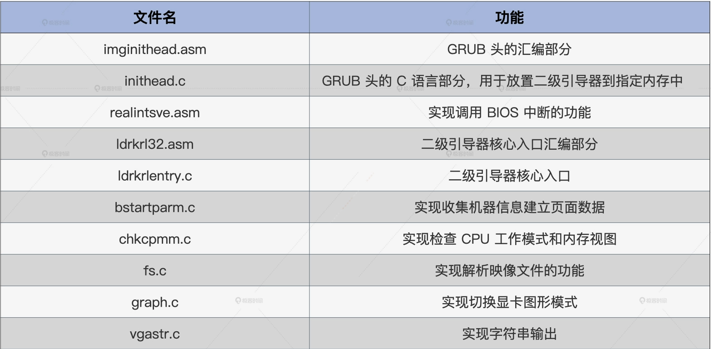
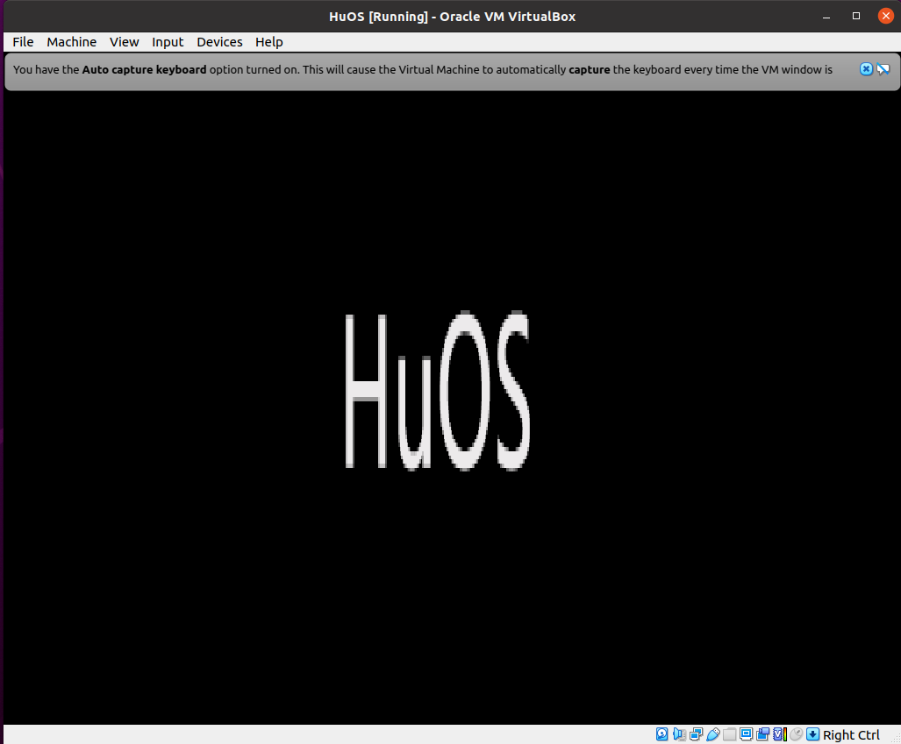

此章节为内核设计部分：   
### Boot Initialization
### [Code](./HuOS1.0/)
#### [Build Computer](./Build_Com/README.md)  

#### [Build Secondary Director](./Build_sec_bootstrap/README.md)

#### [Detect and Get Information](./Get_Info/README)

**这节还存在的问题**  
1. 将Makefile中的Cosmos.eki文件名换了，则无论将logo.bmp文件换成什么内容，都会是第一次启动的图片，怀疑是.eki文件没有改变。但是检查过后发现.eki文件确实会从新编译生成  
2. HuOS2.0/cosmoslink.lds不能随意改名，不知道为什么  
#### [Implement Board-level Initialization & Run The First C Function](./init_run_c_code/README.md)

**这节还存在的问题**  
1. 初始logo没有了
解决: init_graph() -> logo(mbsp);后加延时能看到