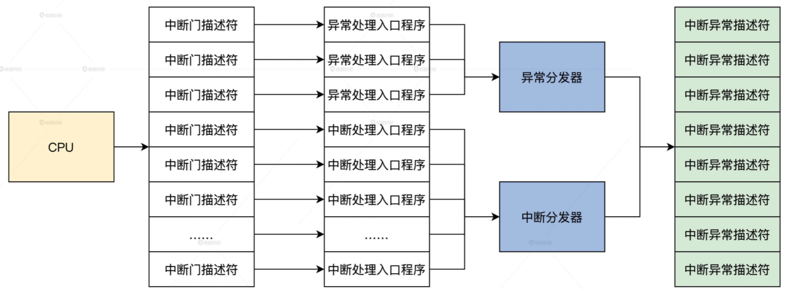
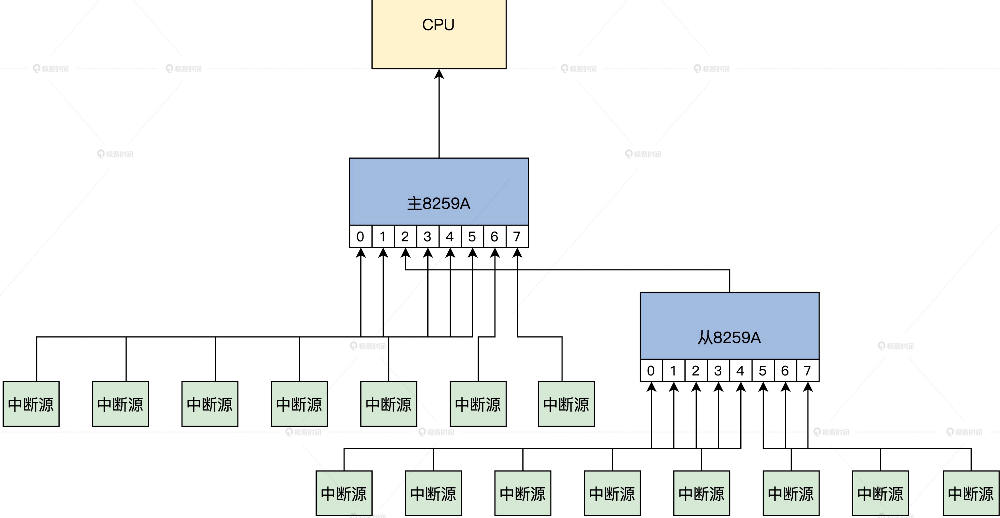

<!-- toc -->
继续在这个 hal_start 函数里，首先执行板级初始化，其实就是 [hal 层（硬件抽象层）初始化](#硬件抽象层初始化)。其中执行了平台初始化，hal 层的内存初始化，中断初始化，最后进入到内核层的初始化。
- [总体调用](#总体调用)
- [函数调用顺序](#总体调用)
- [第一个C函数](#第一个C函数)
- [硬件抽象层(hal层)初始化](#硬件抽象层初始化)
    - [初始化平台](#初始化平台)
        - [重建机器信息结构](#重建机器信息结构)
        - [初始化图形显示驱动](#初始化图形显示驱动)
    - [初始化内存](#初始化内存)
        - [重建并优化内存布局信息](#重建并优化内存布局信息)
    - [初始化中断](#初始化中断)
        - [CPU体系层面中断初始化](#cpu体系层面中断初始化)
            - [中断门](#中断门)
            - [中断入口处理程序](#中断入口处理程序)
            - [中断门描述符](#中断门描述符)
        - [CPU层面的中断处理函数实现](#cpu层面的中断处理函数实现)
            - [中断异常描述符](#中断异常描述符)
            - [中断、异常分发器](#中断异常分发器)
    - [初始化中断控制器(设备端的中断)](#初始化中断控制器设备端的中断)
    - [中断门描述符和中断异常描述符的区别](#中断门描述符和中断异常描述符的区别)
- [进入内核层](#进入内核层)
<!-- tocstop -->
# 总体调用
**一、HAL层调用链**  
hal_start()  

A、先去处理HAL层的初始化  
->init_hal()  

->->init_halplaltform()  
初始化平台  
->->->init_machbstart()  
主要是把二级引导器建立的机器信息结构，复制到了hal层一份给内核使用，同时也为释放二级引导器占用内存做好准备。  
->->->init_bdvideo()  
初始化图形机构; 初始化BGA显卡 或 VBE图形显卡信息【函数指针的使用】; 清空屏幕; 找到"background.bmp"，并显示背景图片  
->->->->init_dftgraph()  
初始了 dftgraph_t 结构体类型的变量 kdftgh，初始化进行现存操作的接口  
->->->->hal_dspversion()  
输出版本号等信息【vsprintfk】; 其中，用ret_charsinfo根据字体文件获取字符像素信息  

->->move_img2maxpadr()  
将移动initldrsve.bin到最大地址  

->->init_halmm()  
初始化内存  
->->->init_phymmarge  
申请phymmarge_t内存; 根据 e820map_t 结构数组，复制数据到phymmarge_t 结构数组; 按内存开始地址进行排序  

->->init_halintupt()  
初始化中断  
->->->init_descriptor()  
初始化GDT描述符x64_gdt  
->->->init_idt_descriptor()  
初始化IDT描述符x64_idt，绑定了中断编号及中断处理函数  
->->->init_intfltdsc()  
初始化中断异常表machintflt，拷贝了中断相关信息  
->->->init_i8259()  
初始化8529芯片中断  
->->->i8259_enabled_line(0)  
取消mask，开启中断请求  
 
->init_krl()  
最后，跳转去处理内核初始化  

**二、中断调用链，以硬件中断为例**  
A、kernel.inc中，通过宏定义，进行了中断定义。以硬件中断为例，可以在kernel.inc中看到：
宏为HARWINT，硬件中断分发器函数为hal_hwint_allocator
```
%macro  HARWINT 1
    保存现场......
    mov   rdi, %1
    mov   rsi,rsp
    call    hal_hwint_allocator
    恢复现场......
%endmacro
```
B、而在kernel.asm中，定义了各种硬件中断编号，比如hxi_hwint00，作为中断处理入口
```
ALIGN   16
hxi_hwint00:
    HARWINT (INT_VECTOR_IRQ0+0)
```
C、有硬件中断时，会先到达中断处理入口，然后调用到硬件中断分发器函数hal_hwint_allocator
第一个参数为中断编号，在rdi
第二个参数为中断发生时的栈指针，在rsi
然后调用异常处理函数hal_do_hwint

D、hal_do_hwint
加锁
调用中断回调函数hal_run_intflthandle
释放锁

E、hal_run_intflthandle
先获取中断异常表machintflt
然后调用i_serlist 链表上所有挂载intserdsc_t 结构中的中断处理的回调函数，是否处理由函数自己判断

F、中断处理完毕

G、异常处理类似，只是触发源头不太一样而已

# 第一个C函数
这是第一个 C 函数，也是初始化函数
```
HuOS/hal/x86/hal_start.c

void hal_start()
{
    //第一步：初始化hal层
    init_hal();
    //第二步：初始化内核层
    init_krl();
    for(;;);  //最后的死循环却有点奇怪，其实它的目的很简单，就是避免这个函数返回，因为这个返回了就无处可去，避免走回头路。
    return;
}
```

# 硬件抽象层初始化
hal 层，把硬件相关的操作集中在这个层，并向上提供接口，目的是让内核上层不用关注硬件相关的细节，也能方便以后移植和扩展。(目前编写的是x86平台的硬件抽象层)  
```
HuOS/hal/x86/halinit.c

void init_hal()
{
    //初始化平台
    init_halplaltform();
    //初始化内存
    //初始化中断
    return;
}
```
## 初始化平台
1. 把二级引导器建立的机器信息结构复制到 hal 层中的一个全局变量中，方便内核中的其它代码使用里面的信息，**之后二级引导器建立的数据所占用的内存都会被释放**。
2. 要初始化图形显示驱动，内核在运行过程要在屏幕上输出信息。
### 重建机器信息结构
```
HuOS/hal/x86/halplatform.c

void machbstart_t_init(machbstart_t *initp)  //machbstart_t是硬件信息定义的结构体
{
    //清零
    memset(initp, 0, sizeof(machbstart_t));
    return;
}

//从物理地址1MB处的硬件信息复制到kmachbsp（kmachbsp是结构体变量），并把kmachbsp清零，最后进行内存拷贝，将1MB处的信息复制到kmachbsp
void init_machbstart()
{
    machbstart_t *kmbsp = &kmachbsp;  //kmachbsp是个结构体变量，结构体类型是 machbstart_t，这个结构和二级引导器所使用的一模一样。同时，它还是一个 hal 层的全局变量
    machbstart_t *smbsp = MBSPADR;    //物理地址1MB处
    machbstart_t_init(kmbsp);
    //复制，要把地址转换成虚拟地址
    memcopy((void *)phyadr_to_viradr((adr_t)smbsp), (void *)kmbsp, sizeof(machbstart_t));
    return;
}

//平台初始化函数
void init_halplaltform()
{
    //复制机器信息结构
    init_machbstart();
    //初始化图形显示驱动
    init_bdvideo();
    return;
}
```
kmachbsp同时还是hal层的全局变量，我们想专门有个文件定义所有 hal 层的全局变量，于是我们在 HuOS/hal/x86/ 下建立一个 halglobal.c 文件
```
HuOS/hal/x86/halglobal.c

//全局变量定义变量放在data段
#define HAL_DEFGLOB_VARIABLE(vartype,varname) \
EXTERN  __attribute__((section(".data"))) vartype varname

HAL_DEFGLOB_VARIABLE(machbstart_t,kmachbsp);
```
宏扩展为带有“attribute（（section（“.data”）））”编译器指令的外部声明。此指令指定变量“varname”应放置在生成的对象文件的“.data”部分中。  
“EXTERN”关键字表示此变量在其他地方定义（可能在单独的源文件中），并在此处声明，以使其在当前源文件中可访问。  
### 初始化图形显示驱动
在 HuOS/hal/x86/ 下的 bdvideo.c 文件中，写好 init_bdvideo 函数  
```
HuOS/hal/x86/bdvideo.c

void init_bdvideo()
{
    dftgraph_t *kghp = &kdftgh;
    //初始化图形数据结构，里面放有图形模式，分辨率，图形驱动函数指针
    init_dftgraph();
    //初始bga图形显卡的函数指针
    init_bga();
    //初始vbe图形显卡的函数指针
    init_vbe();
    //清空屏幕 为黑色
    fill_graph(kghp, BGRA(0, 0, 0));
    //显示背景图片 
    set_charsdxwflush(0, 0);
    hal_background();
    return;
}
```
init_dftgraph() 函数初始了 dftgraph_t 结构体类型的变量 kdftgh，我们在 halglobal.c 文件中定义这个变量，结构类型我们这样来定义。  
```
HuOS/hal/x86/halglobal.c

typedef struct s_DFTGRAPH
{
    u64_t gh_mode;         //图形模式
    u64_t gh_x;            //水平像素点
    u64_t gh_y;            //垂直像素点
    u64_t gh_framphyadr;   //显存物理地址 
    u64_t gh_fvrmphyadr;   //显存虚拟地址
    u64_t gh_fvrmsz;       //显存大小
    u64_t gh_onepixbits;   //一个像素字占用的数据位数
    u64_t gh_onepixbyte;
    u64_t gh_vbemodenr;    //vbe模式号
    u64_t gh_bank;         //显存的bank数
    u64_t gh_curdipbnk;    //当前bank
    u64_t gh_nextbnk;      //下一个bank
    u64_t gh_banksz;       //bank大小
    u64_t gh_fontadr;      //字库地址
    u64_t gh_fontsz;       //字库大小
    u64_t gh_fnthight;     //字体高度
    u64_t gh_nxtcharsx;    //下一字符显示的x坐标
    u64_t gh_nxtcharsy;    //下一字符显示的y坐标
    u64_t gh_linesz;       //字符行高
    pixl_t gh_deffontpx;   //默认字体大小
    u64_t gh_chardxw;
    u64_t gh_flush;
    u64_t gh_framnr;
    u64_t gh_fshdata;      //刷新相关的
    dftghops_t gh_opfun;   //图形驱动操作函数指针结构体
}dftgraph_t;

typedef struct s_DFTGHOPS
{
    //读写显存数据
    size_t (*dgo_read)(void* ghpdev,void* outp,size_t rdsz);
    size_t (*dgo_write)(void* ghpdev,void* inp,size_t wesz);
    sint_t (*dgo_ioctrl)(void* ghpdev,void* outp,uint_t iocode);
    //刷新
    void   (*dgo_flush)(void* ghpdev);
    sint_t (*dgo_set_bank)(void* ghpdev, sint_t bnr);
    //读写像素
    pixl_t (*dgo_readpix)(void* ghpdev,uint_t x,uint_t y);
    void   (*dgo_writepix)(void* ghpdev,pixl_t pix,uint_t x,uint_t y);
    //直接读写像素 
    pixl_t (*dgo_dxreadpix)(void* ghpdev,uint_t x,uint_t y);
    void   (*dgo_dxwritepix)(void* ghpdev,pixl_t pix,uint_t x,uint_t y);
    //设置x，y坐标和偏移
    sint_t (*dgo_set_xy)(void* ghpdev,uint_t x,uint_t y);
    sint_t (*dgo_set_vwh)(void* ghpdev,uint_t vwt,uint_t vhi);
    sint_t (*dgo_set_xyoffset)(void* ghpdev,uint_t xoff,uint_t yoff);
    //获取x，y坐标和偏移
    sint_t (*dgo_get_xy)(void* ghpdev,uint_t* rx,uint_t* ry);
    sint_t (*dgo_get_vwh)(void* ghpdev,uint_t* rvwt,uint_t* rvhi);
    sint_t (*dgo_get_xyoffset)(void* ghpdev,uint_t* rxoff,uint_t* ryoff);
}dftghops_t;

//刷新显存
void flush_videoram(dftgraph_t *kghp)
{
    kghp->gh_opfun.dgo_flush(kghp);
    return;
}
```
我们正是把这些实际的图形驱动函数的地址填入了这个结构体中，然后通过这个结构体，我们就可以调用到相应的函数了。
背景图片——background.bmp在打包映像文件时包含进去，可以随时替换，只要满足 1024*768，24 位的位图文件就行。
下面把这些函数调用起来：
```
HuOS/hal/x86/halinit.c

void init_hal()
{
    init_halplaltform();
    return;
}

HuOS/hal/x86/hal_start.c

void hal_start()
{
    init_hal();//初始化hal层，其中会调用初始化平台函数，在那里会调用初始化图形驱动
    for(;;);
    return;
}
```
## 初始化内存
### 重建并优化内存布局信息
hal 层的内存初始化比较容易，只要向内存管理器提供内存空间布局信息就可以。  
之前在[二级引导器](../Build_sec_bootstrap/README.md)中已经获取了内存布局信息（BIOS 中的 dw _getmmap ；获取内存布局视图的函数），但 HuOS 的内存管理器需要保存更多的信息，最好是顺序的内存布局信息，这样可以增加额外的功能属性，同时降低代码的复杂度。BIOS 提供的结构无法满足前面这些要求，因此需要以 BIOS 提供的结构为基础，设计一套新的数据结构。  
```
HuOS/hal/x86/halmm.c

#define PMR_T_OSAPUSERRAM 1
#define PMR_T_RESERVRAM 2
#define PMR_T_HWUSERRAM 8
#define PMR_T_ARACONRAM 0xf
#define PMR_T_BUGRAM 0xff
#define PMR_F_X86_32 (1<<0)
#define PMR_F_X86_64 (1<<1)
#define PMR_F_ARM_32 (1<<2)
#define PMR_F_ARM_64 (1<<3)
#define PMR_F_HAL_MASK 0xff

typedef struct s_PHYMMARGE
{
    spinlock_t pmr_lock;//保护这个结构是自旋锁
    u32_t pmr_type;     //内存地址空间类型
    u32_t pmr_stype;
    u32_t pmr_dtype;    //内存地址空间的子类型，见上面的宏
    u32_t pmr_flgs;     //结构的标志与状态
    u32_t pmr_stus;
    u64_t pmr_saddr;    //内存空间的开始地址
    u64_t pmr_lsize;    //内存空间的大小
    u64_t pmr_end;      //内存空间的结束地址
    u64_t pmr_rrvmsaddr;//内存保留空间的开始地址
    u64_t pmr_rrvmend;  //内存保留空间的结束地址
    void* pmr_prip;     //结构的私有数据指针，以后扩展所用
    void* pmr_extp;     //结构的扩展数据指针，以后扩展所用
}phymmarge_t;
```
_有些情况下内核要另起炉灶，不想把所有的内存空间都交给内存管理器去管理，所以要保留一部分内存空间，这就是上面结构中那两个 pmr_rrvmsaddr、pmr_rrvmend 字段的作用。_  
有了数据结构，我们还要写代码来操作它。根据 e820map_t 结构数组，建立了一个 phymmarge_t 结构数组，init_one_pmrge 函数正是把 e820map_t 结构中的信息复制到 phymmarge_t 结构中来。  
_e820map_t是一种数据结构，表示内存映射。它是x86架构下PC系统的内存管理中用于表示物理内存地址空间分布的数组。数组中的每一项表示一个内存区块，描述该区块的起始地址、长度以及用途（例如，是否可用作系统内存）。_  
```
HuOS/hal/halmm.c

//根据 e820map_t 结构数组，建立一个 phymmarge_t 结构数组
u64_t initpmrge_core(e820map_t *e8sp, u64_t e8nr, phymmarge_t *pmargesp)
{
    u64_t retnr = 0;
    for (u64_t i = 0; i < e8nr; i++)
    {
        //根据一个e820map_t结构建立一个phymmarge_t结构
        if (init_one_pmrge(&e8sp[i], &pmargesp[i]) == FALSE)
        {
            return retnr;
        }
        retnr++;
    }
    return retnr;
}

void init_phymmarge()
{
    machbstart_t *mbsp = &kmachbsp;     //machbstart_t是硬件信息定义结构体，存储到kmachbsp
    phymmarge_t *pmarge_adr = NULL;     //定义phymmarge_t结构体
    u64_t pmrgesz = 0;

    //根据machbstart_t机器信息结构计算获得phymmarge_t结构的开始地址和大小
    ret_phymmarge_adrandsz(mbsp, &pmarge_adr, &pmrgesz);

    u64_t tmppmrphyadr = mbsp->mb_nextwtpadr;
    e820map_t *e8p = (e820map_t *)((adr_t)(mbsp->mb_e820padr));    
    //建立phymmarge_t结构
    u64_t ipmgnr = initpmrge_core(e8p, mbsp->mb_e820nr, pmarge_adr);
    
    //把phymmarge_t结构的地址大小个数保存machbstart_t机器信息结构中
    mbsp->mb_e820expadr = tmppmrphyadr;
    mbsp->mb_e820exnr = ipmgnr;
    mbsp->mb_e820exsz = ipmgnr * sizeof(phymmarge_t);
    mbsp->mb_nextwtpadr = PAGE_ALIGN(mbsp->mb_e820expadr + mbsp->mb_e820exsz);
    
    //phymmarge_t结构中地址空间从低到高进行排序
    phymmarge_sort(pmarge_adr, ipmgnr);
    return;
}
                                     
//这里 init_halmm 函数中还调用了 init_memmgr 函数，这个正是这我们内存管理器初始化函数，我会在内存管理的那节课展开讲。而 init_halmm 函数将要被 init_hal 函数调用。
```
把这些函数，用一个总管函数调动起来，init_halmm  
```
HuOS/hal/halmm.c

void init_halmm()
{
    init_phymmarge();
    //init_memmgr();
    return;
}
```
## 初始化中断
中断被分为两类：  
**异常**是同步的，原因是错误和故障，不修复错误就不能继续运行。所以这时，CPU 会跳到这种错误的处理代码那里开始运行，运行完了会返回。是同步的原因是如果不修改程序中的错误，下次运行程序到这里同样会发生异常。  
**中断**是异步的，我们通常说的中断就是这种类型，它是因为外部事件而产生的。通常设备需要 CPU 关注时，会给 CPU 发送一个中断信号，所以这时 CPU 会跳到处理这种事件的代码那里开始运行，运行完了会返回。由于不确定何种设备何时发出这种中断信号，所以它是异步的。  
_在 x86 CPU 上，最多支持 256 个中断，还记得前面所说的中断表和中断门描述符吗，这意味着我们要准备 256 个中断门描述符和 256 个中断处理程序的入口。_  
### CPU体系层面中断初始化
#### 中断门
中断表其实是个 **gate_t 结构的数组**，由 CPU 的 IDTR 寄存器指向，IDTMAX 为 256。
```
HuOS/.../halgdtidt_t.h

typedef struct s_GATE 
{         
    u16_t   offset_low;     /* 偏移 */         
    u16_t   selector;       /* 段选择子 */         
    u8_t    dcount;         /* 该字段只在调用门描述符中有效。如果在利用调用门调用子程序时引起特权级的转换和堆栈的改变，需要将外层堆栈中的参数复制到内层堆栈。该双字计数字段就是用于说明这种情况发生时，要复制的双字参数的数量。*/         
    u8_t    attr;           /* P(1) DPL(2) DT(1) TYPE(4) */         
    u16_t   offset_high;    /* 偏移的高位段 */         
    u32_t   offset_high_h;         
    u32_t   offset_resv; 
}__attribute__((packed)) gate_t;  //__attribute__((packed))作用就是告诉编译器取消编译过程中的优化对齐,按照实际占用字节数进行对齐 

//定义中断表 
HAL_DEFGLOB_VARIABLE(gate_t,x64_idt)[IDTMAX];
```
光有数组还不行，还要设置其中的数据，下面我们就来设计这个函数
```
HuOS/hal/halgdtidt.c

//vector 向量也是中断号             desc_type 中断门类型，中断门，陷阱门
//handler 中断处理程序的入口地址     privilege 中断门的权限级别
void set_idt_desc(u8_t vector, u8_t desc_type, inthandler_t handler, u8_t privilege)
{
    gate_t *p_gate = &x64_idt[vector];
    u64_t base = (u64_t)handler;
    p_gate->offset_low = base & 0xFFFF; 
    p_gate->selector = SELECTOR_KERNEL_CS;
    p_gate->dcount = 0;
    p_gate->attr = (u8_t)(desc_type | (privilege << 5));
    p_gate->offset_high = (u16_t)((base >> 16) & 0xFFFF);
    p_gate->offset_high_h = (u32_t)((base >> 32) & 0xffffffff);
    p_gate->offset_resv = 0;
    return;
}
```
#### 中断入口处理程序
有了中断门之后，还差中断入口处理程序，中断入口处理程序只负责这三件事：  
1. 保护 CPU 寄存器，即中断发生时的程序运行的上下文。
2. 调用中断处理程序，这个程序可以是修复异常的，可以是设备驱动程序中对设备响应的程序。
3. 恢复 CPU 寄存器，即恢复中断时程序运行的上下文，使程序继续运行。
这些操作又要用汇编代码才可以编写，**这是内核中最重要的部分**。建立一个 kernel.asm 命名的文件来写好以上三个功能的汇编宏代码，避免写 256 遍同样的代码。
```
HuOS/hal/kernel.asm

//保存中断后的寄存器
%macro  SAVEALL  0  //macro相当于宏指令，SAVEALL是指定的函数名
  push rax
  push rbx
  push rcx
  push rdx
  push rbp
  push rsi
  push rdi
  push r8
  push r9
  push r10
  push r11
  push r12
  push r13
  push r14
  push r15
  xor r14,r14
  mov r14w,ds     //r14w:in 16-bit format
  push r14
  mov r14w,es
  push r14
  mov r14w,fs
  push r14
  mov r14w,gs
  push r14
%endmacro

//恢复中断后寄存器
%macro  RESTOREALL  0
  pop r14
  mov gs,r14w
  pop r14 
  mov fs,r14w
  pop r14
  mov es,r14w
  pop r14
  mov ds,r14w
  pop r15
  pop r14
  pop r13
  pop r12
  pop r11
  pop r10
  pop r9
  pop r8
  pop rdi
  pop rsi
  pop rbp
  pop rdx
  pop rcx
  pop rbx
  pop rax
  iretq
%endmacro

//保存异常下的寄存器
%macro  SAVEALLFAULT 0
  push rax
  push rbx
  push rcx
  push rdx
  push rbp
  push rsi
  push rdi
  push r8
  push r9
  push r10
  push r11
  push r12
  push r13
  push r14
  push r15
  xor r14,r14
  mov r14w,ds
  push r14
  mov r14w,es
  push r14
  mov r14w,fs
  push r14
  mov r14w,gs
  push r14
%endmacro

//恢复异常下寄存器
%macro  RESTOREALLFAULT  0
  pop r14
  mov gs,r14w
  pop r14 
  mov fs,r14w
  pop r14
  mov es,r14w
  pop r14
  mov ds,r14w
  pop r15
  pop r14
  pop r13
  pop r12
  pop r11
  pop r10
  pop r9
  pop r8
  pop rdi
  pop rsi
  pop rbp
  pop rdx
  pop rcx
  pop rbx
  pop rax
  add rsp,8
  iretq
%endmacro

//没有错误码CPU异常
%macro  SRFTFAULT 1            //宏接受一个参数，由%1占位符指定
  push    _NOERRO_CODE         //有的 CPU 异常，CPU 自动把异常码压入到栈中。而有的 CPU 异常没有异常码，为了统一，我们对没有异常码的手动压入一个常数，维持栈的平衡。
  SAVEALLFAULT
  mov r14w,0x10               //0x10：一个默认的16位的公共值
  mov ds,r14w
  mov es,r14w
  mov fs,r14w
  mov gs,r14w
  mov   rdi,%1 ;rdi, rsi        //将第一个参数（%1）的值移到RDI寄存器中
  mov   rsi,rsp                 //当前堆栈指针（RSP）的值移动到RSI寄存器中
  call   hal_fault_allocator    //RDI和RSI为参数
  RESTOREALLFAULT
%endmacro

//CPU异常  调用“hal_fault_allocator”函数并传递相关信息（如当前堆栈状态和故障代码）
%macro  SRFTFAULT_ECODE 1
  SAVEALLFAULT
  mov r14w,0x10
  mov ds,r14w
  mov es,r14w
  mov fs,r14w
  mov gs,r14w
  mov   rdi,%1
  mov   rsi,rsp                 
  call   hal_fault_allocator    
  RESTOREALLFAULT
%endmacro

//硬件中断
%macro  HARWINT  1
  SAVEALL
  mov r14w,0x10
  mov ds,r14w
  mov es,r14w
  mov fs,r14w
  mov gs,r14w
  mov  rdi, %1
  mov   rsi,rsp
  call    hal_intpt_allocator
  RESTOREALL
%endmacro
```
_最重要的只有两个指令：push、pop，这两个正是用来压入寄存器和弹出寄存器的，正好可以用来保存和恢复 CPU 所有的通用寄存器_  
_“r14w”是对x86汇编语言中R14寄存器的低16位的引用。“w”后缀表示引用为16位格式，而“d”后缀表示32位格式的引用，“q”后缀表示64位格式的参考_
general purpose registers (RAX, RBX, RCX, RDX, RBP, RSI, RDI, R8, R9, R10, R11, R12, R13, R14, R15) 通用寄存器；segment registers (DS, ES, FS, GS) 段寄存器  
有了中断异常处理的宏（宏的目的是处理由于编程错误、无效的系统调用或其他问题而发生的软件故障），我们还要它们变成中断异常的处理程序入口点函数。汇编函数其实就是一个标号加一段汇编代码，C 编译器把 C 语言函数编译成汇编代码后，也是标号加汇编代码，函数名就是标号。  
```
HuOS/hal/kernel.asm

//除法错误异常 比如除0
exc_divide_error:
  SRFTFAULT 0
//单步执行异常
exc_single_step_exception:
  SRFTFAULT 1
exc_nmi:
  SRFTFAULT 2
//调试断点异常
exc_breakpoint_exception:
  SRFTFAULT 3
//溢出异常
exc_overflow:
  SRFTFAULT 4
//段不存在异常
exc_segment_not_present:
  SRFTFAULT_ECODE 11
//栈异常
exc_stack_exception:
  SRFTFAULT_ECODE 12
//通用异常
exc_general_protection:
  SRFTFAULT_ECODE 13
//缺页异常
exc_page_fault:
  SRFTFAULT_ECODE 14
hxi_exc_general_intpfault:
  SRFTFAULT 256
//硬件1～7号中断
hxi_hwint00:
  HARWINT  (INT_VECTOR_IRQ0+0)
hxi_hwint01:
  HARWINT  (INT_VECTOR_IRQ0+1)
hxi_hwint02:
  HARWINT  (INT_VECTOR_IRQ0+2)
hxi_hwint03:
  HARWINT  (INT_VECTOR_IRQ0+3)
hxi_hwint04:
  HARWINT  (INT_VECTOR_IRQ0+4)
hxi_hwint05:
  HARWINT  (INT_VECTOR_IRQ0+5)
hxi_hwint06:
  HARWINT  (INT_VECTOR_IRQ0+6)
hxi_hwint07:
  HARWINT  (INT_VECTOR_IRQ0+7)
```
#### 中断门描述符
有了中断处理程序的入口地址，下面我们就可以写函数**设置中断门描述符**了。  
_一开始把所有中断的处理程序设置为保留的通用处理程序，避免未知中断异常发生了 CPU 无处可去，然后对已知的中断和异常进一步设置，这会覆盖之前的通用处理程序，这样就可以确保万无一失。_  
```
HuOS/hal/halsgdidt.c

void init_idt_descriptor()
{
    //一开始把所有中断的处理程序设置为保留的通用处理程序
    for (u16_t intindx = 0; intindx <= 255; intindx++)
    {
        set_idt_desc((u8_t)intindx, DA_386IGate, hxi_exc_general_intpfault, PRIVILEGE_KRNL);
    }
    set_idt_desc(INT_VECTOR_DIVIDE, DA_386IGate, exc_divide_error, PRIVILEGE_KRNL);
    set_idt_desc(INT_VECTOR_DEBUG, DA_386IGate, exc_single_step_exception, PRIVILEGE_KRNL);
    set_idt_desc(INT_VECTOR_NMI, DA_386IGate, exc_nmi, PRIVILEGE_KRNL);
    set_idt_desc(INT_VECTOR_BREAKPOINT, DA_386IGate, exc_breakpoint_exception, PRIVILEGE_USER);
    set_idt_desc(INT_VECTOR_OVERFLOW, DA_386IGate, exc_overflow, PRIVILEGE_USER);
    //...
    set_idt_desc(INT_VECTOR_PAGE_FAULT, DA_386IGate, exc_page_fault, PRIVILEGE_KRNL);
    set_idt_desc(INT_VECTOR_IRQ0 + 0, DA_386IGate, hxi_hwint00, PRIVILEGE_KRNL);
    set_idt_desc(INT_VECTOR_IRQ0 + 1, DA_386IGate, hxi_hwint01, PRIVILEGE_KRNL);
    set_idt_desc(INT_VECTOR_IRQ0 + 2, DA_386IGate, hxi_hwint02, PRIVILEGE_KRNL);
    set_idt_desc(INT_VECTOR_IRQ0 + 3, DA_386IGate, hxi_hwint03, PRIVILEGE_KRNL);
    //...
     return;
}
```
把这些代码整理安装到具体的调用路径上，让上层调用者调用到  
```
HuOS/hal/halintupt.c

void init_halintupt()
{
    init_idt_descriptor();
    init_intfltdsc();   //初始化中断异常表machintflt，拷贝了中断相关信息
    return;
}
```
**到此CPU体系层面的中断就初始化完成了**
### CPU层面的中断处理函数实现
前面只是解决了中断的 CPU 相关部分，而 CPU 只是响应中断，但是并不能解决产生中断的问题。要处理这问题，就要写好相应的处理函数。有些处理是内核所提供的，而有些处理函数是设备驱动提供的，想让它们和中断关联起来，就要好好设计中断处理框架了。  

下面需要写好中断、异常分发器和中断异常描述符  
#### 中断异常描述符
```
HuOS/.../halintupt_t.h

//中断异常描述符
typedef struct s_INTFLTDSC{    
    spinlock_t  i_lock;    
    u32_t       i_flg;    
    u32_t       i_stus;    
    uint_t      i_prity;        //中断优先级    
    uint_t      i_irqnr;        //中断号    
    uint_t      i_deep;         //中断嵌套深度    
    u64_t       i_indx;         //中断计数    
    list_h_t    i_serlist;      //也可以使用中断回调函数的方式
    uint_t      i_sernr;        //中断回调函数个数   
    list_h_t    i_serthrdlst;   //中断线程链表头    
    uint_t      i_serthrdnr;    //中断线程个数    
    void*       i_onethread;    //只有一个中断线程时直接用指针    
    void*       i_rbtreeroot;   //如果中断线程太多则按优先级组成红黑树
    list_h_t    i_serfisrlst;      
    uint_t      i_serfisrnr;       
    void*       i_msgmpool;     //可能的中断消息池    
    void*       i_privp;    
    void*       i_extp;
}intfltdsc_t;
```
中断异常描述符结构中，记录了中断的优先级。因为有些中断可以稍后执行，而有的中断需要紧急执行，所以要设计一个优先级。其中还有中断号，中断计数等统计信息。  
中断可以由线程的方式执行，也可以是一个回调函数，该函数的地址放在另一个结构体中  
```
HuOS/.../halglobal.h

typedef drvstus_t (*intflthandle_t)(uint_t ift_nr,void* device,void* sframe); //中断处理函数的指针类型
typedef struct s_INTSERDSC{    
    list_h_t    s_list;        //在中断异常描述符中的链表
    list_h_t    s_indevlst;    //在设备描述描述符中的链表
    u32_t       s_flg;        
    intfltdsc_t* s_intfltp;    //指向中断异常描述符 
    void*       s_device;      //指向设备描述符
    uint_t      s_indx;    
    intflthandle_t s_handle;   //中断处理的回调函数指针
}intserdsc_t;
```
**如果内核或者设备驱动程序要安装一个中断处理函数，就要先申请一个 intserdsc_t 结构体，然后把中断函数的地址写入其中，最后把这个结构挂载到对应的 intfltdsc_t 结构中的 i_serlist 链表中。**  
#### 中断、异常分发器
**问：_为什么不能直接把中断处理函数放在 intfltdsc_t 结构中呢，还要多此一举搞个 intserdsc_t 结构体呢？_**  
答：因为我们的计算机中可能有很多设备，每个设备都可能产生中断，但是中断控制器的中断信号线是有限的。你可以这样理解：中断控制器最多只能产生几十号中断号，而设备不止几十个，所以会有多个设备共享一根中断信号线。这就导致一个中断发生后，无法确定是哪个设备产生的中断，所以我们干脆让设备驱动程序来决定，因为它是最了解设备的。这里我们让这个 intfltdsc_t 结构上的所有中断处理函数都依次执行，查看是不是自己的设备产生了中断，如果是就处理，不是则略过。  
明白了这两个结构之后，我们就要开始初始化了  
```
HuOS/.../halglobal.h

//定义intfltdsc_t结构数组大小为256
HAL_DEFGLOB_VARIABLE(intfltdsc_t,machintflt)[IDTMAX]; //中断表
```
再来实现中断、异常分发器函数
```
HuOS/hal/halintupt.c

//中断处理函数
void hal_do_hwint(uint_t intnumb, void *krnlsframp)
{
    intfltdsc_t *ifdscp = NULL;
    cpuflg_t cpuflg;
    //根据中断号获取中断异常描述符地址 
    ifdscp = hal_retn_intfltdsc(intnumb);
    //对中断异常描述符加锁并中断
    hal_spinlock_saveflg_cli(&ifdscp->i_lock, &cpuflg);
    ifdscp->i_indx++;
    ifdscp->i_deep++;
    //运行中断处理的回调函数
    hal_run_intflthandle(intnumb, krnlsframp);
    ifdscp->i_deep--;
    //解锁并恢复中断状态
    hal_spinunlock_restflg_sti(&ifdscp->i_lock, &cpuflg);
    return;
}

//异常分发器
void hal_fault_allocator(uint_t faultnumb, void *krnlsframp)
{
    //我们的异常处理回调函数也是放在中断异常描述符中的
    hal_do_hwint(faultnumb, krnlsframp);
    return;
}

//中断分发器
void hal_hwint_allocator(uint_t intnumb, void *krnlsframp)
{
    hal_do_hwint(intnumb, krnlsframp);
    return;
}
```
“intfltdsc_t”结构中的“i_index”和“i_deep”字段表示中断的计数和中断的嵌套深度。“i_index”用于跟踪中断发生的次数。每次处理中断时，它都会递增。“i_deep”用于跟踪中断的嵌套深度。它在进入中断处理程序之前递增，在离开中断处理程序之后递减。这有助于防止可重入中断处理，这可能会导致意外行为。“i_deep”字段允许系统确定当前是否正在处理中断以及是否需要再次处理中断。  
接着实现 hal_run_intflthandle 函数，它负责调用中断处理的回调函数
```
void hal_run_intflthandle(uint_t ifdnr, void *sframe)
{    
    intserdsc_t *isdscp;    
    list_h_t *lst;
    //根据中断号获取中断异常描述符地址    
    intfltdsc_t *ifdscp = hal_retn_intfltdsc(ifdnr);
    //遍历i_serlist链表    
    list_for_each(lst, &ifdscp->i_serlist)    
    {   
        //获取i_serlist链表上对象即intserdsc_t结构
        isdscp = list_entry(lst, intserdsc_t, s_list);  
        //调用中断处理回调函数      
        isdscp->s_handle(ifdnr, isdscp->s_device, sframe);    
    }
    return;
}
```
循环遍历 intfltdsc_t 结构中，i_serlist 链表上所有挂载的 intserdsc_t 结构，然后调用 intserdsc_t 结构中的中断处理的回调函数。  
**以上都是CPU端的中断，接下来是设备端的中断**
## 初始化中断控制器(设备端的中断)
这个可以交给设备驱动程序，但是 CPU 和设备之间的中断控制器，还需要我们出面解决。  
多个设备的中断信号线都会连接到中断控制器上，中断控制器可以决定启用或者屏蔽哪些设备的中断，还可以决定设备中断之间的优先线，所以它才叫中断控制器。    
x86 平台上的中断控制器有多种，最开始是 8259A，然后是 IOAPIC，最新的是 MSI-X。  
为了简单的说明原理选择了 8259A 中断控制器。8259A 在任何 x86 平台上都可以使用，x86 平台使用了两片 8259A 芯片，以级联的方式存在。它拥有 15 个中断源（即可以有 15 个中断信号接入）。
上面直接和 CPU 连接的是主 8259A，下面的是从 8259A，**每一个 8259A 芯片都有两个 I/O 端口，我们可以通过它们对 8259A 进行编程。主 8259A 的端口地址是 0x20，0x21；从 8259A 的端口地址是 0xA0，0xA1**。

下面我们来做代码初始化，我们程序员可以向 8259A 写两种命令字： ICW 和 OCW  
ICW 这种命令字用来实现 8259a 芯片的初始化。而 OCW 这种命令用来向 8259A 发布命令，以对其进行控制。OCW 可以在 8259A 被初始化之后的任何时候被使用  
```
HuOS/hal/i8259.c

//在 init_halintupt() 函数的最后，调用这个函数就行。
void init_i8259()
{
    //初始化主从8259a
    out_u8_p(ZIOPT, ICW1);    
    out_u8_p(SIOPT, ICW1);    
    out_u8_p(ZIOPT1, ZICW2);    
    out_u8_p(SIOPT1, SICW2);    
    out_u8_p(ZIOPT1, ZICW3);    
    out_u8_p(SIOPT1, SICW3);    
    out_u8_p(ZIOPT1, ICW4);    
    out_u8_p(SIOPT1, ICW4);
    //屏蔽全部中断源
    out_u8_p(ZIOPT1, 0xff);    
    out_u8_p(SIOPT1, 0xff);        
    return;
}
```
**_既然我们是研究操作系统不是要写硬件驱动，为什么要在初始化中断控制器后，屏蔽所有的中断源呢？因为我们 HuOS 在初始化阶段还不能处理中断_**  
**_到此，我们的 HuOS 的 hal 层初始化就结束了!_**

## 中断门描述符和中断异常描述符的区别
在x86架构中，**中断描述符表（IDT）** 用于处理硬件中断和异常。IDT包含描述每个中断或异常行为的描述符列表。IDT中使用了两种类型的描述符：中断描述符和中断门。  
**中断描述符**：这些描述符描述正常程序执行期间发生的异常或错误，如被零除错误、页面错误等。异常描述符提供异常类型、特权级别和异常处理程序地址等信息。  
**中断门**：这些描述符描述由外部设备（如键盘、鼠标或网络设备）触发的中断。中断门提供诸如特权级别、中断处理程序的地址和门的类型（陷阱或中断门）之类的信息。  
这两种描述符的主要区别在于它们的目的和描述的事件类型。中断描述符用于描述正常程序执行期间发生的异常，而中断门用于描述由外部设备触发的中断。中断描述符提供有关异常的信息，如异常的类型和异常处理程序的地址，而中断门提供有关中断的信息，例如其特权级别和门的类型。

# 进入内核层
下面进入到内核层，建立一个文件，写上一个函数，作为本章的结尾。但是这个函数是个空函数，目前什么也不做，**它是为 HuOS 内核层初始化而存在的**  
由于内核层是从 hal 层进入的，必须在 hal_start() 函数中被调用，所以在此完成这个函数——init_krl()
```
HuOS/kernel/krlinit.c

void init_krl()
{ 
    //禁止函数返回    
    die(0);    
    return;
}
```
下面我们在 hal_start() 函数中调用它就行了
```
void hal_start()
{   
    //初始化HuOS的hal层 
    init_hal();
    //初始化HuOS的内核层    
    init_krl();    
    return;
}
```
1. HuOS 的第一个 C 函数产生了，它十分简单但极其有意义，它的出现标志着 C 语言的运行环境已经完善。从此我们可以用 C 语言高效地开发操作系统了，由爬行时代进入了跑步前行的状态，可喜可贺。
2. 第一个 C 函数，干的第一件重要工作就是调用 hal 层的初始化函数。这个初始化函数首先初始化了平台，初始化了机器信息结构供内核的其它代码使用，还初始化了我们图形显示驱动、显示了背景图片；其次是初始化了内存管理相关的数据结构；接着初始了中断，中断处理框架是两层，所以最为复杂；最后初始化了中断控制器。
3. 当 hal 层初始化完成了，我们就进入了内核层... (待续...)


