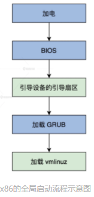
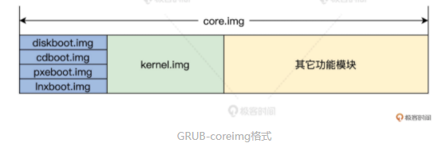

<!-- toc -->
本章介绍Linux 上 GRUB 是怎样启动，以及内核里的“实权人物”——vmlinuz 内核文件是如何产生和运转的
- [全局流程](#全局流程)
- [从bios到grub](#从bios到grub)
- [grub启动](#grub启动)
- [vmlinuz文件结构](#vmlinuz-文件结构)
    - [vmlinuz](#vmlinuz)
    - [bzImage](#bzimage)
    - [setup.bin](#setupbin)
    - [vmlinux.bin](#vmlinuxbin)
    - [vmlinux](#vmlinux)
    - [piggy.c/piggy.S在哪](#piggycpiggys在哪)
    - [piggy.S 的第一个依赖文件 vmlinux.bin.$(suffix-y)](#piggys-的第一个依赖文件-vmlinuxbinsuffix-y)
    - [梳理vmlinux创建方法](#梳理vmlinux创建方法)
- [objcopy](#objcopy)
- [vmlinux和vmlinuz的区别](#vmlinux和vmlinuz的区别)
- [总结](#总结)
<!-- tocstop -->

# 全局流程
机器上电后，BIOS 会进行自检，然后由 BIOS 加载引导设备中引导扇区。在安装有 Linux 操作系统的情况下，在引导扇区里，通常是安装的 GRUB 的一小段程序（安装 windows 的情况则不同）。最后，GRUB 会加载 Linux 的内核映像 vmlinuz  
```
如果计算机安装了 Windows 操作系统，在引导扇区中会安装一个名为 "NTLDR" 的引导加载程序。NTLDR 的作用是加载 Windows 的主引导程序，该主引导程序负责加载 Windows 内核并启动操作系统。它还读取配置文件并显示选择登录的操作系统的界面（如果存在多个操作系统）。
```
**BIOS 加载引导设备中引导扇区：BIOS 会自动读取保存在 CMOS 中的引导设备信息。**  
为了启动外部储存器中的程序，BIOS 会搜索可引导的设备，搜索的顺序是由 CMOS 中的设置信息决定的（这也是我们平时讲的，所谓的在 BIOS 中设置的启动设备顺序）。一个是软驱，一个是光驱，一个是硬盘上，还可以是网络上的设备甚至是一个 usb 接口的 U 盘，都可以作为一个启动设备。  


# 从BIOS到GRUB
硬盘、U 盘（外部储存器）并不和 CPU 直接相连，它们的访问机制和寻址方式与内存截然不同，因此CPU只能访问内存。  

**内存在断电后就没法保存数据了，那 BIOS 又是如何启动的呢?**  
硬件工程师设计 CPU 时，硬性地规定在加电的瞬间，强制将 CS 寄存器的值设置为 0XF000，IP 寄存器的值设置为 0XFFF0。这样一来，CS:IP 就指向了 0XFFFF0 这个物理地址。  

**那么CPU中的cs:ip值是如何组合成0xFFFF0的?**  
1. 由于在实模式下，段地址需要乘以16后才能与偏移地址相加，求出的和便是物理地址，CPU便拿出地址直接用了
2. 在开机的一瞬间，CPU的cs:ip寄存器被强制初始化为0xF000:0xFFF0
3. 由于开始的时候处于实模式，在实模式下的段地址要乘以16，也就是左移4位，于是0xF000:0xFFF0的等效地址将是0xFFFF0。此地址就是BIOS的入口地址  
4. 在这个物理地址上连接了主板上的一块小的 ROM 芯片。这种芯片的访问机制和寻址方式和内存一样，只是它在断电时不会丢失数据，在常规下也不能往这里写入数据，它是一种只读内存，BIOS 程序就被固化在该 ROM 芯片里。  

现在，CS:IP 指向了 0XFFFF0 这个位置，正是 BIOS 程序的入口地址。这意味着 BIOS 正式开始启动。BIOS 一开始会初始化 CPU，接着检查并初始化内存，然后将自己的一部分复制到内存(即BIOS获得的一些初始化数据传给grub)。BIOS 的下一步就是枚举本地设备进行初始化，并进行相关的检查，检查硬件是否损坏，这期间 BIOS 会调用其它设备上的固件程序，如显卡、网卡等设备上的固件程序。最后跳转到内存中运行。  

**当设备初始化和检查步骤完成之后，BIOS 会在内存中建立中断表和中断服务程序，这是启动 Linux 至关重要的工作，因为 Linux 会用到它们。**  
具体操作: BIOS 会从内存地址（0x00000）开始用 1KB 的内存空间（0x00000~0x003FF）构建中断表，在紧接着中断表的位置，用 256KB 的内存空间构建 BIOS 数据区（0x00400~0x004FF），并在 0x0e05b 的地址加载了 8KB 大小的与中断表对应的中断服务程序。

中断表中有 256 个条目，每个条目占用 4 个字节，其中两个字节是 CS 寄存器的值，两个字节是 IP 寄存器的值。每个条目都指向一个具体的中断服务程序。CS为代码段寄存器，IP为指令指针寄存器，它们指示了CPU当前要读取指令的地址。  

Linux 通常是从硬盘中启动的。硬盘上的第 1 个扇区（每个扇区 512 字节空间），被称为 MBR（主启动记录），其中包含有基本的 GRUB 启动程序和分区表，安装 GRUB 时会自动写入到这个扇区，当 MBR 被 BIOS 装载到 0x7c00 地址开始的内存空间中后，BIOS 就会将控制权转交给了 MBR。在当前的情况下，其实是交给了 GRUB。到这里，BIOS 到 GRUB 的过程结束。

# Grub启动
可以发现，BIOS 只会加载硬盘上的第 1 个扇区。不过这个扇区仅有 512 字节，这 512 字节中还有 64 字节的分区表加 2 字节的启动标志，**很显然，剩下 446 字节的空间，是装不下 GRUB 这种大型通用引导器的。**  
于是，GRUB 的加载分成了多个步骤，同时 GRUB 也分成了多个文件，其中有两个重要的文件 boot.img 和 core.img
其中，boot.img 被 GRUB 的安装程序写入到硬盘的 MBR 中，同时**在 boot.img 文件中的一个位置写入 core.img 文件占用的第一个扇区的扇区号**，从而实现从boot跳转到core。  
而 core.img 文件是由 GRUB 安装程序根据安装时的环境信息，用其它 GRUB 的模块文件动态生成。如下图所示：  
  
如果是从硬盘启动的话，core.img 中的第一个扇区的内容就是 diskboot.img 文件。diskboot.img 文件的作用是，读取 core.img 中剩余的部分到内存中。由于这时 diskboot.img 文件还不识别文件系统，所以我们将 core.img 文件的全部位置，都用文件块列表的方式保存到 diskboot.img 文件中。  
这样就能确保 diskboot.img 文件找到 core.img 文件的剩余内容，最后将控制权交给 kernel.img 文件。因为这时 core.img 文件中嵌入了足够多的功能模块，所以可以保证 GRUB 识别出硬盘分区上的文件系统，能够访问 /boot/grub 目录，并且可以加载相关的配置文件和功能模块，来实现相关的功能，例如加载启动菜单、加载目标操作系统等。  
正因为 GRUB2 大量使用了动态加载功能模块，这使得 core.img 文件的体积变得足够小。而 GRUB 的 core.img 文件一旦开始工作，就可以加载 Linux 系统的 vmlinuz 内核文件了。  

# vmlinuz 文件结构
## vmlinuz
vmlinuz在/boot目录下，由 Linux 编译生成的 bzImage 文件复制而来。  
我们一致把 Linux 源码解压到一个 linux 目录中，也就是说我们后面查找 Linux 源代码文件总是从 linux 目录开始的，切换到代码目录执行 make ARCH=x86_64，再执行 make install，就会产生 vmlinuz 文件，可以参考后面的 Makefile 代码  
```
#linux/arch/x86/boot/Makefile

install:    sh $(srctree)/$(src)/install.sh $(KERNELRELEASE) $(obj)/bzImage System.map "$(INSTALL_PATH)"
```
代码解析:  
This is a shell script command that performs an installation of the Linux kernel image and its associated files.  

The command invokes a shell script located at ```$(srctree)/$(src)/install.sh``` and passes four arguments to it:  
1. $(KERNELRELEASE): This is the version of the Linux kernel being installed.
2. $(obj)/bzImage: This is the location of the bzImage file, which is a compressed Linux kernel image file.
3. System.map: This is a file that contains the symbol table of the Linux kernel, which is used by the system to map addresses to symbols.
4. $(INSTALL_PATH): This is the location where the Linux kernel and its associated files will be installed.

The script install.sh will use these arguments to perform the installation of the Linux kernel image and its associated files to the specified location. The script will typically copy the kernel image and the symbol table to the specified location and update the boot loader configuration to make the newly installed kernel image the default boot option.

----------
## bzImage
install.sh 脚本文件只是完成复制的功能，所以我们只要搞懂了 bzImage 文件结构，就等同于理解了 vmlinuz 文件结构。  
那么 bzImage 文件又是怎么来的呢？我们只要研究 bzImage 文件在 Makefile 中的生成规则，就会恍然大悟  
```
#linux/arch/x86/boot/Makefile

$(obj)/bzImage: $(obj)/setup.bin $(obj)/vmlinux.bin $(obj)/tools/build FORCE    
$(call if_changed,image)    @$(kecho) 'Kernel: $@ is ready' ' (#'`cat .version`')'
```
代码解析：  
This is a Makefile rule that builds the bzImage file, which is a compressed Linux kernel image.  

The line ```$(obj)/bzImage: $(obj)/setup.bin $(obj)/vmlinux.bin $(obj)/tools/build FORCE``` defines the dependencies of the bzImage file. The bzImage file depends on three files: ```$(obj)/setup.bin, $(obj)/vmlinux.bin, and $(obj)/tools/build```. The FORCE dependency ensures that the rule will always be executed.  

The line $(call if_changed,image) invokes a Makefile macro if_changed, which checks if the dependencies of the bzImage have changed and executes the rule only if they have changed.  

The line ```@$(kecho) 'Kernel: $@ is ready' ' (#'cat .version')'``` is a message that is displayed by the Makefile when the rule has been executed successfully. The $@ symbol is a special symbol in Makefiles that refers to the target of the rule, which in this case is $(obj)/bzImage. The cat .version command retrieves the contents of the file .version and displays it along with the message.  

In summary, this Makefile rule builds the bzImage file, which is a compressed Linux kernel image, by combining ```$(obj)/setup.bin, $(obj)/vmlinux.bin, and $(obj)/tools/build``` and compressing them into a single file. The rule is executed only if the dependencies have changed and displays a message indicating that the kernel is ready once the rule has been executed successfully.  
生成 bzImage 文件需要三个依赖文件：setup.bin、vmlinux.bin和linux/arch/x86/boot/tools目录下的build。  
build 只是一个 HOSTOS（正在使用的 Linux）下的应用程序，它的作用就是将 setup.bin、vmlinux.bin 两个文件拼接成一个 bzImage 文件。  

----------
## setup.bin
setup.bin 文件是由 objcopy 命令根据 setup.elf 生成的
```
#这些目标文件正是由/arch/x86/boot/目录下对应的程序源代码文件编译产生
setup-y     += a20.o bioscall.o cmdline.o copy.o cpu.o cpuflags.o cpucheck.o
setup-y     += early_serial_console.o edd.o header.o main.o memory.o
setup-y     += pm.o pmjump.o printf.o regs.o string.o tty.o video.o
setup-y     += video-mode.o version.o

#……
SETUP_OBJS = $(addprefix $(obj)/,$(setup-y))
#……
LDFLAGS_setup.elf   := -m elf_i386 -T$(obj)/setup.elf: $(src)/setup.ld $(SETUP_OBJS) FORCE    $(call if_changed,ld)
#……
OBJCOPYFLAGS_setup.bin  := -O binary$(obj)/setup.bin: $(obj)/setup.elf FORCE    $(call if_changed,objcopy)
```
代码解析：  
setup-y is a list of object files that are required for the setup of the bootloader. These files include a20.o, bioscall.o, cmdline.o, etc.

SETUP_OBJS is a list of the object files with their full path, obtained by adding the $(obj)/ prefix to the setup-y list.

LDFLAGS_setup.elf specifies the linker flags to be used when linking the object files into an ELF file named setup.elf. The option -m elf_i386 specifies the target architecture, and the -T option specifies the linker script to be used. The linker script setup.ld and the object files ```$(SETUP_OBJS)``` are passed as input to the linker. The FORCE dependency ensures that the rule will always be executed, and $(call if_changed,ld) checks if the dependencies have changed and executes the rule only if they have changed.

OBJCOPYFLAGS_setup.bin uses the objcopy tool to convert the setup.elf file to a binary file named setup.bin. The option -O binary specifies the output format to be binary. The FORCE dependency ensures that the rule will always be executed, and $(call if_changed,objcopy) checks if the dependencies have changed and executes the rule only if they have changed.

setup.bin 文件正是由 /arch/x86/boot/ 目录下一系列对应的程序源代码文件编译链接产生，其中的 head.S 文件和 main.c 文件格外重要  

--------
## vmlinux.bin
构建 vmlinux.bin 的规则依然在 linux/arch/x86/boot/ 目录下的 Makefile 文件中  
```
#linux/arch/x86/boot/Makefile

OBJCOPYFLAGS_vmlinux.bin := -O binary -R .note -R .comment -S$(obj)/vmlinux.bin: $(obj)/compressed/vmlinux FORCE    $(call if_changed,objcopy)
```
This code is a Makefile script for building the Linux kernel in a Linux kernel build process.

OBJCOPYFLAGS_vmlinux.bin uses the objcopy tool to convert the file $(obj)/compressed/vmlinux to a binary file named vmlinux.bin. The option -O binary specifies the output format to be binary, and the options -R .note and -R .comment specify to remove the .note and .comment sections from the input file. The option -S is used to strip any debugging information.

The FORCE dependency ensures that the rule will always be executed, and $(call if_changed,objcopy) checks if the dependencies have changed and executes the rule only if they have changed.

--------
## vmlinux
vmlinux.bin 文件依赖于 linux/arch/x86/boot/compressed/ 目录下的 vmlinux 目标，下面让我们切换到linux/arch/x86/boot/compressed/目录下继续追踪。  
Makefile:  
```
#linux/arch/x86/boot/compressed/Makefile

#……
#这些目标文件正是由/arch/x86/boot/compressed/目录下对应的程序源代码文件编译产生$(BITS)取值32或者64
vmlinux-objs-y := $(obj)/vmlinux.lds $(obj)/kernel_info.o $(obj)/head_$(BITS).o \    $(obj)/misc.o $(obj)/string.o $(obj)/cmdline.o $(obj)/error.o \    $(obj)/piggy.o $(obj)/cpuflags.o
vmlinux-objs-$(CONFIG_EARLY_PRINTK) += $(obj)/early_serial_console.o
vmlinux-objs-$(CONFIG_RANDOMIZE_BASE) += $(obj)/kaslr.o
ifdef CONFIG_X86_64    
vmlinux-objs-y += $(obj)/ident_map_64.o    
vmlinux-objs-y += $(obj)/idt_64.o $(obj)/idt_handlers_64.o    vmlinux-objs-y += $(obj)/mem_encrypt.o    
vmlinux-objs-y += $(obj)/pgtable_64.o    
vmlinux-objs-$(CONFIG_AMD_MEM_ENCRYPT) += $(obj)/sev-es.o
endif
#……
$(obj)/vmlinux: $(vmlinux-objs-y) $(efi-obj-y) FORCE  
$(call if_changed,ld)
  
  //linux/arch/x86/boot/compressed 目录下的 vmlinux 是由该目录下的 head_32.o 或者 head_64.o、cpuflags.o、error.o、kernel.o、misc.o、string.o 、cmdline.o 、early_serial_console.o 等文件以及 piggy.o 链接而成的。vmlinux.lds 是链接脚本文件。在没做任何编译动作前，前面依赖列表中任何一个目标文件的源文件（除了 piggy.o 源码），我们几乎都可以在 Linux 内核源码里找到。head_64.o 对应源文件 head_64.S、string.o 对应源文件 string.c、misc.o 对应源文件 misc.c 等。
```
代码解析：  
这是一段 Makefile 的代码，其中的 ```$(obj)/vmlinux``` 这一行表示定义了一个目标文件 vmlinux，该文件是由一系列的源文件 ```$(vmlinux-objs-y)``` 和 ```$(efi-obj-y)``` 构建出来的。

```$(vmlinux-objs-y)``` 定义了一个变量，该变量是一个由一系列源文件（如 ```$(obj)/vmlinux.lds、$(obj)/head_$(BITS).o``` 等）组成的列表，这些源文件将用于构建 vmlinux。

```$(efi-obj-y)``` 这一行定义了一个变量，该变量代表的是另一组源文件，这些源文件也将用于构建 vmlinux。

最后一行 $(call if_changed,ld) 是 Makefile 中的一种调用函数的方法，其中 if_changed 是一个定义在 Makefile 中的函数，该函数的作用是当任何一个源文件发生变化时，重新构建 vmlinux 这个目标文件。

-------
## piggy.c/piggy.S在哪
**_为啥找不到 piggy.o 对应的源文件，比如 piggy.c、piggy.S 或其他文件呢？_**  
你需要在 Makefile 文件仔细观察一下，才能发现有个创建文件 piggy.S 的规则
```
#linux/arch/x86/boot/compressed/Makefile

#……
quiet_cmd_mkpiggy = MKPIGGY $@      
cmd_mkpiggy = $(obj)/mkpiggy $< > $@

targets += piggy.S
$(obj)/piggy.S: $(obj)/vmlinux.bin.$(suffix-y) $(obj)/mkpiggy FORCE    $(call if_changed,mkpiggy)
  //原来 piggy.o 是由 piggy.S 汇编代码生成而来，而 piggy.S 是编译 Linux 内核时由 mkpiggy 工作（HOST OS 下的应用程序）动态创建的，这就是我们找不到它的原因。
```
代码解析：  
这段代码是在构建 Linux 内核的 Makefile 中的一段代码，主要实现了生成 piggy.S 文件的功能。  

* ```quiet_cmd_mkpiggy = MKPIGGY $@``` 定义了一个隐藏命令，在运行时不会显示在输出中。  
* ```cmd_mkpiggy = $(obj)/mkpiggy $< > $@``` 定义了 mkpiggy 命令，该命令的作用是将 ```vmlinux.bin.$(suffix-y)``` 文件作为输入，将其经过 ```$(obj)/mkpiggy``` 程序处理后输出到 ```$@```，也就是 piggy.S 文件。```$<``` 是一个特殊变量，代表着所有的依赖文件中的第一个文件。```> $@``` 表示将输出重定向到 $@，也就是 piggy.S 文件。  
* targets += piggy.S 将 piggy.S 文件加入到目标文件的列表中。  
* ```$(obj)/piggy.S: $(obj)/vmlinux.bin.$(suffix-y) $(obj)/mkpiggy FORCE $(call if_changed,mkpiggy)* ``` 定义了 piggy.S 文件的依赖关系。piggy.S 文件依赖于 ```vmlinux.bin.$(suffix-y)``` 和 ```$(obj)/mkpiggy``` 两个文件，并在其中一个文件发生变化时，调用 if_changed 函数，执行 mkpiggy 命令。  

总的来说，这段代码的作用是生成 piggy.S 文件，该文件是内核的一部分，其中存储了内核映像的信息。

----
## piggy.S 的第一个依赖文件 vmlinux.bin.$(suffix-y)
piggy.S 的第一个依赖文件 vmlinux.bin.$(suffix-y) 中的 suffix-y，它表示内核压缩方式对应的后缀。
```
#linux/arch/x86/boot/compressed/Makefile

#……
vmlinux.bin.all-y := $(obj)/vmlinux.bin
vmlinux.bin.all-$(CONFIG_X86_NEED_RELOCS) += $(obj)/vmlinux.relocs
$(obj)/vmlinux.bin.gz: $(vmlinux.bin.all-y) FORCE    
$(call if_changed,gzip)
$(obj)/vmlinux.bin.bz2: $(vmlinux.bin.all-y) FORCE    
$(call if_changed,bzip2)
$(obj)/vmlinux.bin.lzma: $(vmlinux.bin.all-y) FORCE    
$(call if_changed,lzma)
$(obj)/vmlinux.bin.xz: $(vmlinux.bin.all-y) FORCE   
$(call if_changed,xzkern)
$(obj)/vmlinux.bin.lzo: $(vmlinux.bin.all-y) FORCE    
$(call if_changed,lzo)
$(obj)/vmlinux.bin.lz4: $(vmlinux.bin.all-y) FORCE    
$(call if_changed,lz4)
$(obj)/vmlinux.bin.zst: $(vmlinux.bin.all-y) FORCE    
$(call if_changed,zstd22)
suffix-$(CONFIG_KERNEL_GZIP)    := gz
suffix-$(CONFIG_KERNEL_BZIP2)   := bz2
suffix-$(CONFIG_KERNEL_LZMA)    := lzma
suffix-$(CONFIG_KERNEL_XZ)  := xz
suffix-$(CONFIG_KERNEL_LZO)     := lzo
suffix-$(CONFIG_KERNEL_LZ4)     := lz4
suffix-$(CONFIG_KERNEL_ZSTD)    := zst
 //由前面内容可以发现，Linux 内核可以被压缩成多种格式
```
代码解析：  
这段代码是在对内核文件 vmlinux.bin 进行压缩处理的目标文件的生成。

首先，定义了一个 vmlinux.bin.all-y 变量，该变量是内核文件 vmlinux.bin 的依赖文件，并且初始化为 ```$(obj)/vmlinux.bin```。如果 CONFIG_X86_NEED_RELOCS 变量为真，则再加入 ```$(obj)/vmlinux.relocs``` 作为依赖文件。

然后，对 vmlinux.bin.all-y 变量进行压缩处理，生成不同格式的压缩文件：  
```$(obj)/vmlinux.bin.gz```：使用 gzip 命令进行压缩处理
```$(obj)/vmlinux.bin.bz2```：使用 bzip2 命令进行压缩处理
```$(obj)/vmlinux.bin.lzma```：使用 lzma 命令进行压缩处理
```$(obj)/vmlinux.bin.xz```：使用 xzkern 命令进行压缩处理
```$(obj)/vmlinux.bin.lzo```：使用 lzo 命令进行压缩处理
```$(obj)/vmlinux.bin.lz4```：使用 lz4 命令进行压缩处理
```$(obj)/vmlinux.bin.zst```：使用 zstd22 命令进行压缩处理  
最后，通过 suffix 变量进行判断，根据 CONFIG_KERNEL_GZIP、CONFIG_KERNEL_BZIP2、CONFIG_KERNEL_LZMA、CONFIG_KERNEL_XZ、CONFIG_KERNEL_LZO、CONFIG_KERNEL_LZ4 和 CONFIG_KERNEL_ZSTD 变量的设置确定最终压缩文件的格式。

虽然现在我们依然没有搞清楚 vmlinux.bin 文件是怎么来的，但是我们可以发现，linux/arch/x86/boot/compressed 目录下的 Makefile 文件中，有下面这样的代码。
```
#linux/arch/x86/boot/compressed/Makefile

#……
OBJCOPYFLAGS_vmlinux.bin :=  -R .comment -S
$(obj)/vmlinux.bin: vmlinux FORCE 
$(call if_changed,objcopy)
```
arch/x86/boot/compressed 目录下的 vmlinux.bin，它是由 objcopy 工具通过 vmlinux 目标生成。而 vmlinux 目标没有任何修饰前缀和依赖的目标，这说明它就是最顶层目录下的一个 vmlinux 文件。  
继续深究一步就会发现，objcopy 工具在处理过程中只是删除了 vmlinux 文件中“.comment”段，以及符号表和重定位表（通过参数 -S 指定），而 vmlinux 文件的格式依然是 ELF 格式的，如果不需要使用 ELF 格式的内核，这里添加“-O binary”选项就可以了。 

----
## 梳理vmlinux创建方法
其实，vmlinux 文件就是编译整个 Linux 内核源代码文件生成的，Linux 的代码分布在各个代码目录下，这些目录之下又存在目录，Linux 的 kbuild（内核编译）系统，会递归进入到每个目录，由该目录下的 Makefile 决定要编译哪些文件。  
在编译完具体文件之后，就会在该目录下，把已经编译了的文件链接成一个该目录下的 built-in.o 文件，这个 built-in.o 文件也会与上层目录的 built-in.o 文件链接在一起。  
再然后，层层目录返回到顶层目录，所有的 built-in.o 文件会链接生成一个 vmlinux 文件，这个 vmlinux 文件会通过前面的方法转换成 vmlinux.bin 文件。但是此时 vmlinux.bin 文件依然是 ELF 格式的文件。最后，工具软件会压缩成 vmlinux.bin.gz 文件，这里以 gzip 方式压缩。  
vmlinux.bin.gz 文件则是由编译的 Linux 内核所生成的 elf 格式的 vmlinux 文件，**去掉了文件的符号信息和重定位信息后，压缩得到的**。  
再次回到 mkpiggy 命令，其中 mkpiggy 是内核自带的一个工具程序，它把输出方式重定向到文件，从而产生 piggy.S 汇编文件(该文件是内核的一部分，其中存储了内核映像的信息)，源码如下：
```
int main(int argc, char *argv[]){ 
    uint32_t olen;    
    long ilen;    
    FILE *f = NULL;    
    int retval = 1;
    f = fopen(argv[1], "r");    
    if (!f) {        
        perror(argv[1]);        
        goto bail;    
    }
    //……为节约篇幅略去部分代码
    printf(".section \".rodata..compressed\",\"a\",@progbits\n");
    printf(".globl z_input_len\n");    
    printf("z_input_len = %lu\n", ilen);    
    printf(".globl z_output_len\n");    
    printf("z_output_len = %lu\n", (unsigned long)olen);
    printf(".globl input_data, input_data_end\n");
    printf("input_data:\n");    
    printf(".incbin \"%s\"\n", argv[1]);    //使用汇编指令 incbin 将压缩的 vmlinux.bin.gz 毫无修改地包含进来。
    printf("input_data_end:\n");
    printf(".section \".rodata\",\"a\",@progbits\n");
    printf(".globl input_len\n");    
    printf("input_len:\n\t.long %lu\n", ilen);    
    printf(".globl output_len\n");    
    printf("output_len:\n\t.long %lu\n", (unsigned long)olen);
    retval = 0;
bail:    
    if (f)        
        fclose(f);    
    return retval;
}
//由上mkpiggy程序“写的”一个汇编程序piggy.S。
//除了包含了压缩的 vmlinux.bin.gz 内核映像文件外，piggy.S 中还定义了解压 vmlinux.bin.gz 时需要的各种信息，包括压缩内核映像的长度、解压后的长度等信息。

.section ".rodata..compressed","a",@progbits 
.globl z_input_len
 z_input_len = 1921557 
.globl z_output_len 
z_output_len = 3421472 
.globl input_data,input_data_end
.incbin "arch/x86/boot/compressed/vmlinux.bin.gz" 
input_data_end:
.section ".rodata","a",@progbits
.globl input_len
input_len:4421472
.globl output_len
output_len:4424772
```
这些信息和 vmlinux.bin.gz 文件，它们一起生成了 piggy.o 文件，然后 piggy.o 文件和```$(vmlinux-objs-y)$(efi-obj-y)``` 中的目标文件一起链接生成，最终生成了 linux/arch/x86/boot/compressed 目录下的 vmlinux。

# objcopy
objcopy 是一种功能强大的工具，用于复制和转换目标文件，例如将可执行文件转换为其他格式，例如二进制文件、十六进制文件或者可读性更好的格式，例如汇编代码。它可以在许多操作系统中找到，通常是 binutils 包的一部分。

objcopy 能够执行的操作包括：
* 将可执行文件的一部分或全部复制到新的文件中；
* 修改文件的节区，例如将节区的大小更改为更大或更小；
* 转换文件的格式，例如从 a.out 到 elf 格式；
* 删除文件的节区，例如删除调试信息；
* 提取文件的信息，例如提取符号表。  

总的来说，objcopy 是一种非常有用的工具，可以对目标文件执行多种操作，以满足特定的需求。

# vmlinux和vmlinuz的区别
vmlinux is the raw, uncompressed image of the Linux kernel. It is usually used for debugging and development purposes, as it contains symbols and debug information that are useful for developers.

vmlinuz, on the other hand, is a compressed version of the Linux kernel. It is typically used for deployment, as it is smaller and faster to load than the vmlinux file. The "z" in "vmlinuz" stands for "compressed". The compression format used for vmlinuz can vary, but it is often either gzip or bzip2.

# 总结
操作系统的启动分为两个阶段：引导boot和启动startup，本节主要还是boot过程：
BIOS->GRUG1->GRUB1.5->GRUB2->Linux内核【环境硬盘引导、MBR分区】

1. 按电源键，系统加电
2. 主板通电
CPU加电时，会默认设置[CS:IP]为[0XF000:0XFFF0]，根据实模式下寻址规则，CPU指向0XFFFF0
这个地址正是BIOS启动程序位置，而BIOS访问方式与内存一致，所以CPU可以直接读取命令并执行
3. BIOS执行
    * BIOS首先执行POST自检，包括主板、内存、外设等，遇到问题则报警并停止引导
    * BIOS对设备执行简单的初始化工作
    * BIOS 会在内存中：
        * 建立中断表（0x00000~0x003FF）
        * 构建 BIOS 数据区（0x00400~0x004FF）
        * 加载了中断服务程序（0x0e05b~0x1005A）
    * BIOS根据设备启动顺序，依次判断是否可以启动
        * 比如先检查光驱能否启动
        * 然后依次检查硬盘是否可以启动【硬盘分区的时候，设置为活动分区】
4. 硬盘引导
    * 先说下寻址方式，与扇区编号的事情
        * 最传统的磁盘寻址方式为CHS，由三个参数决定读取哪个扇区：磁头（Heads）、柱面(Cylinder)、扇区(Sector)
            * 磁头数【8位】，从0开始，最大255【微软DOS系统，只能用255个】，决定了读取哪个盘片的哪个面【一盘两面】
            * 柱面数【10位】，从0开始，最大1023【决定了读取哪个磁道，磁道无论长短都会划分为相同扇区数】
            * 扇区数【6位】，从1开始，最大数 63【CHS中扇区从1开始，而逻辑划分中扇区从0开始，经常会造成很多误解】
            * 每个扇区为512字节
    * 然后说下引导方式
        * BIOS在发现硬盘启动标志后，BIOS会引发INT 19H中断
        * 这个操作，会将MBR【逻辑0扇区】，也就是磁盘CHS【磁头0，柱面0，扇区1】，读取到内存[0:7C00h]，然后执行其代码【GRUB1阶段】，至此BIOS把主动权交给了GRUB1阶段代码
        * MBR扇区为512字节，扇区最后分区表至少需要66字节【64字节DPT+2字节引导标志】，所以这段代码最多只能有446字节，grub中对应的就是引导镜像boot.img
        * boot.img的任务就是，定位，并通过BIOS INT13中断读取1.5阶段代码，并运行
5. Grub1.5阶段
    * 先说一下MBR GAP
        * 据说微软DOS系统第一个分区的起始逻辑扇区是63扇区，在MBR【0扇区】和分布表之间【63扇区】，存在62个空白扇区，共 31KB。
        * Grub1.5阶段代码就安装在这里。
    * 上面提到，boot.img主要功能就是找到并加载Grub1.5阶段代码，并切换执行。
        * Grub1.5阶段代码是core.img，其主要功能就是加载文件系统驱动，挂载文件系统， 位加载并运行GRUB2阶段代码。
        * core.img包括多个映像和模块：
            * diskboot.img【1.5阶段引导程序】，存在于MBR GAP第一个扇区；【这里是硬盘启动的情况，如果是cd启动就会是cdboot.img】
            * lzma_decompress.img【解压程序】
            * kernel.img【grub核心代码】，会【压缩存放】
            * biosdisk.mod【磁盘驱动】、Part_msdos.mod【MBR分区支持】、Ext2.mod【EXT文件系统】等，会【压缩存放】  

其实boot.img只加载了core.img的第一个扇区【存放diskboot.img】，然后控制权就交出去了，grub阶段1代码使命结束。
diskboot.img知道后续每个文件的位置，会继续通过BIOS中断读取扇区，加载余下的部分并转交控制权，包括：
* 加载lzma_decompress.img，从而可以解压被压缩的模块
* 加载kernel.img，并转交控制权给kernel.img
* kernel.img的grub_main函数会调用grub_load_modules函数加载各个mod模块
* 加载各个mod后，grub就支持文件系统了，访问磁盘不需要再依靠BIOS的中断以扇区为单位读取了，终于可以使用文件系统了

6. GRUB2阶段
    * 现在grub就能访问boot/grub及其子目录了
    * kernel.img接着调用grub_load_normal_mode加载normal模块
    * normal模块读取解析文件grub.cfg，查看有哪些命令，比如发现了linux、initrd这几个命令，需要linux模块
    * normal模块会根据command.lst，定位并加载用到的linux模块【一般在/boot/grub2/i386-pc目录】
    * 当然，同时需要完成初始化显示、载入字体等工作
    * 接下来Grub就会给咱们展示启动菜单了

7. 选择启动菜单
    * 引导协议
        * 引导程序加载内核，前提是确定好数据交换方式，叫做引导协议，内核中引导协议相关部分的代码在arch/x86/boot/header.S中，内核会在这个文件中标明自己的对齐要求、是否可以重定位以及希望的加载地址等信息。同时也会预留空位，由引导加载程序在加载内核时填充，比如initramfs的加载位置和大小等信息。
        * 引导加载程序和内核均为此定义了一个结构体linux_kernel_params，称为引导参数，用于参数设定。Grub会在把控制权移交给内核之前，填充好linux_kernel_params结构体。如果用户要通过grub向内核传递启动参数，即grub.cfg中linux后面的命令行参数。Grub也会把这部分信息关联到引导参数结构体中。
    * 开始引导
        * Linux内核的相关文件位于/boot 目录下，文件名均带有前缀 vmlinuz。
        * 咱们选择对应的菜单后，Grub会开始执行对应命令，定位、加载、初始化内核，并移交到内核继续执行。
        * 调用linux模块中的linux命令，加载linux内核
        * 调用linux模块中的initrd命令，填充initramfs信息，然后Grub会把控制权移交给内核。
        * 内核此时开始执行，同时也就可以读取linux_kernel_params结构体的数据了
        * boot阶段结束，开始进入startup阶段。