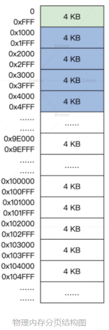
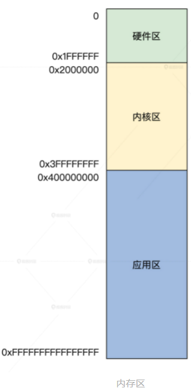

<!-- toc -->
本节包括内存的划分方式和内存页的表示、组织问题，并设计好数据结构。  
- [总结](#总结)
- [分段和分页](#分段和分页)
- [如何表示一个页](#如何表示一个页)
- [内存区](#内存区)
    - [硬件区](#硬件区)
    - [内核区](#内核区)
    - [应用区](#应用区)
- [组织内存页](#组织内存页)
<!-- tocstop -->

# 总结
memarea_t ，进行内存区，解决功能分区的问题  
-> memdivmer_t ，进行内存分割合并管理  
-> bafhlst_t，以2的n次方对内存页面进行分组  
-> msadsc_t，解决单一页面管理问题  

# 分段和分页
从内存管理角度，理一理分段与分页的问题  
1. 表示方式和状态确定角度  
- 段的长度大小不一，用什么数据结构表示一个段，如何确定一个段已经分配还是空闲呢？  
- 而页的大小固定，我们只需用位图就能表示页的分配与释放。比方说，位图（bitmap）中第 1 位为 1，表示第一个页已经分配；位图中第 2 位为 0，表示第二个页是空闲，每个页的开始地址和大小都是固定的。  
2. 从内存碎片的利用看  
由于段的长度大小不一，更容易产生内存碎片，例如内存中有 A 段（内存地址：0～5000）、 B 段（内存地址：5001～8000）、C 段（内存地址：8001～9000），这时释放了 B 段，然后需要给 D 段分配内存空间，且 D 段长度为 5000。但是会发现 A 段和 C 段之间的空间（B 段）不能满足，只能从 C 段之后的内存空间开始分配，随着程序运行，这些情况会越来越多。段与段之间存在着不大不小的空闲空间，内存总的空闲空间很多，但是放不下一个新段。  
而页的大小固定，分配最小单位是页，页也会产生碎片，比如我需要请求分配 4 个页，但在内存中从第 1～3 个页是空闲的，第 4 个页是分配出去了，第 5 个页是空闲的。这种情况下，我们通过修改页表的方式，就能让连续的虚拟页面映射到非连续的物理页面。  
```
分页的内存碎片问题

假设一个分页系统有4个物理页面，每个页面的大小是4KB。现在有一个进程需要加载5个虚拟页面，每个页面大小也是4KB。由于物理页面只有4个，因此只能将其中4个虚拟页面映射到物理页面中，另一个虚拟页面无法加载。假设这个进程需要访问这5个虚拟页面中的任意一个，就需要将当前物理页面中的一个页面卸载，然后将需要访问的虚拟页面加载到该物理页面中。

如果这个过程不断重复，就会导致物理内存中出现不连续的空闲页面。例如，当一个物理页面被卸载时，可能会导致两个相邻的物理页面中间出现一个空闲页面。这种空闲页面就被称为外部碎片。

如果外部碎片过多，就会影响系统性能。因为当一个进程需要加载一个大的虚拟页面时，可能无法找到足够连续的物理页面来映射这个虚拟页面，导致进程无法执行。因此，操作系统需要采取一些策略来减少外部碎片的数量，例如使用内存压缩技术、内存合并技术等等。
```
3. 从内存和硬盘的数据交换效率来看  
当内存不足时，操作系统希望把内存中的一部分数据写回硬盘，来释放内存。这就涉及到内存和硬盘交换数据，交换单位是段还是页？  
如果是段的话，其大小不一，A 段有 50MB，B 段有 1KB，A、B 段写回硬盘的时间也不同，有的段需要时间长，有的段需要时间短，硬盘的空间分配也会有上面第二点同样的问题，这样会导致系统性能抖动。  
如果每次交换一个页，则没有这些问题。另外段最大的问题是使得虚拟内存地址空间，难于实施。  

我们用 4KB 作为页大小，这也正好对应 x86 CPU 长模式下 MMU 4KB 的分页方式。

# 如何表示一个页
我们使用分页模型来管理内存。首先是把物理内存空间分成 4KB 大小页，这页表示从地址 x 开始到 x+0xFFF 这一段的物理内存空间，x 必须是 0x1000 对齐的。这一段 x+0xFFF 的内存空间，称为内存页。  
  
这是一个接近真实机器的情况，不过一定不要忘记前面的内存布局示图，真实的物理内存地址空间不是连续的，这中间可能有空洞，可能是显存，也可能是外设的寄存器。  
```
内存空洞（Memory Hole）通常指的是内存中未被使用的一些地址空间，这些地址空间可能存在于某些特殊的硬件设备映射的地址空间，或者存在于已经被释放的内存块之间。这些未被使用的地址空间可能会对内存管理造成一些问题，例如导致内存碎片化、降低内存利用率等等。

显存（Video Memory）是一种专门用于图形显示的内存，也被称为显存或显存储器。它通常是一种高速的RAM（随机存储器），用于存储计算机图形卡的图像缓存。显存中存储的是显示器显示的像素点的数据，显存的大小和速度对图形显示的清晰度和流畅度有重要影响。一般来说，显存的大小和性能越高，图形显示的效果就越好。

外设的寄存器通常不是存储在内存中，而是直接映射到计算机的地址空间中。这种地址映射方式被称为内存映射（Memory-Mapped I/O）。在内存映射I/O中，外设的寄存器被看作是一块内存区域，可以通过访问内存地址的方式来读写这些寄存器。计算机将外设的寄存器地址映射到内存中的特定地址范围内，然后通过对这些内存地址的读写操作来控制外设的行为。内存映射I/O具有简单、灵活、高效的特点，因此被广泛应用于各种外设控制器中，例如磁盘控制器、显卡、网卡等。通过内存映射I/O方式，计算机可以直接访问外设寄存器，而不需要进行特殊的I/O指令调用，这可以大大简化外设控制的实现。
```
真正的物理内存空间布局信息来源于 e820map_t 结构数组，之前的初始化中，我们已经将其转换成 phymmarge_t 结构数组了，由 kmachbsp->mb_e820expadr 指向。  

**那么如何表示一个页呢?**  
你可能会想到位图或者整型变量数组，用其中一个位代表一个页，位值为 0 时表示页空闲，位值为 1 时表示页已分配；或者用整型数组中一个元素表示一个页，用具体数组元素的数值代表页的状态。如果这样的话，分配、释放内存页的算法就确定了，就是扫描位图或者扫描数组。这样确实可以做出最简单的内存页管理器，但这也是最低效的。  
低效是因为我们仅仅只是保存了内存页的空闲和已分配的信息，这是不够的。我们的 HuOS 当然不能这么做，我们需要页的状态、页的地址、页的分配记数、页的类型、页的链表，这些信息可以用一个 C 语言结构体封装起来。  
```
HuOS/include/halinc/msadsc_t.h

//内存空间地址描述符标志
typedef struct s_MSADFLGS
{
    u32_t mf_olkty:2;    //挂入链表的类型
    u32_t mf_lstty:1;    //是否挂入链表
    u32_t mf_mocty:2;    //分配类型，被谁占用了，内核还是应用或者空闲
    u32_t mf_marty:3;    //属于哪个区
    u32_t mf_uindx:24;   //分配计数  
}__attribute__((packed)) msadflgs_t; //描述msadsc_t结构体本身

//物理地址和标志  
typedef struct s_PHYADRFLGS
{
    u64_t paf_alloc:1;     //分配位
    u64_t paf_shared:1;    //共享位
    u64_t paf_swap:1;      //交换位
    u64_t paf_cache:1;     //缓存位
    u64_t paf_kmap:1;      //映射位
    u64_t paf_lock:1;      //锁定位
    u64_t paf_dirty:1;     //脏位
    u64_t paf_busy:1;      //忙位
    u64_t paf_rv2:4;       //保留位  //低12位
    u64_t paf_padrs:52;    //页物理地址位
}__attribute__((packed)) phyadrflgs_t;

//内存空间地址描述符
typedef struct s_MSADSC
{
    list_h_t md_list;           //链表
    spinlock_t md_lock;         //保护自身的自旋锁
    msadflgs_t md_indxflgs;     //内存空间地址描述符标志
    phyadrflgs_t md_phyadrs;    //物理地址和标志
    void* md_odlink;            //相邻且相同大小msadsc的指针
}__attribute__((packed)) msadsc_t;
```
代码解析:  
使用__attribute__((packed))可以取消对齐操作，这样可以减少存储结构体或联合体所需的空间。这个指令在某些特定情况下非常有用，例如在需要和外部设备进行通信的程序中，需要使用特定的数据格式，这时对齐操作可能会影响通信协议的正确性，因此需要使用__attribute__((packed))来禁止对齐。需要注意的是，取消对齐操作可能会导致性能上的损失，因为访问不对齐的变量可能需要进行额外的操作。另外，使用__attribute__((packed))也可能会导致一些移植性问题，因为不同编译器对于取消对齐操作的支持可能会有所差异。  
msadsc_t 结构看似很大，实则很小，也必须要小，因为它表示一个页面，物理内存页有多少就需要有多少个 msadsc_t 结构。正是因为页面地址总是按 4KB 对齐，所以 phyadrflgs_t 结构的低 12 位才可以另作它用。  
msadsc_t 结构里的链表，可以方便它挂入到其他数据结构中。除了分配计数，msadflgs_t 结构中的其他部分都是用来描述 msadsc_t 结构本身信息的。  
这里链表是用来连接多个 msadsc_t 结构体的，构成一个链表。msadsc_t 结构体是用来描述内存空间的地址、状态和使用情况的，每个结构体包含一个指向下一个 msadsc_t 结构体的指针，通过这些指针将多个 msadsc_t 结构体串联在一起，形成一个链表。  

# 内存区
HuOS 的内存管理器不仅仅是将内存划分成页面，还会把多个页面分成几个内存区。内存区和内存页不同，内存区只是一个逻辑上的概念，并不是硬件上必需的，就是说就算没有内存区，也毫不影响硬件正常工作；但是没有内存页是绝对不行的。  
物理内存分成三个区，分别为硬件区，内核区，应用区  
  
## 硬件区
它占用物理内存低端区域，地址区间为 0~32MB。从名字就能看出来，这个内存区域是给硬件使用的。  
```
我们不是使用虚拟地址吗？虚拟地址不是和物理地址无关吗？
一个虚拟地址可以映射到任一合法的物理地址。  
```
虚拟地址主要依赖于 CPU 中的 MMU，但有很多外部硬件能直接和内存交换数据，常见的有 DMA，并且它只能访问低于 24MB 的物理内存。这就导致了我们很多内存页不能随便分配给这些设备，但是我们只要规定硬件区分配内存页就好，这就是硬件区的作用。  
外部设备直接访问内存时，它无法从MMU的视角出发用虚拟地址去访问，而访问的地址又局限于低端地址范围，所以干脆把系统的低端地址范围保留给这样的外部设备使用。  
## 内核区
内核也要使用内存，但是内核同样也是运行在虚拟地址空间，就需要有一段物理内存空间和内核的虚拟地址空间是线性映射关系。  
很多时候，内核使用内存需要大的、且连续的物理内存空间，比如一个进程的内核栈要 16KB 连续的物理内存、显卡驱动可能需要更大的连续物理内存来存放图形图像数据。这时, 我们就需要在这个内核区中分配内存了。  
## 应用区
这个区域主是给应用用户态程序使用。应用程序使用虚拟地址空间，一开始并不会为应用一次性分配完所需的所有物理内存，而是按需分配，即应用用到一页就分配一个页。  
如果访问到一个没有与物理内存页建立映射关系的虚拟内存页，这时候 CPU 就会产生缺页异常。最终这个缺页异常由操作系统处理，操作系统会分配一个物理内存页，并建好映射关系。  
这是因为这种情况往往分配的是单个页面，所以为了给单个页面提供快捷的内存请求服务，就需要把离散的单页、或者是内核自身需要建好页表才可以访问的页面，统统收归到用户区。  
```
进程的内核栈（Kernel Stack）是操作系统内核为进程分配的一块内存区域，用于存储进程在内核态下执行时所需的数据和上下文信息。

在进程从用户态切换到内核态时，操作系统会为进程分配一个内核栈，用于保存当前进程的状态和数据，以便在处理完中断或系统调用后，能够恢复到进程原来的执行状态。在内核栈中，存储着当前进程的堆栈帧，包括函数的返回地址、参数、局部变量等数据。每个进程都有自己的内核栈，保证了进程之间的隔离。

当进程执行系统调用或中断服务例程时，CPU会将当前进程的上下文信息（如寄存器状态、程序计数器等）保存到内核栈中，然后切换到内核模式，执行相应的中断服务例程或系统调用处理程序。处理完成后，CPU会从内核栈中恢复进程的上下文信息，继续执行进程的代码。
```
---
Then如何表示一个内存区呢？  
和先前物理内存页面一样，我们需要定义一个数据结构，来表示一个内存区的开始地址和结束地址，里面有多少个物理页面，已经分配了多少个物理页面，剩下多少等等。  
```
#define MA_TYPE_HWAD 1
#define MA_TYPE_KRNL 2
#define MA_TYPE_PROC 3
#define MA_HWAD_LSTART 0
#define MA_HWAD_LSZ 0x2000000
#define MA_HWAD_LEND (MA_HWAD_LSTART+MA_HWAD_LSZ-1)
#define MA_KRNL_LSTART 0x2000000
#define MA_KRNL_LSZ (0x40000000-0x2000000)
#define MA_KRNL_LEND (MA_KRNL_LSTART+MA_KRNL_LSZ-1)
#define MA_PROC_LSTART 0x40000000
#define MA_PROC_LSZ (0xffffffff-0x40000000)
#define MA_PROC_LEND (MA_PROC_LSTART+MA_PROC_LSZ)

typedef struct s_MEMAREA
{
    list_h_t ma_list;             //内存区自身的链表
    spinlock_t ma_lock;           //保护内存区的自旋锁
    uint_t ma_stus;               //内存区的状态
    uint_t ma_flgs;               //内存区的标志 
    uint_t ma_type;               //内存区的类型
    sem_t ma_sem;                 //内存区的信号量
    wait_l_head_t ma_waitlst;     //内存区的等待队列
    uint_t ma_maxpages;           //内存区总的页面数
    uint_t ma_allocpages;         //内存区分配的页面数
    uint_t ma_freepages;          //内存区空闲的页面数
    uint_t ma_resvpages;          //内存区保留的页面数
    uint_t ma_horizline;          //内存区分配时的水位线
    adr_t ma_logicstart;          //内存区开始地址
    adr_t ma_logicend;            //内存区结束地址
    uint_t ma_logicsz;            //内存区大小
    //还有一些结构我们这里不关心。后面才会用到
}memarea_t；
```
但是这仍然不能让我们高效地分配内存，因为我们没有把内存区数据结构和内存页面数据结构关联起来，如果我们现在要分配内存页依然要遍历扫描 msadsc_t 结构数组，这和扫描位图没有本质的区别

# 组织内存页
按照我们之前对 msadsc_t 结构的定义，组织内存页就是组织 msadsc_t 结构，而 msadsc_t 结构中就有一个链表，我们组织 msadsc_t 结构正是通过另一个数据结构中的链表，将 msadsc_t 结构串连在其中的。  
**如果仅仅是这样，那我们将扫描这个链表，而这和之前扫描 msadsc_t 结构数组没有任何区别。**  
为了更加科学合理地组织 msadsc_t 结构，下面来定义一个挂载 msadsc_t 结构的数据结构，它其中需要锁、状态、msadsc_t 结构数量，挂载 msadsc_t 结构的链表、和一些统计数据。  
```
typedef struct s_BAFHLST
{
    spinlock_t af_lock;    //保护自身结构的自旋锁
    u32_t af_stus;         //状态 
    uint_t af_oder;        //页面数的位移量
    uint_t af_oderpnr;     //oder对应的页面数比如 oder为2那就是1<<2=4
    uint_t af_fobjnr;      //多少个空闲msadsc_t结构，即空闲页面
    uint_t af_mobjnr;      //此结构的msadsc_t结构总数，即此结构总页面
    uint_t af_alcindx;     //此结构的分配计数
    uint_t af_freindx;     //此结构的释放计数
    list_h_t af_frelst;    //挂载此结构的空闲msadsc_t结构
    list_h_t af_alclst;    //挂载此结构已经分配的msadsc_t结构
}bafhlst_t;
```
af_oder表示页面数的位移量，af_oderpnr表示af_oder对应的页面数。例如，如果af_oder的值为2，则af_oderpnr的值为4，因为2的二进制表示为10，左移两位后变成100，即4。这个字段的目的是方便计算出空闲页面的数量。  
有了 bafhlst_t 数据结构，我们只是有了挂载 msadsc_t 结构的地方，这并没有做到科学合理。  
但是，如果我们把多个 bafhlst_t 数据结构组织起来，形成一个 bafhlst_t 结构数组，并且把这个 bafhlst_t 结构数组放在一个更高的数据结构中，这个数据结构就是内存分割合并数据结构——memdivmer_t，那情况就不一样了。  
```
#define MDIVMER_ARR_LMAX 52
typedef struct s_MEMDIVMER
{
    spinlock_t dm_lock;      //保护自身结构的自旋锁
    u32_t dm_stus;           //状态
    uint_t dm_divnr;         //内存分割/配次数
    uint_t dm_mernr;         //内存合并次数
    bafhlst_t dm_mdmlielst[MDIVMER_ARR_LMAX]; //bafhlst_t结构数组
    bafhlst_t dm_onemsalst;  //单个的bafhlst_t结构
}memdivmer_t;
```
**内存不是只有两个标准操作吗，这里我们为什么要用分割和合并呢？**  
这其实取意于我们的内存分配、释放算法，对这个算法而言分配内存就是分割内存，而释放内存就是合并内存。  

如果 memdivmer_t 结构中 dm_mdmlielst 数组只是一个数组，那是没有意义的。我们正是要通过 dm_mdmlielst 数组，来划分物理内存地址不连续的 msadsc_t 结构。dm_mdmlielst 数组中第 0 个元素挂载单个 msadsc_t 结构，它们的物理内存地址可能对应于 0x1000，0x3000，0x5000。dm_mdmlielst 数组中第 1 个元素挂载两个连续的 msadsc_t 结构，它们的物理内存地址可能对应于0x8000～0x9FFF，0xA000～0xBFFF；dm_mdmlielst 数组中第 2 个元素挂载 4 个连续的 msadsc_t 结构，它们的物理内存地址可能对应于 0x100000～0x103FFF，0x104000～0x107FFF……  

依次类推，dm_mdmlielst 数组挂载连续 msadsc_t 结构的数量等于用 1 左移其数组下标，如数组下标为 3，那结果就是 8（1<<3）个连续的 msadsc_t 结构我们并不在意其中第一个 msadsc_t 结构对应的内存物理地址从哪里开始，**但是第一个 msadsc_t 结构与最后一个 msadsc_t 结构，它们之间的内存物理地址是连续的。**  
  
为了适应不同的物理地址空间的要求，比如有些设备需要低端的物理地址，而有的需要大而连续地址空间，我们对内存进行分区，设计了 memarea_t 结构。  
**每个 memarea_t 结构表示一个内存区，memarea_t 结构中包含一个内存分割合并 memdivmer_t 结构，而在 memdivmer_t 结构中又包含了 bafhlst_t 结构类型 dm_mdmlielst 数组。在 dm_mdmlielst 数组中挂载了多个 msadsc_t 结构。**  

