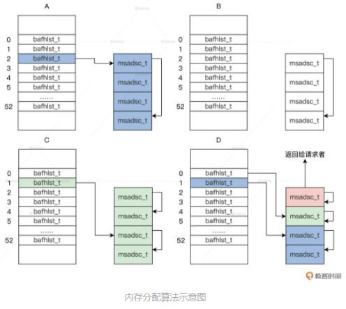
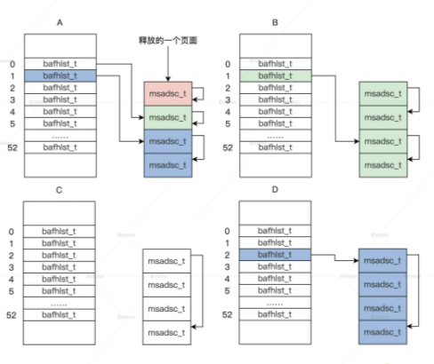

<!-- toc -->
- [总结](#总结)
- [内存页分配](#内存页的分配)
- [内存页的释放](#内存页的释放)
<!-- tocstop -->

# 总结
一、再梳理一下内存结构  
1. 内存memmgrob_t被划分为多个功能分区，每个功能分区用一个memarea_t描述
2. 每个memarea_t都有一个memdivmer_t ，每个memdivmer_t 都有一个bafhlst_t数组[0-51]
3. 每个bafhlst_t都有一个链表，用于存放内存段，规则为：  
bafhlst_t数组中的每个bafhlst_t，会根据其在数组中的序号n，存放全部2的n次方的连续页面，也就是说：  
第0个bafhlst_t，存放全部长度为1的内存段  
第1个bafhlst_t，存放全部长度为2的内存段  
第2个bafhlst_t，存放全部长度为4的内存段  
......
4. 在内存段处理(内存段进行分配、释放、访问和保护等操作)时，将开始的msadsc_t指向了最后msadsc_t结构，内存段的起止就都清晰了，而且无论首尾，都记录了分配情况，方便各类操作
5. 所以从设计层面来讲，页面的分配和释放，也一定只会是2的n次方大小

二、申请  
1. 根据类型找到内存区，也就是定位到了memarea_t->memdivmer_t->bafhlst_t数组
2. 根据申请内存大小，用二进制1的查找，确定要至少要从bafhlst_t数组中的哪个bafhlst_t申请，才能得到足够大的内存
3. 从第一个合适的bafhlst_t到最大的bafhlst_t，依次判断链表中有没有可用内存段，一旦有可用的内存段就使用
4. 如果内存段大于所需，就要把多出来的内存不断除以2挂载到上一个bafhlst_t，直到达到所需长度
5. 设置内存段状态，起始msadsc_t都标记为已占用
6. 更新各层结构相关信息，内存申请结束
7. 代码中还有各种加锁解锁，各种校验，还有从大到小申请的一种方式，可以看下

三、释放  
1. 根据要释放内存段的msadsc_t，获取属于哪个内存区，也就是定位到了memarea_t->memdivmer_t->bafhlst_t数组
2. 根据释放内存大小，用二进制1的查找，确定最大可以释放到bafhlst_t数组中的哪个bafhlst_t，避免内存碎片化
3. 设置内存段状态，起始msadsc_t都标记为未使用
4. 从找到的第一个bafhlst_t到最大的bafhlst_t，依次去看链表中有没有内存段是挨着的，如果有就合并，再去下一个bafhlst_t继续合并  
一旦某个bafhlst_t中没能合并，就可以退出了，因为我们只存2的n次方大小的内存段  
而且每次合并内存段后，都要清理多余的标记，而且开始的msadsc_t要指向最后的msadsc_t  
5. 把最终合并后的内存段，加入到对应的bafhlst_t中，重新设置内存段的起始msadsc_t标记
6. 更新好各层结构相关信息，内存释放结束
7. 代码中还有各种加锁解锁，各种校验，可以看下

四、在内存页面分配过程中，是怎样尽可能保证内存页面连续的呢？  
其实无论采用哪种分配方式，内存的碎片化都是难以彻底避免的。无论是操作系统、虚拟机还是应用，都要面对这个问题。业界有多种思路来解决或缓解此问题：  
1. 把不可移动内存单独管理，系统内存分区其实在一定程度上解决了这些问题
2. linux采用了 buddy system来缓解内存碎片问题，本节已经介绍
3. linux中为了处理特别小的内存请求，引入了slab技术，来辅助buddy system
4. windows有一种LFH技术，在程序启动时，会额外分配一定的连续内存给这个进程备用，从而降低系统层面的内存管理负担
5. windows在进程退出后，不会立即释放dll文件相关内存，一方面提速，一方面也缓解了操作系统内存管理负担。其实，看下你手机的APP，切换到后台时，就是这个效果
6. 无论是linux还是windows都有低优先级进程，在后台默默做着内存规整工作，类似于磁盘碎片清理
7. JVM虚拟机，GC时会通过标记-整理（比如CMS）或复制-清除（比如G1）的方法来解决部分碎片问题
8. 类似LFH，可以考虑在内存分配时额外预留一部分，下次分配在预留的地方继续分配
```
LFH全称为Low Fragmentation Heap，是Windows操作系统中的一种内存管理机制，旨在优化大量小块内存的分配和释放操作，以减少内存碎片的产生和提高系统性能。

LFH机制通过将内存分配块按照大小进行分类，然后将它们放入不同的堆中，对不同大小的内存请求分别进行处理，避免了内存分配时出现过多的碎片。LFH内存分配器会分配一定大小的内存池，并将内存池中的内存分配为不同大小的块，将空闲块维护在链表中，当应用程序申请一块内存时，会从对应大小的内存池中取出一个块，如果该块已被使用，则再取下一个块，避免了内存碎片的产生。

在应用程序执行过程中，LFH机制会动态地调整内存池的大小和块的数量，以适应应用程序的内存使用情况。当一个堆被分配了大量的小块时，LFH会通过调整内存池的大小来降低内存碎片的产生，提高内存的利用率。

总的来说，LFH机制在Windows操作系统中是一种非常重要的内存管理机制，它通过优化内存分配和释放操作，减少了内存碎片的产生，提高了系统的性能和稳定性。
```
9. 为了内存规整方便，可以考虑靠近应用已分配内存区域进行分配
10. 还有一种思路，就是将不连续的内存，转换为逻辑上连续的内存，来绕过碎片化问题，但一些情况下性能难以保证

应用层面也有工作能做：  
1. 比如redis在处理内存的时候，申请时会额外申请一部分先备着【记得是jemalloc】，释放时也不会立即释放，有单独的线程进行处理，在应用层面去降低系统内存管理负担
2. 同时，redis在数据结构上也做了很多努力
3. 在写程序的时候，尽量不要零零散散的去申请大量小内存；
4. 除了标准库以外，可以试一下 jemalloc或Doug Lea's malloc
5. 感兴趣可以看下redis内存管理的代码

# 内存页的分配
如果让你实现一次只分配一个页面，我相信这个问题很好解决，因为你只需要写一段循环代码，在其中遍历出一个空闲的 msadsc_t 结构，就可以返回了。  
**但是我们内存管理器要为内核、驱动，还有应用提供服务，它们对请求内存页面的多少、内存页面是不是连续，内存页面所处的物理地址都有要求。**  
TLB就是把虚拟内存页面与物理内存页面的转换结果存起来，不用每次都用MMU作转换。  
从内存分配的接口函数开始

_TLB和MMU的区别_  
都是处理器中用于管理虚拟内存和物理内存之间映射的硬件单元，它们的作用是优化虚拟内存的访问速度。  
1. 功能不同：TLB是一个高速缓存，用于存储虚拟地址和物理地址之间的映射关系，以减少从主存中读取页表的次数。而MMU则是负责管理虚拟地址到物理地址的转换，并确保访问的内存地址不越界。
2. 所处位置不同：TLB是CPU内部的一个硬件单元，用于加速地址转换过程，位于CPU芯片内部；而MMU通常是一个独立的硬件模块，与CPU相连，它位于CPU和内存之间。
3. 响应速度不同：TLB是CPU内部的一个高速缓存，可以快速响应地址转换请求；而MMU需要访问内存中的页表，因此响应速度较慢。
4. 处理的粒度不同：TLB通常处理页级别的映射，即将虚拟地址映射到物理地址的页帧；而MMU可以处理更细粒度的地址映射，如将虚拟地址映射到具体的物理地址。  
```c
HuOS/hal/x86/memdivmer.c

//内存分配页面框架函数
/*
mmobjp->内存管理数据结构指针
pages->请求分配的内存页面数
retrelpnr->存放实际分配内存页面数的指针 
mrtype->请求的分配内存页面的内存区类型 
flgs->请求分配的内存页面的标志位
*/
msadsc_t *mm_divpages_fmwk(memmgrob_t *mmobjp, uint_t pages, uint_t *retrelpnr, uint_t mrtype, uint_t flgs)
{
    //返回mrtype对应的内存区结构的指针
    memarea_t *marea = onmrtype_retn_marea(mmobjp, mrtype);
    if (NULL == marea)
    {
        *retrelpnr = 0;
        return NULL;
    }
    uint_t retpnr = 0;
    //内存分配的核心函数
    msadsc_t *retmsa = mm_divpages_core(marea, pages, &retpnr, flgs);
    if (NULL == retmsa)
    {
        *retrelpnr = 0;
        return NULL;
    }
    *retrelpnr = retpnr;
    return retmsa;
}

//内存分配页面接口
//mmobjp->内存管理数据结构指针
//pages->请求分配的内存页面数
//retrealpnr->存放实际分配内存页面数的指针
//mrtype->请求的分配内存页面的内存区类型
//flgs->请求分配的内存页面的标志位
//retmsa 一个 msadsc_t 结构的指针，如果是多个页面返回的就是起始页面对应的 msadsc_t 结构的指针
msadsc_t *mm_division_pages(memmgrob_t *mmobjp, uint_t pages, uint_t *retrealpnr, uint_t mrtype, uint_t flgs)
{
    if (NULL == mmobjp || NULL == retrealpnr || 0 == mrtype)
    {
        return NULL;
    }
    uint_t retpnr = 0;
    msadsc_t *retmsa = mm_divpages_fmwk(mmobjp, pages, &retpnr, mrtype, flgs);
    if (NULL == retmsa)
    {
        *retrealpnr = 0;
        return NULL;
    }
    *retrealpnr = retpnr;
    return retmsa;
}
```
接口函数调用框架函数，框架函数调用核心函数。可以发现，这个接口函数返回的是一个 msadsc_t 结构的指针，如果是多个页面返回的就是起始页面对应的 msadsc_t 结构的指针。  
```
为什么不直接返回内存的物理地址呢？
因为我们物理内存管理器是最底层的内存管理器，而上层代码中可能需要页面的相关信息，所以直接返回页面对应 msadsc_t 结构的指针。  
```  
还有一个参数(retrealpnr)是用于返回实际分配的页面数的。比如，内核功能代码请求分配三个页面，我们的内存管理器不能分配三个页面，只能分配两个或四个页面，这时内存管理器就会分配四个页面返回，retrealpnr 指向的变量中就存放数字 4，表示实际分配页面的数量。  
下面来实现内存分配的核心函数
```c
//根据页面数在内存区的m_mdmlielst数组中找出其中请求分配页面的bafhlst_t结构（retrelbhl）和实际要在其中分配页面的bafhlst_t结构(retdivbhl)
//mmobjp->内存管理数据结构指针 
//pages->请求分配的内存页面数 
//retrealpnr->存放实际分配内存页面数的指针 
//mrtype->请求的分配内存页面的内存区类型 
//flgs->请求分配的内存页面的标志位
bool_t onmpgs_retn_bafhlst(memarea_t *malckp, uint_t pages, bafhlst_t **retrelbafh, bafhlst_t **retdivbafh)
{
    //获取bafhlst_t结构数组的开始地址
    bafhlst_t *bafhstat = malckp->ma_mdmdata.dm_mdmlielst;       
    //根据分配页面数计算出分配页面在dm_mdmlielst数组中下标
    sint_t dividx = retn_divoder(pages);
    //从第dividx个数组元素开始搜索
    for (sint_t idx = dividx; idx < MDIVMER_ARR_LMAX; idx++)
    {
    //如果第idx个数组元素对应的一次可分配连续的页面数大于等于请求的页面数，且其中的可分配对象大于0则返回 
        if (bafhstat[idx].af_oderpnr >= pages && 0 < bafhstat[idx].af_fobjnr)
        {
            //返回请求分配的bafhlst_t结构指针
            *retrelbafh = &bafhstat[dividx];
            //返回实际分配的bafhlst_t结构指针
            *retdivbafh = &bafhstat[idx];
            return TRUE;
        }
    }
    *retrelbafh = NULL;
    *retdivbafh = NULL;
    return FALSE;
}

//分配内存
//retrealpnr->存放实际分配内存页面数的指针
msadsc_t *mm_reldivpages_onmarea(memarea_t *malckp, uint_t pages, uint_t *retrelpnr)
{
    bafhlst_t *retrelbhl = NULL, *retdivbhl = NULL;
    //根据页面数在内存区的m_mdmlielst数组中找出其中请求分配页面的bafhlst_t结构（retrelbhl）和实际要在其中分配页面的bafhlst_t结构(retdivbhl)
    bool_t rets = onmpgs_retn_bafhlst(malckp, pages, &retrelbhl, &retdivbhl);
    if (FALSE == rets)
    {
        *retrelpnr = 0;
        return NULL;
    }
    uint_t retpnr = 0;
    //实际在bafhlst_t结构中分配页面
    msadsc_t *retmsa = mm_reldpgsdivmsa_bafhl(malckp, pages, &retpnr, retrelbhl, retdivbhl);
    if (NULL == retmsa)
    {
        *retrelpnr = 0;
        return NULL;
    }
    *retrelpnr = retpnr;
    return retmsa;
}

msadsc_t *mm_divpages_core(memarea_t *mareap, uint_t pages, uint_t *retrealpnr, uint_t flgs)
{
    uint_t retpnr = 0;
    msadsc_t *retmsa = NULL; 
    cpuflg_t cpuflg;
    //内存区加锁
    knl_spinlock_cli(&mareap->ma_lock, &cpuflg);
    if (DMF_RELDIV == flgs)
    {
        //分配内存
        retmsa = mm_reldivpages_onmarea(mareap, pages, &retpnr);
        goto ret_step;
    }
    retmsa = NULL;
    retpnr = 0;
ret_step:
    //内存区解锁
    knl_spinunlock_sti(&mareap->ma_lock, &cpuflg);
    *retrealpnr = retpnr;
    return retmsa;
}
```
onmpgs_retn_bafhlst 函数返回的两个 bafhlst_t 结构指针，若是相等的，则在 mm_reldpgsdivmsa_bafhl 函数中很容易处理，只要取出 bafhlst_t 结构中对应的 msadsc_t 结构返回就好了。  
很多时候它们不相等，这就要分隔连续的 msadsc_t 结构了，下面我们通过 mm_reldpgsdivmsa_bafhl 这个函数来处理这个问题  
```c
//把一段连续的msadsc_t结构加入到它所对应的bafhlst_t结构中
bool_t mrdmb_add_msa_bafh(bafhlst_t *bafhp, msadsc_t *msastat, msadsc_t *msaend)
{
    //把一段连续的msadsc_t结构加入到它所对应的bafhlst_t结构中
    msastat->md_indxflgs.mf_olkty = MF_OLKTY_ODER;
    msastat->md_odlink = msaend;
    msaend->md_indxflgs.mf_olkty = MF_OLKTY_BAFH;
    msaend->md_odlink = bafhp;
    list_add(&msastat->md_list, &bafhp->af_frelst);
    bafhp->af_mobjnr++;
    bafhp->af_fobjnr++;
    return TRUE;
}

//设置msadsc_t结构的相关信息表示已经删除
msadsc_t *mm_divpages_opmsadsc(msadsc_t *msastat, uint_t mnr)
{   
    //单个msadsc_t结构的情况 
    if (mend == msastat)
    {//增加msadsc_t结构中分配计数，分配标志位设置为1
        msastat->md_indxflgs.mf_uindx++;
        msastat->md_phyadrs.paf_alloc = PAF_ALLOC;
        msastat->md_indxflgs.mf_olkty = MF_OLKTY_ODER;
        msastat->md_odlink = mend;
        return msastat;
    }
    msastat->md_indxflgs.mf_uindx++;
    msastat->md_phyadrs.paf_alloc = PAF_ALLOC;
    //多个msadsc_t结构的情况下，末端msadsc_t结构也设置已分配状态
    mend->md_indxflgs.mf_uindx++;
    mend->md_phyadrs.paf_alloc = PAF_ALLOC;
    msastat->md_indxflgs.mf_olkty = MF_OLKTY_ODER;
    msastat->md_odlink = mend;
    return msastat;
}

//从bafhlst_t结构中获取msadsc_t结构的开始与结束地址
bool_t mm_retnmsaob_onbafhlst(bafhlst_t *bafhp, msadsc_t **retmstat, msadsc_t **retmend)
{
    //取出一个msadsc_t结构
    msadsc_t *tmp = list_entry(bafhp->af_frelst.next, msadsc_t, md_list);
    //从链表中删除
    list_del(&tmp->md_list);
    //减少bafhlst_t结构中的msadsc_t计数
    bafhp->af_mobjnr--;
    bafhp->af_fobjnr--;
    //返回msadsc_t结构
    *retmstat = tmp;
    //返回当前msadsc_t结构连续的那个结尾的msadsc_t结构 
    *retmend = (msadsc_t *)tmp->md_odlink;
    if (MF_OLKTY_BAFH == tmp->md_indxflgs.mf_olkty)
    {//如果只单个msadsc_t结构，那就是它本身 
        *retmend = tmp;
    }
    return TRUE;
}

//请求分配页面在bafhlst_t的位置（relbfl）；实际要在其中分配页面在bafhlst_t的位置(divbfl)
msadsc_t *mm_reldpgsdivmsa_bafhl(memarea_t *malckp, uint_t pages, uint_t *retrelpnr, bafhlst_t *relbfl, bafhlst_t *divbfl)
{
    msadsc_t *retmsa = NULL;
    bool_t rets = FALSE;
    msadsc_t *retmstat = NULL, *retmend = NULL;
    //处理相等的情况
    if (relbfl == divbfl)
    {
        //从bafhlst_t结构中获取msadsc_t结构的开始与结束地址
        rets = mm_retnmsaob_onbafhlst(relbfl, &retmstat, &retmend);
        //设置msadsc_t结构的相关信息表示已经删除
        retmsa = mm_divpages_opmsadsc(retmstat, relbfl->af_oderpnr);
        //返回实际的分配页数
        *retrelpnr = relbfl->af_oderpnr;
        return retmsa;
    }
    //处理不等的情况
    //从bafhlst_t结构中获取msadsc_t结构的开始与结束地址
    rets = mm_retnmsaob_onbafhlst(divbfl, &retmstat, &retmend);
    uint_t divnr = divbfl->af_oderpnr;
    //从高bafhlst_t数组元素中向下遍历
    for (bafhlst_t *tmpbfl = divbfl - 1; tmpbfl >= relbfl; tmpbfl--)
    {
        //开始分割连续的msadsc_t结构，把剩下的一段连续的msadsc_t结构加入到对应该bafhlst_t结构中
        if (mrdmb_add_msa_bafh(tmpbfl, &retmstat[tmpbfl->af_oderpnr], (msadsc_t *)retmstat->md_odlink) == FALSE)
        {
            system_error("mrdmb_add_msa_bafh fail\n");
        }
        retmstat->md_odlink = &retmstat[tmpbfl->af_oderpnr - 1];
        divnr -= tmpbfl->af_oderpnr;
    }

    retmsa = mm_divpages_opmsadsc(retmstat, divnr);
    if (NULL == retmsa)
    {
        *retrelpnr = 0;
        return NULL;
    }
    *retrelpnr = relbfl->af_oderpnr;
    return retmsa;
}
```
比如现在我们要分配一个页面，这个算法将执行如下步骤： 
1. 根据一个页面的请求，会返回 m_mdmlielst 数组中的第 0 个 bafhlst_t 结构。
2. 如果第 0 个 bafhlst_t 结构中有 msadsc_t 结构就直接返回，若没有 msadsc_t 结构，就会继续查找 m_mdmlielst 数组中的第 1 个 bafhlst_t 结构。
3. 如果第 1 个 bafhlst_t 结构中也没有 msadsc_t 结构，就会继续查找 m_mdmlielst 数组中的第 2 个 bafhlst_t 结构。
4. 如果第 2 个 bafhlst_t 结构中有 msadsc_t 结构，记住第 2 个 bafhlst_t 结构中对应是 4 个连续的 msadsc_t 结构。这时让这 4 个连续的 msadsc_t 结构从第 2 个 bafhlst_t 结构中脱离。
5. 把这 4 个连续的 msadsc_t 结构，对半分割成 2 个双 msadsc_t 结构，把其中一个双 msadsc_t 结构挂载到第 1 个 bafhlst_t 结构中。
6. 把剩下一个双 msadsc_t 结构，继续对半分割成两个单 msadsc_t 结构，把其中一个单 msadsc_t 结构挂载到第 0 个 bafhlst_t 结构中，剩下一个单 msadsc_t 结构返回给请求者，完成内存分配。  
  
## 内存页的释放
内存页的释放就是内存页分配的逆向过程。我们从内存页分配过程了解到，可以一次分配一个或者多个页面，那么释放内存页也必须支持一次释放一个或者多个页面。  
内存释放的接口函数和框架函数  
```c
HuOS/hal/x86/memdivmer.c

//释放内存页面核心
bool_t mm_merpages_core(memarea_t *marea, msadsc_t *freemsa, uint_t freepgs)
{
    bool_t rets = FALSE;
    cpuflg_t cpuflg;
    //内存区加锁
    knl_spinlock_cli(&marea->ma_lock, &cpuflg);
    //针对一个内存区进行操作
    rets = mm_merpages_onmarea(marea, freemsa, freepgs);
    //内存区解锁
    knl_spinunlock_sti(&marea->ma_lock, &cpuflg);
    return rets;
}

//释放内存页面框架函数
//内存区是由 msadsc_t 结构中获取的，因为之前该结构中保留了所在内存区的类型，所以可以查到并返回内存区。
bool_t mm_merpages_fmwk(memmgrob_t *mmobjp, msadsc_t *freemsa, uint_t freepgs)
{
    //获取要释放msadsc_t结构所在的内存区
    memarea_t *marea = onfrmsa_retn_marea(mmobjp, freemsa, freepgs);
    if (NULL == marea)
    {
        return FALSE;
    }
    //释放内存页面的核心函数
    bool_t rets = mm_merpages_core(marea, freemsa, freepgs);
    if (FALSE == rets)
    {
        return FALSE;
    }
    return rets;
}

//释放内存页面接口
//mmobjp->内存管理数据结构指针
//freemsa->释放内存页面对应的首个msadsc_t结构指针
//freepgs->请求释放的内存页面数
bool_t mm_merge_pages(memmgrob_t *mmobjp, msadsc_t *freemsa, uint_t freepgs)
{
    if (NULL == mmobjp || NULL == freemsa || 1 > freepgs)
    {
        return FALSE;
    }
    //调用释放内存页面的框架函数
    bool_t rets = mm_merpages_fmwk(mmobjp, freemsa, freepgs);
    if (FALSE == rets)
    {
        return FALSE;
    }
    return rets;
}
```
_结构依然是：接口函数调用框架函数，框架函数调用核心函数，函数的返回值都是 bool 类型，即 TRUE 或者 FALSE，来表示内存页面释放操作成功与否。_  
在释放内存页面的核心 mm_merpages_core 函数中，会调用 mm_merpages_onmarea 函数，针对一个内存区进行操作  
```c
//设置msadsc_t结构的信息，完成释放，返回1表示不需要下一步合并操作，返回2表示要进行合并操作
sint_t mm_merpages_opmsadsc(bafhlst_t *bafh, msadsc_t *freemsa, uint_t freepgs)
{
    msadsc_t *fmend = (msadsc_t *)freemsa->md_odlink;
    //处理只有一个单页的情况
    if (freemsa == fmend)
    {
        //页面的分配计数减1
        freemsa->md_indxflgs.mf_uindx--;
        if (0 < freemsa->md_indxflgs.mf_uindx)
        {
            //如果依然大于0说明它是共享页面 直接返回1指示不需要进行下一步操作
            return 1;
        }
        //设置页未分配的标志
        freemsa->md_phyadrs.paf_alloc = PAF_NO_ALLOC;
        freemsa->md_indxflgs.mf_olkty = MF_OLKTY_BAFH;
        freemsa->md_odlink = bafh;//指向所属的bafhlst_t结构
        //返回2指示需要进行下一步操作
        return 2;
    }
    //多个页面的起始页面和结束页面都要减一
    freemsa->md_indxflgs.mf_uindx--;
    fmend->md_indxflgs.mf_uindx--;
    //如果依然大于0说明它是共享页面 直接返回1指示不需要进行下一步操作
    if (0 < freemsa->md_indxflgs.mf_uindx)
    {
        return 1;
    }
    //设置起始、结束页页未分配的标志
    freemsa->md_phyadrs.paf_alloc = PAF_NO_ALLOC;
    fmend->md_phyadrs.paf_alloc = PAF_NO_ALLOC;
    freemsa->md_indxflgs.mf_olkty = MF_OLKTY_ODER;
    //起始页面指向结束页面
    freemsa->md_odlink = fmend;
    fmend->md_indxflgs.mf_olkty = MF_OLKTY_BAFH;
    //结束页面指向所属的bafhlst_t结构
    fmend->md_odlink = bafh;
    //返回2指示需要进行下一步操作
    return 2;
}

//根据freepgs返回请求释放的和最大释放的bafhlst_t结构指针
bool_t onfpgs_retn_bafhlst(memarea_t *malckp, uint_t freepgs, bafhlst_t **retrelbf, bafhlst_t **retmerbf)
{
    //获取bafhlst_t结构数组的开始地址
    bafhlst_t *bafhstat = malckp->ma_mdmdata.dm_mdmlielst;
    //根据分配页面数计算出分配页面在dm_mdmlielst数组中下标
    sint_t dividx = retn_divoder(freepgs);
    //返回请求释放的bafhlst_t结构指针
    *retrelbf = &bafhstat[dividx];
    //返回最大释放的bafhlst_t结构指针
    *retmerbf = &bafhstat[MDIVMER_ARR_LMAX - 1];
    return TRUE;
}

//针对一个内存区进行操作
//freemsa->释放内存页面对应的首个msadsc_t结构指针
//freepgs->请求释放的内存页面数
//返回请求释放的bafhlst_t结构指针 retrelbf  返回最大释放的bafhlst_t结构指针 retmerbf
bool_t mm_merpages_onmarea(memarea_t *malckp, msadsc_t *freemsa, uint_t freepgs)
{
    bafhlst_t *prcbf = NULL;
    sint_t pocs = 0;
    bafhlst_t *retrelbf = NULL, *retmerbf = NULL;
    bool_t rets = FALSE;
    //根据freepgs返回请求释放的和最大释放的bafhlst_t结构指针
    rets = onfpgs_retn_bafhlst(malckp, freepgs, &retrelbf, &retmerbf);
    //设置msadsc_t结构的信息，完成释放，返回1表示不需要下一步合并操作，返回2表示要进行合并操作
    sint_t mopms = mm_merpages_opmsadsc(retrelbf, freemsa, freepgs);
    if (2 == mopms)
    {
        //把msadsc_t结构进行合并然后加入对应bafhlst_t结构
        return mm_merpages_onbafhlst(freemsa, freepgs, retrelbf, retmerbf);
    }
    if (1 == mopms)
    {
        return TRUE;
    }
    return FALSE;
}
```
将 msadsc_t 结构加入到对应的 bafhlst_t 结构中其实是在下一个函数完成的，那就是 mm_merpages_onbafhlst 这个函数。  
```c
bool_t mpobf_add_msadsc(bafhlst_t *bafhp, msadsc_t *freemstat, msadsc_t *freemend)
{
    freemstat->md_indxflgs.mf_olkty = MF_OLKTY_ODER;
    //设置起始页面指向结束页
    freemstat->md_odlink = freemend;
    freemend->md_indxflgs.mf_olkty = MF_OLKTY_BAFH;
    //结束页面指向所属的bafhlst_t结构
    freemend->md_odlink = bafhp;
    //把起始页面挂载到所属的bafhlst_t结构中
    list_add(&freemstat->md_list, &bafhp->af_frelst);
    //增加bafhlst_t结构的空闲页面对象和总的页面对象的计数
    bafhp->af_fobjnr++;
    bafhp->af_mobjnr++;
    return TRUE;
}

//把msadsc_t结构进行合并然后加入对应bafhlst_t结构
//返回请求释放的bafhlst_t结构指针 relbf  返回最大释放的bafhlst_t结构指针 merbf
bool_t mm_merpages_onbafhlst(msadsc_t *freemsa, uint_t freepgs, bafhlst_t *relbf, bafhlst_t *merbf)
{
    sint_t rets = 0;
    msadsc_t *mnxs = freemsa, *mnxe = &freemsa[freepgs - 1];
    bafhlst_t *tmpbf = relbf;
    //从实际要开始遍历，直到最高的那个bafhlst_t结构
    for (; tmpbf < merbf; tmpbf++)
    {
        //查看最大地址连续、且空闲msadsc_t结构，如释放的是第0个msadsc_t结构我们就去查找第1个msadsc_t结构是否空闲，且与第0个msadsc_t结构的地址是不是连续的
        rets = mm_find_cmsa2blk(tmpbf, &mnxs, &mnxe);
        if (1 == rets)
        {
            break;
        }
    }
    //把合并的msadsc_t结构（从mnxs到mnxe）加入到对应的bafhlst_t结构中
    if (mpobf_add_msadsc(tmpbf, mnxs, mnxe) == FALSE)
    {
        return FALSE;
    }
    return TRUE;
}
```
整个释放页面逻辑，最核心的还是要对空闲页面进行合并，合并成更大的连续的内存页面，这是这个释放算法的核心逻辑。
比如，现在我们要释放一个页面，这个算法将执行如下步骤。  
1. 释放一个页面，会返回 m_mdmlielst 数组中的第 0 个 bafhlst_t 结构
2. 设置这个页面对应的 msadsc_t 结构的相关信息，表示已经执行了释放操作。
3. 开始查看第 0 个 bafhlst_t 结构中有没有空闲的 msadsc_t，并且它和要释放的 msadsc_t 对应的物理地址是连续的。没有则把这个释放的 msadsc_t 挂载第 0 个 bafhlst_t 结构中，算法结束，否则进入下一步。
4. 把第 0 个 bafhlst_t 结构中的 msadsc_t 结构拿出来与释放的 msadsc_t 结构，合并成 2 个连续且更大的 msadsc_t。
5. 继续查看第 1 个 bafhlst_t 结构中有没有空闲的 msadsc_t，而且这个空闲 msadsc_t 要和上一步合并的 2 个 msadsc_t 对应的物理地址是连续的。没有则把这个合并的 2 个 msadsc_t 挂载第 1 个 bafhlst_t 结构中，算法结束，否则进入下一步。
6. 把第 1 个 bafhlst_t 结构中的 2 个连续的 msadsc_t 结构，还有合并的 2 个地址连续的 msadsc_t 结构拿出来，合并成 4 个连续且更大的 msadsc_t 结构。
7. 继续查看第 2 个 bafhlst_t 结构，有没有空闲的 msadsc_t 结构，并且它要和上一步合并的 4 个 msadsc_t 结构对应的物理地址是连续的。没有则把这个合并的 4 个 msadsc_t 挂载第 2 个 bafhlst_t 结构中，算法结束。  



1. 我们实现了内存分配接口、框架、核心处理函数，其分配算法是：如果能在 dm_mdmlielst 数组中找到对应请求页面数的 msadsc_t 结构就直接返回，如果没有就寻找下一个 dm_mdmlielst 数组中元素，依次迭代直到最大的 dm_mdmlielst 数组元素，然后依次对半分割，直到分割到请求的页面数为止。  
2. 对应于内存释放过程，我们实现了释放页面的接口、框架、核心处理函数，其释放算法则是分配算法的逆向过程，会查找相邻且物理地址连续的 msadsc_t 结构，进行合并，合并工作也是迭代过程，直到合并到最大的连续 msadsc_t 结构或者后面不能合并为止，最后把这个合并到最大的连续 msadsc_t 结构，挂载到对应的 dm_mdmlielst 数组中。


