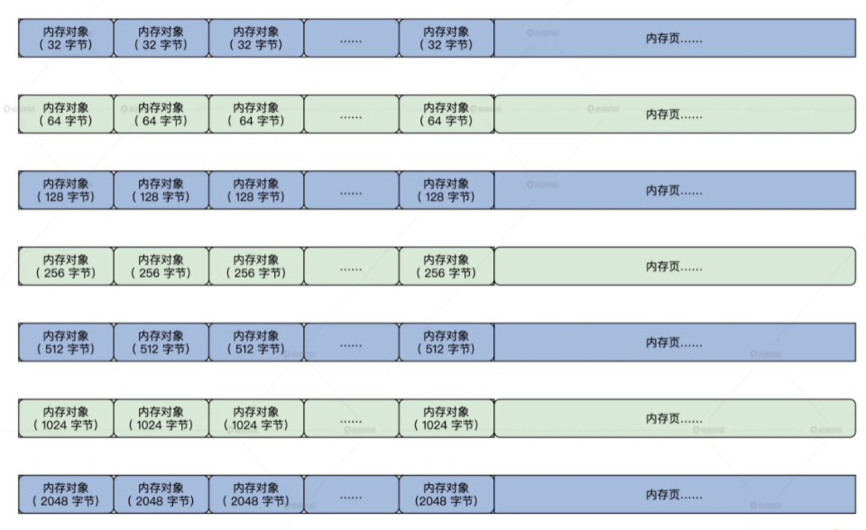

<!-- toc -->
管理内存对象
- [总结](#总结)
- [页的细分](#页的细分-内存对象)
- [如何表示一个内存对象](#如何表示一个内存对象)
- [内存对象容器 (如何放置内存对象)](#内存对象容器-如何放置内存对象)
- [初始化](#初始化)
- [分配内存对象](#分配内存对象)
    - [分配内存对象的接口](#分配内存对象的接口)
    - [查找内存对象容器](#查找内存对象容器)
    - [建立内存对象容器](#建立内存对象容器)
<!-- tocstop -->

# 总结
一、整理一下内存结构
1. memmgrob_t中有kmsobmgrhed_t
2. kmsobmgrhed_t中有一个koblst_t数组【KOBLST_MAX个】，序号为n的koblst_t，存储全部实际长度为长度为32*（n+1）内存对象
3. 每个koblst_t，都包括一个kmsob_t链表
4. kmsob_t结构如下：  
结构体描述部分【  
双向链表  
扩展结构链表【kmbext_t】  
空闲对象链表【freobjh_t】  
已分配对象链表【freobjh_t】  
占用内存页面管理结构【msomdc_t】  
kmsob_t结构体页面链表【so_mc.mc_kmobinlst】  
全部kmbext_t结构体页面链表【so_mc.mc_lst】  
结构体起止地址  
......  
】  
除结构体描述部分，都按相同大小划分为了内存对象【freobjh_t】  

5. 扩展管理kmbext_t，用于扩容  
结构体描述部分{  
双向链表  
结构体起止地址  
......  
}  
除结构体描述部分，都按相同大小划分为了内存对象【freobjh_t】  

6. 链表处理部分

二、分配内存
1. 从memmgrob_t获取kmsobmgrhed_t，也就找到了koblst_t数组
2. 根据申请内存对象大小，找到对应的koblst_t【第一个内存对象比需求大的koblst_t】
3. 如果koblst_t中没有找到kmsob_t，则要初始化  
    A、按页申请内存【1、2或4页】  
    B、进行kmsob_t初始化工作，首先初始化描述部分  
    C、将之后的空间，按固定大小全部初始化为freobjh_t结构  
    D、把全部freobjh_t挂载到koblst_t的空闲列表中  
    E、然后将kmsob_t挂载到koblst_t结构中去  

4. 在kmsob_t中分配内存对象  
4.1、首先判断kmsob_t是否有空闲对象可以分配  
4.2、如果没有空闲对象可以分配，则尝试扩容，创建新的kmbext_t：  
    A、申请内存【1、2或4页】  
    B、并进行初始化工作kmbext_t，首先初始化描述部分  
    C、将之后的空间，按固定大小全部初始化为freobjh_t结构  
    D、把内存页面记录到kmsob_t的页面列表中  
    E、把freobjh_t挂载到koblst_t的空闲列表中  
    F、把kmbext_t挂载到kmsob_t的扩展结构链表中  
4.3、最后返回一个空闲内存对象，并从空闲列表中移除  

5. 更新kmsobmgrhed_t结构的信息
6. 代码中还有各种加速，加锁解锁、校验代码

三、释放内存
1. 从memmgrob_t获取kmsobmgrhed_t，也就找到了koblst_t数组
2. 根据申请内存对象大小，找到对应的koblst_t【第一个内存对象比需求大的koblst_t】
3. 查找内存对象所属的kmsob_t结构  
对于koblst_t中的每一个kmsob_t结构：  
A、先检查内存对象的地址是否落在kmsob_t结构的地址区间  
B、然后依次检测内存对象的地址是否落在kmsob_t的各个kmbext_t扩展结构的地址区间  

4. 释放内存对象，也就是将内存对象添加到空闲列表中

5. 尝试销毁内存对象所在 kmsob_t结构  
4.1、首先判断该kmsob_t全部内存对象都已释放  
4.2、如果全部内存对象都已释放，则释放kmsob_t  
A、将kmsob_t脱链  
B、更新kmsobmgrhed_t结构的信息  
C、遍历释放kmsob_t中全部扩展结构占用的内存页面【先脱链，再释放】  
D、释放kmsob_t自身占用的全部页面【先脱链，再释放】  

6.代码中还有各种加速，加锁解锁、校验代码

# 页的细分 (内存对象)
我们已经建立了物理内存页面管理器，它既可以分配单个页面，也可以分配多个连续的页面，还能指定在特殊内存地址区域中分配页面。**内存中有大量小于一个页面的分配请求，会造成资源浪费**  
结合历史经验和硬件特性（Cache 行大小）来看，我们可以把一个页面或者连续的多个页面，分成 32 字节、64 字节、128 字节、256 字节、512 字节、1024 字节、2048 字节、4096 字节（一个页）。这些都是 Cache 行大小的倍数。我们给这些小块内存取个名字，叫**内存对象**。  
把一个或者多个内存页面分配出来，作为一个内存对象的容器  
在这个容器中容纳相同的内存对象，即同等大小的内存块。你可以把这个容器，想像成一个内存对象数组。  


# 如何表示一个内存对象
```c
//freobjh_t表示一个对象，而结构体中的链表是为了找到这个对象
typedef struct s_FREOBJH
{
    list_h_t oh_list;     //链表
    uint_t oh_stus;       //对象状态
    void* oh_stat;        //对象的开始地址
}freobjh_t;
```

# 内存对象容器 (如何放置内存对象)
为了把多个同等大小的内存对象放在一个内存对象容器中，我们需要设计出表示内存对象容器的数据结构。内存容器要占用内存页面，需要内存对象计数信息、内存对象大小信息，还要能扩展容量。  
```c
//管理内存对象容器占用的内存页面所对应的msadsc_t结构
typedef struct s_MSCLST
{
    uint_t ml_msanr;  //多少个msadsc_t
    uint_t ml_ompnr;  //一个msadsc_t对应的连续的物理内存页面数
    list_h_t ml_list; //挂载msadsc_t的链表
}msclst_t;

//管理内存对象容器占用的内存
typedef struct s_MSOMDC
{
    //msclst_t结构数组
    //mc_lst[0]=1个连续页面的msadsc_t
    //mc_lst[1]=2个连续页面的msadsc_t
    //mc_lst[2]=4个连续页面的msadsc_t
    //mc_lst[3]=8个连续页面的msadsc_t
    //mc_lst[4]=16个连续页面的msadsc_t
    msclst_t mc_lst[MSCLST_MAX];
    uint_t mc_msanr;   //总共多个msadsc_t结构
    list_h_t mc_list;
    //内存对象容器第一个占用msadsc_t
    list_h_t mc_kmobinlst;
    //内存对象容器第一个占用msadsc_t对应的连续的物理内存页面数
    uint_t mc_kmobinpnr;
}msomdc_t;

//内存对象容器
typedef struct s_KMSOB
{
    list_h_t so_list;        //链表
    spinlock_t so_lock;      //保护结构自身的自旋锁
    uint_t so_stus;          //状态与标志
    uint_t so_flgs;
    adr_t so_vstat;          //内存对象容器的开始地址
    adr_t so_vend;           //内存对象容器的结束地址
    size_t so_objsz;         //内存对象大小
    size_t so_objrelsz;      //内存对象实际大小
    uint_t so_mobjnr;        //内存对象容器中总共的对象个数
    uint_t so_fobjnr;        //内存对象容器中空闲的对象个数
    list_h_t so_frelst;      //内存对象容器中空闲的对象链表头
    list_h_t so_alclst;      //内存对象容器中分配的对象链表头
    list_h_t so_mextlst;     //内存对象容器扩展kmbext_t结构链表头
    uint_t so_mextnr;        //内存对象容器扩展kmbext_t结构个数
    msomdc_t so_mc;          //内存对象容器占用内存页面管理结构
    void* so_privp;          //本结构私有数据指针
    void* so_extdp;          //本结构扩展数据指针
}kmsob_t;

//管理内存对象容器扩展容量
typedef struct s_KMBEXT
{
    list_h_t mt_list;        //链表
    adr_t mt_vstat;          //内存对象容器扩展容量开始地址
    adr_t mt_vend;           //内存对象容器扩展容量结束地址
    kmsob_t* mt_kmsb;        //指向内存对象容器结构
    uint_t mt_mobjnr;        //内存对象容器扩展容量的内存中有多少对象
}kmbext_t;
```
kmsob_t 用于表示内存对象容器，kmbext_t 用于表示内存对象容器的扩展内存，msomdc_t 和 msclst_t 用于管理内存对象容器占用的物理内存页面。  

在一组连续物理内存页面（用来存放内存对象）的开始地址那里，就存放着我们 kmsob_t 和 kmbext_t 的实例变量，它们占用了几十字节的空间。  
kmsob_t、kmbext_t、freobjh_t 结构的实例变量，它们是建立内存对象容器时创建并初始化的，这个过程是伴随着分配内存对象而进行的。  

# 初始化
有一点还是要初始化的，那就是管理 kmsob_t 结构的数据结构。它用于挂载不同大小的内存容器。  
```c
HuOS/hal/x86/kmsob.c

#define KOBLST_MAX (64)
//挂载kmsob_t结构
typedef struct s_KOBLST
{
    list_h_t ol_emplst; //挂载kmsob_t结构的链表
    kmsob_t* ol_cahe;   //最近一次查找的kmsob_t结构
    uint_t ol_emnr;     //挂载kmsob_t结构的数量
    size_t ol_sz;       //kmsob_t结构中内存对象的大小
}koblst_t;

//管理kmsob_t结构的数据结构
typedef struct s_KMSOBMGRHED
{
    spinlock_t ks_lock;  //保护自身的自旋锁
    list_h_t ks_tclst;   //链表
    uint_t ks_tcnr;
    uint_t ks_msobnr;    //总共多少个kmsob_t结构
    kmsob_t* ks_msobche; //最近分配内存对象的kmsob_t结构
    koblst_t ks_msoblst[KOBLST_MAX]; //koblst_t结构数组
}kmsobmgrhed_t;

//初始化koblst_t结构体
void koblst_t_init(koblst_t *initp, size_t koblsz)
{
    list_init(&initp->ol_emplst);
    initp->ol_cahe = NULL;
    initp->ol_emnr = 0;
    initp->ol_sz = koblsz;
    return;
}

//初始化kmsobmgrhed_t结构体
void kmsobmgrhed_t_init(kmsobmgrhed_t *initp)
{
    size_t koblsz = 32;
    knl_spinlock_init(&initp->ks_lock);
    list_init(&initp->ks_tclst);
    initp->ks_tcnr = 0;
    initp->ks_msobnr = 0;
    initp->ks_msobche = NULL;
    for (uint_t i = 0; i < KOBLST_MAX; i++)
    {
        koblst_t_init(&initp->ks_msoblst[i], koblsz);
        koblsz += 32;  //这里并不是按照开始的图形分类的而是每次增加32字节，所以是32，64,96,128,160,192,224，256，.......
    }
    return;
}

//初始化kmsob
void init_kmsob()
{
    kmsobmgrhed_t_init(&memmgrob.mo_kmsobmgr);  //kmsobmgrhed_t 结构的实例变量其实放在我们之前的 memmgrob_t 结构中了
    return;
}
```
init_kmsob 函数调用 kmsobmgrhed_t_init 函数，在其中循环初始化 koblst_t 结构体数组  
```c
HuOS/include/halinc/halglobal.c

HAL_DEFGLOB_VARIABLE(memmgrob_t,memmgrob);

typedef struct s_MEMMGROB
{
    list_h_t mo_list;
    spinlock_t mo_lock;
    uint_t mo_stus;
    uint_t mo_flgs;
    //略去很多字段
    //管理kmsob_t结构的数据结构
    kmsobmgrhed_t mo_kmsobmgr;
    void* mo_privp;
    void* mo_extp;
}memmgrob_t;

HuOS/hal/x86/memmgrinit.c
void init_memmgr()
{
    //初始化内存页结构
    init_msadsc();
    //初始化内存区结构
    init_memarea();
    //处理内存占用 内核占用的内存空间
    init_search_krloccupymm(&kmachbsp);
    //合并内存页到内存区中
    init_memmgrob();
    //初始化kmsob
    init_kmsob();
    return;
}
```
到这里，我们在内存管理初始化 init_memmgr 函数中调用了 init_kmsob 函数，对管理内存对象容器的结构进行了初始化，这样后面我们就能分配内存对象了。  

# 分配内存对象
前面只是初始化了 kmsobmgrhed_t 结构，却没初始化任何 kmsob_t 结构，而这个结构就是存放内存对象的容器，没有它是不能进行任何分配内存对象的操作的。  
查找、建立 kmsob_t 结构，然后在 kmsob_t 结构中建立 freobjh_t 结构，最后在内存对象容器的容量不足时，一起来扩展容器的内存。  
## 分配内存对象的接口
分配内存对象的流程，仍然要从分配接口开始。分配内存对象的接口很简单，只有一个内存对象大小的参数，然后返回内存对象的首地址。
```c
HuOS/hal/x86/kmsob.c

//分配内存对象的核心函数
void *kmsob_new_core(size_t msz)
{
    //获取kmsobmgrhed_t结构的地址
    kmsobmgrhed_t *kmobmgrp = &memmgrob.mo_kmsobmgr;
    void *retptr = NULL;
    koblst_t *koblp = NULL;
    kmsob_t *kmsp = NULL;
    cpuflg_t cpuflg;
    //对kmsobmgrhed_t结构加锁
    knl_spinlock_cli(&kmobmgrp->ks_lock, &cpuflg);
    koblp = onmsz_retn_koblst(kmobmgrp, msz);
    if (NULL == koblp)
    {
        retptr = NULL;
        goto ret_step;
    }
    kmsp = onkoblst_retn_newkmsob(koblp, msz);
    if (NULL == kmsp)
    {
        kmsp = _create_kmsob(kmobmgrp, koblp, koblp->ol_sz);
        if (NULL == kmsp)
        {
            retptr = NULL;
            goto ret_step;
        }
    }
    retptr = kmsob_new_onkmsob(kmsp, msz);
    if (NULL == retptr)
    {
        retptr = NULL;
        goto ret_step;
    }
    //更新kmsobmgrhed_t结构的信息
    kmsob_updata_cache(kmobmgrp, koblp, kmsp, KUC_NEWFLG);
ret_step:
    //解锁kmsobmgrhed_t结构
    knl_spinunlock_sti(&kmobmgrp->ks_lock, &cpuflg);
    return retptr;
}

//内存对象分配接口
void *kmsob_new(size_t msz)
{
    //对于小于1 或者 大于2048字节的大小不支持 直接返回NULL表示失败
    if (1 > msz || 2048 < msz)
    {
        return NULL;
    }
    //调用核心函数
    return kmsob_new_core(msz);
}
```
内存对象分配接口很简单，只是对分配内存对象的大小进行检查，然后调用分配内存对象的核心函数，在这个核心函数中，就是围绕我们之前定义的几个数据结构，去进行一系列操作。  
## 查找内存对象容器
内存对象是放在内存对象容器中的，所以要分配内存对象，必须要先根据要分配的内存对象大小，找到内存对象容器  
内存对象容器数据结构 kmsob_t 就挂载在 kmsobmgrhed_t 数据结构中的 ks_msoblst（koblst_t） 数组中，所以我们要遍历 ks_msoblst 数组，我们来写一个 onmsz_retn_koblst 函数，它返回 ks_msoblst 数组元素的指针，表示先根据内存对象的大小找到挂载 kmsob_t 结构对应的 koblst_t 结构。  
```c
//看看内存对象容器是不是合乎要求
kmsob_t *scan_newkmsob_isok(kmsob_t *kmsp, size_t msz)
{
    //只要内存对象大小小于等于内存对象容器的对象大小就行
    if (msz <= kmsp->so_objsz)
    {
        return kmsp;
    }
    return NULL;
}

koblst_t *onmsz_retn_koblst(kmsobmgrhed_t *kmmgrhlokp, size_t msz)
{
    //遍历ks_msoblst数组
    for (uint_t kli = 0; kli < KOBLST_MAX; kli++)
    {
        //只要大小合适就返回
        if (kmmgrhlokp->ks_msoblst[kli].ol_sz >= msz)
        {
            return &kmmgrhlokp->ks_msoblst[kli];
        }
    }
    return NULL;
}

kmsob_t *onkoblst_retn_newkmsob(koblst_t *koblp, size_t msz)
{
    kmsob_t *kmsp = NULL, *tkmsp = NULL;
    list_h_t *tmplst = NULL;
    //先看看上次分配所用到的koblst_t是不是正好是这次需要的
    kmsp = scan_newkmsob_isok(koblp->ol_cahe, msz);
    if (NULL != kmsp)
    {
        return kmsp;
    }
    //如果koblst_t中挂载的kmsob_t大于0
    if (0 < koblp->ol_emnr)
    {
        //开始遍历koblst_t中挂载的kmsob_t
        list_for_each(tmplst, &koblp->ol_emplst)
        {
            tkmsp = list_entry(tmplst, kmsob_t, so_list);
            //检查当前kmsob_t是否合乎要求
            kmsp = scan_newkmsob_isok(tkmsp, msz);
            if (NULL != kmsp)
            {
                return kmsp;
            }
        }
    }
    return NULL;
}
```
通过 onmsz_retn_koblst 函数，它根据内存对象大小查找并返回 ks_msoblst 数组元素的指针，这个数组元素中就挂载着相应的内存对象容器，然后由 onkoblst_retn_newkmsob 函数查询其中的内存对象容器并返回。  
## 建立内存对象容器
第一次分配内存对象时调用 onkoblst_retn_newkmsob 函数，它肯定会返回一个 NULL。因为第一次分配时肯定没有 kmsob_t 结构，所以我们在这个时候建立一个 kmsob_t 结构，即建立内存对象容器。  
写一个 _create_kmsob 函数来创建 kmsob_t 结构，并执行一些初始化工作  
```c
//初始化内存对象数据结构
void freobjh_t_init(freobjh_t *initp, uint_t stus, void *stat)
{
    list_init(&initp->oh_list);
    initp->oh_stus = stus;
    initp->oh_stat = stat;
    return;
}

//初始化内存对象容器数据结构
void kmsob_t_init(kmsob_t *initp)
{
    list_init(&initp->so_list);
    knl_spinlock_init(&initp->so_lock);
    initp->so_stus = 0;
    initp->so_flgs = 0;
    initp->so_vstat = NULL;
    initp->so_vend = NULL;
    initp->so_objsz = 0;
    initp->so_objrelsz = 0;
    initp->so_mobjnr = 0;
    initp->so_fobjnr = 0;
    list_init(&initp->so_frelst);
    list_init(&initp->so_alclst);
    list_init(&initp->so_mextlst);
    initp->so_mextnr = 0;
    msomdc_t_init(&initp->so_mc);
    initp->so_privp = NULL;
    initp->so_extdp = NULL;
    return;
}

//把内存对象容器数据结构，挂载到对应的koblst_t结构中去
bool_t kmsob_add_koblst(koblst_t *koblp, kmsob_t *kmsp)
{
    list_add(&kmsp->so_list, &koblp->ol_emplst);
    koblp->ol_emnr++;
    return TRUE;
}

//初始化内存对象容器
kmsob_t *_create_init_kmsob(kmsob_t *kmsp, size_t objsz, adr_t cvadrs, adr_t cvadre, msadsc_t *msa, uint_t relpnr)
{
    //初始化kmsob结构体
    kmsob_t_init(kmsp);
    //设置内存对象容器的开始、结束地址，内存对象大小
    kmsp->so_vstat = cvadrs;
    kmsp->so_vend = cvadre;
    kmsp->so_objsz = objsz;
    //把物理内存页面对应的msadsc_t结构加入到kmsob_t中的so_mc.mc_kmobinlst链表上
    list_add(&msa->md_list, &kmsp->so_mc.mc_kmobinlst);
    kmsp->so_mc.mc_kmobinpnr = (uint_t)relpnr;
    //设置内存对象的开始地址为kmsob_t结构之后，结束地址为内存对象容器的结束地址
    freobjh_t *fohstat = (freobjh_t *)(kmsp + 1), *fohend = (freobjh_t *)cvadre;
    uint_t ap = (uint_t)((uint_t)fohstat);
    freobjh_t *tmpfoh = (freobjh_t *)((uint_t)ap);
    for (; tmpfoh < fohend;)
    {
        //相当在kmsob_t结构体之后建立一个freobjh_t结构体数组
        if ((ap + (uint_t)kmsp->so_objsz) <= (uint_t)cvadre)
        {
            //初始化每个freobjh_t结构体
            freobjh_t_init(tmpfoh, 0, (void *)tmpfoh);
            //把每个freobjh_t结构体加入到kmsob_t结构体中的so_frelst中
            list_add(&tmpfoh->oh_list, &kmsp->so_frelst);
            kmsp->so_mobjnr++;
            kmsp->so_fobjnr++;
        }
        ap += (uint_t)kmsp->so_objsz;
        tmpfoh = (freobjh_t *)((uint_t)ap);
    }
    return kmsp;
}

//建立一个内存对象容器
kmsob_t *_create_kmsob(kmsobmgrhed_t *kmmgrlokp, koblst_t *koblp, size_t objsz)
{
    kmsob_t *kmsp = NULL;
    msadsc_t *msa = NULL;
    uint_t relpnr = 0;
    uint_t pages = 1;
    if (128 < objsz)
    {
        pages = 2;
    }
    if (512 < objsz)
    {
        pages = 4;
    }
    //为内存对象容器分配物理内存空间，这是我们之前实现的物理内存页面管理器
    msa = mm_division_pages(&memmgrob, pages, &relpnr, MA_TYPE_KRNL, DMF_RELDIV);
    if (NULL == msa)
    {
        return NULL;
    }
    u64_t phyadr = msa->md_phyadrs.paf_padrs << PSHRSIZE;
    u64_t phyade = phyadr + (relpnr << PSHRSIZE) - 1;
    //计算它们的虚拟地址
    adr_t vadrs = phyadr_to_viradr((adr_t)phyadr);
    adr_t vadre = phyadr_to_viradr((adr_t)phyade);
    //初始化kmsob_t并建立内存对象
    kmsp = _create_init_kmsob((kmsob_t *)vadrs, koblp->ol_sz, vadrs, vadre, msa, relpnr);
    //把kmsob_t结构，挂载到对应的koblst_t结构中去
    if (kmsob_add_koblst(koblp, kmsp) == FALSE)
    {
        system_error(" _create_kmsob kmsob_add_koblst FALSE\n");
    }
    //增加计数
    kmmgrlokp->ks_msobnr++;
    return kmsp;
}
```
_create_kmsob 函数就是根据分配内存对象大小，建立一个内存对象容器。  
首先，这个函数会找物理内存页面管理器申请一块连续内存页面。然后，在其中的开始部分建立 kmsob_t 结构的实例变量，又在 kmsob_t 结构的后面建立 freobjh_t 结构数组，并把每个 freobjh_t 结构挂载到 kmsob_t 结构体中的 so_frelst 中。最后再把 kmsob_t 结构，挂载到 kmsobmgrhed_t 结构对应的 koblst_t 结构中去。  
## 扩容内存对象容器
如果我们不断重复分配同一大小的内存对象，那么那个内存对象容器中的内存对象，迟早要分配完的。一旦内存对象分配完，内存对象容器就没有空闲的内存空间产生内存对象了。这时，我们就要为内存对象容器扩展内存空间了。  
```c
//初始化kmbext_t结构
void kmbext_t_init(kmbext_t *initp, adr_t vstat, adr_t vend, kmsob_t *kmsp)
{
    list_init(&initp->mt_list);
    initp->mt_vstat = vstat;
    initp->mt_vend = vend;
    initp->mt_kmsb = kmsp;
    initp->mt_mobjnr = 0;
    return;
}

//扩展内存页面
bool_t kmsob_extn_pages(kmsob_t *kmsp)
{
    msadsc_t *msa = NULL;
    uint_t relpnr = 0;
    uint_t pages = 1;
    if (128 < kmsp->so_objsz)
    {
        pages = 2;
    }
    if (512 < kmsp->so_objsz)
    {
        pages = 4;
    }
    //找物理内存页面管理器分配2或者4个连续的页面
    msa = mm_division_pages(&memmgrob, pages, &relpnr, MA_TYPE_KRNL, DMF_RELDIV);
    if (NULL == msa)
    {
        return FALSE;
    }
    u64_t phyadr = msa->md_phyadrs.paf_padrs << PSHRSIZE;
    u64_t phyade = phyadr + (relpnr << PSHRSIZE) - 1;
    adr_t vadrs = phyadr_to_viradr((adr_t)phyadr);
    adr_t vadre = phyadr_to_viradr((adr_t)phyade);
    //求出物理内存页面数对应在kmsob_t的so_mc.mc_lst数组中下标
    sint_t mscidx = retn_mscidx(relpnr);
    //把物理内存页面对应的msadsc_t结构加入到kmsob_t的so_mc.mc_lst数组中
    list_add(&msa->md_list, &kmsp->so_mc.mc_lst[mscidx].ml_list);
    kmsp->so_mc.mc_lst[mscidx].ml_msanr++;

    kmbext_t *bextp = (kmbext_t *)vadrs;
    //初始化kmbext_t数据结构
    kmbext_t_init(bextp, vadrs, vadre, kmsp);
    //设置内存对象的开始地址为kmbext_t结构之后，结束地址为扩展内存页面的结束地址
    freobjh_t *fohstat = (freobjh_t *)(bextp + 1), *fohend = (freobjh_t *)vadre;

    uint_t ap = (uint_t)((uint_t)fohstat);
    freobjh_t *tmpfoh = (freobjh_t *)((uint_t)ap);
    for (; tmpfoh < fohend;)
    {
        if ((ap + (uint_t)kmsp->so_objsz) <= (uint_t)vadre)
        {//在扩展的内存空间中建立内存对象
            freobjh_t_init(tmpfoh, 0, (void *)tmpfoh);
            list_add(&tmpfoh->oh_list, &kmsp->so_frelst);
            kmsp->so_mobjnr++;
            kmsp->so_fobjnr++;
            bextp->mt_mobjnr++;
        }
        ap += (uint_t)kmsp->so_objsz;
        tmpfoh = (freobjh_t *)((uint_t)ap);
    }
    list_add(&bextp->mt_list, &kmsp->so_mextlst);
    kmsp->so_mextnr++;
    return TRUE;
}
```


