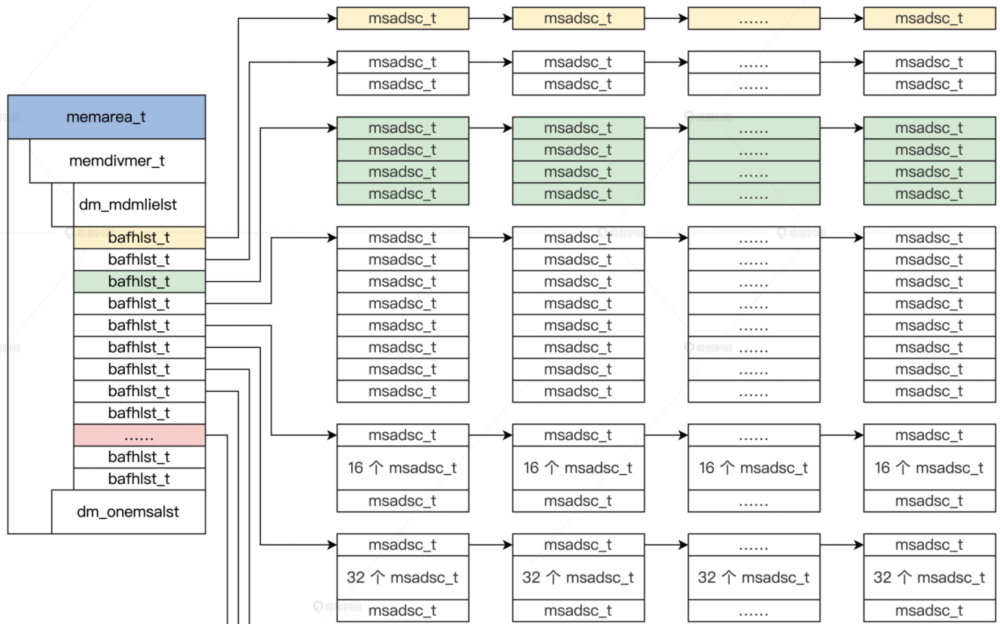
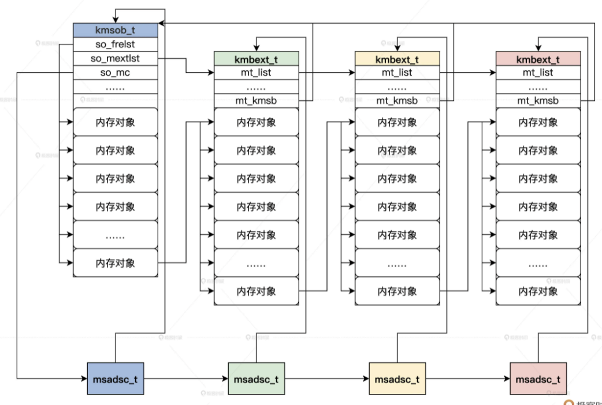

此章节为内核设计部分：   
### Memory Design
### [Code](./HuOS4.0/)
#### [Divide_Organize_Memory1](./Divide_Organize_Memory1/README.md)
#### [Divide_Organize_Memory2(Memory Page Init)](./Divide_Organize_Memory2/README.md)
#### [Divide_Organize_Memory3(Memory Page Alloc&Release)](./Divide_Organize_Memory3/README.md)

### [Code](./HuOS5.0/)
#### [Manage Memroy Object](./Manage_Memory_Object/README.md)

#### [Virtual Memory](./virtual_memory/README.md)
#### [Operate Virtual Memory](./operate_virtual_memory/README.md)
#### [How Buddy System Allocate Memory](./buddy_system/README.md)

#### [How SLAB System Allocate Memory](./slab_system/README.md)
