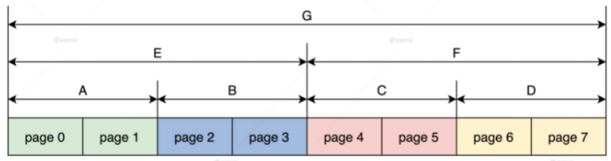

Linux 系统中，用来管理物理内存页面的伙伴系统，以及负责分配比页更小的内存对象的 SLAB 分配器了。  
<!-- toc -->
- [伙伴系统](#伙伴系统)
    - [怎样表示一个页](#怎样表示一个页)
    - [怎样表示一个区](#怎样表示一个区)
    - [怎样表示一个内存节点](#怎样表示一个内存节点)
    - [数据结构之间的关系](#数据结构之间的关系)
    - [何为伙伴](#何为伙伴)
- [分配页面](#分配页面)
    - [通过接口找到内存节点](#通过接口找到内存节点)
    - [开始分配](#开始分配)
    - [准备分配页面的参数](#准备分配页面的参数)
    - [Plan A：快速分配路径](#plan-a快速分配路径)
    - [Plan B：慢速分配路径](#plan-b慢速分配路径)
    - [如何分配内存页面](#如何分配内存页面)
<!-- tocstop -->

# 伙伴系统
## 怎样表示一个页
Linux 也是使用分页机制管理物理内存的，即 Linux 把物理内存分成 4KB 大小的页面进行管理。早期 Linux 使用了位图，后来使用了字节数组，但是现在 Linux 定义了一个 page 结构体来表示一个页，代码如下所示。  
```c
struct page {
    //page结构体的标志，它决定页面是什么状态
    unsigned long flags;
    union {
        struct {
            //挂载上级结构的链表
            struct list_head lru;
            //用于文件系统，address_space结构描述上文件占用了哪些内存页面
            struct address_space *mapping;
            pgoff_t index;
            unsigned long private;
        };
        //DMA设备的地址
        struct {
            dma_addr_t dma_addr;
        };
        //当页面用于内存对象时指向相关的数据结构
        struct {
            union {
                struct list_head slab_list;
                struct {
                    struct page *next;
#ifdef CONFIG_64BIT
                    int pages;
                    int pobjects;
#else
                    short int pages;
                    short int pobjects;
#endif
                };
            };
            //指向管理SLAB的结构kmem_cache
            struct kmem_cache *slab_cache;
            //指向SLAB的第一个对象
            void *freelist;
            union {
                void *s_mem;
                unsigned long counters;
                struct {
                    unsigned inuse:16;
                    unsigned objects:15;
                    unsigned frozen:1;
                };
            };
        };
        //用于页表映射相关的字段
        struct {
            unsigned long _pt_pad_1;
            pgtable_t pmd_huge_pte;
            unsigned long _pt_pad_2;
            union {
                struct mm_struct *pt_mm;
                atomic_t pt_frag_refcount;
            };
            //自旋锁
#if ALLOC_SPLIT_PTLOCKS
            spinlock_t *ptl;
#else
            spinlock_t ptl;
#endif
        };
        //用于设备映射
        struct {
            struct dev_pagemap *pgmap;
            void *zone_device_data;
        };
        struct rcu_head rcu_head;
    };
    //页面引用计数
    atomic_t _refcount;

#ifdef LAST_CPUPID_NOT_IN_PAGE_FLAGS
    int _last_cpupid;
#endif
} _struct_page_alignment;
```
union在结构体中的作用是提供一种方法，让你可以在一个固定大小的内存空间中存储不同类型的数据，从而节省内存。但需要注意的是，在同一时刻，union只能存储其中一种类型的数据。  
这个 page 结构看上去非常巨大，信息量很多，但其实它占用的内存很少，根据 Linux 内核配置选项不同，占用 20～40 个字节空间。page 结构大量使用了 C 语言 union 联合体定义结构字段，这个联合体的大小，要根据它里面占用内存最大的变量来决定。  
page 结构正是通过 flags 表示它处于哪种状态，根据不同的状态来使用 union 联合体的变量表示的数据信息。如果 page 处于空闲状态，它就会使用 union 联合体中的 lru 字段，挂载到对应空闲链表中。  
**我们只需要知道 Linux 内核中，一个 page 结构表示一个物理内存页面就行了。**  
## 怎样表示一个区
Linux 内核中也有区的逻辑概念，因为硬件的限制，Linux 内核不能对所有的物理内存页统一对待，所以就把属性相同物理内存页面，归结到了一个区中。在 32 位的 x86 平台中，一些使用 DMA 的设备只能访问 0~16MB 的物理空间，因此将 0~16MB 划分为 DMA 区。  
高内存区则适用于要访问的物理地址空间大于虚拟地址空间，Linux 内核不能建立直接映射的情况。  
除开这两个内存区，物理内存中剩余的页面就划分到常规内存区了。有的平台没有 DMA 区，64 位的 x86 平台则没有高内存区。  
Linux 内核用 zone 数据结构表示一个区  
```c
enum migratetype {
    MIGRATE_UNMOVABLE, //不能移动的
    MIGRATE_MOVABLE,   //可移动和
    MIGRATE_RECLAIMABLE,
    MIGRATE_PCPTYPES,  //属于pcp list的
    MIGRATE_HIGHATOMIC = MIGRATE_PCPTYPES,
#ifdef CONFIG_CMA
    MIGRATE_CMA,   //属于CMA区的
#endif
#ifdef CONFIG_MEMORY_ISOLATION
    MIGRATE_ISOLATE,
#endif
    MIGRATE_TYPES
};

//页面空闲链表头
struct free_area {
    struct list_head    free_list[MIGRATE_TYPES];
    unsigned long       nr_free;
};

struct zone {
    unsigned long _watermark[NR_WMARK];
    unsigned long watermark_boost;
    //预留的内存页面数
    unsigned long nr_reserved_highatomic;
    //内存区属于哪个内存节点
#ifdef CONFIG_NUMA
    int node;
#endif
    struct pglist_data  *zone_pgdat;
    //内存区开始的page结构数组的开始下标
    unsigned long       zone_start_pfn;
    atomic_long_t       managed_pages;
    //内存区总的页面数
    unsigned long       spanned_pages;
    //内存区存在的页面数
    unsigned long       present_pages;
    //内存区名字
    const char      *name;
    //挂载页面page结构的链表
    struct free_area    free_area[MAX_ORDER];
    //内存区的标志
    unsigned long       flags;
    /*保护free_area的自旋锁*/
    spinlock_t      lock;
};
```
```
enum是一种枚举类型，用于定义一组有名字的整数常量。它可以提高代码的可读性和易于维护。
struct是一种结构体类型，用于将多个不同类型的变量组合成一个复合数据结构。结构体可以用于表示现实世界中的各种对象和它们的属性。
---
enum通常用于定义有限个可选项，例如表示一周中的某一天、一个颜色、一个状态等。
struct通常用于表示具有多个属性的复杂对象，例如表示一个点的坐标、一个日期、一个学生的信息等。
```
_watermark 表示内存页面总量的水位线有 min, low, high 三种状态，可以作为启动内存页面回收的判断标准。spanned_pages 是该内存区总的页面数。

**为什么要有个 present_pages 字段表示页面真正存在呢？**
那是因为一些内存区中存在内存空洞，空洞对应的 page 结构不能用。

在 zone 结构中我们真正要关注的是 free_area 结构的数组，这个数组就是用于实现伙伴系统的。其中 MAX_ORDER 的值默认为 11，分别表示挂载地址连续的 page 结构数目为 1，2，4，8，16，32……最大为 1024。而 free_area 结构中又是一个 list_head 链表数组，该数组将具有相同迁移类型的 page 结构尽可能地分组，有的页面可以迁移，有的不可以迁移，同一类型的所有相同 order 的 page 结构，就构成了一组 page 结构块。  
分配的时候，会先按请求的 migratetype 从对应的 page 结构块中寻找，如果不成功，才会从其他 migratetype 的 page 结构块中分配。这样做是为了让内存页迁移更加高效，可以有效降低内存碎片。  
## 怎样表示一个内存节点
我们先要了解 **NUMA**  
在很多服务器和大型计算机上，如果物理内存是分布式的，由多个计算节点组成，那么每个 CPU 核都会有自己的本地内存，CPU 在访问它的本地内存的时候就比较快，访问其他 CPU 核内存的时候就比较慢，这种体系结构被称为 Non-Uniform Memory Access（NUMA）。  

```c
enum {
    ZONELIST_FALLBACK,
#ifdef CONFIG_NUMA
    ZONELIST_NOFALLBACK,
#endif
    MAX_ZONELISTS
};

struct zoneref {
    struct zone *zone;//内存区指针
    int zone_idx;     //内存区对应的索引
};

struct zonelist {
    struct zoneref _zonerefs[MAX_ZONES_PER_ZONELIST + 1];
};

//zone枚举类型 从0开始
enum zone_type {
#ifdef CONFIG_ZONE_DMA
    ZONE_DMA,
#endif
#ifdef CONFIG_ZONE_DMA32
    ZONE_DMA32,
#endif
    ZONE_NORMAL,
#ifdef CONFIG_HIGHMEM
    ZONE_HIGHMEM,
#endif
    ZONE_MOVABLE,
#ifdef CONFIG_ZONE_DEVICE
    ZONE_DEVICE,
#endif
    __MAX_NR_ZONES

};

//定义MAX_NR_ZONES为__MAX_NR_ZONES 最大为6
DEFINE(MAX_NR_ZONES, __MAX_NR_ZONES);
//内存节点
typedef struct pglist_data {
    //定一个内存区数组，最大为6个zone元素
    struct zone node_zones[MAX_NR_ZONES];
    //两个zonelist，一个是指向本节点的的内存区，另一个指向由本节点分配不到内存时可选的备用内存区。
    struct zonelist node_zonelists[MAX_ZONELISTS];
    //本节点有多少个内存区
    int nr_zones;
    //本节点开始的page索引号
    unsigned long node_start_pfn;
    //本节点有多少个可用的页面
    unsigned long node_present_pages;
    //本节点有多少个可用的页面包含内存空洞
    unsigned long node_spanned_pages;
    //节点id
    int node_id;
    //交换内存页面相关的字段
    wait_queue_head_t kswapd_wait;
    wait_queue_head_t pfmemalloc_wait;
    struct task_struct *kswapd;
    //本节点保留的内存页面
    unsigned long       totalreserve_pages;
    //自旋锁
    spinlock_t      lru_lock;
} pg_data_t;
```
pglist_data 结构中包含了 zonelist 数组。第一个 zonelist 类型的元素指向本节点内的 zone 数组，第二个 zonelist 类型的元素指向其它节点的 zone 数组，而一个 zone 结构中的 free_area 数组中又挂载着 page 结构。这样在本节点中分配不到内存页面的时候，就会到其它节点中分配内存页面。当计算机不是 NUMA 时，这时 Linux 就只创建一个节点。  
## 数据结构之间的关系

## 何为伙伴
在 Linux 物理内存页面管理中，连续且相同大小的 pages 就可以表示成伙伴。  

首先最小的 page（0,1）是伙伴，page（2,3）是伙伴，page（4,5）是伙伴，page（6,7）是伙伴，然后 A 与 B 是伙伴，C 与 D 是伙伴，最后 E 与 F 是伙伴  

# 分配页面
linux分配物理页面: 首先要找到内存节点，接着找到内存区，然后合适的空闲链表，最后在其中找到页的 page 结构，完成物理内存页面的分配。  
## 通过接口找到内存节点
  
虚线框中为接口函数，下面则是分配内存页面的核心实现，所有的接口函数都会调用到 alloc_pages 函数，而这个函数最终会调用 __alloc_pages_nodemask 函数完成内存页面的分配。  
```c
//gfp表示内存分配的标志，order表示请求分配的内存页数量（实际分配的内存页数为2的order次方）
//函数返回一个指向分配到的内存页的指针
struct page *alloc_pages_current(gfp_t gfp, unsigned order)
{
    struct mempolicy *pol = &default_policy;
    struct page *page;
    //判断当前是否不在中断上下文中且内存分配标志gfp没有指定只从当前节点分配内存
    if (!in_interrupt() && !(gfp & __GFP_THISNODE))
        //根据当前进程（current）获取其内存策略，并将结果赋值给指针pol
        pol = get_task_policy(current);
    //判断内存策略的模式是否为交错模式（MPOL_INTERLEAVE）
    if (pol->mode == MPOL_INTERLEAVE)
        //为当前进程分配内存页，并将结果赋值给指针page
        page = alloc_page_interleave(gfp, order, interleave_nodes(pol));
    else
        //为当前进程分配内存页，并将结果赋值给指针page。此时，内存分配会根据gfp、order、内存策略pol中的节点和节点掩码来进行
        page = __alloc_pages_nodemask(gfp, order,
                policy_node(gfp, pol, numa_node_id()),
                policy_nodemask(gfp, pol));

    return page;
}

static inline struct page * alloc_pages(gfp_t gfp_mask, unsigned int order)
{
    return alloc_pages_current(gfp_mask, order);
}
```
最终要调用 __alloc_pages_nodemask 函数，而且我们还要搞清楚它的参数，order 很好理解，它表示请求分配 2 的 order 次方个页面，重点是 gfp_t 类型的 gfp_mask  
```c
typedef unsigned int __bitwise gfp_t;
#define ___GFP_DMA      0x01u
#define ___GFP_HIGHMEM      0x02u
#define ___GFP_DMA32        0x04u
#define ___GFP_MOVABLE      0x08u
#define ___GFP_RECLAIMABLE  0x10u
#define ___GFP_HIGH     0x20u
#define ___GFP_IO       0x40u
#define ___GFP_FS       0x80u
#define ___GFP_ZERO     0x100u
#define ___GFP_ATOMIC       0x200u
#define ___GFP_DIRECT_RECLAIM   0x400u
#define ___GFP_KSWAPD_RECLAIM   0x800u
#define ___GFP_WRITE        0x1000u
#define ___GFP_NOWARN       0x2000u
#define ___GFP_RETRY_MAYFAIL    0x4000u
#define ___GFP_NOFAIL       0x8000u
#define ___GFP_NORETRY      0x10000u
#define ___GFP_MEMALLOC     0x20000u
#define ___GFP_COMP     0x40000u
#define ___GFP_NOMEMALLOC   0x80000u
#define ___GFP_HARDWALL     0x100000u
#define ___GFP_THISNODE     0x200000u
#define ___GFP_ACCOUNT      0x400000u
//需要原子分配内存不得让请求者进入睡眠
#define GFP_ATOMIC  (__GFP_HIGH|__GFP_ATOMIC|__GFP_KSWAPD_RECLAIM)
//分配用于内核自己使用的内存，可以有IO和文件系统相关的操作
#define GFP_KERNEL  (__GFP_RECLAIM | __GFP_IO | __GFP_FS)
#define GFP_KERNEL_ACCOUNT (GFP_KERNEL | __GFP_ACCOUNT)
//分配内存不能睡眠，不能有I/O和文件系统相关的操作
#define GFP_NOWAIT  (__GFP_KSWAPD_RECLAIM)
#define GFP_NOIO    (__GFP_RECLAIM)
#define GFP_NOFS    (__GFP_RECLAIM | __GFP_IO)
//分配用于用户进程的内存
#define GFP_USER    (__GFP_RECLAIM | __GFP_IO | __GFP_FS | __GFP_HARDWALL)
//用于DMA设备的内存
#define GFP_DMA     __GFP_DMA
#define GFP_DMA32   __GFP_DMA32
//把高端内存区的内存分配给用户进程
#define GFP_HIGHUSER    (GFP_USER | __GFP_HIGHMEM)
#define GFP_HIGHUSER_MOVABLE    (GFP_HIGHUSER | __GFP_MOVABLE)
#define GFP_TRANSHUGE_LIGHT ((GFP_HIGHUSER_MOVABLE | __GFP_COMP | \__GFP_NOMEMALLOC | __GFP_NOWARN) & ~__GFP_RECLAIM)
#define GFP_TRANSHUGE   (GFP_TRANSHUGE_LIGHT | __GFP_DIRECT_RECLAIM)
```
gfp_t 类型就是 int 类型，用其中位的状态表示请求分配不同的内存区的内存页面，以及分配内存页面的不同方式。  
## 开始分配
__alloc_pages_nodemask 函数主要干了三件事
1. 准备分配页面的参数
2. 进入快速分配路径
3. 若快速分配路径没有分配到页面，就进入慢速分配路径
```c
//preferred_nid 表示要尝试分配页面的 NUMA 节点；nodemask 表示一个 NUMA 节点掩码，用于指定可用的节点。
struct page *__alloc_pages_nodemask(gfp_t gfp_mask, unsigned int order, int preferred_nid,  nodemask_t *nodemask)
{
    struct page *page;
    unsigned int alloc_flags = ALLOC_WMARK_LOW;
    gfp_t alloc_mask;
    struct alloc_context ac = { };
    //分配页面的order大于等于最大的order直接返回NULL
    if (unlikely(order >= MAX_ORDER)) {
        WARN_ON_ONCE(!(gfp_mask & __GFP_NOWARN));
        return NULL;
    }
    gfp_mask &= gfp_allowed_mask;
    alloc_mask = gfp_mask;
    //准备分配页面的参数放在ac变量中
    if (!prepare_alloc_pages(gfp_mask, order, preferred_nid, nodemask, &ac, &alloc_mask, &alloc_flags))
        return NULL;
    //ALLOC_WMARK_LOW 是一个标志，表示要在低水印线以下进行分配
    //调用 alloc_flags_nofragment 函数，根据 gfp_mask 和 preferred_zoneref 等参数，确定了是否要禁用页面碎片合并
    alloc_flags |= alloc_flags_nofragment(ac.preferred_zoneref->zone, gfp_mask);
    //进入快速分配路径，尝试从空闲页面链表中获取页面
    page = get_page_from_freelist(alloc_mask, order, alloc_flags, &ac);
    if (likely(page))
        goto out;
    alloc_mask = current_gfp_context(gfp_mask);
    ac.spread_dirty_pages = false;
    ac.nodemask = nodemask;
    //进入慢速分配路径
    page = __alloc_pages_slowpath(alloc_mask, order, &ac);
out:
    return page;
}
```
## 准备分配页面的参数
一个变量 ac 是 alloc_context 类型的，顾名思义，分配参数就保存在了 ac 这个分配上下文的变量中。  
prepare_alloc_pages 函数根据传递进来的参数，还会对 ac 变量做进一步处理。  
```c
struct alloc_context {
    struct zonelist *zonelist;
    nodemask_t *nodemask;
    struct zoneref *preferred_zoneref;
    int migratetype;
    enum zone_type highest_zoneidx;
    bool spread_dirty_pages;
};

static inline bool prepare_alloc_pages(gfp_t gfp_mask, unsigned int order,
        int preferred_nid, nodemask_t *nodemask,
        struct alloc_context *ac, gfp_t *alloc_mask,
        unsigned int *alloc_flags)
{
    //从哪个内存区分配内存
    ac->highest_zoneidx = gfp_zone(gfp_mask);
    //根据节点id计算出zone的指针
    ac->zonelist = node_zonelist(preferred_nid, gfp_mask);
    ac->nodemask = nodemask;
    //计算出free_area中的migratetype值，比如如分配的掩码为GFP_KERNEL，那么其类型为MIGRATE_UNMOVABLE；
    ac->migratetype = gfp_migratetype(gfp_mask);
    //处理CMA相关的分配选项
    *alloc_flags = current_alloc_flags(gfp_mask, *alloc_flags);
    ac->spread_dirty_pages = (gfp_mask & __GFP_WRITE);
    //搜索nodemask表示的节点中可用的zone保存在preferred_zoneref
    ac->preferred_zoneref = first_zones_zonelist(ac->zonelist,
                    ac->highest_zoneidx, ac->nodemask);
    return true;
}
```
prepare_alloc_pages 函数根据传递进入的参数，就能找出要分配内存区、候选内存区以及内存区中空闲链表的 migratetype 类型。它把这些全部收集到 ac 结构中，只要它返回 true，就说明分配内存页面的参数已经准备好了。
## Plan A：快速分配路径
快速分配路径在 Linux 内核中是一种优化技巧，旨在提高页面分配的效率。当内核需要分配一个页面时，首先会尝试从空闲页面链表中获取页面，如果获取成功，则直接返回该页面的指针。这种方式非常快速，因为它不需要进行任何内存回收操作，可以直接从空闲页面链表中获取页面。

然而，快速分配路径并不适用于所有情况。当系统中的内存不足时，如果继续使用快速分配路径，则可能会导致内存耗尽，从而导致系统崩溃。因此，当内存不足时，内核需要进行内存回收操作，以便释放一些页面，供其他进程使用。

然而，在快速分配路径中，内核不能进行内存回收操作，因为这会导致分配操作变慢，从而破坏了快速分配路径的优化效果。因此，如果在快速分配路径中无法获取到页面，则内核需要进入慢速分配路径，以便进行内存回收操作，并尝试获取页面。在慢速分配路径中，内核可以采取一些内存回收措施，例如回收缓存页面或者回收匿名页面等，从而释放一些内存供其他进程使用。但是，这种方式相对较慢，因为它需要进行一些复杂的内存回收操作，所以只有在快速分配路径无法满足需求时才会使用。

快速分配路径不会处理内存页面合并和回收  
```c
//用于从空闲页面链表中获取一个或多个页面
//alloc_flags 表示分配页面时的一些标志，如是否允许页面碎片合并等
static struct page *
get_page_from_freelist(gfp_t gfp_mask, unsigned int order, int alloc_flags,
                        const struct alloc_context *ac)
{
    //表示一个内存区的引用
    struct zoneref *z;
    struct zone *zone;
    struct pglist_data *last_pgdat_dirty_limit = NULL;
    bool no_fallback;
retry:
    no_fallback = alloc_flags & ALLOC_NOFRAGMENT;
    z = ac->preferred_zoneref;
    //遍历ac->preferred_zoneref中每个内存区
    for_next_zone_zonelist_nodemask(zone, z, ac->highest_zoneidx,
                    ac->nodemask) {
        struct page *page;
        unsigned long mark;
        //查看内存水位线
        mark = wmark_pages(zone, alloc_flags & ALLOC_WMARK_MASK);
        //检查内存区中空闲内存是否在水印之上
        if (!zone_watermark_fast(zone, order, mark,
                       ac->highest_zoneidx, alloc_flags,
                       gfp_mask)) {
            int ret;
            //当前内存区的内存结点做内存回收,如果回收后仍然无法满足要求，则该函数继续遍历下一个内存区。
            //虽然 node_reclaim 函数在这段代码中被调用了，但它不是必需的，只有在快速分配路径无法获取到页面时才会使用它进行内存回收操作
            ret = node_reclaim(zone->zone_pgdat, gfp_mask, order);
            switch (ret) {
            //快速分配路径不处理页面回收的问题
            case NODE_RECLAIM_NOSCAN:
                continue;
            case NODE_RECLAIM_FULL:
                continue;
            default:
                //根据分配的order数量判断内存区的水位线是否满足要求
                if (zone_watermark_ok(zone, order, mark,
                    ac->highest_zoneidx, alloc_flags))
                    //如果可以可就从这个内存区开始分配
                    goto try_this_zone;
                continue;
            }
        }

try_this_zone:
        //真正分配内存页面
        page = rmqueue(ac->preferred_zoneref->zone, zone, order,
                gfp_mask, alloc_flags, ac->migratetype);
        if (page) {
            //清除一些标志或者设置联合页等等；初始化页面，并返回该页面的指针
            prep_new_page(page, order, gfp_mask, alloc_flags);
            return page;
        }
    }
    if (no_fallback) {
        alloc_flags &= ~ALLOC_NOFRAGMENT;
        goto retry;
    }
    return NULL;
}
```
遍历所有的候选内存区，然后针对每个内存区检查水位线，是不是执行内存回收机制，当一切检查通过之后，就开始调用 rmqueue 函数执行内存页面分配。  
## Plan B：慢速分配路径
当快速分配路径没有分配到页面的时候，就会进入慢速分配路径。跟快速路径相比，慢速路径最主要的不同是它会执行页面回收，回收页面之后会进行多次重复分配，直到最后分配到内存页面，或者分配失败
```c
static inline struct page *
__alloc_pages_slowpath(gfp_t gfp_mask, unsigned int order,
                        struct alloc_context *ac)
{
    bool can_direct_reclaim = gfp_mask & __GFP_DIRECT_RECLAIM;
    const bool costly_order = order > PAGE_ALLOC_COSTLY_ORDER;
    struct page *page = NULL;
    unsigned int alloc_flags;
    unsigned long did_some_progress;
    enum compact_priority compact_priority;
    enum compact_result compact_result;
    int compaction_retries;
    int no_progress_loops;
    unsigned int cpuset_mems_cookie;
    int reserve_flags;

retry:
    //唤醒所有交换内存的线程
    if (alloc_flags & ALLOC_KSWAPD)
        wake_all_kswapds(order, gfp_mask, ac);
    //依然调用快速分配路径入口函数尝试分配内存页面
     page = get_page_from_freelist(gfp_mask, order, alloc_flags, ac);
    if (page)
        goto got_pg;

    //尝试直接回收内存并且再分配内存页面
    page = __alloc_pages_direct_reclaim(gfp_mask, order, alloc_flags, ac,
                            &did_some_progress);
    if (page)
        goto got_pg;

    //尝试直接压缩内存并且再分配内存页面
    page = __alloc_pages_direct_compact(gfp_mask, order, alloc_flags, ac,
                    compact_priority, &compact_result);
    if (page)
        goto got_pg;
    //检查对于给定的分配请求，重试回收是否有意义
    if (should_reclaim_retry(gfp_mask, order, ac, alloc_flags,
                 did_some_progress > 0, &no_progress_loops))
        goto retry;
    //检查对于给定的分配请求，重试压缩是否有意义
    if (did_some_progress > 0 &&
            should_compact_retry(ac, order, alloc_flags,
                compact_result, &compact_priority,
                &compaction_retries))
        goto retry;
    //回收、压缩内存已经失败了，开始尝试杀死进程，回收内存页面
    page = __alloc_pages_may_oom(gfp_mask, order, ac, &did_some_progress);
    if (page)
        goto got_pg;
got_pg:
    return page;
}
```
__alloc_pages_slowpath 函数一开始会唤醒所有用于内存交换回收的线程  
get_page_from_freelist 函数分配失败了就会进行内存回收，内存回收主要是释放一些文件占用的内存页面。  
如果内存回收不行，就会就进入到内存压缩环节。  
内存压缩不是指压缩内存中的数据，而是指移动内存页面，进行内存碎片整理，腾出更大的连续的内存空间。如果内存碎片整理了，还是不能成功分配内存，就要杀死进程以便释放更多内存页面了。  
## 如何分配内存页面
无论快速分配路径还是慢速分配路径，最终执行内存页面分配动作的始终是 get_page_from_freelist 函数，更准确地说，实际完成分配任务的是 rmqueue 函数
```c
//从空闲页面链表中获取一个或多个页面
//preferred_zone 表示优先选择的内存区，zone 表示当前操作的内存区
static inline struct page *rmqueue(struct zone *preferred_zone,
            struct zone *zone, unsigned int order,
            gfp_t gfp_flags, unsigned int alloc_flags,
            int migratetype)
{
    unsigned long flags;
    struct page *page;
    if (likely(order == 0)) {
        if (!IS_ENABLED(CONFIG_CMA) || alloc_flags & ALLOC_CMA ||
                migratetype != MIGRATE_MOVABLE) {
    //如果order等于0,就说明是分配一个页面，就从pcplist中分配
            page = rmqueue_pcplist(preferred_zone, zone, gfp_flags,
                    migratetype, alloc_flags);
            goto out;
        }
    }
    //加锁并关中断
    //该函数会首先尝试从 free_area 中获取页面。如果 free_area 中没有可用页面，则该函数会尝试从 zone 的其他空闲页面链表中获取页面，直到找到满足要求的页面或者无法获取页面为止。如果获取到了页面，则该函数会调用 check_new_pages 函数检查新页面的相关信息，并返回页面的指针。
    spin_lock_irqsave(&zone->lock, flags);
    do {
        page = NULL;
        if (order > 0 && alloc_flags & ALLOC_HARDER) {
            //从free_area中分配
            page = __rmqueue_smallest(zone, order, MIGRATE_HIGHATOMIC);
        }
        if (!page)
            //它最后也是调用__rmqueue_smallest函数
            page = __rmqueue(zone, order, migratetype, alloc_flags);
    } while (page && check_new_pages(page, order));
    spin_unlock(&zone->lock);

    zone_statistics(preferred_zone, zone);
    local_irq_restore(flags);
out:
    return page;
}
```
rmqueue_pcplist 和 __rmqueue_smallest 是分配内存页面的核心函数。  

pcplist 是一种页面列表，用于管理多个页面。它是 per-CPU Page List 的缩写，表示每个 CPU 都有自己的页面列表。pcplist 可以用来缓存一些与进程相关的页面，从而减少页面迁移的开销。每个 CPU 都有自己的 pcplist，当一个进程需要分配页面时，内核会首先尝试从该进程所运行的 CPU 的本地 pcplist 中获取页面。如果 pcplist 中没有可用页面，则内核会从全局空闲页面链表中获取页面，并将页面添加到该进程所运行的 CPU 的 pcplist 中。当一个进程需要释放页面时，内核会将页面从该进程所运行的 CPU 的 pcplist 中删除，并将页面添加到全局空闲页面链表中。

先来看看 rmqueue_pcplist 函数，在请求分配一个页面的时候，就是用它从 pcplist 中分配页面的。所谓的 pcp 是指，每个 CPU 都有一个内存页面高速缓冲，由数据结构 per_cpu_pageset 描述，包含在内存区中。在 Linux 内核中，系统会经常请求和释放单个页面。如果针对每个 CPU，都建立出预先分配了单个内存页面的链表，用于满足本地 CPU 发出的单一内存请求，就能提升系统的性能
```c
struct per_cpu_pages {
    int count;      //列表中的页面数
    int high;       //页面数高于水位线，需要清空
    int batch;      //从伙伴系统增加/删除的块数
    //页面列表，每个迁移类型一个。
    struct list_head lists[MIGRATE_PCPTYPES];
};

struct per_cpu_pageset {
    struct per_cpu_pages pcp;
#ifdef CONFIG_NUMA
    s8 expire;
    u16 vm_numa_stat_diff[NR_VM_NUMA_STAT_ITEMS];
#endif
#ifdef CONFIG_SMP
    s8 stat_threshold;
    s8 vm_stat_diff[NR_VM_ZONE_STAT_ITEMS];
#endif
};

static struct page *__rmqueue_pcplist(struct zone *zone, int migratetype,unsigned int alloc_flags,struct per_cpu_pages *pcp,
            struct list_head *list)
{
    struct page *page;
    do {
        if (list_empty(list)) {
            //如果list为空，就从这个内存区中分配一部分页面到pcp中来
            pcp->count += rmqueue_bulk(zone, 0,
                    pcp->batch, list,
                    migratetype, alloc_flags);
            if (unlikely(list_empty(list)))
                return NULL;
        }
        //获取list上第一个page结构
        page = list_first_entry(list, struct page, lru);
        //脱链
        list_del(&page->lru);
        //减少pcp页面计数
        pcp->count--;
    } while (check_new_pcp(page));
    return page;
}

static struct page *rmqueue_pcplist(struct zone *preferred_zone,
            struct zone *zone, gfp_t gfp_flags,int migratetype, unsigned int alloc_flags)
{
    struct per_cpu_pages *pcp;
    struct list_head *list;
    struct page *page;
    unsigned long flags;
    //关中断
    local_irq_save(flags);
    //获取当前CPU下的pcp
    pcp = &this_cpu_ptr(zone->pageset)->pcp;
    //获取pcp下迁移的list链表
    list = &pcp->lists[migratetype];
    //摘取list上的page结构
    page = __rmqueue_pcplist(zone,  migratetype, alloc_flags, pcp, list);
    //开中断
    local_irq_restore(flags);
    return page;
}
```
它主要是优化了请求分配单个内存页面的性能。但是遇到多个内存页面的分配请求，就会调用 __rmqueue_smallest 函数，从 free_area 数组中分配。  
__rmqueue_smallest 函数:  
```c
//获取free_area中对应migratetype为下标的free_list中的page
static inline struct page *get_page_from_free_area(struct free_area *area,int migratetype)
{
    //返回free_list[migratetype]中的第一个page若没有就返回NULL
    return list_first_entry_or_null(&area->free_list[migratetype],
                    struct page, lru);
}

//脱链page
static inline void del_page_from_free_list(struct page *page, struct zone *zone,unsigned int order)
{
    if (page_reported(page))
        __ClearPageReported(page);
    //脱链
    list_del(&page->lru);
    //清除page中伙伴系统的标志
    __ClearPageBuddy(page);
    set_page_private(page, 0);
    //减少free_area中页面计数
    zone->free_area[order].nr_free--;
}

//把另一半pages加入对应的free_area中
static inline void add_to_free_list(struct page *page, struct zone *zone,
                    unsigned int order, int migratetype)
{
    struct free_area *area = &zone->free_area[order];
    //把一组page的首个page加入对应的free_area中
    list_add(&page->lru, &area->free_list[migratetype]);
    area->nr_free++;
}

//分割一组页
static inline void expand(struct zone *zone, struct page *page,
    int low, int high, int migratetype)
{
    //最高order下连续的page数 比如high = 3 size=8
    unsigned long size = 1 << high;
    //循环分割
    while (high > low) {
        high--;
        size >>= 1;//每次循环左移一位 4,2,1
        //标记为保护页，当其伙伴被释放时，允许合并
        if (set_page_guard(zone, &page[size], high, migratetype))
            continue;
        //把另一半pages加入对应的free_area中
        add_to_free_list(&page[size], zone, high, migratetype);
        //设置伙伴
        set_buddy_order(&page[size], high);
    }
}

static __always_inline struct page *__rmqueue_smallest(struct zone *zone, unsigned int order,int migratetype)
{
    unsigned int current_order;
    struct free_area *area;
    struct page *page;
    for (current_order = order; current_order < MAX_ORDER; ++current_order) {
        //获取current_order对应的free_area
        area = &(zone->free_area[current_order]);
        //获取free_area中对应migratetype为下标的free_list中的page
        page = get_page_from_free_area(area, migratetype);
        if (!page)
            continue;
        //脱链page
        del_page_from_free_list(page, zone, current_order);
        //分割伙伴
        expand(zone, page, order, current_order, migratetype);
        set_pcppage_migratetype(page, migratetype);
        return page;
    }
    return NULL;
}
```
在 __rmqueue_smallest 函数中，首先要取得 current_order 对应的 free_area 区中 page，若没有，就继续增加 current_order，直到最大的 MAX_ORDER。要是得到一组连续 page 的首地址，就对其脱链，然后调用 expand 函数分割伙伴。(expand 函数是完成伙伴算法的核心)  

# 回顾
首先，我们学习了伙伴系统的数据结构，我们从页开始，Linux 用 page 结构代表一个物理内存页面，接着在 page 上层定义了内存区 zone，这是为了不同的地址空间的分配要求。然后 Linux 为了支持 NUMA 体系的计算机，而定义了节点 pglist_data，每个节点中包含了多个 zone，我们一起理清了这些数据结构之间的关系。

之后，我们进入到分配页面这一步，为了理解伙伴系统的内存分配的原理，我们研究了伙伴系统的分配接口，然后重点分析了它的快速分配路径和慢速分配路径。只有在快速分配路径失败之后，才会进入慢速分配路径，慢速分配路径中会进行内存回收相关的工作。最后，我们一起了解了 expand 函数是如何分割伙伴，完成页面分配的。

Linux 系统中，比页更小的内存对象要怎样分配呢？    --答: SLAB