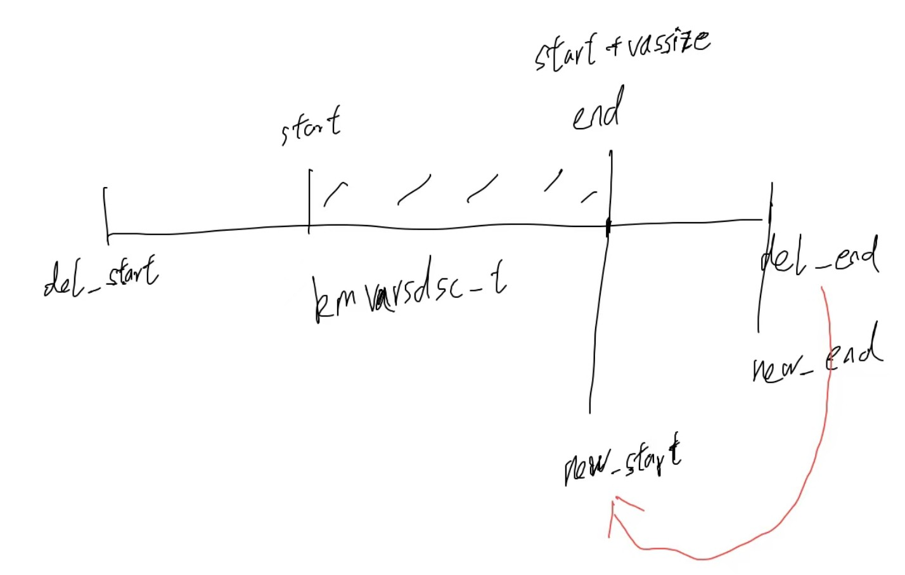

<!-- toc -->
分配和释放虚拟内存  
- [虚拟地址的空间的分配与释放](#虚拟地址的空间的分配与释放)
    - [虚拟地址空间分配接口](#虚拟地址空间分配接口)
    - [分配时查找虚拟地址区间](#分配时查找虚拟地址区间)
    - [虚拟地址空间释放接口](#虚拟地址空间释放接口)
    - [释放时查找虚拟地址区间](#释放时查找虚拟地址区间)
- [测试环节：虚拟空间能正常访问么](#测试环节虚拟空间能正常访问么)
    - [准备工作](#准备工作)
    - [异常情况与原因分析](#异常情况与原因分析)
    - [开始处理缺页异常](#开始处理缺页异常)
    - [缺页地址是否合法](#缺页地址是否合法)
    - [映射物理内存页面](#映射物理内存页面)
- [总结](#总结)
<!-- tocstop -->

# 虚拟地址的空间的分配与释放
整个虚拟地址空间是由一个个虚拟地址区间组成的。那么分配一个虚拟地址空间就是在整个虚拟地址空间分割出一个区域，而释放一块虚拟地址空间，就是把这个区域合并到整个虚拟地址空间中去。  
## 虚拟地址空间分配接口
分配虚拟地址空间应该有大小、有类型、有相关标志，还有从哪里开始分配等信息  
```c
krlvadrsmem.c

//start是要分配的虚拟地址空间的开始地址，vassize是要分配的虚拟地址空间的大小，vaslimits是虚拟地址空间的限制，vastype是虚拟地址空间的类型
duiaadr_t vma_new_vadrs_core(mmadrsdsc_t *mm, adr_t start, size_t vassize, u64_t vaslimits, u32_t vastype)
{
    adr_t retadrs = NULL;
    kmvarsdsc_t *newkmvd = NULL, *currkmvd = NULL;
    virmemadrs_t *vma = &mm->msd_virmemadrs;
    knl_spinlock(&vma->vs_lock);
    //查找虚拟地址区间
    currkmvd = vma_find_kmvarsdsc(vma, start, vassize);
    if (NULL == currkmvd)
    {
        retadrs = NULL;
        goto out;
    }
    //进行虚拟地址区间进行检查看能否复用这个数据结构
    if (((NULL == start) || (start == currkmvd->kva_end)) && (vaslimits == currkmvd->kva_limits) && (vastype == currkmvd->kva_maptype))
    {
        //能复用的话，当前虚拟地址区间的结束地址返回
        retadrs = currkmvd->kva_end;
        //扩展当前虚拟地址区间的结束地址为分配虚拟地址区间的大小
        currkmvd->kva_end += vassize;
        vma->vs_currkmvdsc = currkmvd;
        goto out;
    }
    //建立一个新的kmvarsdsc_t虚拟地址区间结构
    newkmvd = new_kmvarsdsc();
    if (NULL == newkmvd)
    {
        retadrs = NULL;
        goto out;
    }
    //如果分配的开始地址为NULL就由系统动态决定
    if (NULL == start)
    {
        //当然是接着当前虚拟地址区间之后开始
        newkmvd->kva_start = currkmvd->kva_end;
    }
    else
    {
        //否则这个新的虚拟地址区间的开始就是请求分配的开始地址
        newkmvd->kva_start = start;
    }
    //设置新的虚拟地址区间的结束地址
    newkmvd->kva_end = newkmvd->kva_start + vassize;
    newkmvd->kva_limits = vaslimits;
    newkmvd->kva_maptype = vastype;
    newkmvd->kva_mcstruct = vma;
    vma->vs_currkmvdsc = newkmvd;
    //将新的虚拟地址区间加入到virmemadrs_t结构中
    list_add(&newkmvd->kva_list, &currkmvd->kva_list);
    //看看新的虚拟地址区间是否是最后一个
    if (list_is_last(&newkmvd->kva_list, &vma->vs_list) == TRUE)
    {
        vma->vs_endkmvdsc = newkmvd;
    }
    //返回新的虚拟地址区间的开始地址
    retadrs = newkmvd->kva_start;
out:
    knl_spinunlock(&vma->vs_lock);
    return retadrs;
}

//start是要分配的虚拟地址空间的开始地址，vassize是要分配的虚拟地址空间的大小，vaslimits是虚拟地址空间的限制，vastype是虚拟地址空间的类型
//分配虚拟地址空间的接口
adr_t vma_new_vadrs(mmadrsdsc_t *mm, adr_t start, size_t vassize, u64_t vaslimits, u32_t vastype)
{
    if (NULL == mm || 1 > vassize)
    {
        return NULL;
    }
    if (NULL != start)
    {
        //进行参数检查，开始地址要和页面（4KB 0x1000）对齐，结束地址不能超过整个虚拟地址空间
        if (((start & 0xfff) != 0) || (0x1000 > start) || (USER_VIRTUAL_ADDRESS_END < (start + vassize)))
        {
            return NULL;
        }
    }
    //调用虚拟地址空间分配的核心函数
    return vma_new_vadrs_core(mm, start, VADSZ_ALIGN(vassize), vaslimits, vastype);
}
```
接口函数进行参数检查，然后调用核心函数完成实际的工作。在核心函数中，会调用 vma_find_kmvarsdsc 函数去查找 virmemadrs_t 结构中的所有 kmvarsdsc_t 结构，找出合适的虚拟地址区间。  
我们允许应用程序指定分配虚拟地址空间的开始地址，也可以由系统决定，**但是应用程序指定的话，分配更容易失败，因为很可能指定的开始地址已经被占用了**  
## 分配时查找虚拟地址区间
之前的vma_find_kmvarsdsc查找虚拟地址空间函数并没有实现: 主要是根据分配的开始地址和大小，在 virmemadrs_t 结构中查找相应的 kmvarsdsc_t 结构。  
它是如何查找的呢？举个例子，比如 virmemadrs_t 结构中有两个 kmvarsdsc_t 结构，A_kmvarsdsc_t 结构表示 0x1000～0x4000 的虚拟地址空间，B_kmvarsdsc_t 结构表示 0x7000～0x9000 的虚拟地址空间。这时，我们分配 2KB 的虚拟地址空间，vma_find_kmvarsdsc 函数查找发现 A_kmvarsdsc_t 结构和 B_kmvarsdsc_t 结构之间正好有 0x4000～0x7000 的空间，刚好放得下 0x2000 大小的空间，于是这个函数就会返回 A_kmvarsdsc_t 结构，否则就会继续向后查找。  
```c
//检查kmvarsdsc_t结构
kmvarsdsc_t *vma_find_kmvarsdsc_is_ok(virmemadrs_t *vmalocked, kmvarsdsc_t *curr, adr_t start, size_t vassize)
{
    kmvarsdsc_t *nextkmvd = NULL;
    adr_t newend = start + (adr_t)vassize;
    //如果curr不是最后一个先检查当前kmvarsdsc_t结构
    if (list_is_last(&curr->kva_list, &vmalocked->vs_list) == FALSE)
    {
        //就获取curr的下一个kmvarsdsc_t结构
        nextkmvd = list_next_entry(curr, kmvarsdsc_t, kva_list);
        //由系统动态决定分配虚拟空间的开始地址
        if (NULL == start)
        {
            //如果curr的结束地址加上分配的大小小于等于下一个kmvarsdsc_t结构的开始地址就返回curr
            if ((curr->kva_end + (adr_t)vassize) <= nextkmvd->kva_start)
            {
                return curr;
            }
        }
        else
        {
            //否则比较应用指定分配的开始、结束地址是不是在curr和下一个kmvarsdsc_t结构之间
            if ((curr->kva_end <= start) && (newend <= nextkmvd->kva_start))
            {
                return curr;
            }
        }
    }
    else
    {
        //否则curr为最后一个kmvarsdsc_t结构
        if (NULL == start)
        {
            //curr的结束地址加上分配空间的大小是不是小于整个虚拟地址空间
            if ((curr->kva_end + (adr_t)vassize) < vmalocked->vs_isalcend)
            {
                return curr;
            }
        }
        else
        {
            //否则比较应用指定分配的开始、结束地址是不是在curr的结束地址和整个虚拟地址空间的结束地址之间
            if ((curr->kva_end <= start) && (newend < vmalocked->vs_isalcend))
            {
                return curr;
            }
        }
    }
    return NULL;
}

//查找kmvarsdsc_t结构
kmvarsdsc_t *vma_find_kmvarsdsc(virmemadrs_t *vmalocked, adr_t start, size_t vassize)
{
    kmvarsdsc_t *kmvdcurrent = NULL, *curr = vmalocked->vs_currkmvdsc;
    adr_t newend = start + vassize;
    list_h_t *listpos = NULL;
    //分配的虚拟空间大小小于4KB不行
    if (0x1000 > vassize)
    {
        return NULL;
    }
    //将要分配虚拟地址空间的结束地址大于整个虚拟地址空间 不行
    if (newend > vmalocked->vs_isalcend)
    {
        return NULL;
    }

    if (NULL != curr)
    {
        //先检查当前kmvarsdsc_t结构行不行
        kmvdcurrent = vma_find_kmvarsdsc_is_ok(vmalocked, curr, start, vassize);
        if (NULL != kmvdcurrent)
        {
            return kmvdcurrent;
        }
    }
    //遍历virmemadrs_t中的所有的kmvarsdsc_t结构
    list_for_each(listpos, &vmalocked->vs_list)
    {
        curr = list_entry(listpos, kmvarsdsc_t, kva_list);
        //检查每个kmvarsdsc_t结构
        kmvdcurrent = vma_find_kmvarsdsc_is_ok(vmalocked, curr, start, vassize);
        if (NULL != kmvdcurrent)
        {
            //如果符合要求就返回
            return kmvdcurrent;
        }
    }
    return NULL;
}
```
## 虚拟地址空间释放接口
```c
//释放虚拟地址空间的核心函数
bool_t vma_del_vadrs_core(mmadrsdsc_t *mm, adr_t start, size_t vassize)
{
    bool_t rets = FALSE;
    kmvarsdsc_t *newkmvd = NULL, *delkmvd = NULL;
    virmemadrs_t *vma = &mm->msd_virmemadrs;
    knl_spinlock(&vma->vs_lock);
    //查找要释放虚拟地址空间的kmvarsdsc_t结构
    delkmvd = vma_del_find_kmvarsdsc(vma, start, vassize);
    if (NULL == delkmvd)
    {
        rets = FALSE;
        goto out;
    }
    //第一种情况要释放的虚拟地址空间正好等于查找的kmvarsdsc_t结构
    if ((delkmvd->kva_start == start) && (delkmvd->kva_end == (start + (adr_t)vassize)))
    {
        //脱链
        list_del(&delkmvd->kva_list);
        //删除kmvarsdsc_t结构
        del_kmvarsdsc(delkmvd);
        vma->vs_kmvdscnr--;
        rets = TRUE;
        goto out;
    }
    //第二种情况要释放的虚拟地址空间是在查找的kmvarsdsc_t结构的上半部分
    if ((delkmvd->kva_start == start) && (delkmvd->kva_end > (start + (adr_t)vassize)))
    {
        //所以直接把查找的kmvarsdsc_t结构的开始地址设置为释放虚拟地址空间的结束地址
        delkmvd->kva_start = start + (adr_t)vassize;
        rets = TRUE;
        goto out;
    }
    //第三种情况要释放的虚拟地址空间是在查找的kmvarsdsc_t结构的下半部分
    if ((delkmvd->kva_start < start) && (delkmvd->kva_end == (start + (adr_t)vassize)))
    {
        //所以直接把查找的kmvarsdsc_t结构的结束地址设置为释放虚拟地址空间的开始地址
        delkmvd->kva_end = start;
        rets = TRUE;
        goto out;
    }
    //第四种情况要释放的虚拟地址空间是在查找的kmvarsdsc_t结构的中间
    if ((delkmvd->kva_start < start) && (delkmvd->kva_end > (start + (adr_t)vassize)))
    {
        //所以要再新建一个kmvarsdsc_t结构来处理释放虚拟地址空间之后的下半虚拟部分地址空间
        newkmvd = new_kmvarsdsc();
        if (NULL == newkmvd)
        {
            rets = FALSE;
            goto out;
        }
        //让新的kmvarsdsc_t结构指向查找的kmvarsdsc_t结构的后半部分虚拟地址空间
        newkmvd->kva_end = delkmvd->kva_end;
        newkmvd->kva_start = start + (adr_t)vassize;
        //和查找到的kmvarsdsc_t结构保持一致
        newkmvd->kva_limits = delkmvd->kva_limits;
        newkmvd->kva_maptype = delkmvd->kva_maptype;
        newkmvd->kva_mcstruct = vma;
        delkmvd->kva_end = start;
        //加入链表
        list_add(&newkmvd->kva_list, &delkmvd->kva_list);
        vma->vs_kmvdscnr++;
        //是否为最后一个kmvarsdsc_t结构
        if (list_is_last(&newkmvd->kva_list, &vma->vs_list) == TRUE)
        {
            vma->vs_endkmvdsc = newkmvd;
            vma->vs_currkmvdsc = newkmvd;
        }
        else
        {
            vma->vs_currkmvdsc = newkmvd;
        }
        rets = TRUE;
        goto out;
    }
    rets = FALSE;
out:
    knl_spinunlock(&vma->vs_lock);
    return rets;
}

//释放虚拟地址空间的接口
//mmadrsdsc_t *mm：进程的虚拟地址空间描述符
bool_t vma_del_vadrs(mmadrsdsc_t *mm, adr_t start, size_t vassize)
{    //对参数进行检查
    if (NULL == mm || 1 > vassize || NULL == start)
    {
        return FALSE;
    }
    //调用核心处理函数
    return vma_del_vadrs_core(mm, start, VADSZ_ALIGN(vassize));
}
```

因为分配虚拟地址空间时，我们为了节约 kmvarsdsc_t 结构占用的内存空间，规定只要分配的虚拟地址空间上一个虚拟地址空间是连续且类型相同的，我们就借用上一个 kmvarsdsc_t 结构，而不是重新分配一个 kmvarsdsc_t 结构表示新分配的虚拟地址空间。你可以想像一下，一个应用每次分配一个页面的虚拟地址空间，不停地分配，而每个新分配的虚拟地址空间都有一个 kmvarsdsc_t 结构对应，这样物理内存将很快被耗尽。  
## 释放时查找虚拟地址区间
虚拟地址空间的核心处理函数 vma_del_vadrs_core 函数中，调用了 vma_del_find_kmvarsdsc 函数，用于查找要释放虚拟地址空间的 kmvarsdsc_t 结构，可是为什么不用分配虚拟地址空间时那个查找函数（vma_find_kmvarsdsc）呢？  
因为释放时查找的要求不一样。释放时仅仅需要保证，释放的虚拟地址空间的开始地址和结束地址，他们落在某一个 kmvarsdsc_t 结构表示的虚拟地址区间就行，所以我们还是另写一个函数  
```c
kmvarsdsc_t *vma_del_find_kmvarsdsc(virmemadrs_t *vmalocked, adr_t start, size_t vassize)
{
    kmvarsdsc_t *curr = vmalocked->vs_currkmvdsc;
    adr_t newend = start + (adr_t)vassize;
    list_h_t *listpos = NULL;

    if (NULL != curr)
    {
        //释放的虚拟地址空间落在了当前kmvarsdsc_t结构表示的虚拟地址区间
        if ((curr->kva_start) <= start && (newend <= curr->kva_end))
        {
            return curr;
        }
    }
    //遍历所有的kmvarsdsc_t结构
    list_for_each(listpos, &vmalocked->vs_list)
    {
        curr = list_entry(listpos, kmvarsdsc_t, kva_list);
        //释放的虚拟地址空间是否落在了其中的某个kmvarsdsc_t结构表示的虚拟地址区间
        if ((start >= curr->kva_start) && (newend <= curr->kva_end))
        {
            return curr;
        }
    }
    return NULL;
}
```
释放时，查找虚拟地址区间的函数非常简单，仅仅是检查释放的虚拟地址空间是否落在查找 kmvarsdsc_t 结构表示的虚拟地址区间中，而可能的四种变换形式，交给核心释放函数处理。  

# 测试环节：虚拟空间能正常访问么
进入测试环节，试一试访问一下分配的虚拟地址空间  
## 准备工作
想要访问一个虚拟地址空间，当然需要先分配一个虚拟地址空间，所以我们要写点测试代码，分配一个虚拟地址空间并访问它  
```c
//测试函数
void test_vadr()
{
    //分配一个0x1000大小的虚拟地址空间
    adr_t vadr = vma_new_vadrs(&initmmadrsdsc, NULL, 0x1000, 0, 0);
    //返回NULL表示分配失败
    if(NULL == vadr)
    {
        kprint("分配虚拟地址空间失败\n");
    }
    //在刷屏幕上打印分配虚拟地址空间的开始地址
    kprint("分配虚拟地址空间地址:%x\n", vadr);
    kprint("开始写入分配虚拟地址空间\n");
    //访问虚拟地址空间，把这空间全部设置为0
    hal_memset((void*)vadr, 0, 0x1000);
    kprint("结束写入分配虚拟地址空间\n");
    return;
}

void init_kvirmemadrs()
{
    //……
    //调用测试函数
    test_vadr();
    return;
}
```
这个在 init_kvirmemadrs 函数的最后调用的 test_vadr 函数，一旦执行，一定会发生异常。为了显示这个异常，我们要在异常分发器函数中写点代码。  
```c
HuOS/hal/x86/halintupt.c

void hal_fault_allocator(uint_t faultnumb, void *krnlsframp)
{
    //打印异常号
    kprint("faultnumb is :%d\n", faultnumb);
    //如果异常号等于14则是内存缺页异常
    if (faultnumb == 14)
    {
        //打印缺页地址，这地址保存在CPU的CR2寄存器中
        kprint("异常地址:%x,此地址禁止访问\n", read_cr2());
    }
    //死机，不让这个函数返回了
    die(0);
    return;
}
```
## 异常情况与原因分析
  
显示我们分配了 0x1000 大小的虚拟地址空间，其虚拟地址是 0x5000，接着对这个地址进行访问，最后产生了缺页异常，缺页的地址正是我们分配的虚拟空间的开始地址。  

**为什么会发生这个缺页异常呢？**  
因为我们访问了一个虚拟地址，这个虚拟地址由 CPU 发送给 MMU，而 MMU 无法把它转换成对应的物理地址，CPU 的那条访存指令无法执行了，因此就产生一个缺页异常。于是，CPU 跳转到缺页异常处理的入口地址（kernel.asm 文件中的 exc_page_fault 标号处）开始执行代码，处理这个缺页异常。  

**那我们可不可以分配虚拟地址空间时，就分配物理内存页面并建立好对应的 MMU 页表呢？**  
这当然可以解决问题，但是现实中往往是等到发生缺页异常了，才分配物理内存页面，建立对应的 MMU 页表。这种延迟内存分配技术在系统工程中非常有用，因为它能最大限度的节约物理内存。分配的虚拟地址空间，只有实际访问到了才分配对应的物理内存页面。  
## 开始处理缺页异常
缺页异常是从 kernel.asm 文件中的 exc_page_fault 标号处开始，但它只是保存了 CPU 的上下文，然后调用了内核的通用异常分发器函数，最后由异常分发器函数调用不同的异常处理函数，如果是缺页异常，就要调用缺页异常处理的接口函数。  
```c
//缺页异常处理接口
sint_t vma_map_fairvadrs(mmadrsdsc_t *mm, adr_t vadrs)
{
    //对参数进行检查
    if ((0x1000 > vadrs) || (USER_VIRTUAL_ADDRESS_END < vadrs) || (NULL == mm))
    {
        return -EPARAM;
    }
    //进行缺页异常的核心处理
    return vma_map_fairvadrs_core(mm, vadrs);
}

//由异常分发器调用的接口
sint_t krluserspace_accessfailed(adr_t fairvadrs)
{
    //这里应该获取当前进程的mm，但是现在我们没有进程，才initmmadrsdsc代替
    mmadrsdsc_t* mm = &initmmadrsdsc;
    //应用程序的虚拟地址不可能大于USER_VIRTUAL_ADDRESS_END
    if(USER_VIRTUAL_ADDRESS_END < fairvadrs)
    {
        return -EACCES;
    }
    return vma_map_fairvadrs(mm, fairvadrs);
}
```
在 HuOS/hal/x86/halintupt.c 文件的异常分发器函数中来调用它
```c
void hal_fault_allocator(uint_t faultnumb, void *krnlsframp)
{
    adr_t fairvadrs;
    kprint("faultnumb is :%d\n", faultnumb);
    if (faultnumb == 14)
    {
        //获取缺页的地址
        fairvadrs = (adr_t)read_cr2();
        kprint("异常地址:%x,此地址禁止访问\n", fairvadrs);
        if (krluserspace_accessfailed(fairvadrs) != 0)
        {
            //处理缺页失败就死机
            system_error("缺页处理失败\n");
        }
        //成功就返回
        return;
    }
    die(0);
    return;
}
```
在这个上下文中，read_cr2 函数用于读取 x86 架构处理器的 CR2 寄存器的值。

CR2 寄存器用于存储最近发生的页错误（Page Fault）的线性地址。在这个代码片段中，hal_fault_allocator 函数处理硬件抛出的异常。当发生页错误时（faultnumb 等于 14），read_cr2 函数被调用，以获取发生页错误的线性地址并将其存储在 fairvadrs 变量中。

然后，代码检查这个地址是否属于用户空间。如果是用户空间地址并且处理失败，系统将报错并停止运行。如果成功处理，函数将返回。如果发生其他类型的错误（faultnumb 不等于 14），系统将调用 die(0) 函数并停止运行。

vma_map_fairvadrs_core 函数，来进行缺页异常的核心处理
```c
sint_t vma_map_fairvadrs_core(mmadrsdsc_t *mm, adr_t vadrs)
{
    sint_t rets = FALSE;
    adr_t phyadrs = NULL;
    virmemadrs_t *vma = &mm->msd_virmemadrs;
    kmvarsdsc_t *kmvd = NULL;
    kvmemcbox_t *kmbox = NULL;
    knl_spinlock(&vma->vs_lock);
    //查找对应的kmvarsdsc_t结构
    kmvd = vma_map_find_kmvarsdsc(vma, vadrs);
    if (NULL == kmvd)
    {
        rets = -EFAULT;
        goto out;
    }
    //返回kmvarsdsc_t结构下对应kvmemcbox_t结构
    kmbox = vma_map_retn_kvmemcbox(kmvd);
    if (NULL == kmbox)
    {
        rets = -ENOMEM;
        goto out;
    }
    //分配物理内存页面并建立MMU页表
    phyadrs = vma_map_phyadrs(mm, kmvd, vadrs, (0 | PML4E_US | PML4E_RW | PML4E_P));
    if (NULL == phyadrs)
    {
        rets = -ENOMEM;
        goto out;
    }
    rets = EOK;
out:
    knl_spinunlock(&vma->vs_lock);
    return rets;
}
```
首先，查找缺页地址对应的 kmvarsdsc_t 结构，没找到说明没有分配该虚拟地址空间，那属于非法访问不予处理；然后，查找 kmvarsdsc_t 结构下面的对应 kvmemcbox_t 结构，它是用来挂载物理内存页面的；最后，分配物理内存页面并建立 MMU 页表映射关系。  
## 缺页地址是否合法
要想判断一个缺页地址是否合法，我们就要确定它是不是已经分配的虚拟地址，也就是看这个虚拟地址是不是会落在某个 kmvarsdsc_t 结构表示的虚拟地址区间。因此，我们要去查找相应的 kmvarsdsc_t 结构，如果没有找到则虚拟地址没有分配，即这个缺页地址不合法。  
```c
kmvarsdsc_t *vma_map_find_kmvarsdsc(virmemadrs_t *vmalocked, adr_t vadrs)
{
    list_h_t *pos = NULL;
    kmvarsdsc_t *curr = vmalocked->vs_currkmvdsc;
    //看看上一次刚刚被操作的kmvarsdsc_t结构
    if (NULL != curr)
    {
        //虚拟地址是否落在kmvarsdsc_t结构表示的虚拟地址区间
        if ((vadrs >= curr->kva_start) && (vadrs < curr->kva_end))
        {
            return curr;
        }
    }
    //遍历每个kmvarsdsc_t结构
    list_for_each(pos, &vmalocked->vs_list)
    {
        curr = list_entry(pos, kmvarsdsc_t, kva_list);
        //虚拟地址是否落在kmvarsdsc_t结构表示的虚拟地址区间
        if ((vadrs >= curr->kva_start) && (vadrs < curr->kva_end))
        {
            return curr;
        }
    }
    return NULL;
}
```
核心逻辑就是用虚拟地址和 kmvarsdsc_t 结构中的数据做比较，大于等于 kmvarsdsc_t 结构的开始地址并且小于 kmvarsdsc_t 结构的结束地址，就行了。  
## 建立 kvmemcbox_t 结构
kvmemcbox_t 结构可以用来挂载物理内存页面 msadsc_t 结构，而这个 msadsc_t 结构是由虚拟地址区间 kmvarsdsc_t 结构代表的虚拟空间所映射的物理内存页面。一个 kmvarsdsc_t 结构，必须要有一个 kvmemcbox_t 结构，才能分配物理内存。除了这个功能，kvmemcbox_t 结构还可以在内存共享的时候使用。  
```c
//返回kmvarsdsc_t结构下对应kvmemcbox_t结构
kvmemcbox_t *vma_map_retn_kvmemcbox(kmvarsdsc_t *kmvd)
{
    kvmemcbox_t *kmbox = NULL;
    //如果kmvarsdsc_t结构中已经存在了kvmemcbox_t结构，则直接返回
    if (NULL != kmvd->kva_kvmbox)
    {
        return kmvd->kva_kvmbox;
    }
    //新建一个kvmemcbox_t结构
    kmbox = knl_get_kvmemcbox();
    if (NULL == kmbox)
    {
        return NULL;
    }
    //指向这个新建的kvmemcbox_t结构
    kmvd->kva_kvmbox = kmbox;
    return kmvd->kva_kvmbox;
}
```
knl_get_kvmemcbox 函数就是调用 kmsob_new 函数分配一个 kvmemcbox_t 结构大小的内存空间对象，然后其中实例化 kvmemcbox_t 结构的变量。
## 映射物理内存页面
现在我们正式给虚拟地址分配对应的物理内存页面，建立对应的 MMU 页表，使虚拟地址到物理地址可以转换成功，数据终于能写入到物理内存之中了。  
```c
//分配物理内存页面并建立MMU页表
adr_t vma_map_msa_fault(mmadrsdsc_t *mm, kvmemcbox_t *kmbox, adr_t vadrs, u64_t flags)
{
    msadsc_t *usermsa;
    adr_t phyadrs = NULL;
    //分配一个物理内存页面，挂载到kvmemcbox_t中，并返回对应的msadsc_t结构
    usermsa = vma_new_usermsa(mm, kmbox);
    if (NULL == usermsa)
    {
        //没有物理内存页面返回NULL表示失败
        return NULL;
    }
    //获取msadsc_t对应的内存页面的物理地址
    phyadrs = msadsc_ret_addr(usermsa);
    //建立MMU页表完成虚拟地址到物理地址的映射
    if (hal_mmu_transform(&mm->msd_mmu, vadrs, phyadrs, flags) == TRUE)
    {
        //映射成功则返回物理地址
        return phyadrs;
    }
    //映射失败就要先释放分配的物理内存页面
    vma_del_usermsa(mm, kmbox, usermsa, phyadrs);
    return NULL;
}

//接口函数
adr_t vma_map_phyadrs(mmadrsdsc_t *mm, kmvarsdsc_t *kmvd, adr_t vadrs, u64_t flags)
{
    kvmemcbox_t *kmbox = kmvd->kva_kvmbox;
    if (NULL == kmbox)
    {
        return NULL;
    }
    //调用核心函数，flags表示页表条目中的相关权限、存在、类型等位段
    return vma_map_msa_fault(mm, kmbox, vadrs, flags);
}
```
用 vma_map_msa_fault 函数做实际的工作。首先，它会调用 vma_new_usermsa 函数，在 vma_new_usermsa 函数内部调用了我们前面学过的页面内存管理接口，分配一个物理内存页面并把对应的 msadsc_t 结构挂载到 kvmemcbox_t 结构上。  
接着获取 msadsc_t 结构对应内存页面的物理地址，最后是调用 hal_mmu_transform 函数完成虚拟地址到物理地址的映射工作，它主要是建立 MMU 页表，在 HuOS/hal/x86/halmmu.c 文件中。vma_map_phyadrs 函数一旦成功返回，就会随着原有的代码路径层层返回。至此，处理缺页异常就结束了。  
# 总结
首先，我们实现了虚拟地址空间的分配与释放。这是虚拟内存管理的核心功能，通过查找地址区间结构来确定哪些虚拟地址空间已经分配或者空闲。然后我们解决了缺页异常处理问题。我们分配一段虚拟地址空间，并没有分配对应的物理内存页面，而是等到真正访问虚拟地址空间时，才触发了缺页异常。这时，我们再来处理缺页异常中分配物理内存页面的工作，建立对应的 MMU 页表映射关系。这种延迟分配技术可以有效节约物理内存。  

**请问，x86 CPU 的缺页异常，是第几号异常？缺页的地址保存在哪个寄存器中？**  
如果异常号等于14则是内存缺页异常，打印缺页地址，这地址保存在CPU的CR2寄存器中  


