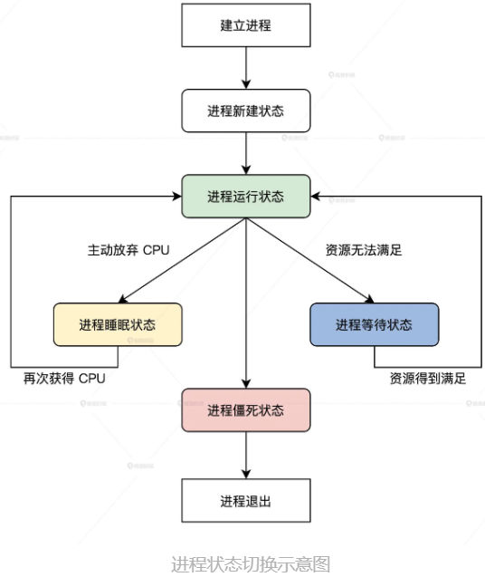
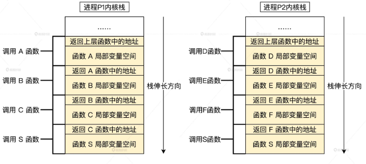
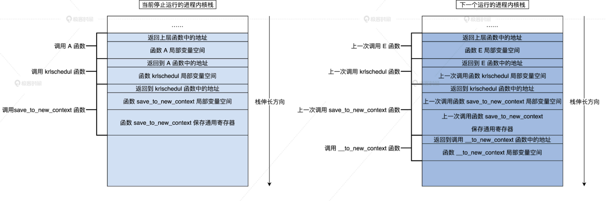

<!-- toc -->
- [为什么需要多进程调度](#为什么需要多进程调度)
- [管理进程](#管理进程)
    - [进程的生命周期](#进程的生命周期)
    - [如何组织进程](#如何组织进程)
    - [管理进程的初始化](#管理进程的初始化)
- [设计实现进程调度器](#设计实现进程调度器)
    - [进程调度器入口](#进程调度器入口)
    - [如何获取当前运行的进程](#如何获取当前运行的进程)
    - [选择下一个进程](#选择下一个进程)
    - [获取空转进程](#获取空转进程)
    - [进程切换](#进程切换)
<!-- tocstop -->

# 为什么需要多进程调度
1. CPU 个数总是比进程个数少，多进程共用一个CPU，每个进程在这个CPU上运行一段时间
2. 当一个进程不能获取某种资源，导致它不能继续运行时，就应该让出 CPU。当然你也可以把第一点中的 CPU 时间，也归纳为一种资源，这样就合并为一点：进程拿不到资源就要让出 CPU

  
就算用完了自己的CPU时间，也要借助进程调度让出CPU

# 管理进程
## 进程的生命周期
系统实现中，通常用进程的状态表示进程的生命周期。进程的状态我们用几个宏来定义。
```c
#define TDSTUS_RUN 0        //进程运行状态
#define TDSTUS_SLEEP 3      //进程睡眠状态
#define TDSTUS_WAIT 4       //进程等待状态
#define TDSTUS_NEW 5        //进程新建状态
#define TDSTUS_ZOMB 6       //进程僵死状态
```
_进程僵死状态，表示进程将要退出系统不再进行调度_  

## 如何组织进程
thread_t表示一个进程，系统中会有很多thread_t结构根据刚才我们对进程生命周期的解读，我们又知道了进程是随时可能建立或者退出的，所以系统中会随时分配或者删除 thread_t 结构。  
应对这样的情况，最简单的办法就是使用链表数据结构，而且我们的进程有优先级，所以我们可以设计成每个优先级对应一个链表头。  
由于这是调度器模块，所以我们要建立几个文件 krlsched.h、krlsched.c  
```c
typedef struct s_THRDLST
{
    list_h_t    tdl_lsth;                //挂载进程的链表头
    thread_t*   tdl_curruntd;            //该链表上正在运行的进程
    uint_t      tdl_nr;                  //该链表上进程个数
}thrdlst_t;

typedef struct s_SCHDATA
{
    spinlock_t  sda_lock;                //自旋锁
    uint_t      sda_cpuid;               //当前CPU id
    uint_t      sda_schdflgs;            //标志
    uint_t      sda_premptidx;           //进程抢占计数
    uint_t      sda_threadnr;            //进程数
    uint_t      sda_prityidx;            //当前优先级
    thread_t*   sda_cpuidle;             //当前CPU的空转进程
    thread_t*   sda_currtd;              //当前正在运行的进程
    thrdlst_t   sda_thdlst[PRITY_MAX];   //进程链表数组
}schdata_t;

typedef struct s_SCHEDCALSS
{
    spinlock_t  scls_lock;                //自旋锁
    uint_t      scls_cpunr;               //CPU个数
    uint_t      scls_threadnr;            //系统中所有的进程数
    uint_t      scls_threadid_inc;        //分配进程id所用
    schdata_t   scls_schda[CPUCORE_MAX];  //每个CPU调度数据结构
}schedclass_t;
```
schedclass_t 是个全局数据结构，这个结构里包含一个 schdata_t 结构数组，数组大小根据 CPU 的数量决定。在每个 schdata_t 结构中，又包含一个进程优先级大小的 thrdlst_t 结构数组。  

## 管理进程的初始化
就是对 schedclass_t 结构的变量的初始化  
由于schedclass_t 结构的变量应该是个全局变量，所以先得在 HuOS6.0/kernel/krlglobal.c 文件中定义一个 schedclass_t 结构的全局变量:  
```c
KRL_DEFGLOB_VARIABLE(schedclass_t,osschedcls);
```
KRL_DEFGLOB_VARIABLE 是一个宏（macro），用于定义全局变量。这个宏可能负责设置变量的存储类别（例如 static、extern 等），以便在其他源文件中使用。

schedclass_t 是一个数据类型，可能是一个结构体、枚举或者别名（typedef）。它代表了操作系统调度器的一个调度类。通常，调度类负责管理不同类型的进程调度策略（例如实时进程、普通进程等）。

osschedcls 是定义的全局变量的名称，它的类型是 schedclass_t。这个变量可能在其他源文件或模块中用于存储或访问操作系统调度类信息。

接着我们在 HuOS6.0/kernel/krlsched.c 文件中写好初始化 osschedcls 变量的代码
```c
void thrdlst_t_init(thrdlst_t *initp)
{
    list_init(&initp->tdl_lsth); //初始化挂载进程的链表
    initp->tdl_curruntd = NULL; //开始没有运行进程
    initp->tdl_nr = 0;  //开始没有进程
    return;
}

void schdata_t_init(schdata_t *initp)
{
    krlspinlock_init(&initp->sda_lock);
    initp->sda_cpuid = hal_retn_cpuid(); //获取CPU id
    initp->sda_schdflgs = NOTS_SCHED_FLGS;
    initp->sda_premptidx = 0;
    initp->sda_threadnr = 0;
    initp->sda_prityidx = 0;
    initp->sda_cpuidle = NULL; //开始没有空转进程和运行的进程
    initp->sda_currtd = NULL;
    for (uint_t ti = 0; ti < PRITY_MAX; ti++)
    {
        //初始化schdata_t结构中的每个thrdlst_t结构
        thrdlst_t_init(&initp->sda_thdlst[ti]);
    }
    return;
}

void schedclass_t_init(schedclass_t *initp)
{
    krlspinlock_init(&initp->scls_lock);
    initp->scls_cpunr = CPUCORE_MAX;  //CPU最大个数
    initp->scls_threadnr = 0;   //开始没有进程
    initp->scls_threadid_inc = 0;
    for (uint_t si = 0; si < CPUCORE_MAX; si++)
    {
        //初始化osschedcls变量中的每个schdata_t
        schdata_t_init(&initp->scls_schda[si]);
    }
    return;
}

void init_krlsched()
{
    //初始化osschedcls变量
    schedclass_t_init(&osschedcls);
    return;
}
```
init_krlsched 函数调用 schedclass_t_init 函数，对 osschedcls 变量进行初始化工作，但是 init_krlsched 函数由谁调用呢  
就是 HuOS6.0/kernel/krlinit.c 文件中的 init_krl 函数，我们在这个函数中来调用 init_krlsched 函数
```c
void init_krl()
{
    init_krlsched();
    die(0); //控制不让init_krl函数返回
    return;
}
```

# 设计实现进程调度器
## 进程调度器入口
其实，进程调度器不过是个函数，和其它函数并没有本质区别，你在其它很多代码执行路径上都可以调用它。只是它会从一个进程运行到下一个进程。  
无非是确定当前正在运行的进程，然后选择下一个将要运行的进程，最后从当前运行的进程，切换到下一个将要运行的进程。  
```c
void krlschedul()
{
    thread_t *prev = krlsched_retn_currthread(),//返回当前运行进程
             *next = krlsched_select_thread();//选择下一个运行的进程
    save_to_new_context(next, prev);//从当前进程切换到下一个进程
    return;
}
```
下面开始实现 krlschedul 函数中的其它功能逻辑
## 如何获取当前运行的进程
获取当前正在运行的进程，目的是为了保存当前进程的运行上下文，确保在下一次调度到当前运行的进程时能够恢复运行。后面你就会看到，每次切换到下一个进程运行时，我们就会将下一个运行的进程设置为当前运行的进程  
```c
thread_t *krlsched_retn_currthread()
{
    uint_t cpuid = hal_retn_cpuid();
    //通过cpuid获取当前cpu的调度数据结构
    schdata_t *schdap = &osschedcls.scls_schda[cpuid];
    if (schdap->sda_currtd == NULL)
    {
        //若调度数据结构中当前运行进程的指针为空，就出错死机
        hal_sysdie("schdap->sda_currtd NULL");
    }
    return schdap->sda_currtd;//返回当前运行的进程
}
```
schdata_t 结构中的 sda_currtd 字段正是保存当前正在运行进程的地址。返回这个字段的值，就能取得当前正在运行的进程。  
## 选择下一个进程
**这个过程是进程调度算法的核心**，它关乎到进程的吞吐量，能否及时响应请求，CPU 的利用率，各个进程之间运行获取资源的公平性，这些问题综合起来就会影响整个操作系统的性能、可靠性。
```c
//osschedcls是schedclass_t的全局变量
thread_t *krlsched_select_thread()
{
    thread_t *retthd, *tdtmp;
    cpuflg_t cufg;
    uint_t cpuid = hal_retn_cpuid();
    schdata_t *schdap = &osschedcls.scls_schda[cpuid];
    krlspinlock_cli(&schdap->sda_lock, &cufg);
    for (uint_t pity = 0; pity < PRITY_MAX; pity++)
    {
        //从最高优先级开始扫描
        if (schdap->sda_thdlst[pity].tdl_nr > 0)
        {
            //若当前优先级的进程链表不为空
            if (list_is_empty_careful(&(schdap->sda_thdlst[pity].tdl_lsth)) == FALSE)
            {
                //取出当前优先级进程链表下的第一个进程
                tdtmp = list_entry(schdap->sda_thdlst[pity].tdl_lsth.next, thread_t, td_list);
                list_del(&tdtmp->td_list);//脱链
                if (schdap->sda_thdlst[pity].tdl_curruntd != NULL)
                {
                    //将这sda_thdlst[pity].tdl_curruntd的进程挂入链表尾
                    list_add_tail(&(schdap->sda_thdlst[pity].tdl_curruntd->td_list), &schdap->sda_thdlst[pity].tdl_lsth);
                }
                schdap->sda_thdlst[pity].tdl_curruntd = tdtmp;
                retthd = tdtmp; //将选择的进程放入sda_thdlst[pity].tdl_curruntd中，并返回
                goto return_step;
            }
            if (schdap->sda_thdlst[pity].tdl_curruntd != NULL)
            {
                //若sda_thdlst[pity].tdl_curruntd不为空就直接返回它
                retthd = schdap->sda_thdlst[pity].tdl_curruntd;
                goto return_step;
            }
        }
    }
    //如果最后也没有找到进程就返回默认的空转进程
    schdap->sda_prityidx = PRITY_MIN;
    retthd = krlsched_retn_idlethread();
return_step:
    //解锁并返回进程
    krlspinunlock_sti(&schdap->sda_lock, &cufg);
    return retthd;
}
```
首先，从高到低扫描优先级进程链表，然后若当前优先级进程链表不为空，就取出该链表上的第一个进程，放入 thrdlst_t 结构中的 tdl_curruntd 字段中，并把之前 thrdlst_t 结构的 tdl_curruntd 字段中的进程挂入该链表的尾部，并返回。最后，当扫描到最低优先级时也没有找到进程，就返回默认的空转进程。  

_**为什么要有一个空转进程，直接返回 NULL 不行吗？**_  
不行，因为调度器的功能必须完成从一个进程到下一个进程的切换，如果没有下一个进程，而上一个进程又不能运行了，调度器将无处可去，整个系统也将停止运行，这当然不是我们要的结果，所以我们要给系统留下最后一条路。  
## 获取空转进程
```c
thread_t *krlsched_retn_idlethread()
{
    uint_t cpuid = hal_retn_cpuid();
    //通过cpuid获取当前cpu的调度数据结构
    schdata_t *schdap = &osschedcls.scls_schda[cpuid];
    if (schdap->sda_cpuidle == NULL)
    {
        //若调度数据结构中空转进程的指针为空，就出错死机
        hal_sysdie("schdap->sda_cpuidle NULL");
    }
    return schdap->sda_cpuidle;//返回空转进程
}
```
## 进程切换
在进程切换前，我们还要了解另一个重要的问题：进程在内核中函数调用路径，那什么是函数调用路径。  
比如进程 P1 调用了函数 A，接着在函数 A 中调用函数 B，然后在函数 B 中调用了函数 C，最后在函数 C 中调用了调度器函数 S，这个函数 A 到函数 S 就是进程 P1 的函数调用路径。  
**函数调用路径是通过栈来保存的，对于运行在内核空间中的进程，就是保存在对应的内核栈中**  
  
实现进程切换的函数。在这个函数中，我们要干这几件事:  
首先，我们把当前进程的通用寄存器保存到当前进程的内核栈中；  
然后，保存 CPU 的 RSP 寄存器到当前进程的机器上下文结构中，并且读取保存在下一个进程机器上下文结构中的 RSP 的值，把它存到 CPU 的 RSP 寄存器中；  
接着，调用一个函数切换 MMU 页表；  
最后，从下一个进程的内核栈中恢复下一个进程的通用寄存器。  
```c
void save_to_new_context(thread_t *next, thread_t *prev)
{
    __asm__ __volatile__(
        "pushfq \n\t"//保存当前进程的标志寄存器
        "cli \n\t"  //关中断
        //保存当前进程的通用寄存器
        "pushq %%rax\n\t"
        "pushq %%rbx\n\t"
        "pushq %%rcx\n\t"
        "pushq %%rdx\n\t"
        "pushq %%rbp\n\t"
        "pushq %%rsi\n\t"
        "pushq %%rdi\n\t"
        "pushq %%r8\n\t"
        "pushq %%r9\n\t"
        "pushq %%r10\n\t"
        "pushq %%r11\n\t"
        "pushq %%r12\n\t"
        "pushq %%r13\n\t"
        "pushq %%r14\n\t"
        "pushq %%r15\n\t"
        //保存CPU的RSP寄存器到当前进程的机器上下文结构中
        "movq %%rsp,%[PREV_RSP] \n\t"
        //把下一个进程的机器上下文结构中的RSP的值，写入CPU的RSP寄存器中
        "movq %[NEXT_RSP],%%rsp \n\t"//事实上这里已经切换到下一个进程了，因为切换进程的内核栈
        //调用__to_new_context函数切换MMU页表
        "callq __to_new_context\n\t"
        //恢复下一个进程的通用寄存器
        "popq %%r15\n\t"
        "popq %%r14\n\t"
        "popq %%r13\n\t"
        "popq %%r12\n\t"
        "popq %%r11\n\t"
        "popq %%r10\n\t"
        "popq %%r9\n\t"
        "popq %%r8\n\t"
        "popq %%rdi\n\t"
        "popq %%rsi\n\t"
        "popq %%rbp\n\t"
        "popq %%rdx\n\t"
        "popq %%rcx\n\t"
        "popq %%rbx\n\t"
        "popq %%rax\n\t"
        "popfq \n\t"      //恢复下一个进程的标志寄存器
        //输出当前进程的内核栈地址
        : [ PREV_RSP ] "=m"(prev->td_context.ctx_nextrsp)
        //读取下一个进程的内核栈地址
        : [ NEXT_RSP ] "m"(next->td_context.ctx_nextrsp), "D"(next), "S"(prev)//为调用__to_new_context函数传递参数
        : "memory");
    return;
}
```
通过切换进程的内核栈，导致切换进程，因为进程的函数调用路径就保存在对应的内核栈中，只要调用 krlschedul 函数，最后的函数调用路径一定会停在 save_to_new_context 函数中，当 save_to_new_context 函数一返回，就会导致回到调用 save_to_new_context 函数的下一行代码开始运行，在这里就是返回到 krlschedul 函数中，最后层层返回。  
  
同时你也会发现一个问题，就是这个切换机制能够正常运行，必须保证下一个进程已经被调度过，也就是它调用执行过 krlschedul 函数。  
那么已知新建进程绝对没有调用过 krlschedul 函数，所以它得进行特殊处理。我们在 __to_new_context 函数中完成这个特殊处理  
```c
void __to_new_context(thread_t *next, thread_t *prev)
{
    uint_t cpuid = hal_retn_cpuid();
    schdata_t *schdap = &osschedcls.scls_schda[cpuid];
    //设置当前运行进程为下一个运行的进程
    schdap->sda_currtd = next;
    //设置下一个运行进程的tss为当前CPU的tss
    next->td_context.ctx_nexttss = &x64tss[cpuid];
    //设置当前CPU的tss中的R0栈为下一个运行进程的内核栈
    next->td_context.ctx_nexttss->rsp0 = next->td_krlstktop;
    //装载下一个运行进程的MMU页表
    hal_mmu_load(&next->td_mmdsc->msd_mmu);
    if (next->td_stus == TDSTUS_NEW)
    {
        //如果是新建进程第一次运行就要进行处理
        next->td_stus = TDSTUS_RUN;
        retnfrom_first_sched(next);
    }
    return;
}
```
__to_new_context 负责设置当前运行的进程，处理 CPU 发生中断时需要切换栈的问题，又切换了一个进程的 MMU 页表（即使用新进程的地址空间），最后如果是新建进程第一次运行，就调用 retnfrom_first_sched 函数进行处理。下面我们来写好这个函数。  
```c
void retnfrom_first_sched(thread_t *thrdp)
{
    __asm__ __volatile__(
        "movq %[NEXT_RSP],%%rsp\n\t"  //设置CPU的RSP寄存器为该进程机器上下文结构中的RSP
        //恢复进程保存在内核栈中的段寄存器
        "popq %%r14\n\t"
        "movw %%r14w,%%gs\n\t"
        "popq %%r14\n\t"
        "movw %%r14w,%%fs\n\t"
        "popq %%r14\n\t"
        "movw %%r14w,%%es\n\t"
        "popq %%r14\n\t"
        "movw %%r14w,%%ds\n\t"
        //恢复进程保存在内核栈中的通用寄存器
        "popq %%r15\n\t"
        "popq %%r14\n\t"
        "popq %%r13\n\t"
        "popq %%r12\n\t"
        "popq %%r11\n\t"
        "popq %%r10\n\t"
        "popq %%r9\n\t"
        "popq %%r8\n\t"
        "popq %%rdi\n\t"
        "popq %%rsi\n\t"
        "popq %%rbp\n\t"
        "popq %%rdx\n\t"
        "popq %%rcx\n\t"
        "popq %%rbx\n\t"
        "popq %%rax\n\t"
        //恢复进程保存在内核栈中的RIP、CS、RFLAGS，（有可能需要恢复进程应用程序的RSP、SS）寄存器
        "iretq\n\t"
        :
        : [ NEXT_RSP ] "m"(thrdp->td_context.ctx_nextrsp)
        : "memory");
}
```
retnfrom_first_sched 函数不会返回到调用它的 __to_new_context 函数中，而是直接运行新建进程的相关代码
```
当调度器函数调度到一个新建进程时，为何要进入 retnfrom_first_sched 函数呢？
retnfrom_first_sched 函数不会返回到调用它的 __to_new_context 函数中，而是直接运行新建进程的相关代码。 新的进程暂时还没有上下文，所以也就没办法切换了，于是直接运行。
```