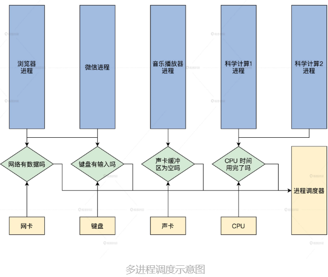

<!-- toc -->
- [为什么需要多进程调度](#为什么需要多进程调度)
- [管理进程](#管理进程)

<!-- tocstop -->

# 为什么需要多进程调度
1. CPU 个数总是比进程个数少，多进程共用一个CPU，每个进程在这个CPU上运行一段时间
2. 当一个进程不能获取某种资源，导致它不能继续运行时，就应该让出 CPU。当然你也可以把第一点中的 CPU 时间，也归纳为一种资源，这样就合并为一点：进程拿不到资源就要让出 CPU

  
就算用完了自己的CPU时间，也要借助进程调度让出CPU

# 管理进程

