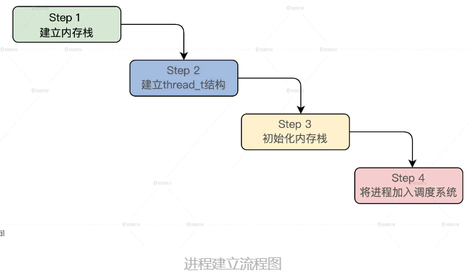
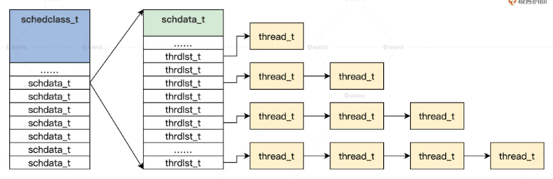

此章节为进程设计部分：   
### Process Design
### [Code](./HuOS6.0/)
#### [What_is_Process](./What_is_Process/README.md)

### [Code](./HuOS7.0/)
#### [Manage_Process](./Manage_Process/README.md)

#### [Process_weak_wait](./Process_weak_wait/README.md)
#### [Linux_Process_Manage](./Linux_Process/README.md)