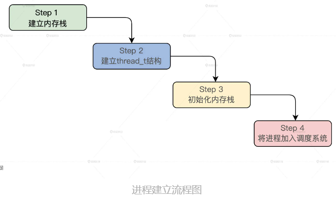

<!-- toc -->
- [从 SLAB 中分配 task_struct 结构，以及从伙伴内存系统分配内核栈的过程什么是进程](#从-slab-中分配-task_struct-结构以及从伙伴内存系统分配内核栈的过程什么是进程)
- [进程的结构](#进程的结构)
- [细化进程需要实现的功能](#细化进程需要实现的功能)
- [实现进程](#实现进程)
    - [表示一个进程](#表示一个进程)
    - [进程的地址空间](#进程的地址空间)
    - [进程的机器上下文](#进程的机器上下文)
- [建立进程](#建立进程)
    - [建立进程接口](#建立进程接口)
    - [建立内核进程](#建立内核进程)
    - [创建thread_t结构](#创建thread_t结构)
    - [初始化内核栈](#初始化内核栈)
    - [建立普通进程](#建立普通进程)
- [重点回顾](#重点回顾)
<!-- tocstop -->

# 从 SLAB 中分配 task_struct 结构，以及从伙伴内存系统分配内核栈的过程什么是进程
进程是操作系统中一个层次非常高的组件，并且他非常依赖于内存管理、中断、硬件体系结构。  
终端输入ps -aux，显示的是一些具体进程的数据，如创建进程和用户、进程 ID、使用 CPU 的百分比，进程运行状态，进程的建立时间、进程的运行时间、进程名等，这些数据综合起来就代表了一个进程。  
```
运行一个应用程序时，操作系统也要记录这个应用程序使用多少内存，打开了什么文件，当有些资源不可用的时候要不要睡眠，当前进程运行到哪里了。操作系统把这些信息综合统计，存放在内存中，抽象为进程。
```
因此进程的抽象概念为：进程是一个应用程序运行时刻的实例（从进程的结构看）；进程是应用程序运行时所需资源的容器（从进程的功能看）；甚至进程是一堆数据结构（从操作系统对进程实现的角度来说）。  

# 进程的结构
进程是一个应用程序运行时刻的实例，它的目的就是操作系统用于管理和运行多个应用程序的。  
所以进程必须要有一个地址空间，这个地址空间至少包括两部分内容：一部分是内核，一部分是用户的应用程序。  
结合 x86 硬件平台对虚拟地址空间的制约，画一幅图：  
  
图中有 8 个进程，每个进程拥有 x86 CPU 的整个虚拟地址空间，这个虚拟地址空间被分成了两个部分，上半部分是所有进程都共享的内核部分 ，里面放着一份内核代码和数据，下半部分是应用程序，分别独立，互不干扰。  
  
当 CPU 在 R0 特权级运行时，就运行在上半部分内核的地址空间中，当 CPU 在 R3 特权级时，就运行在下半部分的应用程序地址空间中。各进程的虚拟地址空间是相同的，它们之间物理地址不同，是由 MMU 页表进行隔离的，所以每个进程的应用程序的代码绝对不能随意访问内核的代码和数据。  

# 细化进程需要实现的功能
1. 内核必须能够命令应用程序，让它随时中断（进入内核地址空间）或恢复执行，这就需要保存应用程序的机器上下文和它运行时刻的栈。  
2. 就像活动组织者会用表格备案一样，内核还需要记录一个应用程序都访问了哪些资源，比如打开了某个文件，或是访问了某个设备。而这样的“记录表”，我们就用“资源描述符”来表示。  

```
机器上下文（Machine Context）指的是处理器在执行指令时，与指令执行状态相关的所有寄存器、内核函数调用路径、标志位等处理器状态的集合。
```
进程是一个应用程序运行时刻的实例。那这样一来，一个细化的进程结构，就可以像下图这样设计。  
  
其中带 * 号是每个进程都有独立一份，有了这样的设计结构，多个进程就能并发运行了  

# 实现进程
## 表示一个进程
对于一个进程，它有状态，id，运行时间，优先级，应用程序栈，内核栈，机器上下文，资源描述符，地址空间，我们将这些信息组织在一起，就形成了一个进程的数据结构。  
在 HuOS6.0/include/knlinc/ 目录下建立一个 krlthread_t.h 文件，在其中写上代码  
```c
HuOS6.0/include/knlinc/krlthread_t.h

typedef struct s_THREAD
{
    spinlock_t  td_lock;           //进程的自旋锁
    list_h_t    td_list;           //进程链表
    uint_t      td_flgs;           //进程的标志
    uint_t      td_stus;           //进程的状态
    uint_t      td_cpuid;          //进程所在的CPU的id
    uint_t      td_id;             //进程的id
    uint_t      td_tick;           //进程运行了多少tick
    uint_t      td_privilege;      //进程的权限
    uint_t      td_priority;       //进程的优先级
    uint_t      td_runmode;        //进程的运行模式
    adr_t       td_krlstktop;      //应用程序内核栈顶地址
    adr_t       td_krlstkstart;    //应用程序内核栈开始地址
    adr_t       td_usrstktop;      //应用程序栈顶地址
    adr_t       td_usrstkstart;    //应用程序栈开始地址
    mmadrsdsc_t* td_mmdsc;         //地址空间结构
    context_t   td_context;        //机器上下文件结构
    objnode_t*  td_handtbl[TD_HAND_MAX];//打开的对象数组
}thread_t;
```
进程的内核栈和进程的应用程序栈是两块内存空间，进程的权限表示一个进程是用户进程还是系统进程。  
进程有 64 个优先级，**td_priority 数值越小优先级越高**。td_handtbl 只是一个 objnode_t 结构的指针类型数组。  
一个进程打开一个文件内核就会创建一个对应的 objnode_t 结构的实例变量，这个 objnode_t 结构的地址就保存在 td_handtbl 数组中。你可以这么理解：这个 objnode_t 结构就是进程打开资源的描述符。  
## 进程的地址空间
在 thread_t 结构中有个 mmadrsdsc_t 结构的指针，在这个结构中有虚拟地址区间结构和 MMU 相关的信息。  
在常规情况下，新建一个进程就要建立一个 mmadrsdsc_t 结构，让 thread_t 结构的 td_mmdsc 的指针变量指向它。  
## 进程的机器上下文
CPU 的通用寄存器，是中断发生进入内核时，压入内核栈中的；从中断入口处开始调用的函数，都是属于内核的函数。  
函数的调用路径就在内核栈中，整个过程是这样的：  
进程调度器函数会调用进程切换函数，完成切换进程这个操作，而在进程切换函数中会保存栈寄存器的值  
```c
typedef struct s_CONTEXT
{
    uint_t       ctx_nextrip; //保存下一次运行的地址
    uint_t       ctx_nextrsp; //保存下一次运行时内核栈的地址
    x64tss_t*    ctx_nexttss; //指向tss结构
}context_t;
```
TSS（Task State Segment）结构是x86架构中的一个数据结构，用于存储任务（进程）的上下文信息。每个任务在x86架构中都有自己的TSS结构，其中包含了该任务的状态信息，包括代码段、数据段、栈指针等。当任务切换时，CPU会保存当前任务的状态信息到其TSS结构中，然后加载新任务的TSS结构中保存的状态信息。  
TSS结构在保护模式下使用，可用于多任务操作系统的实现。在Linux内核中，TSS结构被用于保存进程的堆栈和内核态栈的指针。  
context_t 结构中的字段不多，我们相对陌生的就是 x64tss_t 结构的指针，这个结构是 CPU 要求的一个结构，**这个结构它本身的地址放在一个 GDT 表项中，由 CPU 的 tr 寄存器指向**，tr 寄存器中的值是 GDT 中 x64tss_t 结构项对应的索引。  
```c
HuOS6.0/hal/x86/halglobal.c

// 每个CPU核心一个tss
HAL_DEFGLOB_VARIABLE(x64tss_t,x64tss)[CPUCORE_MAX];

typedef struct s_X64TSS
{
    u32_t reserv0; //保留
    u64_t rsp0;  //R0特权级的栈地址
    u64_t rsp1;  //R1特权级的栈地址，我们未使用
    u64_t rsp2;  //R2特权级的栈地址，我们未使用
    u64_t reserv28;//保留
    u64_t ist[7];  //我们未使用
    u64_t reserv92;//保留
    u16_t reserv100;//保留
    u16_t iobase;   //我们未使用
}__attribute__((packed)) x64tss_t;
```
CPU 在发生中断时，会根据中断门描述里的目标段选择子，进行必要的特权级切换，特权级的切换就必须要切换栈，CPU 硬件会自己把当前 rsp 寄存器保存到内部的临时寄存器 tmprsp；然后从 x64tss_t 结构体中找出对应的栈地址，装入 rsp 寄存器中；接着，再把当前的 ss、tmprsp、rflags、cs、rip，依次压入当前 rsp 指向的栈中。  

# 建立进程
即在内存中建立起对应的数据结构的实例变量。但是对进程来说，并不是建立 thread_t 结构的实例变量就完事了，还要建立进程的应用程序栈和进程的内核栈，进程地址空间等。  
## 建立进程接口
```c
HuOS6.0/kernel/krlthread.c

//参数从左到右分别是应用程序启动运行的地址、创建标志、进程权限和进程优先级、进程的应用程序栈和内核栈大小
thread_t *krlnew_thread(void *filerun, uint_t flg, uint_t prilg, uint_t prity, size_t usrstksz, size_t krlstksz)
{
    size_t tustksz = usrstksz, tkstksz = krlstksz;
    //对参数进行检查，不合乎要求就返回NULL表示创建失败
    if (filerun == NULL || usrstksz > DAFT_TDUSRSTKSZ || krlstksz > DAFT_TDKRLSTKSZ)
    {
        return NULL;
    }
    if ((prilg != PRILG_USR && prilg != PRILG_SYS) || (prity >= PRITY_MAX))
    {
        return NULL;
    }
    //默认大小8个页面
    //进程应用程序栈大小检查，小于默认大小则使用默认大小
    if (usrstksz < DAFT_TDUSRSTKSZ)
    {
        tustksz = DAFT_TDUSRSTKSZ;
    }
    //进程内核栈大小检查，小于默认大小则使用默认大小
    if (krlstksz < DAFT_TDKRLSTKSZ)
    {
        tkstksz = DAFT_TDKRLSTKSZ;
    }
    //是否建立内核进程
    if (KERNTHREAD_FLG == flg)
    {
        return krlnew_kern_thread_core(filerun, flg, prilg, prity, tustksz, tkstksz);
    }
    //是否建立普通进程
    else if (USERTHREAD_FLG == flg)
    {
        return krlnew_user_thread_core(filerun, flg, prilg, prity, tustksz, tkstksz);
    }
    return NULL;
}
```
进程对栈的大小有要求，如果小于默认大小 8 个页面就使用默认的栈大小，最后根据创建标志确认是建立内核态进程还是建立普通进程。  
## 建立内核进程
内核进程就是用进程的方式去运行一段内核代码，那么这段代码就可以随时暂停或者继续运行，又或者和其它代码段并发运行，只是这种进程永远不会回到进程应用程序地址空间中去，只会在内核地址空间中运行。  
首先分配一个内核栈的内存空间，接着创建 thread_t 结构的实例变量，然后对 thread_t 结构体的字段进行设置，最后，初始化进程内核栈把这个新进程加入到进程的调度系统之中。  
```c
thread_t *krlnew_kern_thread_core(void *filerun, uint_t flg, uint_t prilg, uint_t prity, size_t usrstksz, size_t krlstksz)
{
    thread_t *ret_td = NULL;
    bool_t acs = FALSE;
    adr_t krlstkadr = NULL;
    //分配内核栈空间
    krlstkadr = krlnew(krlstksz);
    if (krlstkadr == NULL)
    {
        return NULL;
    }
    //建立thread_t结构体的实例变量
    ret_td = krlnew_thread_dsc();
    if (ret_td == NULL)
    {
        //创建失败必须要释放之前的栈空间
        acs = krldelete(krlstkadr, krlstksz);
        if (acs == FALSE)
        {
            return NULL;
        }
        return NULL;
    }
    //设置进程权限
    ret_td->td_privilege = prilg;
    //设置进程优先级
    ret_td->td_priority = prity;
    //设置进程的内核栈顶和内核栈开始地址
    ret_td->td_krlstktop = krlstkadr + (adr_t)(krlstksz - 1);
    ret_td->td_krlstkstart = krlstkadr;
    //初始化进程的内核栈
    krlthread_kernstack_init(ret_td, filerun, KMOD_EFLAGS);
    //加入进程调度系统
    krlschdclass_add_thread(ret_td);
    //返回进程指针
    return ret_td;
}
```
## 创建thread_t结构
首先，我们以 thread_t 结构的地址作为进程的 ID，这个 ID 具有唯一性；其次，我们目前没有为一个进程分配mmadrsdsc_t 结构体，而是指向了默认的地址空间结构 initmmadrsdsc；最后，hal_retn_cpuid 函数在目前的情况下永远返回 0，这是因为我们使用了一个 CPU。  
```c
//初始化context_t结构
void context_t_init(context_t *initp)
{
    initp->ctx_nextrip = 0;
    initp->ctx_nextrsp = 0;
    //指向当前CPU的tss
    initp->ctx_nexttss = &x64tss[hal_retn_cpuid()];
    return;
}

//返回进程id其实就thread_t结构的地址
uint_t krlretn_thread_id(thread_t *tdp)
{
    return (uint_t)tdp;
}

//初始化thread_t结构
void thread_t_init(thread_t *initp)
{
    krlspinlock_init(&initp->td_lock);
    list_init(&initp->td_list);
    initp->td_flgs = TDFLAG_FREE;
    initp->td_stus = TDSTUS_NEW;//进程状态为新建
    initp->td_cpuid = hal_retn_cpuid();
    initp->td_id = krlretn_thread_id(initp);
    initp->td_tick = 0;
    initp->td_privilege = PRILG_USR;//普通进程权限
    initp->td_priority = PRITY_MIN;//最高优先级
    initp->td_runmode = 0;
    initp->td_krlstktop = NULL;
    initp->td_krlstkstart = NULL;
    initp->td_usrstktop = NULL;
    initp->td_usrstkstart = NULL;
    initp->td_mmdsc = &initmmadrsdsc;//指向默认的地址空间结构

    context_t_init(&initp->td_context);
    //初始化td_handtbl数组
    for (uint_t hand = 0; hand < TD_HAND_MAX; hand++)
    {
        initp->td_handtbl[hand] = NULL;
    }
    return;
}

//创建thread_t结构
thread_t *krlnew_thread_dsc()
{
    //分配thread_t结构大小的内存空间
    thread_t *rettdp = (thread_t *)(krlnew((size_t)(sizeof(thread_t))));
    if (rettdp == NULL)
    {
        return NULL;
    }
    //初始化刚刚分配的thread_t结构
    thread_t_init(rettdp);
    return rettdp;
}
```
## 初始化内核栈
我们初始化进程的内核栈，其实是为了在进程的内核栈中放置一份 CPU 的寄存器数据。  
这份 CPU 寄存器数据是一个进程机器上下文的一部分，当一个进程开始运行时，我们将会使用“pop”指令从进程的内核栈中弹出到 CPU 中，这样 CPU 就开始运行进程了，CPU 的一些寄存器是有位置关系的，所以我们要定义一个结构体来操作它们  
```s
rflags（寄存器标志）寄存器是x86架构中的一个特殊寄存器，它存储了许多与当前处理器状态相关的标志位。rflags 寄存器用于表示状态信息、控制处理器操作以及控制条件分支等。

rflags 寄存器中的一些主要标志位如下：

CF（进位标志）：当算术操作产生进位或借位时，该标志被设置。
PF（奇偶标志）：当一个操作的结果包含偶数个1时，该标志被设置。
AF（辅助进位标志）：当一个操作在低四位产生进位或借位时，该标志被设置。
ZF（零标志）：当一个操作的结果为零时，该标志被设置。
SF（符号标志）：当一个操作的结果为负数时（最高位为1），该标志被设置。
TF（陷阱标志）：用于调试，当设置后，处理器会在每条指令执行后产生一个陷阱。
IF（中断使能标志）：当设置后，处理器允许外部中断请求。
DF（方向标志）：用于控制字符串操作的方向，如复制、比较等。
OF（溢出标志）：当有符号算术操作产生溢出时，该标志被设置。

这些标志位在很多情况下都很重要，例如在条件分支指令（如 jz、jnz、jb 等）中，处理器会根据这些标志位来确定分支是否应该被执行。这使得程序员可以根据操作结果来进行不同的操作。
```
```c
typedef struct s_INTSTKREGS
{
    uint_t r_gs;
    uint_t r_fs;
    uint_t r_es;
    uint_t r_ds;  //段寄存器
    uint_t r_r15;
    uint_t r_r14;
    uint_t r_r13;
    uint_t r_r12;
    uint_t r_r11;
    uint_t r_r10;
    uint_t r_r9;
    uint_t r_r8;
    uint_t r_rdi;
    uint_t r_rsi;
    uint_t r_rbp;
    uint_t r_rdx; //通用寄存器
    uint_t r_rcx;
    uint_t r_rbx;
    uint_t r_rax;
    uint_t r_rip_old;//程序的指针寄存器
    uint_t r_cs_old;//代码段寄存器
    uint_t r_rflgs; //rflags标志寄存
    uint_t r_rsp_old;//栈指针寄存器
    uint_t r_ss_old; //栈段寄存器
}intstkregs_t;
```
intstkregs_t 结构中，每个字段都是 8 字节 64 位的，**因为 x86 CPU 在长模式下 rsp 栈指针寄存器始终 8 字节对齐**。栈是向下伸长的（从高地址向低地址）所以这个结构是反向定义（相对于栈）,下面我们来写代码初始化内核栈  
```c
//初始化进程的内核栈
void krlthread_kernstack_init(thread_t *thdp, void *runadr, uint_t cpuflags)
{
    //处理栈顶16字节对齐
    thdp->td_krlstktop &= (~0xf);
    thdp->td_usrstktop &= (~0xf);
    //内核栈顶减去intstkregs_t结构的大小
    intstkregs_t *arp = (intstkregs_t *)(thdp->td_krlstktop - sizeof(intstkregs_t));
    //把intstkregs_t结构的空间初始化为0
    hal_memset((void*)arp, 0, sizeof(intstkregs_t));
    //rip寄存器的值设为程序运行首地址
    arp->r_rip_old = (uint_t)runadr;
    //cs寄存器的值设为内核代码段选择子
    arp->r_cs_old = K_CS_IDX;
    arp->r_rflgs = cpuflags;
    //返回进程的内核栈
    arp->r_rsp_old = thdp->td_krlstktop;
    arp->r_ss_old = 0;
    //其它段寄存器的值设为内核数据段选择子
    arp->r_ds = K_DS_IDX;
    arp->r_es = K_DS_IDX;
    arp->r_fs = K_DS_IDX;
    arp->r_gs = K_DS_IDX;
    //设置进程下一次运行的地址为runadr
    thdp->td_context.ctx_nextrip = (uint_t)runadr;
    //设置进程下一次运行的栈地址为arp
    thdp->td_context.ctx_nextrsp = (uint_t)arp;
    return;
}
```
第 7 行arp 为什么要用内核栈顶地址减去 intstkregs_t 结构的大小呢？  
C 语言处理结构体时，从结构体第一个字段到最后一个字段，这些字段的地址是从下向上（地址从低到高）伸长的，而栈正好相反，所以要减去 intstkregs_t 结构的大小，为 intstkregs_t 结构腾出空间  
  
因为我们建立的是内核态进程，所以上面初始化的内核栈是不能返回到进程的应用程序空间的。而如果要返回到进程的应用程序空间中，内核栈中的内容是不同的，但是内核栈结构却一样。  
```
当进程从内核态返回到用户态时，内核栈的内容会发生变化。这是因为不同的进程可能具有不同的上下文信息。为了保持这些信息的独立性，操作系统需要在进程间切换时保存和恢复各自的上下文。内核栈主要用于保存进程在内核态运行时的上下文。
```
**初始化返回进程应用程序空间的内核栈。请注意，初始化的还是内核栈，只是内容不同**  
```c
void krlthread_userstack_init(thread_t *thdp, void *runadr, uint_t cpuflags)
{
    //处理栈顶16字节对齐
    thdp->td_krlstktop &= (~0xf);
    thdp->td_usrstktop &= (~0xf);
    //内核栈顶减去intstkregs_t结构的大小
    intstkregs_t *arp = (intstkregs_t *)(thdp->td_krlstktop - sizeof(intstkregs_t));
    //把intstkregs_t结构的空间初始化为0
    hal_memset((void*)arp, 0, sizeof(intstkregs_t));
    //rip寄存器的值设为程序运行首地址 
    arp->r_rip_old = (uint_t)runadr;
    //cs寄存器的值设为应用程序代码段选择子 
    arp->r_cs_old = U_CS_IDX;
    arp->r_rflgs = cpuflags;
    //返回进程应用程序空间的栈
    arp->r_rsp_old = thdp->td_usrstktop;
    //其它段寄存器的值设为应用程序数据段选择子
    arp->r_ss_old = U_DS_IDX;
    arp->r_ds = U_DS_IDX;
    arp->r_es = U_DS_IDX;
    arp->r_fs = U_DS_IDX;
    arp->r_gs = U_DS_IDX;
    //设置进程下一次运行的地址为runadr
    thdp->td_context.ctx_nextrip = (uint_t)runadr;
    //设置进程下一次运行的栈地址为arp
    thdp->td_context.ctx_nextrsp = (uint_t)arp;
    return;
}
```
上述代码中初始化进程的内核栈，所使用的段选择子指向的是应用程序的代码段和数据段，这个代码段和数据段它们特权级为 R3，CPU 正是根据这个代码段、数据段选择子来切换 CPU 工作特权级的。这样，CPU 的执行流就可以返回到进程的应用程序空间了。  
## 建立普通进程
在建立进程的接口函数 krlnew_thread 的流程中，会根据参数 flg 的值，选择调用不同的函数，来建立不同类型的进程。  
```c
//建立普通进程
thread_t *krlnew_user_thread_core(void *filerun, uint_t flg, uint_t prilg, uint_t prity, size_t usrstksz, size_t krlstksz)
{
    thread_t *ret_td = NULL;
    bool_t acs = FALSE;
    adr_t usrstkadr = NULL, krlstkadr = NULL;
    //分配应用程序栈空间
    usrstkadr = krlnew(usrstksz);
    if (usrstkadr == NULL)
    {
        return NULL;
    }
    //分配内核栈空间
    krlstkadr = krlnew(krlstksz);
    if (krlstkadr == NULL)
    {
        if (krldelete(usrstkadr, usrstksz) == FALSE)
        {
            return NULL;
        }
        return NULL;
    }
    //建立thread_t结构体的实例变量
    ret_td = krlnew_thread_dsc();
    //创建失败必须要释放之前的栈空间
    if (ret_td == NULL)
    {
        acs = krldelete(usrstkadr, usrstksz);
        acs = krldelete(krlstkadr, krlstksz);
        if (acs == FALSE)
        {
            return NULL;
        }
        return NULL;
    }
    //设置进程权限 
    ret_td->td_privilege = prilg;
    //设置进程优先级
    ret_td->td_priority = prity;
    //设置进程的内核栈顶和内核栈开始地址
    ret_td->td_krlstktop = krlstkadr + (adr_t)(krlstksz - 1);
    ret_td->td_krlstkstart = krlstkadr;
    //设置进程的应用程序栈顶和内核应用程序栈开始地址
    ret_td->td_usrstktop = usrstkadr + (adr_t)(usrstksz - 1);
    ret_td->td_usrstkstart = usrstkadr;
    //初始化返回进程应用程序空间的内核栈
    krlthread_userstack_init(ret_td, filerun, UMOD_EFLAGS);
    //加入调度器系统
    krlschdclass_add_thread(ret_td);
    return ret_td;
}
```
和建立内核进程相比，建立普通进程有两点不同。  
1. 多分配了一个应用程序栈。因为内核进程不会返回到进程的应用程序空间，所以不需要应用程序栈，而普通进程则需要
2. 在最后调用的是 krlthread_userstack_init 函数，该函数初始化返回进程应用程序空间的内核栈，这在前面已经介绍过了

# 重点回顾
表示进程的数据结构，与进程相关内存地址空间结构，还有进程的机器上下文数据结构。这些数据结构综合起来就表示了进程。  
建立进程的过程无非是创建进程结构体、分配进程的内核栈与应用程序栈，并对进程的内核栈进行初始化，最后将进程加入调度系统，以便后面将进程投入运行。  
  
```
各个进程是如何共享同一份内核代码和数据的？
每个进程都有一个内核栈，指向同一块内核内存区域，共享一份内核代码和内核数据。内核进程一份页表，用户进程两份页表，用户进程多了一份用户空间页表，与其它用户进程互不干扰。
```