https://zhuanlan.zhihu.com/p/273829162

<!-- toc -->
- [红黑树](#红黑树)
    - [平衡树（B树）](#平衡树（B树）)
    - [2-3-4树到红黑树的转化](#2-3-4树到红黑树的转化)
    - [2-3树的插入删除操作](#2-3树的插入删除操作)
        - [插入](#插入)
        - [删除](#删除)
    - [红黑树介绍](#红黑树介绍)
        - [红黑树的插入删除](#红黑树的插入删除)
    - [问题](#问题)
<!-- tocstop -->

# 红黑树
诸如Java中HashMap的底层实现，在JDK1.8中为了解决过度哈希冲突带来的长链表，会将链表转为红黑树；Linux底层的CFS进程调度算法中，vruntime利用红黑树来进行存储；多路复用技术的Epoll的核心结构也是红黑树+双向链表。  
_我是在看到Linux的CFS算法中的红黑树，才开始对红黑树有了一些兴趣_  
红黑树也是对树结构的一种高度综合运用，涉及到多叉树，树平衡调整，节点旋转等等，这些是对数据结构基本功的最佳历练。  

## 平衡树（B树）
红黑树的本质其实也是对概念模型：2-3-4树的一种实现，因此我们先来关注2-3-4树。2-3-4树是阶数为4的B树。（树的阶数指的是树中每个节点最多拥有的子节点数目。例如，一个二叉树的阶数为2，一个四叉树的阶数为4。）  
B树，全名BalanceTree，平衡多路查找树。这种结构主要用来做查找。  

B树最重要的特性在于平衡，这使得我们能够在最坏情况下也保持O(LogN)的时间复杂度实现查找（一个不具备平衡性的查找树可能退化成单链表，时间复杂度会到O（N））。  
**在此需要提醒大家一下，平衡的定义是说从空链接到根节点距离相等，此处一定要用心理解。（也就是说非叶子节点是不会存在空链接的）**  

2-3-4树是一颗阶数为4的B树，所以它会存在2节点, 3节点和4节点。2节点中存放着一个key[X]，两个指针，分别指向小于X的子节点和大于X的子节点；3节点中存放在两个key[X,Y],三个指针，分别指向小于X的子节点，介于X~Y之间的子节点和大于Y的子节点；4节点依此类推。  
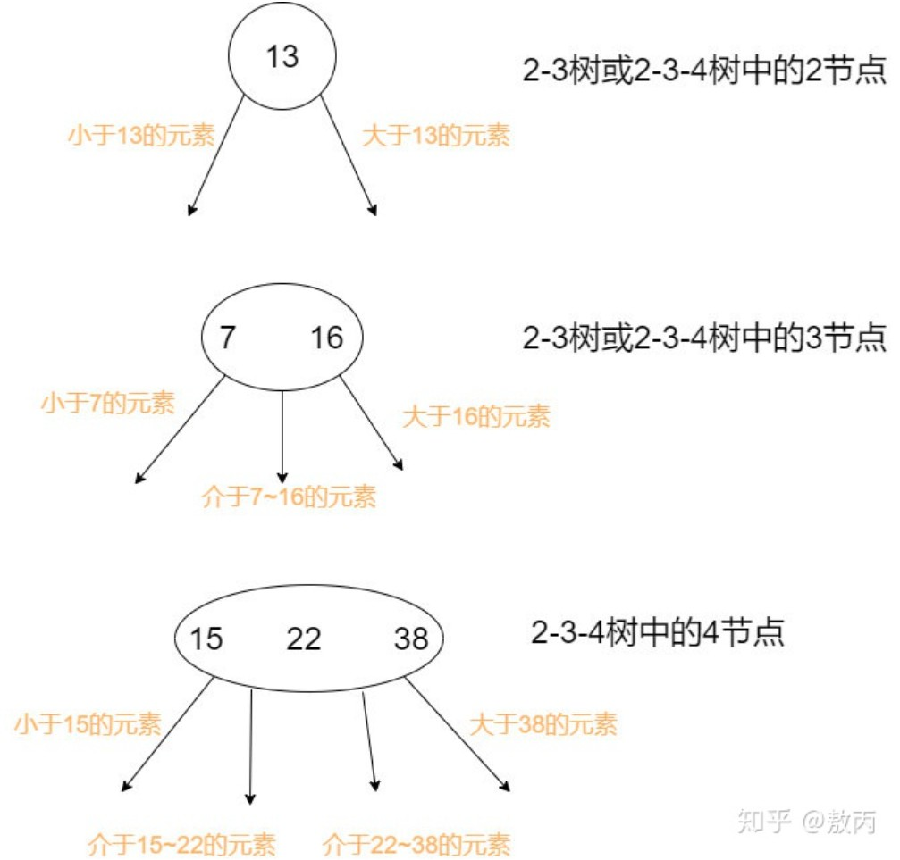  

## 2-3-4树到红黑树的转化
红黑树是对概念模型2-3-4树的一种实现，由于直接进行不同节点间的转化会造成较大的开销，所以选择以二叉树为基础，在二叉树的属性中加入一个颜色属性来表示2-3-4树中不同的节点。  
2-3-4树中的2节点对应着红黑树中的黑色节点，而2-3-4树中的非2节点是以红节点+黑节点的方式存在。红节点的意义是与黑色父节点结合，表达着2-3-4树中的3，4节点。（此处理解成红节点也好，红色链接也好，看个人喜好。很多书中会说是由黑色节点指出的红色链接，链接指向的节点颜色为红。）  
我们先看2-3-4树到红黑树的节点转换。2节点直接转化为黑色节点；3节点这里可以有两种表现形式，左倾红节点或者右倾红节点。而4节点被强制要求转化为一个黑父带着左右两个红色儿子。  
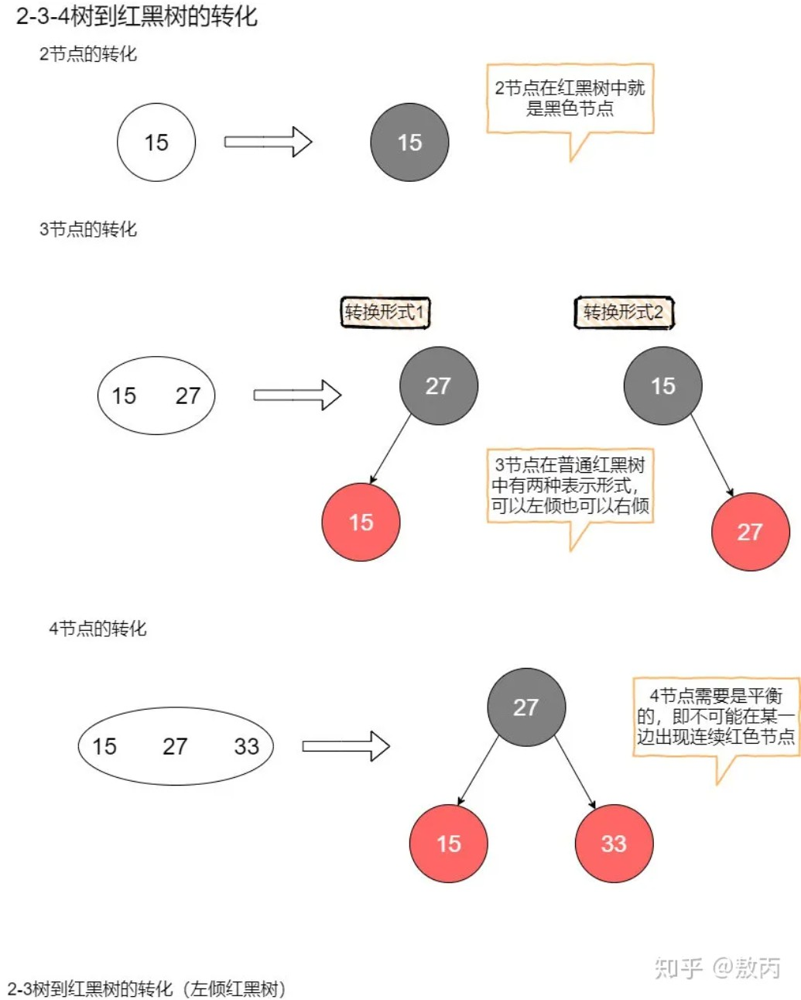  
本文的研究主体是2-3树（原因会在后文给出），并且是2-3树中较为特殊的一种转化--左倾红黑树。顾名思义，左倾红黑树限制了如果在树中出现了红色节点，那么这个节点必须是左儿子。以下是它的转化过程：  
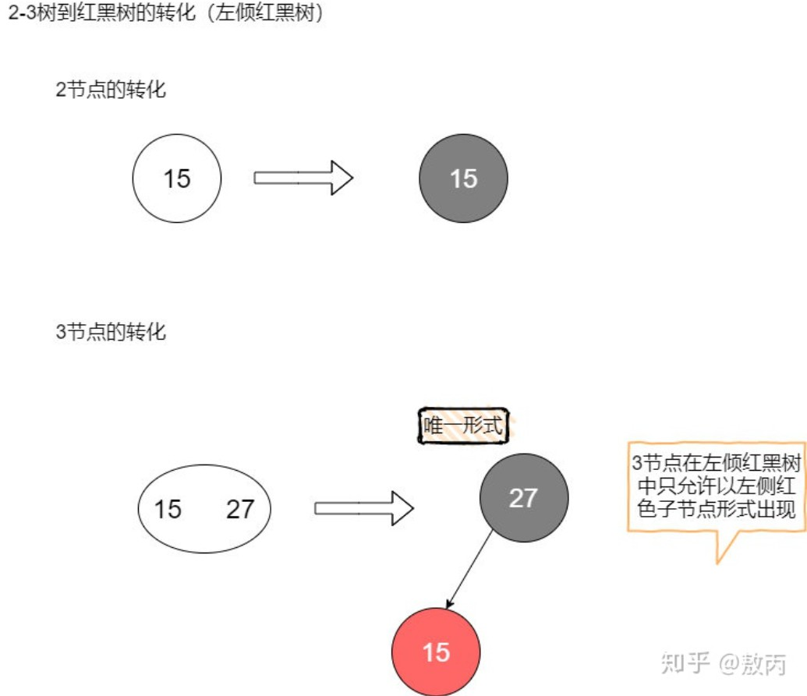  

光看单个节点的转化可能还不够明显，我制作了一张红黑树转2-3树的示意图，很清晰地描绘了它们之间的关系。只要把左倾红黑树中的红色节点顺时针方向旋转45°使其与黑父平行，然后再将它们看作一个整体，你就会发现，这不就是一颗2-3树吗？  
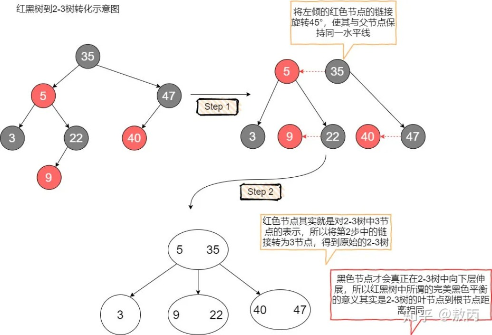  
至此，红黑树其实就是对概念模型2-3树（或者2-3-4树）的一种实现。算法导论中给出的是红黑树基于2-3-4树实现，其中4节点要求平衡（即4节点必须用黑色父亲和左右两个红色儿子表示，红色儿子不能出现在同一边）。  
算法4中给出的红黑树是基于2-3树实现，而且这种实现的红黑树十分特殊，它要求概念模型中的3节点在红黑树中必须用左倾的红色节点来表示。这种限定能够很大的减少红黑树调整过程中的复杂性，我们将在接下来的内容中体会到这一点。**本文最终选择算法4中的红黑树做演示主体**  
_考虑到部分读者有充足的精力研究以2-3-4树为概念模型的红黑树，在介绍2-3树的同时也会带上2-3-4树的基础知识，帮助学有余力的读者去理解算法导论中的红黑树。（所以如果没有必要，只看2-3树的部分就行）_  
* 首先，算法4中的红黑树基于2-3树概念模型，不用考虑2-3-4树中复杂的4节点分裂；
* 第二，算法4中的红黑树是左倾红黑树，进一步降低了调平的难度；
* 第三，算法导论中对于红黑树删除场景的阐述并不够具体，许多关键环节都用“经过一定的旋转和变色处理”来带过，不利于新手的学习。（我花了很长时间还原具体过程）。

## 2-3树的插入删除操作
我们在了解红黑树的插入删除操作之前，需要先了解2-3树的插入删除操作，这样才能理解红黑树中染色和旋转背后的意义。  
### 插入
对于2-3树的插入。我们的插入操作需要遵循一个原则：先将这个元素尝试性地放在已经存在的节点中，如果要存放的节点是2节点，那么插入后会变成3节点，如果要存放的节点是3节点，那么插入后会变成4节点（临时）。然后，我们对可能生成的临时4节点进行分裂处理，使得临时4节点消失。  
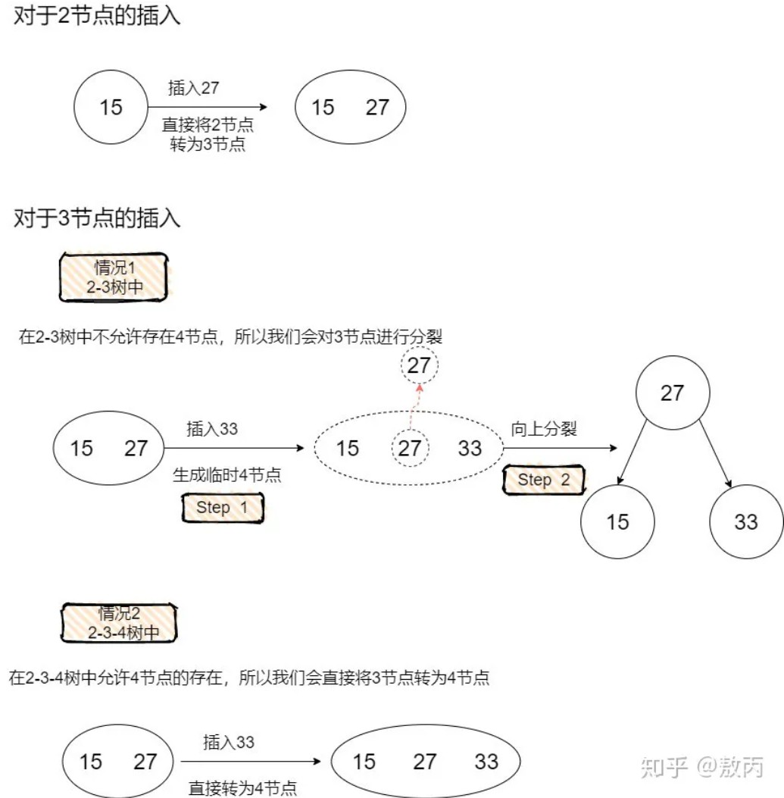  
如果需要在2-3-4树中向4节点内插入元素，那么会引发如下图所示的分裂过程  
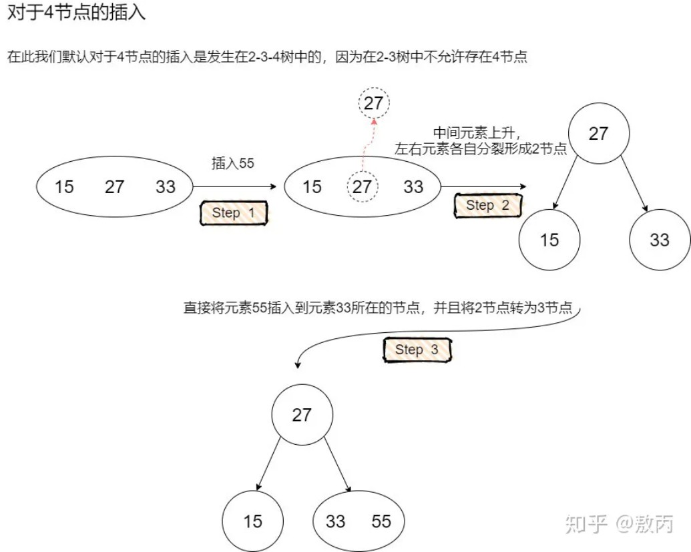  
_事实上，这正对应了红黑树在插入的时候一定会把待插入节点涂成红色，因为红色节点的意义是与父节点进行关联，形成概念模型2-3树中的3节点或者临时4节点。而红黑树之所以需要在插入后进行调整，正是因为可能存在着概念模型中的临时4节点（反应在红黑树中是双红的情况）。_  
试想在2-3树中如果待插入节点是个2节点，那么反应在红黑树中，不正好对应着黑色父节点吗，在黑色父节点下面增加一个红色儿子，确实不会违背红黑树的任何规则，这也对应着我们向2-3树中的2节点插入一个元素，只需要简单的把2节点变成3节点。  
### 删除
接下来让我们来看一下对于2-3树的删除。对于2-3树的删除我们主要要考虑待删除元素在2节点这种情况，因为如果待删除元素在3节点，那么可以直接将这个元素删除，而不会破坏2-3树的任何性质（删除这个元素不会引起高度的变化）。  
当待删除元素在2节点的时候，由于删除这个元素会导致2节点失去自己唯一的元素，引发2节点自身的删除，会使得树中某条路径的高度发生变化，树变得不平衡。  
因此我们有两种方案去解决这个问题：  
* 第一种方案，先删除这个2节点，然后对树进行平衡调整。
* 第二种方案，我们想办法让这个被删除的元素不可能出现在2节点中。

本文选择第二种方案，我们在搜索到这个节点的路径中，不断地判断当前节点是否为2节点，如果是，就从它的兄弟节点或者它的父节点借一个元素，使得当前节点由2节点成为一个3节点或者一个临时4节点（视具体情况而定，在后面的红黑树部分会详细介绍）。  
这种操作会产生一种结果：除非当前节点是根节点，否则当前节点的父节点一定是一个非2节点（因为搜索的路径是自上而下，父节点已经进行过了这种操作，所以不可能是2节点），那么我们可以保证到达叶子节点的时候，也能顺利的从父节点或者兄弟节点处借到元素，使得自己成为非2节点。从而能够直接删除某个元素（现在这个元素不在2节点中了）。  
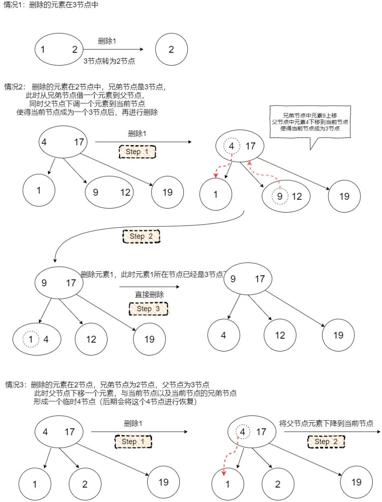  
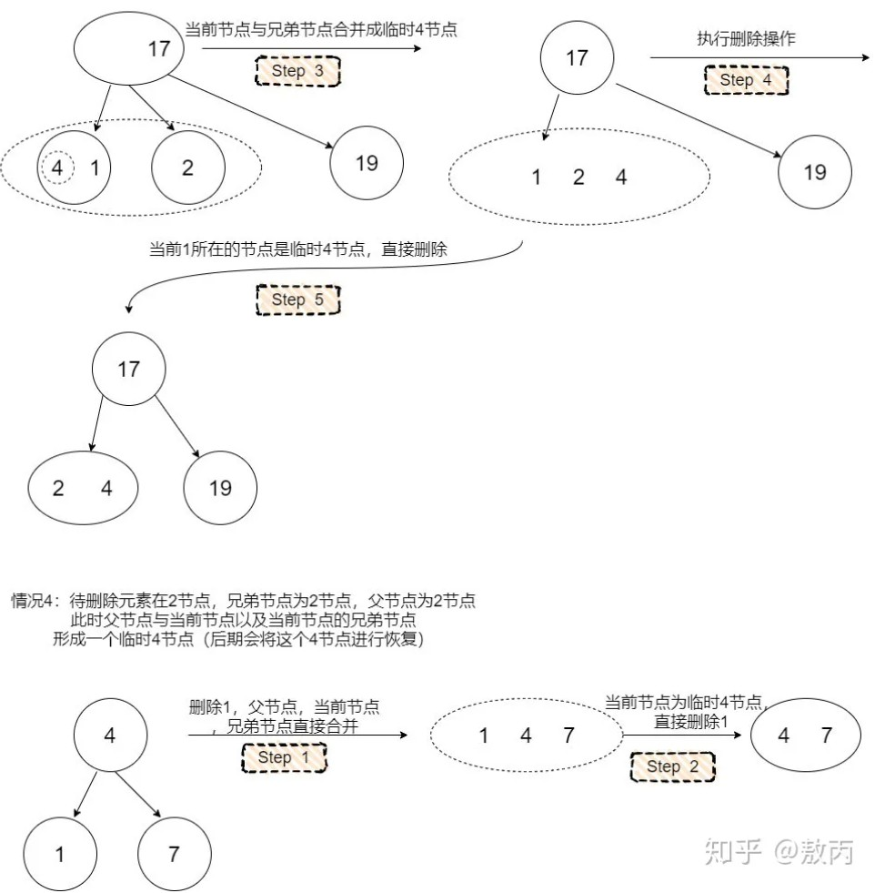

## 红黑树介绍
1. 节点颜色有红色和黑色  
【2-3树到红黑树的转化已经解释过】  
2. 根节点必为黑色  
【2-3树中如果根节点为2节点，那么它本来就对应红黑树中黑节点；如果根节点为3节点，也可以用黑色节点表示较大的那个元素，然后较小的元素作为左倾红节点存在于红黑树中】
3. 所有叶子节点都是黑色  
【此处提到的叶子其实是空链接，因篇幅问题不便全部画出】  
4. 任意节点到叶子节点经过的黑色节点数目相同  
【红黑树中的红节点是和黑色父节点绑定的，在2-3树中本来就是同一层的，只有黑色节点才会在2-3树中真正贡献高度，由于2-3树的任一节点到空链接距离相同，因此反应在红黑树中就是黑色完美平衡】  
5. 不会有连续的红色节点  
【2-3树中本来就规定没有4节点，2-3-4树中虽然有4节点，但是要求在红黑树中体现为一黑色节点带两红色儿子，分布左右，所以也不会有连续红节点】  

相信在你的视角中，红黑树已经不再是这五条僵硬的定义了，它背后正浮现着一颗2-3树概念模型。虽然你已经有了这样的认识，但是红黑树作为真正的实现模型，我们还是要回到这个实现本身来探究它的一系列操作。在开始前，我准备了两个基础知识，希望能帮助到你。  

**作为二叉查找树**  
二叉查找树的节点有一个元素X和两个指针域，左指针指向小于X的元素，右指针指向大于X的元素。  
假设我们的插入序列是1~10，那么这颗树会演变成只有右链接的形式，树高会增加到10层，这个时候已经不具备O(LogN)的查找时间复杂度，因为这颗树退化成了链表。  
当我们向一颗二叉查找树中插入一个元素Y的时候，我们会一直与树中的节点进行大小比较，如果Y小于当前元素，就往左走，如果Y大于当前元素，就往右走，直到达到叶子节点，这个时候我们可以把Y插入这颗二叉查找树了。  
由于这次的插入动作，整棵树可能会发生一些不平衡，因此我们需要在插入后进行一次平衡调整，使得整棵树恢复到平衡的状态（具体如何调整，要看树是AVL还是红黑树亦或是其他的平衡树）。  
因此对二叉树进行平衡调整是很重要的一个环节，无论是AVL还是红黑树，它们本质上都是希望尽可能保证这颗二叉查找树中的元素尽量均衡的分布在树的两侧。  

二叉查找树的删除是一个很有意思的问题，不同于插入的是，待删除的元素并不能保证一定出现在树中的叶子节点。这将带来一个棘手的情景，即我们需要从树的中间部分取走一个元素，而且在取走后还需要经过调整来使得整颗树满足平衡的性质。从树的中间部分直接取走一个节点的场景实在是太多，也牵扯到了太多相关的节点，这种操作很难实现。  
好在有人提出了一个观点，我们对查找树中一个节点的删除，其实可以不必真的改动这个节点的位置。由于查找树的特殊性质，将某个元素节点删除后，它有两个最佳替代者，分别是有序序列中的前驱元素和后继元素。  
我们还是以一个包含元素1~10的二叉查找树为例，如果我们希望删除5所在的节点，那么让4或者6替代它的位置都是可行的。作为前驱元素的4，会存放在5所在节点的左子树的最右侧；作为后继元素的6，会存放在5所在节点的右子树的最左侧。  

现在我们又让问题简化了，也就是说，删除某个节点的时候，我们先找到它的前驱元素或者后继元素（随便选一个），将它的前驱元素直接填到待删除的节点，然后再把它的前驱元素或者后继元素删除。  
这个时候问题就转化成了在二叉查找树中删除一个没有左子树的节点（或者是一个没有右子树的节点），我们只需要将这个节点删除再进行对应的平衡调整即可（虽然还是需要调平，但是比直接在树中层删除一个同时具备左右儿子的节点要容易很多）。  
**注意，此处并没有强调是针对红黑树的操作，因为红黑树和AVL都是二叉查找树，它们都适用这个方法。**  

**介绍一下树的旋转**  
为了调平一颗二叉树，使得其左右节点数目分布均匀，通常会选择旋转的手段。你可以把一颗二叉树某节点的左右子树想象成天平上待称量的物品，如果哪边重了，我们就从重的那边拿出一部分，加到轻的那边，以此保持相对的平均。  
在二叉树中这种调整的操作就是旋转，下面给出了两个示例，希望大家能够仔细探究，旋转是二叉树调平的精髓。  
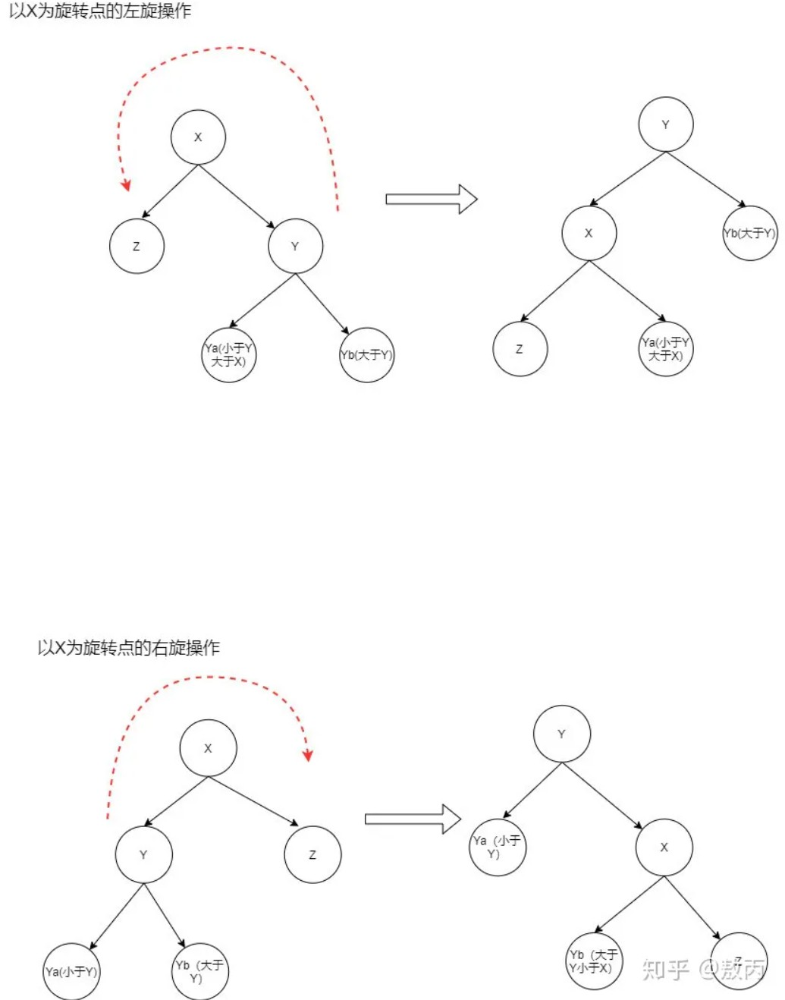  

### 红黑树的插入删除
理解了这些之后，再去看红黑树的插入删除，就能够理解旋转和染色背后的意义了。  
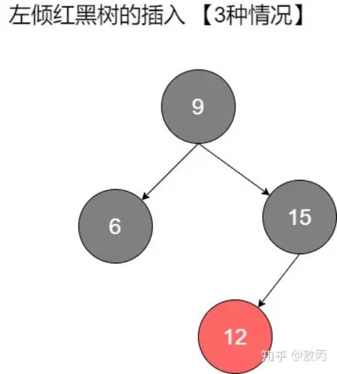  
我们选择算法4中的左倾红黑树作演示：首先看**左倾红黑树的插入**  
如图所示，对于左倾红黑树的插入一共有三种可能的情况。  
* 第一种，待插入元素比黑父大，插在了黑父的右边，而黑父左边是红色儿子。这种情况会导致在红黑树中出现右倾红节点。
注意，这种情况对应着2-3树中出现了临时4节点，我们在2-3树中的处理是将这个临时4节点分裂，左右元素各自形成一个2节点，中间元素上升到上层跟父节点结合。所以，我们在红黑树中的动作是，将原本红色的左右儿子染黑（左右分裂），将黑父染红（等待上升结合）。  
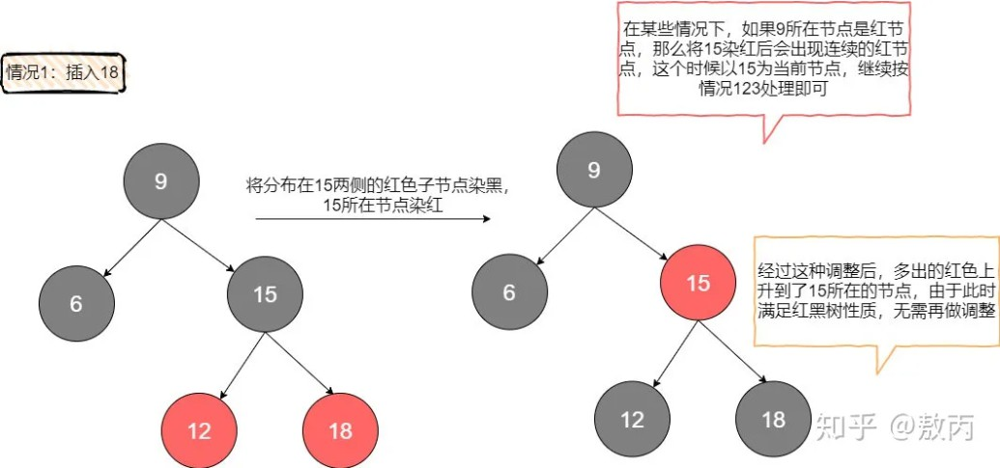  
* 第二种情况，待插入元素比红父小，且红父自身就是左倾。听起来有点绕，看图就会明白，其实就是说红父和待插入元素同时靠在了左边，形成了连续的红节点。  
这种情况我们需要用两步来调整。由于我们插入的是红色节点，其实不会破坏黑色完美平衡，所以要注意的是在旋转和染色的过程种继续保持这种完美黑色平衡。  
首先对红父的父亲进行一次右旋，这次右旋不会破坏黑色平衡，但是也没有解决连续红色的问题。  
接下来将12所在节点与15所在节点交换颜色，这样的目的是为了消除连续红色，并且这个操作依旧维持了黑色平衡。现在我们已经得到了情况1的场景，直接按情况1处理即可。  
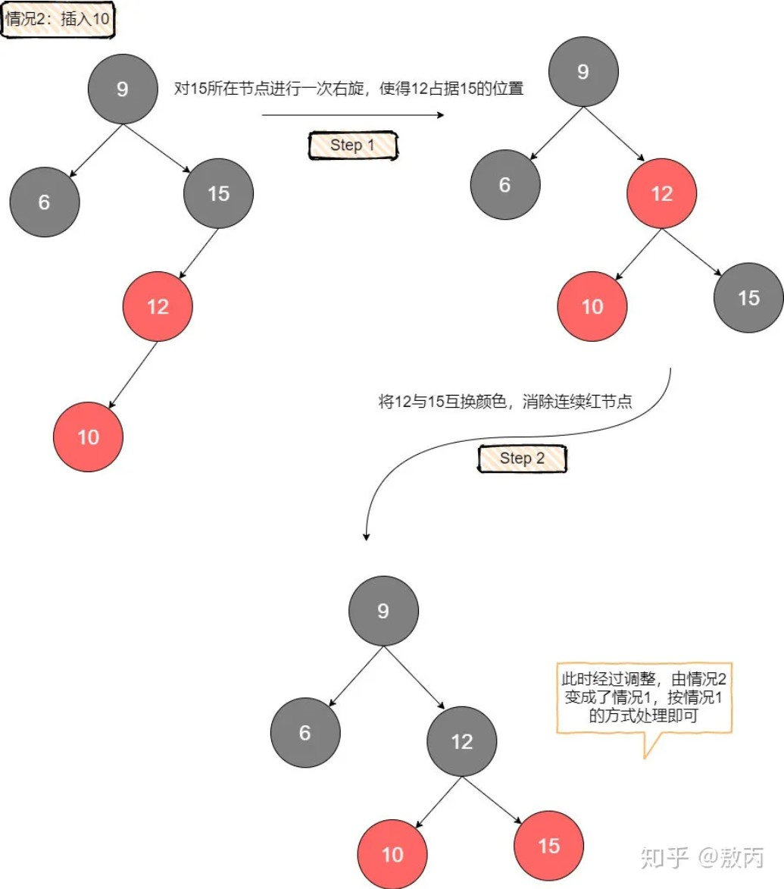  
* 第三种情况，待插入元素比红父大，且红父自身就是左倾。  
也就是说插入的这个节点形成了一个右倾的红色节点，对右倾的处理很简单，将红父进行一次左旋，就能使得右倾红节点变为左倾，现在出现了连续的左倾红节点，直接按情况2处理即可。  
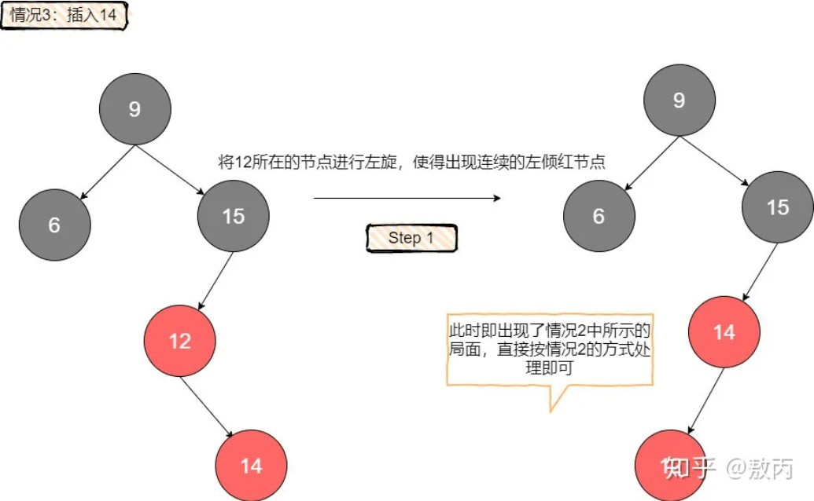  

在插入时，可以体会到左倾红黑树对于左倾的限制带来的好处，因为在原树符合红黑树定义的情况下，如果父亲是红的，那么它一定左倾，同时也不用考虑可能存在的右倾兄弟（如果有，那说明原树不满足红黑树定义）。  
这种限制消除了很多需要考虑的场景，让插入变得更加简单。  

**左倾红黑树的删除**  
左倾红黑树的删除需要借鉴上文中提到的二叉查找树通用的删除策略，当我们要删除某个节点的时候选择它的前驱节点或者后继节点元素来替代它，转而删除它的前驱/后继节点。  
在这个例子中，我选择用后继节点来替代被删除节点。  

假设我们需要删除的节点它的右子树如图所示，那么对该节点的删除实际上转为了对2的删除。  
我们从当前的根节点出发，利用2-3树中预合并的策略逐层对红黑树进行调整。具体的做法是，每次都保证当前的节点是2-3树中的非2节点，如果当前节点已经是非2节点，那么直接跳过；如果当前节点是2节点，那么根据兄弟节点的状况来进行调整：  
* 如果兄弟是2节点，那么从父节点借一个元素给当前节点，然后与兄弟节点一起形成一个临时4节点。  
* 如果兄弟是非2节点，那么兄弟上升一个元素到父节点，同时父节点下降一个元素到当前节点，使得当前节点成为一个3节点。  

这样的策略能够保证最后走到待删除节点的时候，它一定是一个非2节点，我们可以直接将其元素删除。  
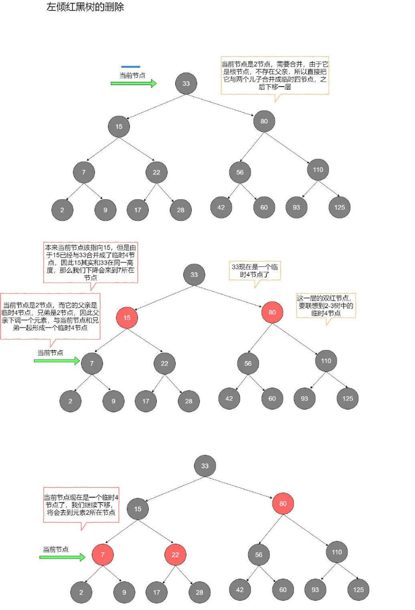  
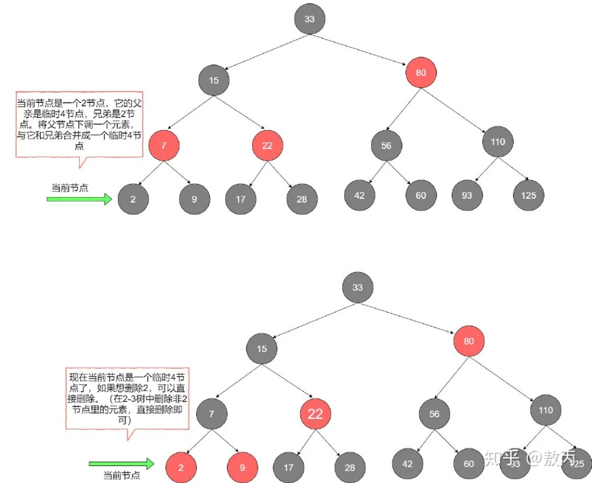  

接下来要考虑的是修复工作，由于红黑树定义的限制，我们在调整的过程中出现了一些本不该存在的红色右倾节点（因为生成了概念模型中的临时4节点），于是我们顺着搜索的方向向上回溯，如果遇到当前节点具备右倾的红色儿子，那么对当前节点进行一次左旋，这时原本的右儿子会来到当前节点的位置，然后将右儿子与当前节点交换颜色，我们就将右倾红节点修复成了左倾红节点，同时我们并没有破坏黑色节点的平衡。  
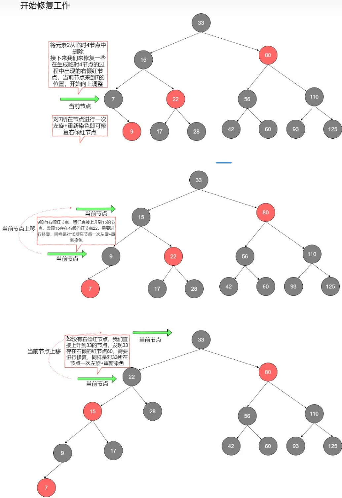  
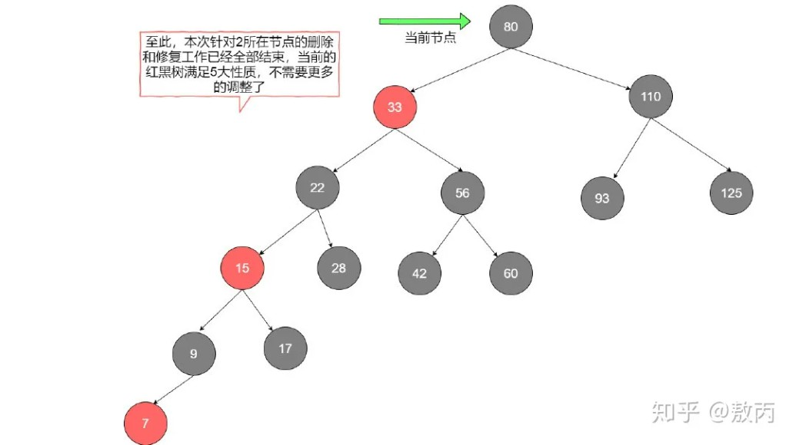  
右倾转左倾是一个很基本的操作，我们以35，44为例，你既可以将35作为黑节点，44作为右倾红色儿子；也可以将44作为黑节点，35作为左倾红儿子。事实上我们对于右倾的修复就是换了一种树形而已。一路回溯到当前根节点，直至路径中不再包含任何的红色右倾节点，至此修复工作全部完成。  

## 问题
红黑树中要红节点干什么呢？红节点的真实意义是什么呢？  
1. 平衡操作：红色节点在红黑树中的插入和删除操作中扮演着平衡树的角色。当向红黑树中插入一个节点时，如果插入位置违反了红黑树的平衡性规则，可以通过改变节点的颜色和进行旋转操作来重新平衡树的结构。红色节点的插入和删除操作通常是为了保持红黑树的平衡性，并确保树的高度保持较小的范围，从而保证了查找、插入和删除的高效性。  
2. 约束条件：红色节点在红黑树中的颜色属性是一种重要的约束条件，用于确保树的结构和性质。根据红黑树的规则，红色节点的父节点必须是黑色节点，这是为了保持从根到叶子的任意路径上的黑色节点数量相等。这个约束条件确保了红黑树的平衡性和有序性，使得树的性质得以保持。  

平衡树的特点是什么?  
1. 平衡性：平衡树的主要特点是保持树的平衡性，即树的左右子树的高度差不超过一个固定的阈值（通常为1）。这样可以确保树的高度相对较小，使得查找、插入和删除等操作的时间复杂度保持在较低的水平。平衡性能够使得树的各个分支相对均衡，避免了出现高度不平衡的情况，提高了整体的性能和效率。
2. 自动调整：平衡树具备自动调整的能力，即在插入或删除节点时，能够通过特定的平衡操作（例如旋转、重新着色等）来保持树的平衡性。这意味着无需手动进行平衡操作，平衡树能够自动调整节点的位置和颜色，使得树的结构始终保持平衡状态。自动调整的特点使得平衡树的维护变得相对简单，减少了人为错误和繁琐的操作。
3. 快速查找：平衡树具有快速查找的特点，可以在具有大量节点的情况下，通过比较节点的值和树的结构，快速定位目标节点。平衡树通常采用二叉查找树的形式，具备有序性，使得查找操作可以通过比较节点的值进行二分搜索，从而提高查找的效率。
4. 插入和删除效率较高：由于平衡树保持了树的平衡性，插入和删除节点的操作效率相对较高。通过自动调整平衡操作，平衡树能够尽可能保持树的平衡性，减少了插入和删除节点时需要调整的节点数量，从而提高了操作的效率。

红黑树需要和平衡二叉树一样满足平衡性吗?  
1. 不完全相同。红黑树是一种特殊类型的平衡二叉树，但它的平衡性要求相对更宽松一些。  
在传统的平衡二叉树（如AVL树）中，要求左子树和右子树的高度差不超过1，也就是说树的左右子树要保持严格的平衡。这样可以确保树的高度相对较小，从而提供了快速的查找和操作。  
而在红黑树中，平衡性的要求相对宽松一些。红黑树的平衡性通过以下性质来定义：从任一节点到其每个叶子节点的所有路径都包含相同数量的黑色节点。这个性质保证了树的高度在一定的范围内，但并不要求严格的左右子树高度差。因此，红黑树可以具有较为松散的平衡性要求，相对于传统的平衡二叉树更加灵活。  
红黑树之所以可以放宽对平衡性的要求，是为了在插入和删除操作时能够更高效地维护树的平衡。通过一系列的平衡操作，如颜色变换和旋转，红黑树可以自动调整节点的位置和颜色，保持树的平衡性。这样，红黑树能够在维持相对较低的高度的同时，提供较好的查找、插入和删除的性能。  
因此，红黑树作为一种自平衡的二叉查找树，虽然不要求严格的平衡性，但通过一定的平衡性要求和自动调整机制，仍能提供高效的操作和较好的性能。  

