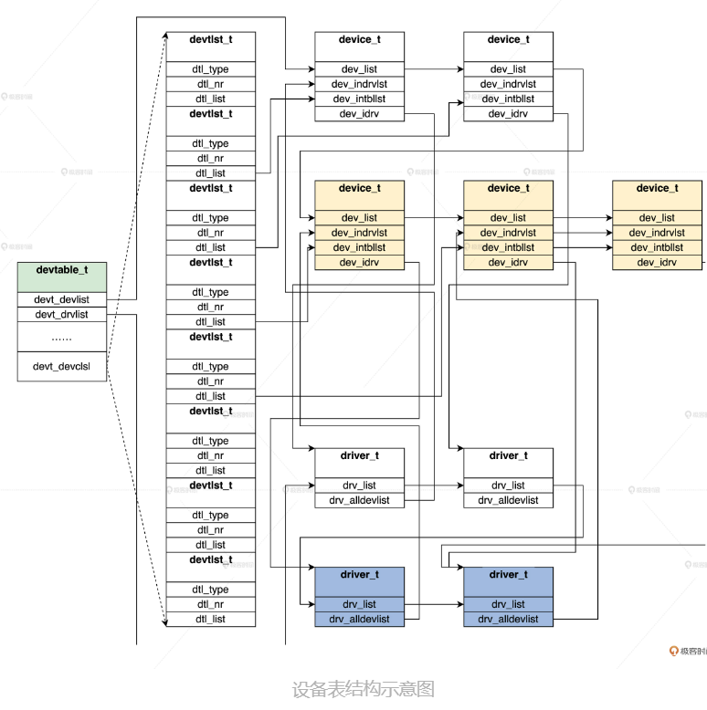

<!-- toc -->
如何表示设备类型与设备驱动
- [如何表如何表示设备类型与设备驱动](#如何表如何表示设备类型与设备驱动)
- [计算机的结构](#计算机的结构)
- [如何管理设备](#如何管理设备)
    - [分权而治](#分权而治)
    - [设备驱动程序](#设备驱动程序)
        - [设备](#设备)
        - [驱动](#驱动)
        - [设备驱动的组织(设备表)](#设备驱动的组织(设备表))
        - [驱动程序功能](#驱动程序功能)
    - [设备分类](#设备分类)
<!-- tocstop -->

# 如何表如何表示设备类型与设备驱动
HuOS会“成立各类部门”，用于管理众多设备，一个部门负责一类设备。

# 计算机的结构
  
总线有层级关系，各种设备通过总线相连。  

# 如何管理设备
管理内存和管理CPU是操作系统最核心的部分，但是这还不够，因为计算机不止有 CPU，还有各种设备。如果把计算机内部所有的设备和数据都描述成资源，操作系统内核无疑是这些资源的管理者。  
## 分权而治
操作系统内核无法包含所有的设备控制代码，那就索性不包含，或者只包含最基本、最通用的设备控制代码。所以我们要把设备控制代码独立出来，与操作系统内核分开、独立开发。每个设备对应一个设备控制代码模块，操作系统内核要控制哪个设备，就加载相应的设备代码模块，以后不使用这个设备了，就可以删除对应的设备控制代码模块。------**驱动程序**  
## 设备驱动程序
操作系统内核如何表示多个设备与驱动的存在？如何组织多个设备和多个驱动程序的问题？我们还得考虑应该让驱动程序提供一些什么支持？  
### 设备
设备数据结构的实例变量，一旦建立，就表示操作系统内核中存在一个逻辑设备了。  
```c
typedef struct s_DEVID
{
    uint_t  dev_mtype;//设备类型号
    uint_t  dev_stype; //设备子类型号
    uint_t  dev_nr; //设备序号
}devid_t;

typedef struct s_DEVICE
{
    list_h_t    dev_list;//设备链表
    list_h_t    dev_indrvlst; //设备在驱动程序数据结构中对应的挂载链表
    list_h_t    dev_intbllst; //设备在设备表数据结构中对应的挂载链表
    spinlock_t  dev_lock; //设备自旋锁
    uint_t      dev_count; //设备计数
    sem_t       dev_sem; //设备信号量
    uint_t      dev_stus; //设备状态
    uint_t      dev_flgs; //设备标志
    devid_t      dev_id; //设备ID
    uint_t      dev_intlnenr; //设备中断服务例程的个数
    list_h_t    dev_intserlst; //设备中断服务例程的链表
    list_h_t    dev_rqlist; //对设备的请求服务链表
    uint_t      dev_rqlnr; //对设备的请求服务个数
    sem_t       dev_waitints; //用于等待设备的信号量
    struct s_DRIVER* dev_drv; //设备对应的驱动程序数据结构的指针
    void* dev_attrb; //设备属性指针
    void* dev_privdata; //设备私有数据指针
    void* dev_userdata;//将来扩展所用
    void* dev_extdata;//将来扩展所用
    char_t* dev_name; //设备名
}device_t;
```
设备 ID 结构十分重要，它表示设备的类型、设备号，子设备号是为了解决多个相同设备的，还有一个指向设备驱动程序的指针，这是用于访问设备时调用设备驱动程序的，只要有人建立了一个设备结构的实例变量，内核就能感知到一个设备存在了。  
### 驱动
驱动程序主动建立设备。  
我们还是要定义一个数据结构来表示一个驱动程序，数据结构中应该包含驱动程序名，驱动程序 ID，驱动程序所管理的设备，最重要的是完成功能设备相关功能的函数  
```c
typedef struct s_DRIVER
{
    spinlock_t drv_lock; //保护驱动程序数据结构的自旋锁
    list_h_t drv_list;//挂载驱动程序数据结构的链表
    uint_t drv_stuts; //驱动程序的相关状态
    uint_t drv_flg; //驱动程序的相关标志
    uint_t drv_id; //驱动程序ID
    uint_t drv_count; //驱动程序的计数器
    sem_t drv_sem; //驱动程序的信号量
    void* drv_safedsc; //驱动程序的安全体
    void* drv_attrb; //LMOSEM内核要求的驱动程序属性体
    void* drv_privdata; //驱动程序私有数据的指针
    drivcallfun_t drv_dipfun[IOIF_CODE_MAX]; //驱动程序功能派发函数指针数组
    list_h_t drv_alldevlist; //挂载驱动程序所管理的所有设备的链表
    drventyexit_t drv_entry; //驱动程序的入口函数指针
    drventyexit_t drv_exit; //驱动程序的退出函数指针
    void* drv_userdata;//用于将来扩展
    void* drv_extdata; //用于将来扩展
    char_t* drv_name; //驱动程序的名字
}driver_t;
```
HuOS 内核每加载一个驱动程序模块，就会自动分配一个驱动程序数据结构并且将其实例化。  
HuOS 内核负责建立驱动数据结构，而驱动程序又建立了设备数据结构，形成了一个驱动程序与 HuOS 内核“握手”的动作。  
### 设备驱动的组织(设备表)
设备表的数据结构，来组织这些驱动程序数据结构和设备数据结构
```c
#define DEVICE_MAX 34
typedef struct s_DEVTLST
{
    uint_t dtl_type;//设备类型
    uint_t dtl_nr;//设备计数
    list_h_t dtl_list;//挂载设备device_t结构的链表
}devtlst_t;

typedef struct s_DEVTABLE
{
    list_h_t devt_list; //设备表自身的链表
    spinlock_t devt_lock; //设备表自旋锁
    list_h_t devt_devlist; //全局设备链表
    list_h_t devt_drvlist; //全局驱动程序链表，驱动程序不需要分类，一个链表就行
    uint_t   devt_devnr; //全局设备计数
    uint_t   devt_drvnr; //全局驱动程序计数
    devtlst_t devt_devclsl[DEVICE_MAX]; //分类存放设备数据结构的devtlst_t结构数组
}devtable_t;
```
devtlst_t 是每个设备类型一个，表示一类设备，但每一类可能有多个设备，所以在 devtlst_t 结构中，有一个设备计数和设备链表。  
肯定还要定义一个 devtable_t 结构的全局变量  
```c
//HuOS/kernel/krlglobal.c
KRL_DEFGLOB_VARIABLE(devtable_t,osdevtable);

//HuOS/kernel/krldevice.c
void devtlst_t_init(devtlst_t *initp, uint_t dtype)
{
    initp->dtl_type = dtype;//设置设备类型    initp->dtl_nr = 0;
    list_init(&initp->dtl_list);
    return;
}

void devtable_t_init(devtable_t *initp)
{
    list_init(&initp->devt_list);
    krlspinlock_init(&initp->devt_lock);
    list_init(&initp->devt_devlist);
    list_init(&initp->devt_drvlist);
    initp->devt_devnr = 0;
    initp->devt_drvnr = 0;
    for (uint_t t = 0; t < DEVICE_MAX; t++)
    {
        //初始化设备链表
        devtlst_t_init(&initp->devt_devclsl[t], t);
    }
    return;
}

void init_krldevice()
{
    devtable_t_init(&osdevtable);//初始化系统全局设备表
    return;
}

//在 HuOS/kernel/krlinit.c文件中
void init_krl()
{
    init_krlmm();
    init_krldevice();
    //记住一定要在初始化调度器之前，初始化设备表
    init_krlsched();
    init_krlcpuidle();
    return;
}
```
  
首先 devtable_t 结构中能找到所有的设备和驱动，然后从设备能找到对应的驱动，从驱动也能找到其管理的所有设备 ，最后就能实现一个驱动管理多个设备。  
### 驱动程序功能
归纳一下用来驱动程序的几种主要函数
```c
//驱动程序入口和退出函数
drvstus_t device_entry(driver_t* drvp,uint_t val,void* p);
drvstus_t device_exit(driver_t* drvp,uint_t val,void* p);
//设备中断处理函数
drvstus_t device_handle(uint_t ift_nr,void* devp,void* sframe);
//打开、关闭设备函数
drvstus_t device_open(device_t* devp,void* iopack);
drvstus_t device_close(device_t* devp,void* iopack);
//读、写设备数据函数
drvstus_t device_read(device_t* devp,void* iopack);
drvstus_t device_write(device_t* devp,void* iopack);
//调整读写设备数据位置函数
drvstus_t device_lseek(device_t* devp,void* iopack);
//控制设备函数
drvstus_t device_ioctrl(device_t* devp,void* iopack);
//开启、停止设备函数
drvstus_t device_dev_start(device_t* devp,void* iopack);
drvstus_t device_dev_stop(device_t* devp,void* iopack);
//设置设备电源函数
drvstus_t device_set_powerstus(device_t* devp,void* iopack);
//枚举设备函数
drvstus_t device_enum_dev(device_t* devp,void* iopack);
//刷新设备缓存函数
drvstus_t device_flush(device_t* devp,void* iopack);
//设备关机函数
drvstus_t device_shutdown(device_t* devp,void* iopack);
```
那么这些函数如何和操作系统内核关联起来呢？还记得 driver_t 结构中那个函数指针数组吗，如下所示。  
```c
#define IOIF_CODE_OPEN 0 //对应于open操作
#define IOIF_CODE_CLOSE 1 //对应于close操作
#define IOIF_CODE_READ 2 //对应于read操作
#define IOIF_CODE_WRITE 3 //对应于write操作
#define IOIF_CODE_LSEEK 4 //对应于lseek操作
#define IOIF_CODE_IOCTRL 5 //对应于ioctrl操作
#define IOIF_CODE_DEV_START 6 //对应于start操作
#define IOIF_CODE_DEV_STOP 7 //对应于stop操作
#define IOIF_CODE_SET_POWERSTUS 8 //对应于powerstus操作
#define IOIF_CODE_ENUM_DEV 9 //对应于enum操作
#define IOIF_CODE_FLUSH 10 //对应于flush操作
#define IOIF_CODE_SHUTDOWN 11 //对应于shutdown操作
#define IOIF_CODE_MAX 12 //最大功能码
//驱动程序分派函数指针类型
typedef drvstus_t (*drivcallfun_t)(device_t*,void*);
//驱动程序入口、退出函数指针类型
typedef drvstus_t (*drventyexit_t)(struct s_DRIVER*,uint_t,void*);
typedef struct s_DRIVER
{
    //……
    drivcallfun_t drv_dipfun[IOIF_CODE_MAX];//驱动程序分派函数指针数组。
    list_h_t drv_alldevlist;//驱动所管理的所有设备。
    drventyexit_t drv_entry;
    drventyexit_t drv_exit;
    //……
}driver_t;
```
driver_t 结构中的 drv_dipfun 函数指针数组(功能派发函数指针数组)，正是存放上述那 12 个驱动程序函数的指针。这样操作系统内核就能通过 driver_t 结构，调用到对应的驱动程序函数操作对应的设备了。  

## 设备分类
问：操作系统内核所感知的设备，一定要与物理设备一一对应吗？  
答：储存设备，其实不管它是机械硬盘，还是 TF 卡，或者是一个设备控制代码模块，它向操作系统内核表明它是储存设备，但它完全有可能分配一块内存空间来储存数据，不必访问真正的储存设备。所以，操作系统内核所感知的设备，并不需要和物理设备对应，这取决于设备控制代码自身的行为。内核所定义的设备，可称为内核设备或者逻辑设备，其实这只是对物理计算平台中几种类型设备的一种抽象。  

例如如下的NETWORK_DEVICE 网络设备，不管它是有线网卡还是无线网卡，或者是设备控制代码虚拟出来的虚拟网卡。  
HuOS 内核都将认为它是一个网络设备，这就是设备的抽象，这样有利于我们灵活、简便管理设备。  
```c
HuOS/include/knlinc/krldevice_t.h

#define NOT_DEVICE 0               //不表示任何设备
#define BRIDGE_DEVICE 4            //总线桥接器设备
#define CPUCORE_DEVICE 5           //CPU设备，CPU也是设备
#define RAMCONTER_DEVICE 6        //内存控制器设备
#define RAM_DEVICE 7              //内存设备
#define USBHOSTCONTER_DEVICE 8    //USB主控制设备
#define INTUPTCONTER_DEVICE 9     //中断控制器设备
#define DMA_DEVICE 10             //DMA设备
#define CLOCKPOWER_DEVICE 11      //时钟电源设备
#define LCDCONTER_DEVICE 12        //LCD控制器设备
#define NANDFLASH_DEVICE 13       //nandflash设备
#define CAMERA_DEVICE 14          //摄像头设备
#define UART_DEVICE 15             //串口设备
#define TIMER_DEVICE 16            //定时器设备
#define USB_DEVICE 17              //USB设备
#define WATCHDOG_DEVICE 18        //看门狗设备
#define RTC_DEVICE 22              //实时时钟设备
#define SD_DEVICE 25               //SD卡设备
#define AUDIO_DEVICE 26            //音频设备
#define TOUCH_DEVICE 27           //触控设备
#define NETWORK_DEVICE 28         //网络设备
#define VIR_DEVICE 29               //虚拟设备
#define FILESYS_DEVICE 30            //文件系统设备
#define SYSTICK_DEVICE 31           //系统TICK设备
#define UNKNOWN_DEVICE 32        //未知设备，也是设备
#define HD_DEVICE 33        //硬盘设备
```
