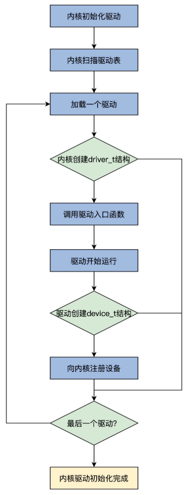

<!-- toc -->
如何在内核中注册设备
- [设备的注册流程](#设备的注册流程)

<!-- tocstop -->

我们先从全局了解一下设备的注册流程，然后了解怎么加载驱动，最后探索怎么让驱动建立一个设备，并在内核中注册。  
例如：  
1. 操作系统会收到一个中断。
2. USB 总线驱动的中断处理程序会执行。
3. 调用操作系统内核相关的服务，查找 USB 鼠标对应的驱动程序。
4. 操作系统加载驱动程序。
5. 驱动程序开始执行，向操作系统内核注册一个鼠标设备。这就是一般操作系统加载驱动的粗略过程。对于安装在主板上的设备，操作系统会枚举设备信息，然后加载驱动程序，让驱动程序创建并注册相应的设备。当然，你还可以手动加载驱动程序。

为了简单起见，我们的 os 不会这样复杂，暂时也不支持设备热拨插功能。我们让 os 自动加载驱动，在驱动中向 os 注册相应的设备。  
  