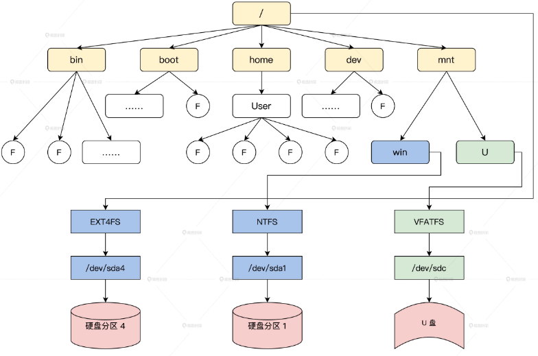

<!-- toc -->
LINUX的虚拟文件系统是如何管理文件的
- [VFS](#VFS)
- [VFS数据结构](#VFS数据结构)
    - [超级块结构](#超级块结构)
    - [目录结构](#目录结构)
    - [文件索引结点](#文件索引结点)
    - [打开的文件](#打开的文件)
    - [四大对象结构的关系](#四大对象结构的关系)
- [文件操作](#文件操作)
    - [打开文件](#打开文件)
    - [读写文件](#读写文件)
    - [关闭文件](#关闭文件)
- [文件系统实例](#文件系统实例)
    - [注册trfs](#注册trfs)
    - [使用trfs文件系统](#使用trfs文件系统)
<!-- tocstop -->

# VFS
VFS（Virtual Filesystem）就像伙伴系统、SLAB 内存管理算法一样，也是 SUN 公司最早在 Sloaris 上实现的虚拟文件系统，也可以理解为通用文件系统抽象层。  
在 Linux 中，支持 EXT、XFS、JFS、BTRFS、FAT、NTFS 等多达十几种不同的文件系统，但不管在什么储存设备上使用什么文件系统，也不管访问什么文件，都可以统一地使用一套 open(), read()、write()、close() 这样的接口。这些接口看上去都很简单，但要基于不同的存储设备设计，还要适应不同的文件系统，这并不容易。这就得靠优秀的 VFS 了，**它提供了一个抽象层，让不同的文件系统表现出一致的行为。**  
  
_In the VFS layer, a "dentry" (short for directory entry) is a data structure used to represent entries in the directory hierarchy. Each directory on a file system contains one or more dentries, each corresponding to a file or a subdirectory within that directory._  
VFS 提供一系列数据结构和具体文件系统应该实现的回调函数。这样，一个文件系统就可以被安装到 VFS 中了。操作具体文件时，VFS 会根据需要调用具体文件系统的函数。从此文件系统的细节就被 VFS 屏蔽了。  

# VFS数据结构
定义一组通用的数据结构，规范各个文件系统的实现，每种结构都对应一套回调函数集合，这是典型的面向对象的设计方法。  
这些数据结构包含描述文件系统信息的超级块、表示文件名称的目录结构、描述文件自身信息的索引节点结构、表示打开一个文件的实例结构。  
## 超级块结构
这个结构用于一个具体文件系统的相关信息，其中包含了 VFS 规定的标准信息，也有具体文件系统的特有信息，Linux 系统中的超级块结构是一个文件系统安装在 VFS 中的标识。  
```c
struct super_block {
    struct list_head    s_list; //超级块链表
    dev_t           s_dev;     //设备标识
    unsigned char       s_blocksize_bits;//以位为单位的块大小
    unsigned long       s_blocksize;//以字节为单位的块大小
    loff_t          s_maxbytes; //一个文件最大多少字节
    struct file_system_type *s_type; //文件系统类型
    const struct super_operations   *s_op;//超级块函数集合
    const struct dquot_operations   *dq_op;//磁盘限额函数集合
    unsigned long       s_flags;//挂载标志
    unsigned long       s_magic;//文件系统魔数
    struct dentry       *s_root;//挂载目录
    struct rw_semaphore s_umount;//卸载信号量
    int         s_count;//引用计数
    atomic_t        s_active;//活动计数
    struct block_device *s_bdev;//块设备
    void            *s_fs_info;//文件系统信息
    time64_t           s_time_min;//最小时间限制
    time64_t           s_time_max;//最大时间限制
    char            s_id[32];   //标识名称
    uuid_t          s_uuid;     //文件系统的UUID
    struct list_lru     s_dentry_lru;//LRU方式挂载的目录
    struct list_lru     s_inode_lru;//LRU方式挂载的索引结点
    struct mutex        s_sync_lock;//同步锁
    struct list_head    s_inodes;   //所有的索引节点
    spinlock_t      s_inode_wblist_lock;//回写索引节点的锁
    struct list_head    s_inodes_wb;    //挂载所有要回写的索引节点
} __randomize_layout;
```
文件系统被挂载到 VFS 的某个目录下时，VFS 会调用获取文件系统自己的超级块的函数，用具体文件系统的信息构造一个上述结构的实例，有了这个结构实例，VFS 就能感知到一个文件系统插入了。  
超级块函数集合  
```c
struct super_operations {
    //分配一个新的索引结点结构
    struct inode *(*alloc_inode)(struct super_block *sb);
    //销毁给定的索引节点
    void (*destroy_inode)(struct inode *);
    //释放给定的索引节点
    void (*free_inode)(struct inode *);
    //VFS在索引节点为脏(改变)时，会调用此函数
    void (*dirty_inode) (struct inode *, int flags);
    //该函数用于将给定的索引节点写入磁盘
    int (*write_inode) (struct inode *, struct writeback_control *wbc);
    //在最后一个指向索引节点的引用被释放后，VFS会调用该函数
    int (*drop_inode) (struct inode *);
    void (*evict_inode) (struct inode *);
    //减少超级块计数调用
    void (*put_super) (struct super_block *);
    //同步文件系统调用
    int (*sync_fs)(struct super_block *sb, int wait);
    //释放超级块调用
    int (*freeze_super) (struct super_block *);
    //释放文件系统调用
    int (*freeze_fs) (struct super_block *);
    int (*thaw_super) (struct super_block *);
    int (*unfreeze_fs) (struct super_block *);
    //VFS通过调用该函数，获取文件系统状态
    int (*statfs) (struct dentry *, struct kstatfs *);
    //当指定新的安装选项重新安装文件系统时，VFS会调用此函数
    int (*remount_fs) (struct super_block *, int *, char *);
    //VFS调用该函数中断安装操作。该函数被网络文件系统使用，如NFS
    void (*umount_begin) (struct super_block *);
};
//super_operations 结构中所有函数指针所指向的函数，都应该要由一个具体文件系统实现。
```
## 目录结构
  
```c
//快速字符串保存关于字符串的 "元数据"（即长度和哈希值）
struct qstr {
    union {
        struct {
            HASH_LEN_DECLARE;
        };
        u64 hash_len;
    };
    const unsigned char *name;//指向名称字符串
};
struct dentry {
    unsigned int d_flags;       //目录标志
    seqcount_spinlock_t d_seq;  //锁
    struct hlist_bl_node d_hash;//目录的哈希链表
    struct dentry *d_parent;    //指向父目录
    struct qstr d_name;         //目录名称
    struct inode *d_inode;      //指向目录文件的索引节点
    unsigned char d_iname[DNAME_INLINE_LEN];    //短目录名
    struct lockref d_lockref;   //目录锁与计数
    const struct dentry_operations *d_op;//目录的函数集
    struct super_block *d_sb;   //指向超级块
    unsigned long d_time;       //时间
    void *d_fsdata;         //指向具体文件系统的数据
    union {
        struct list_head d_lru;     //LRU链表
        wait_queue_head_t *d_wait;
    };
    struct list_head d_child;   //挂入父目录的链表节点
    struct list_head d_subdirs; //挂载所有子目录的链表
} __randomize_layout;
```
dentry 结构中包含了目录的名字和挂载子目录的链表，同时也能指向父目录。但是需要注意的是，目录也是文件，需要用 inode 索引结构来管理目录文件数据。  
这个目录文件数据，你可以把它想象成一个表，表有三列，它们分别是：名称、类型（文件或者目录）、inode 号。扫描这个表，就可以找出这个目录文件中包含的所有子目录或者文件。  
目录函数集  
```c
struct dentry_operations {
    //该函数判断目录对象是否有效
    int (*d_revalidate)(struct dentry *, unsigned int);
    int (*d_weak_revalidate)(struct dentry *, unsigned int);
    //该函数为目录项生成散列值，当目录项要加入散列表中时，VFS调用该函数
    int (*d_hash)(const struct dentry *, struct qstr *);
    //VFS调用该函数来比较name1和name2两个文件名。多数文件系统使用VFS的默认操作，仅做字符串比较。对于有些文件系统，比如FAT，简单的字符串比较不能满足其需要，因为 FAT文件系统不区分大小写
    int (*d_compare)(const struct dentry *,
            unsigned int, const char *, const struct qstr *);
    //当目录项对象的计数值等于0时，VFS调用该函数
    int (*d_delete)(const struct dentry *);
    //当分配目录时调用 
    int (*d_init)(struct dentry *);
    //当目录项对象要被释放时，VFS调用该函数，默认情况下，它什么也不做
    void (*d_release)(struct dentry *);
    void (*d_prune)(struct dentry *);
    //当一个目录项对象丢失了相关索引节点时，VFS调用该函数。默认情况下VFS会调用iput()函数释放索引节点
    void (*d_iput)(struct dentry *, struct inode *);
    //当需要生成一个dentry的路径名时被调用
    char *(*d_dname)(struct dentry *, char *, int);
    //当要遍历一个自动挂载时被调用（可选），这应该创建一个新的VFS挂载记录并将该记录返回给调用者
    struct vfsmount *(*d_automount)(struct path *);
    //文件系统管理从dentry的过渡（可选）时，被调用
    int (*d_manage)(const struct path *, bool);
    //叠加/联合类型的文件系统实现此方法
    struct dentry *(*d_real)(struct dentry *, const struct inode *);
} ____cacheline_aligned;
```
dentry_operations 结构中的函数，也需要具体文件系统实现，下层代码查找或者操作目录时 VFS 就会调用这些函数，让具体文件系统根据自己储存设备上的目录信息处理并设置 dentry 结构中的信息，这样文件系统中的目录就和 VFS 的目录对应了。  
## 文件索引结点
VFS 用 inode 结构表示一个文件索引结点，它里面包含文件权限、文件所属用户、文件访问和修改时间、文件数据块号等一个文件的全部信息，一个 inode 结构就对应一个文件  
```c
struct inode {
    umode_t         i_mode;//文件访问权限
    unsigned short      i_opflags;//打开文件时的标志
    kuid_t          i_uid;//文件所属的用户id
    kgid_t          i_gid;//文件所属的用户组id
    unsigned int        i_flags;//标志
    const struct inode_operations   *i_op;//inode函数集
    struct super_block  *i_sb;//指向所属超级块
    struct address_space    *i_mapping;//文件数据在内存中的页缓存
    unsigned long       i_ino;//inode号
    dev_t           i_rdev;//实际设备标志符
    loff_t          i_size;//文件大小，以字节为单位
    struct timespec64   i_atime;//文件访问时间
    struct timespec64   i_mtime;//文件修改时间
    struct timespec64   i_ctime;//最后修改时间
    spinlock_t      i_lock; //保护inode的自旋锁
    unsigned short          i_bytes;//使用的字节数
    u8          i_blkbits;//以位为单位的块大小；
    u8          i_write_hint;
    blkcnt_t        i_blocks;
    struct list_head    i_io_list;
    struct list_head    i_lru;      //在缓存LRU中的链表节点
    struct list_head    i_sb_list;//在超级块中的链表节点
    struct list_head    i_wb_list;
    atomic64_t      i_version;//版本号
    atomic64_t      i_sequence;
    atomic_t        i_count;//计数
    atomic_t        i_dio_count;//直接io进程计数
    atomic_t        i_writecount;//写进程计数
    union {
        const struct file_operations    *i_fop;//文件函数集合
        void (*free_inode)(struct inode *);
    };
    struct file_lock_context    *i_flctx;
    struct address_space    i_data;
    void            *i_private; //私有数据指针
} __randomize_layout;
```
inode 结构表示一个文件的全部信息，但这个 inode 结构是 VFS 使用的，跟某个具体文件系统上的“inode”结构并不是一一对应关系。  
inode结构的函数集合  
```c
struct inode_operations {
    //VFS通过系统create()和open()接口来调用该函数，从而为dentry对象创建一个新的索引节点
    int (*create) (struct inode *, struct dentry *,int);
    //该函数在特定目录中寻找索引节点，该索引节点要对应于dentry中给出的文件名
    struct dentry * (*lookup) (struct inode *, struct dentry *);
    //被系统link()接口调用，用来创建硬连接。硬链接名称由dentry参数指定
    int (*link) (struct dentry *, struct inode *, struct dentry *);
    //被系统unlink()接口调用，删除由目录项dentry链接的索引节点对象
    int (*unlink) (struct inode *, struct dentry *);
    //被系统symlik()接口调用，创建符号连接，该符号连接名称由symname指定，连接对象是dir目录中的dentry目录项
    int (*symlink) (struct inode *, struct dentry *, const char *);
    //被mkdir()接口调用，创建一个新目录。
    int (*mkdir) (struct inode *, struct dentry *, int);
    //被rmdir()接口调用，删除dentry目录项代表的文件
    int (*rmdir) (struct inode *, struct dentry *);
    //被mknod()接口调用，创建特殊文件(设备文件、命名管道或套接字)。
    int (*mknod) (struct inode *, struct dentry *, int, dev_t);
    //VFS调用该函数来移动文件。文件源路径在old_dir目录中，源文件由old_dentry目录项所指定，目标路径在new_dir目录中，目标文件由new_dentry指定
    int (*rename) (struct inode *, struct dentry *, struct inode *, struct dentry *);
    //被系统readlink()接口调用，拷贝数据到特定的缓冲buffer中。拷贝的数据来自dentry指定的符号链接
    int (*readlink) (struct dentry *, char *, int);
    //被VFS调用，从一个符号连接查找他指向的索引节点
    int (*follow_link) (struct dentry *, struct nameidata *);
    //在follow_link()调用之后，该函数由vfs调用进行清除工作
    int (*put_link) (struct dentry *, struct nameidata *);
    //被VFS调用，修改文件的大小，在调用之前，索引节点的i_size项必须被设置成预期的大小
    void (*truncate) (struct inode *);
    //该函数用来检查给定的inode所代表的文件是否允许特定的访问模式，如果允许特定的访问模式，返回0，否则返回负值的错误码
    int (*permission) (struct inode *, int);
    //被notify_change接口调用，在修改索引节点之后，通知发生了改变事件
    int (*setattr) (struct dentry *, struct iattr *);
    //在通知索引节点需要从磁盘中更新时，VFS会调用该函数
    int (*getattr) (struct vfsmount *, struct dentry *, struct kstat *);
    //被VFS调用，向dentry指定的文件设置扩展属性
    int (*setxattr) (struct dentry *, const char *, const void *, size_t, int);
    //被VFS调用，拷贝给定文件的扩展属性name对应的数值
    ssize_t (*getxattr) (struct dentry *, const char *, void *, size_t);
    //该函数将特定文件所有属性列表拷贝到一个缓冲列表中
    ssize_t (*listxattr) (struct dentry *, char *, size_t);
    //该函数从给定文件中删除指定的属性
    int (*removexattr) (struct dentry *, const char *);      
};
```
VFS 通过定义 inode 结构和函数集合，并让具体文件系统实现这些函数，使得 VFS 及其上层只要关注 inode 结构，底层的具体文件系统根据自己的文件信息生成相应的 inode 结构，达到了 VFS 表示一个文件的目的。  
## 打开的文件
VFS 如何表示一个打开的文件。VFS 设计了一个文件对象结构解决这个问题，文件对象结构表示进程已打开的文件。  
应用程序直接处理的就是文件，而不是超级块、索引节点或目录项。文件对象结构包含了我们非常熟悉的信息，如访问模式、当前读写偏移等。  
```c
struct file {
    union {
        struct llist_node   fu_llist;
        struct rcu_head     fu_rcuhead;
    } f_u;
    struct path     f_path; //文件路径
    struct inode        *f_inode;  //文件对应的inode
    const struct file_operations    *f_op;//文件函数集合
    spinlock_t      f_lock;  //自旋锁
    enum rw_hint        f_write_hint;
    atomic_long_t       f_count;//文件对象计数据
    unsigned int        f_flags;//文件标志
    fmode_t         f_mode;//文件权限
    struct mutex        f_pos_lock;//文件读写位置锁
    loff_t          f_pos;//进程读写文件的当前位置
    u64         f_version;//文件版本
    void            *private_data;//私有数据
} __randomize_layout
```
在进程结构中有个文件表，那个表其实就是 file 结构的指针数组，进程每打开一个文件就会建立一个 file 结构实例，并将其地址放入数组中，最后返回对应的数组下标，就是我们调用 open 函数返回的那个整数。  
对于 file 结构，也有对应的函数集合 file_operations 结构  
```c
struct file_operations {
    struct module *owner;//所在的模块
    loff_t (*llseek) (struct file *, loff_t, int);//调整读写偏移
    ssize_t (*read) (struct file *, char __user *, size_t, loff_t *);//读
    ssize_t (*write) (struct file *, const char __user *, size_t, loff_t *);//写
    int (*mmap) (struct file *, struct vm_area_struct *);//映射
    int (*open) (struct inode *, struct file *);//打开
    int (*flush) (struct file *, fl_owner_t id);//刷新
    int (*release) (struct inode *, struct file *);//关闭
} __randomize_layout;
```
file_operations 结构中的函数指针有 31 个，这里我删除了我们不需要关注的函数指针，这些函数依然需要具体文件系统来实现，由 VFS 层来调用。  
## 四大对象结构的关系
  
上图中展示了 spuer_block、dentry、inode、file 四大结构的关系，当然这只是打开一个文件的情况  

# 文件操作
## 打开文件
在 x86_64 架构里，open 函数会执行 syscall 指令，从用户态转换到内核态，并且最终调用到 do_sys_open 函数，然进而调用 do_sys_openat2 函数。  
https://static001.geekbang.org/resource/image/a9/c4/a977d06a73a9c7f3e821b08b76f628c4.jpg?wh=9732x6205  
  
图中清楚了展示了从系统调用开始，打开文件的全部主要流程，file、dentry、inode 三个结构在这个流程中扮演了重要角色。在查找路径和检查权限后，进入了具体文件系统的打开流程。  
## 读写文件
读写本是两个操作，只是数据流向不同：读操作是数据从文件经由内核流向进程，而写操作是数据从进程经由内核流向文件。  
  
## 关闭文件
为什么要关闭文件呢？因为打开文件时分配了很多资源，如 file、dentry、inode，内存缓冲区等，这些资源使用了都要还给系统，如若不然，就会导致资源泄漏。  
  
回收了 file 结构，其中最重要是调用了文件系统的 flush 函数，它给了文件系统一个刷新缓冲区，把数据写回储存设备的机会，这样就保证了储存设备数据的一致性。  

# 文件系统实例
一个 400 行代码左右的最小文件系统，它就是 trfs，这是一个内存文件系统，支持文件的建立、打开、读写、关闭等操作，通过内存块存放数据。下面仅对文件系统的注册和使用进行介绍。  
## 注册trfs
由于我们的文件系统是写在 Linux 内核模块中的，所以我们要在模块初始化函数中注册文件系统 ，Linux 注册文件系统需要一个参数，即文件系统类型结构，它里面放着文件系统名字、文件系统挂载、卸载的回调函数  
```c
struct file_system_type trfs_fs_type = {
    .owner = THIS_MODULE,
    .name = "trfs",//文件系统名字
    .mount = trfs_mount,//文件系统挂载函数
    .kill_sb = trfs_kill_superblock,//文件系统卸载函数
};
static int trfs_init(void)
{
    int ret;
    init_fileinfo();//初始化trfs文件系统数据结构
    ret = register_filesystem(&trfs_fs_type);//注册文件系统
    if (ret)
        printk(KERN_EMERG"register trfs failed\n");
    printk(KERN_EMERG"trfs is ok\n");
    return ret;
}
static void trfs_exit(void)
{
    exit_fileinfo();//释放trfs文件系统数据结构
    unregister_filesystem(&trfs_fs_type);//卸载文件系统
}
module_init(trfs_init);
module_exit(trfs_exit);
```
## 使用trfs文件系统
首先是编译 trfs 内核模块代码，在终端中 cd 到对应的目录下执行 make，然后把编译好的内核模块插入到系统中，最后就是将这个文件系统挂载到一个具体的目录下。代码如下。  
```c
make                           //编译内核模块
sudo insmod trfs.ko            //把内核模块插入到内核
sudo mount -t trfs none /mnt/  // 挂载trfs文件系统到mnt目录下
```
有了上述代码，挂载 trfs 到 /mnt 下，我们就可以用 touch 建立一个文件，然后用 cat 读取这个文件了。  