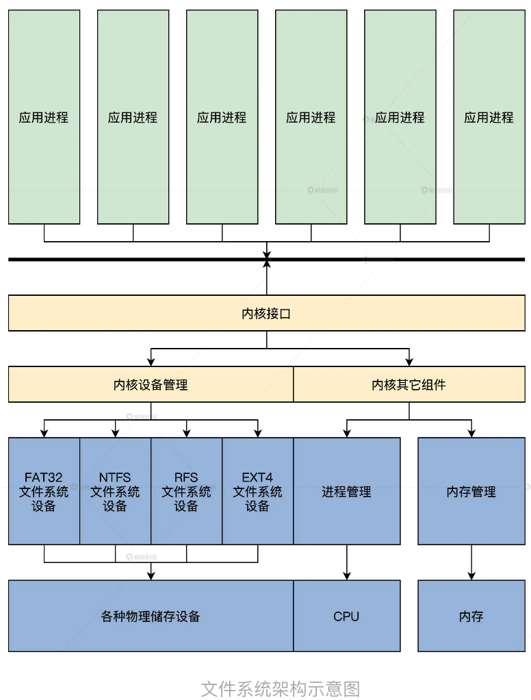
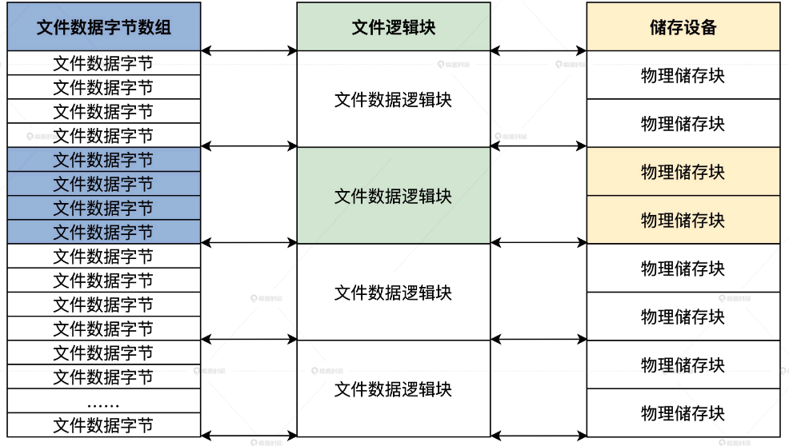
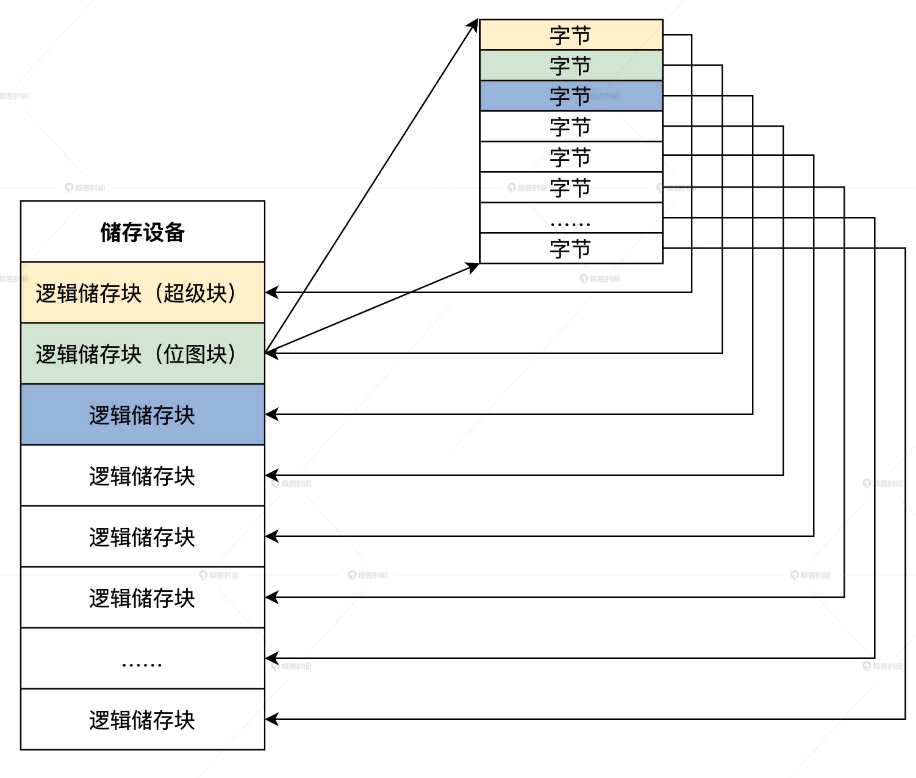
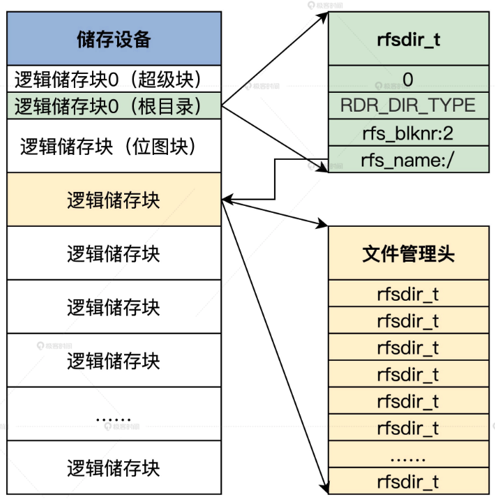
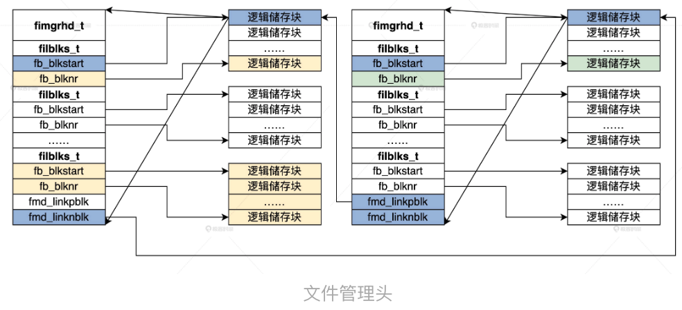

<!-- toc -->
如何组织文件
- [文件系统](#文件系统)
    - [文件系统设计](#文件系统设计)
    - [文件格式与存储块](#文件格式与存储块)
    - [如何组织文件](#如何组织文件)
- [文件系统数据结构](#文件系统数据结构)
    - [设计超级块](#设计超级块)
    - [位图](#位图)
    - [文件管理头](#文件管理头)
<!-- tocstop -->

# 文件系统
操作系统分出的子系统用来把许多文件存储在某一种存储设备上方便进程对各种文件执行打开，关闭，读写，增加和删除等操作。其在上层为用户或者进程提供了一个逻辑视图，也就是目录结构。  
## 文件系统设计
思考:
1. 文件系统为什么可以是一个设备开始，以及它在整个 HuOS 内核中的位置格局？
2. 文件数据的格式以及储存介质的最小单位是什么？
3. 如何组织越来越多的文件？

**文件系统只是一个设备**  
不同文件系统格式：FAT32、NTFS、Ext4、Btrfs、ZFS、HPFS 等。因此文件系统难以成为内核的一部分。操作系统可动态加载和删除不同的文件系统组件。  
  
我们使用一块 4MB 大小的内存空间来模拟储存设备，这不是我们第一次建造内存文件系统（ramfs），只是我们做得更小。在文件系统设备驱动程序的入口函数中，分配 4MB 大小的内存空间。  
## 文件格式与存储块
我们按什么格式把这些数据（文件）存放在储存介质上。  
这个格式是指文件系统存放文件数据的格式。文件数据本身的格式，文件系统不该多管，例如 MP3、Word 文档的内部格式，各不相同。  
类 UNIX 系统和 Windows 系统都采用了相同的方案，那就是**逻辑上认为一个文件就是一个可以动态增加、减少的线性字节数组**，即文件数据的每个字节都一一对应到这个线性数组中的每个元素。  
  
储存设备的最小单位是一个储存块，不像内存设备可以最少访问一个字节。  
文件系统把文件数据定义成一个动态的线性字节数组，可是一开始我们不知道这个数组是多大，需要分配多少个物理储存块，最好是把这个动态的线性字节数组分成一个个数据块。为了文件系统能工作在不同的储存设备上，所以我们把这里的数据块定义为文件系统逻辑块，其大小为 4096 字节，最后把这个逻辑块映射到一个或多个物理储存块。  
  
## 如何组织文件
文件数量多了就出现了目录，而目录是用来帮助用户组织或归纳文件的。  

# 文件系统数据结构
表示文件系统本身的一些数据结构，这些数据结构我们称为**文件系统元数据**。  
## 设计超级块
一个文件系统有很多重要的信息，例如文件系统标识、版本、状态，储存介质大小，文件系统逻辑储存块大小，位图所在的储存块，还有根目录等。包含这些信息的数据结构，就叫做文件系统的超级块或者文件系统描述块。
HuOS/include/drvinc/ 目录下建立一个 drvrfs_t.h 文件，写下 rfssublk_t 结构
```c
typedef struct s_RFSSUBLK
{
    spinlock_t rsb_lock;//超级块在内存中使用的自旋锁
    uint_t rsb_mgic;//文件系统标识
    uint_t rsb_vec;//文件系统版本
    uint_t rsb_flg;//标志
    uint_t rsb_stus;//状态
    size_t rsb_sz;//该数据结构本身的大小
    size_t rsb_sblksz;//超级块大小
    size_t rsb_dblksz;//文件系统逻辑储存块大小，我们这里用的是4KB
    uint_t rsb_bmpbks;//位图的开始逻辑储存块
    uint_t rsb_bmpbknr;//位图占用多少个逻辑储存块
    uint_t rsb_fsysallblk;//文件系统有多少个逻辑储存块
    rfsdir_t rsb_rootdir;//根目录，后面会看到这个数据结构的
}rfssublk_t;
```
超级块，保存在储存设备的第一个 4KB 大小的逻辑储存块中，但是它本身的大小没有 4KB，多余的空间用于以后扩展。**rfsdir_t 数据结构是一个目录数据结构**。  
## 位图
标识哪个逻辑储存块是空闲的或者被占用的。位图，就是利用一块储存空间中所有位的状态，达到映射逻辑储存块状态（是否已分配）的目的。  
一个字节是 8 个位，那么 4KB 的储存空间中，就有（4096*8）个位，这每个位映射到一个逻辑储存块，其中一个位的值为 0，就表示该位对应的逻辑储存块是空闲的，反之就表示对应的逻辑储存块是占用的。  
  
在实际操作时，我们把位图这个储存块当成一个字节数组就行了。这里我们用了一块 4MB 的内存空间模拟储存设备，所以一共只有 1024 个 4KB 大小的逻辑储存块。因为远远小于 4096，所以用不着把所有位都利用起来，操作一个个位很麻烦，完全可以用一个字节表示一个逻辑储存块是否空闲还是占用。  
## 文件目录
从本质上来说，目录也是一种数据，这种数据中包含了目录类型、状态、指向文件数据管理头的块号、名称等信息。  
rfsdir_t 数据结构，写在 drvrfs_t.h 文件中  
```c
#define DR_NM_MAX (128-(sizeof(uint_t)*3)) //可以看出 rfsdir_t 数据结构最多只有 128 字节大小
#define RDR_NUL_TYPE 0
#define RDR_DIR_TYPE 1
#define RDR_FIL_TYPE 2
#define RDR_DEL_TYPE 5
typedef struct s_RFSDIR
{
    uint_t rdr_stus;//目录状态
    uint_t rdr_type;//目录类型，可以是空类型、目录类型、文件类型、已删除的类型
    uint_t rdr_blknr;//指向文件数据管理头的块号，不像内存可以用指针，只能按块访问
    char_t rdr_name[DR_NM_MAX];//名称数组，大小为DR_NM_MAX
}rfsdir_t;
```
名称数组的大小就是 128 减去 3 个 8 字节，由于储存设备不能用字节地址访问，它只能一块一块的访问，所以 rfsdir_t 结构中有个域，指向文件数据管理头的块号。  
  
超级块中的 rfsdir_t 结构保存了根目录的名称和指向管理根目录数据的文件管理头的块号。而实际的目录数据保存在逻辑储存块中，这表明目录也是一种数据。  
## 文件管理头
文件除了文件名，还有状态、类型、创建时间、访问时间、大小，更为重要的是要知道该文件使用了哪些逻辑储存块。  
下面就来把上述所有的文件信息，归纳整理成一个数据结构，写在 drvrfs_t.h 文件中称为文件管理头，即 fimgrhd_t 结构  
```c
#define FBLKS_MAX 32
#define FMD_NUL_TYPE 0
#define FMD_DIR_TYPE 1
#define FMD_FIL_TYPE 2
#define FMD_DEL_TYPE 5//文件管理头也需要表明它管理的是目录文件还是普通文件
typedef struct s_FILBLKS
{    
    uint_t fb_blkstart;//开始的逻辑储存块号
    uint_t fb_blknr;//逻辑储存块的块数，从blkstart开始的连续块数
}filblks_t;
typedef struct s_fimgrhd
{
    uint_t fmd_stus;//文件状态
    uint_t fmd_type;//文件类型：可以是目录文件、普通文件、空文件、已删除的文件
    uint_t fmd_flg;//文件标志
    uint_t fmd_sfblk;//文件管理头自身所在的逻辑储存块
    uint_t fmd_acss;//文件访问权限
    uint_t fmd_newtime;//文件的创建时间，换算成秒
    uint_t fmd_acstime;//文件的访问时间，换算成秒
    uint_t fmd_fileallbk;//文件一共占用多少个逻辑储存块
    uint_t fmd_filesz;//文件大小
    uint_t fmd_fileifstbkoff;//文件数据在第一块逻辑储存块中的偏移
    uint_t fmd_fileiendbkoff;//文件数据在最后一块逻辑储存块中的偏移
    uint_t fmd_curfwritebk;//文件数据当前将要写入的逻辑储存块
    uint_t fmd_curfinwbkoff;//文件数据当前将要写入的逻辑储存块中的偏移
    filblks_t fmd_fleblk[FBLKS_MAX];//文件占用逻辑储存块的数组，一共32个filblks_t结构
    uint_t fmd_linkpblk;//指向文件的上一个文件管理头的逻辑储存块
    uint_t fmd_linknblk;//指向文件的下一个文件管理头的逻辑储存块
}fimgrhd_t;
```
关键是 fmd_fleblk 数组，它里面的每个元素都保存一片连续的逻辑储存块。  
比如一个文件占用：4~8、10~15、30~40 的逻辑储存块，那么就在 fmd_fleblk[0]中保存 4 和 4，在 fmd_fleblk[1]中保存 10 和 5，在 fmd_fleblk[2]中保存 30 和 10。  
当文件特别大时，fmd_fleblk 数组元素可能就不够用了。但是我们想了一个办法，在 fmd_fleblk 数组元素用完时，就再分配一个逻辑储存块，在里面再次存放同一个文件的 fimgrhd_t 结构，**让上一个 fimgrhd_t 结构中的 fmd_linknblk 域指向这个逻辑储存块，再让这个逻辑储存块中 fimgrhd_t 结构中的 fmd_linkpblk 域，指向上一个 fimgrhd_t 结构所在的逻辑储存块。**  
  
可以看到 fimgrhd_t 结构如何管理一个文件占有的所有逻辑储存块，并且可以通过类似链表的形式动态增加 fimgrhd_t 结构，实际上就是在动态增加文件的逻辑储存块。同时我们不难发现，文件的第一个逻辑储存块的首个 512 字节空间中，存放的就是 fimgrhd_t 数据结构。  

_我们文件系统的储存单位为什么要自定义一个逻辑储存块？_  
不同设备的物理块都不同，难以兼容，自己搞一个逻辑块抽象一层可以降低程序复杂度  