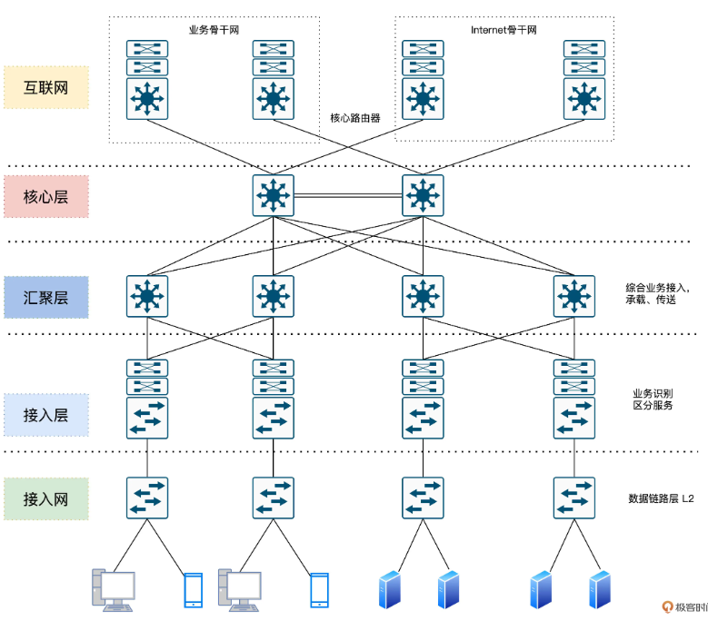
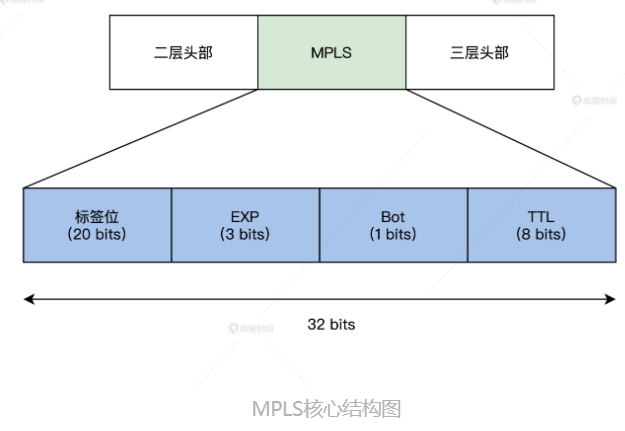
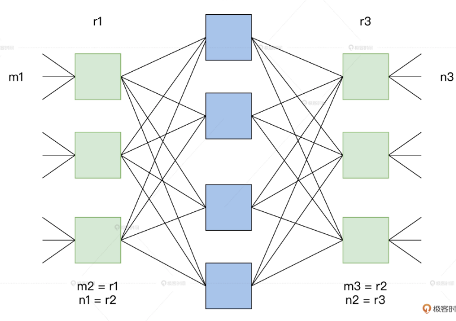
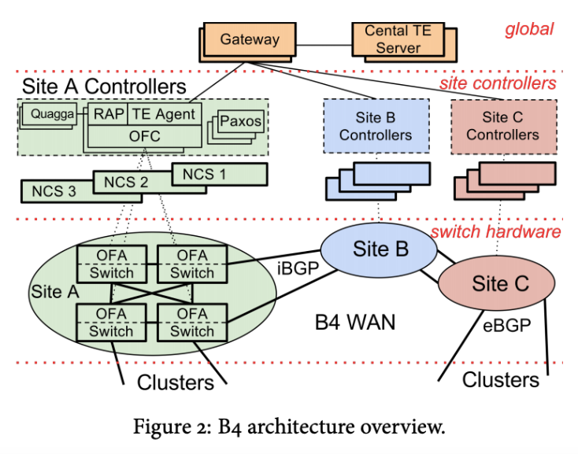
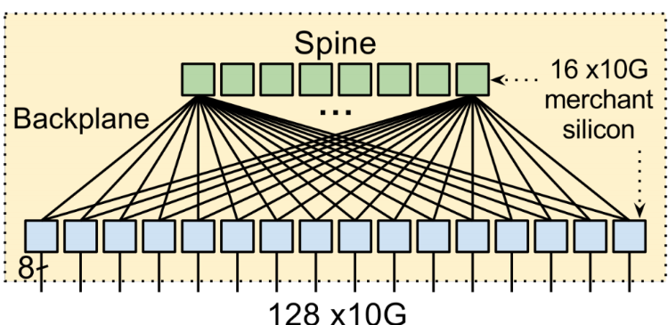
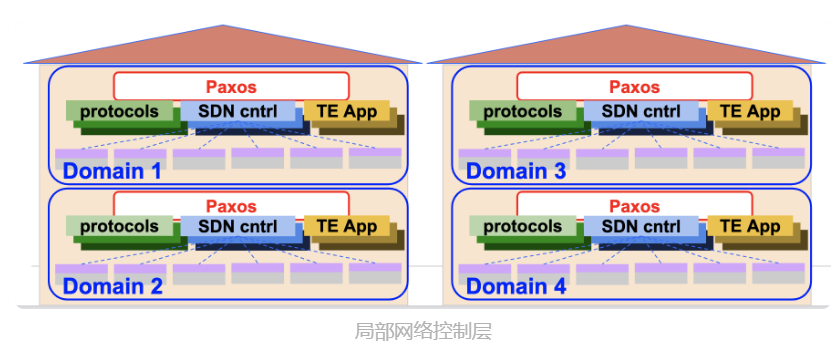
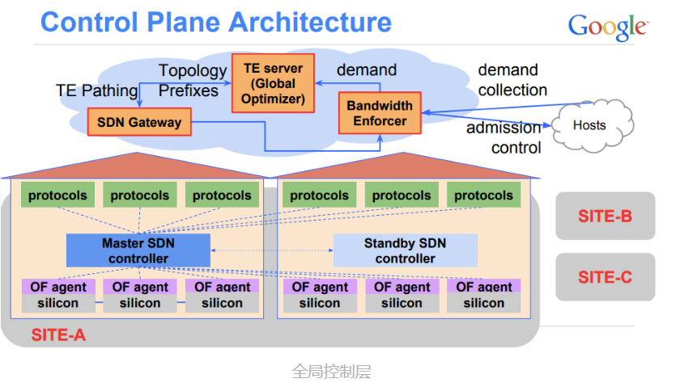
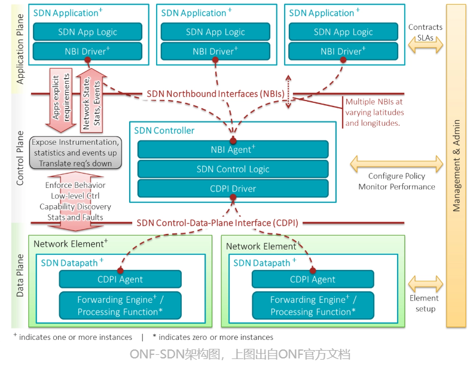

现实世界中网络请求是如何穿过重重网络设备，实现大规模组网的。  
<!-- toc -->
- [传统网络架构](#传统网络架构)
- [优化与迭代：MPLS 技术](#优化与迭代mpls-技术)
    - [无阻塞交换网络研究](#无阻塞交换网络研究)
- [Google B4](#google-b4)
    - [第一层：物理设备层](#第一层物理设备层)
    - [第二层：局部网络控制层](#第二层局部网络控制层)
    - [第三层全局控制层（Global）](#第三层全局控制层global)
    - [SDN 原理](#sdn-原理)
    - [SDN 的基本特征和优势](#sdn-的基本特征和优势)
- [开放网络操作系统 ONOS 组网实践](#开放网络操作系统-onos-组网实践)
<!-- tocstop -->

# 传统网络架构
传统的三层网络架构，著名的通信设备厂商思科把这种架构叫做分级的互联网络模型（Hierarchical Inter-networking Model）。这种架构的优点是，可以把复杂的网络设计问题抽象为几个层面来解决，每个层面又聚焦于某些特定的功能。这样就能把复杂而庞大的网络问题拆解成比较好解决的子问题。  
  
首先是核心层。交换层的核心交换机为进出数据中心的数据包提供高速转发的功能，为多个汇聚层提供连通性，同时也为整个网络提供灵活的 L3 路由网络。  
然后是汇聚层。汇聚交换机与接入交换机相连，提供防火墙、SSL 卸载、入侵检测、网络分析等其他服务。  
最后我们来看接入层。接入交换机通常位于机架的顶部，因此它们也被称为 ToR 交换机，并且它们与服务器物理连接。
核心层和汇聚层这种骨干网络需要承担的流量是蛮大的，流量大意味着对交换性能、效率有更高的要求。所以为了解决性能、效率等问题，我们需要在 OSI 的 1、2、3 层上分别做优化。  

我们发现经典的 IP 网络是逐跳转发数据的。转发数据时，每台路由器都要根据包头的目的地址查询路由表，以获得下一跳的出口。这个过程显然是繁琐低效的。另外，转发路径也不够灵活，为了加以改善，我们在第二层之上、第三层之下引入一个 2.5 层的技术方案，即多协议标签交换（MPLS）技术。  

# 优化与迭代：MPLS 技术
  
MPLS 通过 LDP 标签分发协议。我来举个例子吧，这相当于把快递标签“贴在”了快递盒子上了，后续只需要读取标签，就能知道这个数据要转发到哪里去了。这样就避免了传统路由网络中每路过一个经手人（每一跳），都要把快递盒子打开看一看的额外开销。  
路径计算元素协议（RSVP-TE）最大的优点是收集整个网络的拓扑和链路状态信息。通过扩展的资源预留协议，可以实现灵活的转发路径选择和规划。这就好比双十一了，物流公司根据物流大数据收集到的路网和拥堵状态等信息，自动规划出性价比最高的路径，显然快递配送效率会得到很大提升。  
_当然，只在 OSI 的 2、3 层之间做优化是远远不够的，为了满足动辄数百 G 传输需求，物理层也经历了从 DWDM（Dense Wavelength Division Multiplexing）波分复用系统这种波分复用技术到 OTN（Iptical Transport Network，光传送网）的技术演进。_  

MPLS 技术虽然也解决了问题，但也加重了耦合，并且存在资源利用率低、复杂度高、价格昂贵等缺点。所以后来 SR（Segment Routing）技术又应运而生，而随着 IPv6 的演进，我们用 SRv6 替代 MPLS 技术也是大势所趋。  
我们还要注意到业务需求的变化。比如随着云与 5G 等移动通信的发展，流量除了以前客户端和服务端的南北向通信之外，服务端分布式服务之间也会引入了大量的通信流量。甚至随着云与容器的演进，服务端会存在大量的虚拟机迁移等动作。这些对传统网络中 STP 拓扑变化、收敛以及网络规模都带来了巨大的挑战。  
## 无阻塞交换网络研究
用多个小规模、低成本的单元，构建复杂、大规模的网络。  
CLOW 网络是包含输入级别、中间级别和输出级别的三级互连体系结构。下图中的矩形表示规模较小的转发单元，其成本显然也相对较低。CLOS 的本质可以简单理解为是一种多级交换的架构思想，并且这种架构很适合在输入和输出持续增加的情况下将中间交叉数降至最低。  
m 是每个子模块的输入端口数，n 是每个子模块的输出端口数，r 是每一级的子模块数，经过合理的重排，只要满足公式：
r2≥max(m1,n3)。那么，对于任意的输入到输出，总是能找到一条无阻塞的通路。  
  
CLOS 架构被应用到 Switch Fabric。应用 CLOS 架构的交换机的开关密度，与交换机端口数量 N 的关系如下。
O(N^(3/2))  
在 N 较大时，CLOS 模型能降低交换机内部的开关密度。由此可见，越来越多的人发现了传统三层网络架构下的痛点，于是一种叫做胖树的网络架构应运而生。《A Scalable, Commodity Data Center Network Architecture》  
而借鉴 Fattree 和 CLOS 模型的思想，目前业界衍生出了叶脊（Spine-Leaf）网络架构。目前通过 FaceBook、Google 等公司大量实践的事实已经证明，Spine-Leaf 网络架构可以提供高带宽、低延迟、非阻塞、可扩展的服务器到服务器连接。这种新一代架构在工程实践中的代表之一，则正是 Google 的 B4 网络。  

# Google B4
B4 网络，实现了数据在各个公司园区之间的实时复制。  
B4 网络的核心架构由 Google 设计的控制软件和白盒交换机构成。谷歌的目标是建立一个类似于广域网的镜像网络，随着网络规模的不断扩展，目前谷歌的大部分业务都已经运行在 B4 上了。  
  
B4 网络的其实也是由三层构成，但这个和传统网络的“三层架构”又不太一样。这里指的是物理设备层（Switch Hardware）、局部网络控制层（Site Controllers）和全局控制层（Global）。  
全局控制层中的 SDN 网关和 TE 服务器会在全局进行统一控制，而每个数据中心（Site）则会通过 Site Controller 来控制物理交换机，从而实现将网络的控制面和数据面分离的效果。  
## 第一层：物理设备层
白盒交换机。这个自研的交换机使用了 24 颗 16×10Gb 的芯片，还携带了 128 个 10Gb 网口。交换机里面运行的是 OpenFlow 协议。  
那如何让专用的交换机芯片跟 OpenFlow 更好地进行协同呢？为了解决这个问题，Google 采用了 TTP 方案。实际运行时交换机则会把像访问控制列表（ACL）、路由表、隧道表之类的关键数据通过 BGP/IS-IS 协议报文送到 Controller，由 Controller 进行处理。  
  
## 第二层：局部网络控制层
B4 网络中，一个 Controller 服务可以控制多个交换机。而为了保证可用性，一个交换机是可以连接多个 Controller 服务的，而同一时间只会有一个 Controller 服务为这台交换机提供服务，并且一个数据中心中会包含由多个 Controller 服务实例构成的服务集群。  
在局部网络控制层中，还会使用 Paxos 协议负责所有控制功能的领导者（leader）选举  
每个节点上的 Paxos 实例对给定控制功能的可用副本集做应用程序级别的健康检测。当大多数的 Paxos 实例检测到故障时，他们就会从剩余的可用服务器集中选出一个新的负责人。然后，Paxos 会将递增的 ID 号回调给当选的 leader。leader 使用这个 ID 来向客户表明自己的身份。  
  
## 第三层全局控制层（Global）
负责全局控制的 TE Server 通过 SDN Gateway 从各个数据中心的控制器收集链路信息，从而掌握路径状态。这些路径以 IP-In-IP 隧道的方式创建，通过 SDN 网关到达 Onix 控制器，最后下达到交换机。当一个新的业务数据需要传输时，应用程序会估计它在传输时需要的带宽，并为它选择一个最佳路径，这样可以让链路的带宽利用率达到整体最佳。  
  
## SDN 原理
开放网络基金会 ONF（Open Networking Foundation）则站在了 Google B4 等前人经验的基础上，当然也是将 SDN 架构分为三层，如下。  
应用层是由包含了各种不同的的业务逻辑的应用构成的。  
控制层主要负责数据平面相关资源的编排、调度、网络拓扑的维护以及状态信息管理等工作。  
数据层相对来说逻辑更轻，主要负责数据的转发、处理以及运行时的一些状态收集工作。  
  
## SDN 的基本特征和优势
1. 控制逻辑与转发逻辑分离。转发平面主要是由受控的转发设备构成，具体的转发方式和相关业务逻辑则由分离在控制面的控制应用程序控制。
2. 开放的 API。通过开放的南北向 API，可以实现应用和网络的无缝集成，让应用只需要关注自己的逻辑，不需要关注底层的实现细节。
3. 集中控制：集中的控制平面可以获取网络资源的全局信息，并根据业务需求进行全局分配和优化。

几大优势
1. 灵活性，动态调整网络设备的配置，不再需要手动配置每台设备了。
2. 网络硬件简化（如白盒交换机等）。只需要关注数据处理和转发，与具体业务特性解耦，加速新业务特性的引入。
3. 自动化的网络部署、操作和维护以及故障诊断。

# 开放网络操作系统 ONOS 组网实践
ONOS 是一个开源的、分布式的网络操作系统控制平台，可以满足运营商对网络业务的电信级需求。  
我们前面讲过 SDN 分为控制面和数据面，对应到开源实现中 ONOS 就是控制面的具体实现，而 Mininet (云原生虚拟化网络仿真工具)对应的就是数据面实现。  
使用 ONOS+Mininet 我们可以快速创建一个包含主机、交换机、SDN 控制器以及链路的虚拟网络，并且 Mininet 创建的交换机也是支持上文讲到的 OpenFlow 协议的，这也使得它具备了高度的灵活性。使用这个工具，我们可以在本地轻松搭建一个 SDN 开发、调试环境。  