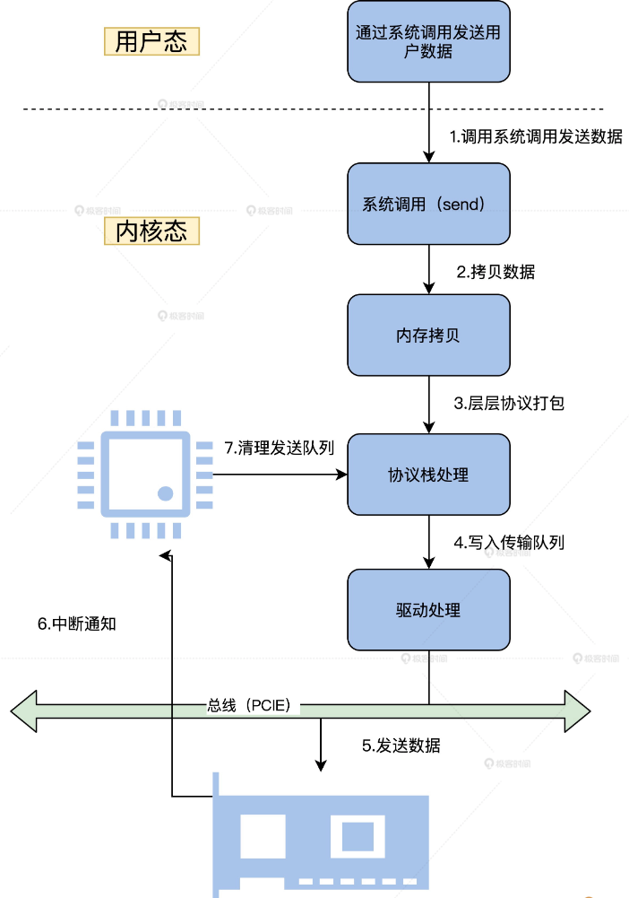
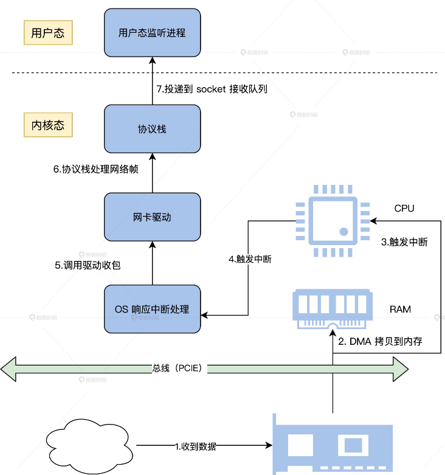
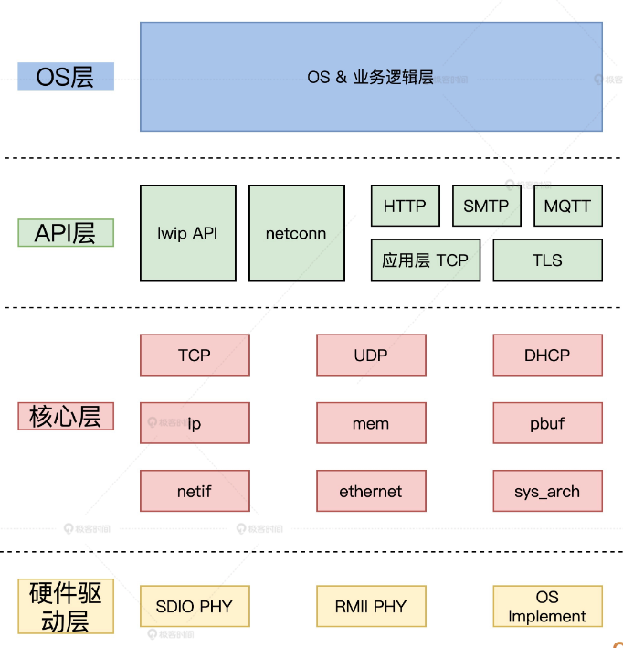
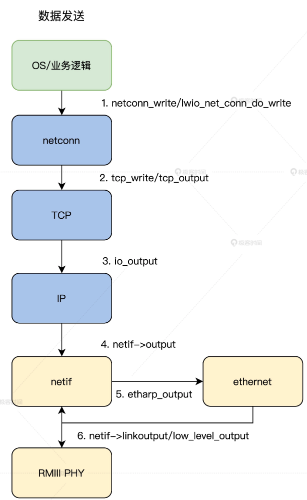
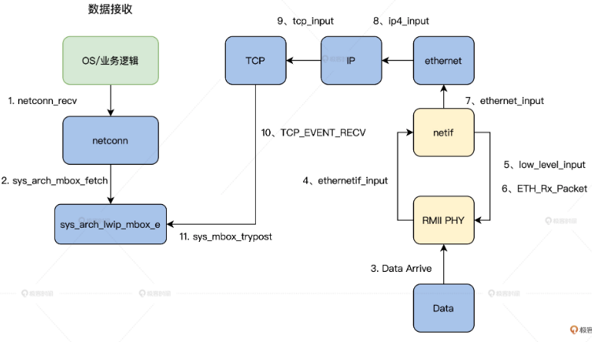
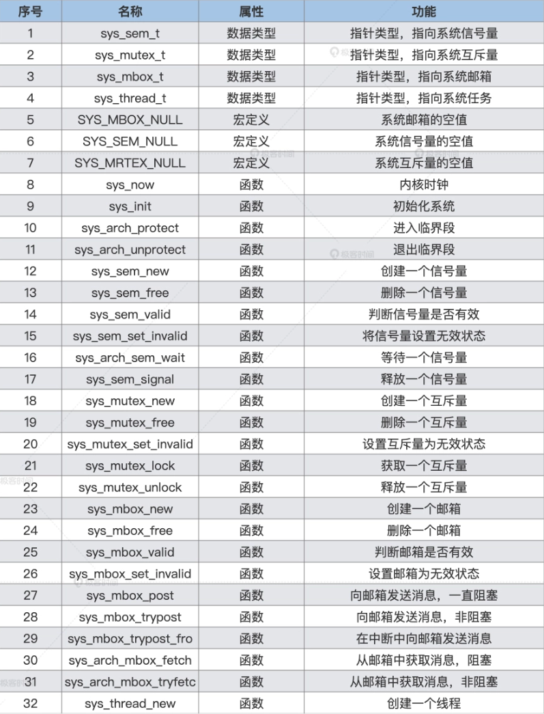

<!-- toc -->
- [一次具体的网络发收过程](#一次具体的网络发收过程)
    - [发送过程总览](#发送过程总览)
    - [接收过程总览](#接收过程总览)
- [lwIP 架构](#lwip-架构)
    - [第一层](#第一层)
    - [第二层](#第二层)
    - [第三层](#第三层)
    - [第四层](#第四层)
- [lwIP 执行流程](#lwip-执行流程)
    - [数据发送](#数据发送)
    - [数据接收](#数据接收)
- [协议栈移植](#协议栈移植)
    - [有操作系统模式](#有操作系统模式)
<!-- tocstop -->

# 一次具体的网络发收过程
内核中的数据流转也只是为了满足网络收发的需求而进行的设计。  
## 发送过程总览
应用程序首先会准备好数据，调用用户态下的库函数。接着调用系统 API 接口函数，进入到内核态。  
内核态对应的系统服务函数会复制应用程序的数据到内核的内存空间中，然后将数据移交给网络协议栈，在网络协议栈中将数据层层打包。  
最后，包装好的数据会交给网卡驱动，网卡驱动程序负责将打包好的数据写入网卡并让其发送出去。  
  
其中还有 DMA 处理、CRC 校验、出错处理等细节  
## 接收过程总览
就是发送数据的逆过程。  
首先，网卡接收到数据，通过 DMA 复制到指定的内存，接着发送中断，以便通知网卡驱动，由网卡驱动处理中断复制数据。然后网络协议收到网卡驱动传过来的数据，层层解包，获取真正的有效数据。最后，这个数据会发送给用户态监听的应用进程。  
  

# LwIP 架构
TCP/IP 协议的轻量级开源项目，用 C 语言实现的软件组件，一共有两套接口层，向下是操作系统要提供的，向上是提供给应用程序的。这样 lwIP 就能嵌入到任何操作系统之中工作，并为这个操作系统上的应用软件提供网络功能支持了。  
完整性”主要是指 TCP 协议的完整性，实现的关键点就是在保持 TCP 协议主要功能的基础上减少对 RAM 的占用。同时，lwIP 还支持 IPv6 的标准实现。  
  
## 第一层
MCU 的业务层是 lwIP 的服务对象，也是其自身代码使用 lwIP 的地方。  
大部分时候我们都是从这里入手，通过 netconn 或 lwip_api 使用 lwIP 的各种功能函数。  
在典型的 TCP 通信的客户端应用程序中，一般先要通过 netconn_new 创建一个 struct netconn 对象，然后调用 netconn_connect 连接到服务器，并返回成功或失败。成功后，可以调用 netconn_write 向服务器发送数据，也可以调用 netconn_recv 接收数据。最后，关闭连接并通过 netconn_close 释放资源。  
## 第二层
lwIP 的 api 层是 netconn 的功能代码所在的层，负责为上层代码提供 netconn 的 api。习惯使用 socket 的同学也可以使用 lwip_socket 等函数，以标准的 socket 方式调用 lwIP。新版本增加了 http、mqtt 等应用的代码，这些额外的应用对目前的物联网通信来说确实很方便。
## 第三层
lwIP 的核心层存放了 TCP/IP 协议栈的核心代码，它不仅实现了大部分的 TCP 和 UDP 功能，还实现了 DNS、ICMP、IGMP 等协议，同时也实现了内存管理和网络接口功能。  
该层提供了 sys_arch 模块设计，便于将 lwIP 移植到不同的操作系统，如线程创建、信号量、消息队列等功能。和操作系统相关的真正定义写在了 lwip/include/sys.h 文件中。  
## 第四层
硬件驱动层提供 PHY 芯片驱动，用来匹配 lwIP 的使用。lwIP 会调用该层的代码将组装好的数据包发送到网络，同时从网络接收数据包并进行分析，实现通信功能。  

# lwIP 执行流程
## 数据发送
把 lwIP 作为 HuOS 的一个内核组件来工作，自然要由 lwIP 接收来自内核上层发来的数据。内核上层首先会调用 lwIP 的 netconn 层的接口函数 netconn_write，通过这个函数，数据正式流进 lwIP 组件层。  
接着，netconn 层调用 lwIP 组件的 TCP 层的接口函数 tcp_write，在 TCP 层对数据首次进行打包。然后，TCP 层将打包好的数据通过调用 io_output 函数，向下传递给 lwIP 组件的 IP 层，进行打包。  
最后，IP 层将打包好的数据发送给网卡驱动接口层 netif，这里调用了实际的网卡驱动程序，将数据发送出去。  
  
## 数据接收
数据接收需要应用程序首先调用 lwIP 的 netconn 层的 netconn_recv 接口。然后由 netconn 层调用 sys_arch_mbox_fetch 函数，进入监听等待相关的 mbox。  
接着，数据会进入网卡，驱动程序相关的函数负责把它复制到内存。再然后是调用 ethernet_input 函数，进入 ethernet 层。完成相关处理后，调用 ip4_input 函数，数据在 lwIP 组件的 IP 层对数据解包，进行相应处理之后，还会调用 tcp_input 函数，进入 lwIP 组件的 TCP 层对数据解包。  
最后，调用 sys_mbox_trypost 函数把数据放入特定的 mbox，也就是消息盒子里，这样等待监听的应用程序就能得到数据了。  
  

# 协议栈移植
lwIP 的结构设计非常优秀，这让移植工作变得很容易。我们这里只要了解 lwIP 组件的 sys_arch 层的接口函数即可。  
lwIP 有两种移植模式，一种是 NO_SYS，无操作系统模式，一种是有操作系统模式。用 NO_SYS 模式比较简单。  
操作系统模式主要需要基于操作系统的 IPC 机制，对网络连接进行了抽象（信号量、邮箱 / 队列、互斥体等机制），从而保证内核与应用层 API 的通讯。这样做的好处是 lwIP 内核线程可以只负责数据包的 TCP/IP 封装和拆封，而不用进行数据的应用层处理，从而极大地提高系统对网络数据包的处理效率。  
而这些操作系统模拟层的函数主要是在 sys.h 中声明的，我们一般在 sys_arch.c 文件中完成其定义。所以，**带操作系统的移植就是在无操作系统的基础上添加操作系统模拟层。**  
## 有操作系统模式
现在我们就可以在 HuOS 系统提供的 IPC 等机制基础之上，对照 sys.h 文件中声明的函数一一去实现了。实际工程中完整移植网络栈，需要将后面表格里的这 30 多个函数全部实现。  
  
这些变量和函数主要面向信号量、互斥体和邮箱，包括创建、删除、释放和获取等各种操作，所以我们需要根据操作系统的规定来实现这些函数。  
在 lwIP 中，用户代码通过邮箱与协议栈内部交互。邮箱本质上是指向数据的指针。API 将指针传递给内核，内核通过这个指针访问数据，然后进行处理。相反，内核也是通过邮箱将数据传递给用户代码的。  
```c
/*创建一个空的邮箱。*/
err_t sys_mbox_new(sys_mbox_t *mbox, int size)
{
	osMessageQDef(QUEUE, size, void *);
	*mbox = osMessageCreate(osMessageQ(QUEUE), NULL);
	#if SYS_STATS
	++lwip_stats.sys.mbox.used;
	if (lwip_stats.sys.mbox.max < lwip_stats.sys.mbox.used) {
		lwip_stats.sys.mbox.max = lwip_stats.sys.mbox.used;
	}
	#endif /* SYS_STATS */
	if (*mbox == NULL)
		return ERR_MEM;
	return ERR_OK;
}
/*重新分配一个邮箱。如果邮箱被释放时，邮箱中仍有消息，在lwIP中这是出现编码错误的指示，并通知开发人员。*/
void sys_mbox_free(sys_mbox_t *mbox)
{
	if( osMessageWaiting(*mbox) )
	{
		portNOP();
		#if SYS_STATS
		lwip_stats.sys.mbox.err++;
		#endif /* SYS_STATS */
	}
	osMessageDelete(*mbox);
	#if SYS_STATS
	--lwip_stats.sys.mbox.used;
	#endif /* SYS_STATS */
}
/*发送消息到邮箱*/
void sys_mbox_post(sys_mbox_t *mbox, void *data)
{
	while(osMessagePut(*mbox, (uint32_t)data, osWaitForever) != osOK);
}
/*尝试将消息发送到邮箱*/
err_t sys_mbox_trypost(sys_mbox_t *mbox, void *msg)
{
	err_t result;
	if ( osMessagePut(*mbox, (uint32_t)msg, 0) == osOK)
	{
		result = ERR_OK;
	}
	else {
		result = ERR_MEM;
		#if SYS_STATS
		lwip_stats.sys.mbox.err++;
		#endif /* SYS_STATS */
	}
	return result;
}
/*阻塞进程从邮箱获取消息*/
u32_t sys_arch_mbox_fetch(sys_mbox_t *mbox, void **msg, u32_t timeout)
{
	osEvent event;
	uint32_t starttime = osKernelSysTick();;
	if(timeout != 0)
	{
		event = osMessageGet (*mbox, timeout);
		if(event.status == osEventMessage)
		{
			*msg = (void *)event.value.v;
			return (osKernelSysTick() - starttime);
		}
		else
		{
			return SYS_ARCH_TIMEOUT;
		}
	}
	else
	{
		event = osMessageGet (*mbox, osWaitForever);
		*msg = (void *)event.value.v;
		return (osKernelSysTick() - starttime);
	}
}
/*尝试从邮箱获取消息*/
u32_t sys_arch_mbox_tryfetch(sys_mbox_t *mbox, void **msg)
{
	osEvent event;
	event = osMessageGet (*mbox, 0);
	if(event.status == osEventMessage)
	{
		*msg = (void *)event.value.v;
		return ERR_OK;
	}
	else
	{
		return SYS_MBOX_EMPTY;
	}
}
/*判断一个邮箱是否有效*/
int sys_mbox_valid(sys_mbox_t *mbox)
{
	if (*mbox == SYS_MBOX_NULL)
		return 0;
	else
		return 1;
}
/*设置一个邮箱无效*/
void sys_mbox_set_invalid(sys_mbox_t *mbox)
{
	*mbox = SYS_MBOX_NULL;
}
// 创建一个新的信号量。而 "count"参数指示该信号量的初始状态
err_t sys_sem_new(sys_sem_t *sem, u8_t count)
{
	osSemaphoreDef(SEM);
	*sem = osSemaphoreCreate (osSemaphore(SEM), 1);
	if(*sem == NULL)
	{
		#if SYS_STATS
		++lwip_stats.sys.sem.err;
		#endif /* SYS_STATS */
		return ERR_MEM;
	}
	if(count == 0) // Means it can't be taken
	{
		osSemaphoreWait(*sem,0);
	}
	#if SYS_STATS
	++lwip_stats.sys.sem.used;
	if (lwip_stats.sys.sem.max < lwip_stats.sys.sem.used) {
		lwip_stats.sys.sem.max = lwip_stats.sys.sem.used;
	}
	#endif /* SYS_STATS */
	return ERR_OK;
}
```
此外还有一些函数也是协议栈需要的函数，特别是 sys_thread_new 函数，不但协议栈在初始化时需要用到，在后续我们实现各类基于 lwIP 的应用时也会用得到  
```c
sys_thread_t sys_thread_new(const char *name, lwip_thread_fn thread , void *arg, int stacksize, int prio)
{
	const osThreadDef_t os_thread_def = { (char *)name, (os_pthread)thread, (osPriority)prio, 0, stacksize};
	return osThreadCreate(&os_thread_def, arg);
}
osThreadId osThreadCreate (const osThreadDef_t *thread_def, void *argument)
{
TaskHandle_t handle;
#if( configSUPPORT_STATIC_ALLOCATION == 1 ) && ( configSUPPORT_DYNAMIC_ALLOCATION == 1 )
if((thread_def->buffer != NULL) && (thread_def->controlblock != NULL)) {
handle = xTaskCreateStatic((TaskFunction_t)thread_def->pthread,(const portCHAR *)thread_def->name,
thread_def->stacksize, argument, makeFreeRtosPriority(thread_def->tpriority),
thread_def->buffer, thread_def->controlblock);
}
else {
if (xTaskCreate((TaskFunction_t)thread_def->pthread,(const portCHAR *)thread_def->name,
thread_def->stacksize, argument, makeFreeRtosPriority(thread_def->tpriority),
&handle) != pdPASS) {
return NULL;
}
}
#elif( configSUPPORT_STATIC_ALLOCATION == 1 )
handle = xTaskCreateStatic((TaskFunction_t)thread_def->pthread,(const portCHAR *)thread_def->name,
thread_def->stacksize, argument, makeFreeRtosPriority(thread_def->tpriority),
thread_def->buffer, thread_def->controlblock);
#else
if (xTaskCreate((TaskFunction_t)thread_def->pthread,(const portCHAR *)thread_def->name,
thread_def->stacksize, argument, makeFreeRtosPriority(thread_def->tpriority),
&handle) != pdPASS) {
return NULL;
}
#endif
return handle;
}
```


