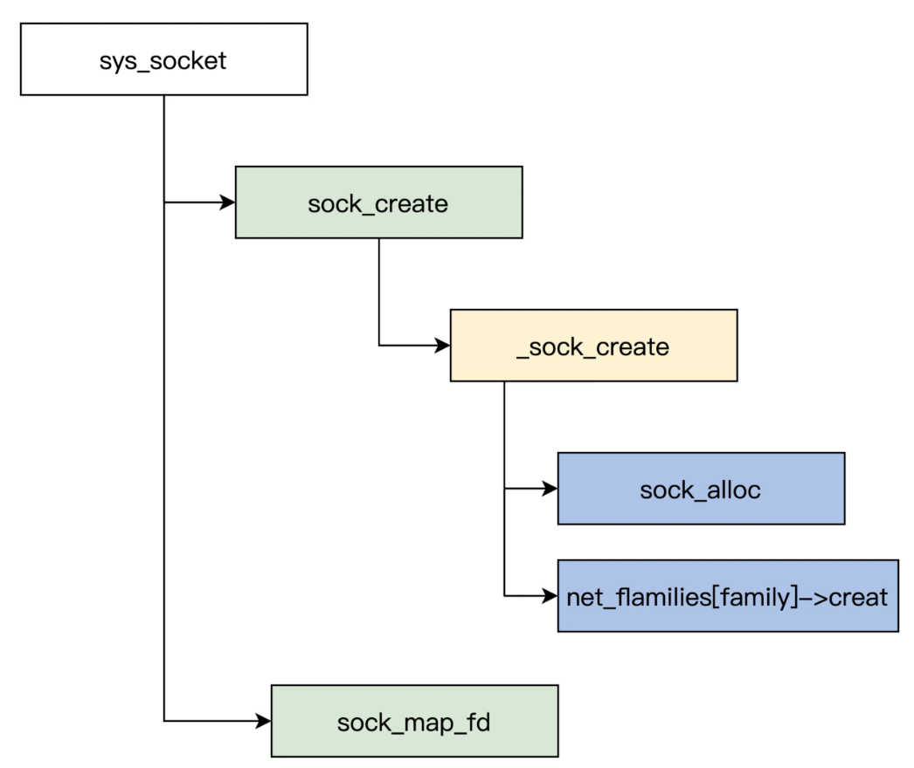

<!-- toc -->
探讨套接字从创建、协议接口注册与初始化过程，深入分析套接字系统，是怎样调用各个功能函数的。
- [套接字接口](#套接字接口)
- [套接字的创建](#套接字的创建)
- [套接字的绑定](#套接字的绑定)
- [主动连接](#主动连接)
- [被动接收连接](#被动接收连接)
- [监听套接字](#监听套接字)
- [发送数据](#发送数据)
- [接收数据](#接收数据)
- [关闭连接](#关闭连接)
<!-- tocstop -->

# 套接字接口
Linux 内核实现的套接字接口，将 UNIX 的“一切都是文件操作”的概念应用在了网络连接访问上，让应用程序可以用常规文件操作 API 访问网络连接。  
Linux 使用内核套接字概念与用户空间套接字通信，这样可以让实现和操作变得更简单。Linux 提供了一套 API 和套接字数据结构，这些服务向下与内核接口，向上与用户空间接口，应用程序正是使用这一套 API 访问内核中的网络功能。  

# 套接字的创建
在应用程序使用 TCP/IP 协议栈的功能之前，我们必须调用套接字库函数 API 创建一个新的套接字，创建好以后，对库函数创建套接字的调用，就会转换为内核套接字创建函数的系统调用。这时，完成的是通用套接字创建的初始化功能，跟具体的协议族并不相关。  
这个过程具体是这样的，在应用程序中执行 socket 函数，socket 产生系统调用中断执行内核的套接字分路函数 sys_socketcall，在 sys_socketcall 套接字函数分路器中将调用传送到 sys_socket 函数，由 sys_socket 函数调用套接字的通用创建函数 sock_create。sock_create 函数完成通用套接字创建、初始化任务后，再调用特定协议族的套接字创建函数。  
  
例子: 由 AF_INET 协议族的 inet_create 函数完成套接字与特定协议族的关联。  
一个新的 struct socket 数据结构起始由 sock_create 函数创建，该函数直接调用 __sock_create 函数，__sock_create 函数的任务是为套接字预留需要的内存空间，由 sock_alloc 函数完成这项功能。  
sock_create -> __sock_create -> sock_alloc 创建socket结构体  
这个 sock_alloc 函数不仅会为 struct socket 数据结构实例预留空间，也会为 struct inode 数据结构实例分配需要的内存空间，这样可以使两个数据结构的实例相关联。  
```c
static int __sock_create(struct net *net, int family, int type, int protocol,
 struct socket **res, int kern)
{
	int err;
	struct socket *sock;
	const struct net_proto_family *pf;
	// 首先检验是否支持协议族
	/*
		* 检查是否在内核支持的socket范围内
	*/
	if (family < 0 || family >= NPROTO)
		return -EAFNOSUPPORT;
	if (type < 0 || type >= SOCK_MAX)
		return -EINVAL;
	/*
		* 为新的套接字分配内存空间，分配成功后返回新的指针
	*/
	sock = sock_alloc();
}
```
```c
static struct socket *sock_alloc(void) {
	struct inode *inode;
	struct socket *sock;
    // 初始化一个可用的inode节点， 在fs/inode.c中
    inode = new_inode(sock_mnt->mnt_sb);
    if (!inode)
    	return NULL;
    // 实际创建的是socket_alloc复合对象，因此要使用SOCKET_I宏从inode中取出关联的socket对象用于返回
    sock = SOCKET_I(inode);
    kmemcheck_annotate_bitfield(sock, type);
    // 文件类型为套接字
    inode->i_mode = S_IFSOCK | S_IRWXUGO;
    inode->i_uid = current_fsuid();
    inode->i_gid = current_fsgid();

    percpu_add(sockets_in_use, 1);
	return sock;
}
```
函数将 struct socket 数据结构的 struct proto_ops *ops 设置为 NULL。随后，当某个协议族中的协议成员的套接字创建函数被调用时，ops 将指向协议实例的操作函数。这时将 struct socket 数据结构的 flags 数据域设置为 0，创建时还没有任何标志需要设置。  
在之后的调用中，应用程序调用 send 或 receive 套接字库函数时会设置 flags 数据域。最后将其他两个数据域 sk 和 file 初始化为 NULL。sk 数据域随后会把由协议特有的套接字创建函数设置为指向内部套接字结构。file 将在调用 sock_map_fd 函数时设置为分配的文件返回的指针。  
文件指针用于访问打开套接字的虚拟文件系统的文件状态。在 sock_alloc 函数返回后，sock_create 函数调用协议族的套接字创建函数 err =pf->create(net, sock, protocol)，它通过访问 net_families 数组获取协议族的创建函数，对于 TCP/IP 协议栈，协议族将设置为 AF_INET。  

# 套接字的绑定
创建完套接字后，应用程序需要调用 sys_bind 函数把套接字和地址绑定起来  
```c
asmlinkage long sysbind (bind, int, fd, struct sockaddr __user *, umyaddr, int, addrlen)
{
  struct socket *sock;
  struct sockaddr_storage address;
  int err, fput_needed;
  /*
   * 获取socket实例。
  */
  sock = sockfd_lookup_light(fd, &err, &fput_needed);
  if (sock) {
    err = move_addr_to_kernel(umyaddr, addrlen, (struct sockaddr *)&address);
    if (err >= 0) {
      err = security_socket_bind(sock, (struct sockaddr *)&address, addrlen);
      /*
       * 如果是TCP套接字，sock->ops指向的是inet_stream_ops，
       * sock->ops是在inet_create()函数中初始化，所以bind接口
       * 调用的是inet_bind()函数。
       */
      if (!err)
        err = sock->ops->bind(sock, (struct sockaddr *) &address, addrlen);
    }
    fput_light(sock->file, fput_needed);
  }
  return err;
}
```
sys_bind 函数首先会查找套接字对应的 socket 实例，调用 sockfd_lookup_light。在绑定之前，将用户空间的地址拷贝到内核空间的缓冲区中，在拷贝过程中会检查用户传入的地址是否正确。  
等上述的准备工作完成后，就会调用 inet_bind 函数来完成绑定操作。  
```c
int inet_bind(struct socket *sock, struct sockaddr *uaddr, int addr_len)
{
    struct sockaddr_in *addr = (struct sockaddr_in *)uaddr;
    struct sock *sk = sock->sk;
    struct inet_sock *inet = inet_sk(sk);
    unsigned short snum;
    int chk_addr_ret;
    int err;

    if (sk->sk_prot->bind) {/* 如果传输层接口上实现了bind调用，则回调它。目前只有SOCK_RAW类型的传输层实现了该接口raw_bind */
        err = sk->sk_prot->bind(sk, uaddr, addr_len);
        goto out;
    }
    err = -EINVAL;
    if (addr_len < sizeof(struct sockaddr_in))
        goto out;
    err = -EADDRNOTAVAIL;
    if (!sysctl_ip_nonlocal_bind &&/* 必须绑定到本地接口的地址 */
        !inet->freebind &&
        addr->sin_addr.s_addr != INADDR_ANY &&/* 绑定地址不合法 */
        chk_addr_ret != RTN_LOCAL &&
        chk_addr_ret != RTN_MULTICAST &&
        chk_addr_ret != RTN_BROADCAST)
        goto out;

    snum = ntohs(addr->sin_port);
    err = -EACCES;
    if (snum && snum < PROT_SOCK && !capable(CAP_NET_BIND_SERVICE))
        goto out;

    lock_sock(sk);/* 对套接口进行加锁，因为后面要对其状态进行判断 */

    /* Check these errors (active socket, double bind). */
    err = -EINVAL;
    /**
     * 如果状态不为CLOSE，表示套接口已经处于活动状态，不能再绑定
     * 或者已经指定了本地端口号，也不能再绑定
     */
    if (sk->sk_state != TCP_CLOSE || inet->num)
        goto out_release_sock;

    /* 设置地址到传输控制块中 */
    inet->rcv_saddr = inet->saddr = addr->sin_addr.s_addr;
    /* 如果是广播或者多播地址，则源地址使用设备地址。 */
    if (chk_addr_ret == RTN_MULTICAST || chk_addr_ret == RTN_BROADCAST)
        inet->saddr = 0;  /* Use device */

    /* 调用传输层的get_port来进行地址绑定。如tcp_v4_get_port或udp_v4_get_port */
    if (sk->sk_prot->get_port(sk, snum)) {
        …
    }

    /* 设置标志，表示已经绑定了本地地址和端口 */
    if (inet->rcv_saddr)
        sk->sk_userlocks |= SOCK_BINDADDR_LOCK;
    if (snum)
        sk->sk_userlocks |= SOCK_BINDPORT_LOCK;
    inet->sport = htons(inet->num);
    /* 还没有连接到对方，清除远端地址和端口 */
    inet->daddr = 0;
    inet->dport = 0;
    /* 清除路由缓存 */
    sk_dst_reset(sk);
    err = 0;
out_release_sock:
    release_sock(sk);
out:
    return err;
}
```

# 主动连接
应用程序处理的是面向连接的网络服务（SOCK_STREAM 或 SOCK_SEQPACKET），所以在交换数据之前，需要在请求连接服务的进程（客户）与提供服务的进程（服务器）之间建立连接。  
当应用程序调用 connect 函数发出连接请求时，内核会启动函数 sys_connect  
```c
int __sys_connect(int fd, struct sockaddr __user *uservaddr, int addrlen)
{
  int ret = -EBADF;
  struct fd f;
  f = fdget(fd);
  if (f.file) {
    struct sockaddr_storage address;
    ret = move_addr_to_kernel(uservaddr, addrlen, &address);
    if (!ret)
            // 调用__sys_connect_file
      ret = __sys_connect_file(f.file, &address, addrlen, 0);
    fdput(f);
  }
  return ret;
}
//连接成功会返回socket的描述符，否则会返回一个错误码。
```

# 被动接收连接
接受一个客户端的连接请求会调用 accept 函数，应用程序触发内核函数 sys_accept，等待接收连接请求。如果允许连接，则重新创建一个代表该连接的套接字，并返回其套接字描述符  
```c
int __sys_accept4_file(struct file *file, unsigned file_flags,
           struct sockaddr __user *upeer_sockaddr,
           int __user *upeer_addrlen, int flags,
           unsigned long nofile)
{
  struct socket *sock, *newsock;
  struct file *newfile;
  int err, len, newfd;
  struct sockaddr_storage address;
  if (flags & ~(SOCK_CLOEXEC | SOCK_NONBLOCK))
    return -EINVAL;
  if (SOCK_NONBLOCK != O_NONBLOCK && (flags & SOCK_NONBLOCK))
    flags = (flags & ~SOCK_NONBLOCK) | O_NONBLOCK;
  sock = sock_from_file(file, &err);
  if (!sock)
    goto out;
  err = -ENFILE;
    // 创建一个新套接字
  newsock = sock_alloc();
  if (!newsock)
    goto out;
  newsock->type = sock->type;
  newsock->ops = sock->ops;
  __module_get(newsock->ops->owner);
  newfd = __get_unused_fd_flags(flags, nofile);
  if (unlikely(newfd < 0)) {
    err = newfd;
    sock_release(newsock);
    goto out;
  }
  newfile = sock_alloc_file(newsock, flags, sock->sk->sk_prot_creator->name);
  if (IS_ERR(newfile)) {
    err = PTR_ERR(newfile);
    put_unused_fd(newfd);
    goto out;
  }
  err = security_socket_accept(sock, newsock);
  if (err)
    goto out_fd;
    // 根据套接字类型调用不同的函数inet_accept
  err = sock->ops->accept(sock, newsock, sock->file->f_flags | file_flags,
          false);
  if (err < 0)
    goto out_fd;
  if (upeer_sockaddr) {
    len = newsock->ops->getname(newsock,
          (struct sockaddr *)&address, 2);
    if (len < 0) {
      err = -ECONNABORTED;
      goto out_fd;
    }
        // 从内核复制到用户空间
    err = move_addr_to_user(&address,
          len, upeer_sockaddr, upeer_addrlen);
    if (err < 0)
      goto out_fd;
  }
  /* File flags are not inherited via accept() unlike another OSes. */
  fd_install(newfd, newfile);
  err = newfd;
out:
  return err;
out_fd:
  fput(newfile);
  put_unused_fd(newfd);
  goto out;
}
```
这个新的套接字描述符与最初创建套接字时，设置的套接字地址族与套接字类型、使用的协议一样。原来创建的套接字不与连接关联，它继续在原套接字上侦听，以便接收其他连接请求。  

# 监听套接字
调用 listen 函数时，应用程序触发内核的 sys_listen 函数，把套接字描述符 fd 对应的套接字设置为监听模式，观察连接请求。  
```c
int __sys_listen(int fd, int backlog)
{
  struct socket *sock;
  int err, fput_needed;
  int somaxconn;
    // 通过套接字描述符找到struct socket
  sock = sockfd_lookup_light(fd, &err, &fput_needed);
  if (sock) {
    somaxconn = sock_net(sock->sk)->core.sysctl_somaxconn;
    if ((unsigned int)backlog > somaxconn)
      backlog = somaxconn;
    err = security_socket_listen(sock, backlog);
    if (!err)
    //根据套接字类型调用监听函数
      err = sock->ops->listen(sock, backlog);
    fput_light(sock->file, fput_needed);
  }
  return err;
}
```

# 发送数据
套接字应用中最简单的传送函数是 send，send 函数的作用类似于 write，但 send 函数允许应用程序指定标志，规定如何对待传送数据。调用 send 函数时，会触发内核的 sys_send 函数，把发送缓冲区的数据发送出去。
1. 应用程序的数据被复制到内核后，sys_send 函数调用 sock_sendmsg，依据协议族类型来执行发送操作。  
1.1 如果是 INET 协议族套接字，sock_sendmsg 将调用 inet_sendmsg 函数。  
1.2 如果采用 TCP 协议，inet_sendmsg 函数将调用 tcp_sendmsg，并按照 TCP 协议规则来发送数据包。  

_send 函数返回发送成功，并不意味着在连接的另一端的进程可以收到数据，这里只能保证发送 send 函数执行成功，发送给网络设备驱动程序的数据没有出错。_

# 接收数据
recv 函数与文件读 read 函数类似，recv 函数中可以指定标志来控制如何接收数据，调用 recv 函数时，应用程序会触发内核的 sys_recv 函数，把网络中的数据递交到应用程序。当然，read、recvfrom 函数也会触发 sys_recv 函数。  
recv->sys_recv->sys_recvfrom/sock_recvfrom/__sock_recvmsg->sock_common_recvmsg->tcp_recvmsg  
1. 为把内核的网络数据转入应用程序的接收缓冲区，sys_recv 函数依次调用 sys_recvfrom、sock_recvfrom 和 __sock_recvmsg，并依据协议族类型来执行具体的接收操作。  
1.1 如果是 INET 协议族套接字，__sock_recvmsg 将调用 sock_common_recvmsg 函数。  
1.2 如果采用 TCP 协议，sock_common_recvmsg 函数将调用 tcp_recvmsg，按照 TCP 协议规则来接收数据包
如果接收方想获取数据包发送端的标识符，应用程序可以调用 sys_recvfrom 函数来获取数据包发送方的源地址  

```c
/*
struct sockaddr __user *addr：指向用户空间的 sockaddr 结构体的指针，用于存储发送方的地址信息
int __user *addr_len：指向用户空间的整型变量的指针，用于存储 sockaddr 结构体的大小
------
首先，这个函数通过调用 import_single_range 函数将用户空间的缓冲区 ubuf 和大小 size 转换为内核空间的 iovec 结构体，并将其存储在 msghdr 结构体中。
然后，通过调用 sockfd_lookup_light 函数，根据描述符 fd 找到对应的 struct socket 结构体。
接着，设置 msghdr 结构体的其他字段，包括控制信息、地址信息等。
*/
int __sys_recvfrom(int fd, void __user *ubuf, size_t size, unsigned int flags,
       struct sockaddr __user *addr, int __user *addr_len)
{
  struct socket *sock;
  struct iovec iov;
  struct msghdr msg;
  struct sockaddr_storage address;
  int err, err2;
  int fput_needed;
  err = import_single_range(READ, ubuf, size, &iov, &msg.msg_iter);
  if (unlikely(err))
    return err;
    // 通过套接字描述符找到struct socket
  sock = sockfd_lookup_light(fd, &err, &fput_needed);
  if (!sock)
    goto out;
  msg.msg_control = NULL;
  msg.msg_controllen = 0;
  /* Save some cycles and don't copy the address if not needed */
  msg.msg_name = addr ? (struct sockaddr *)&address : NULL;
  /* We assume all kernel code knows the size of sockaddr_storage */
  msg.msg_namelen = 0;
  msg.msg_iocb = NULL;
  msg.msg_flags = 0;
  if (sock->file->f_flags & O_NONBLOCK)
    flags |= MSG_DONTWAIT;
    // sock_recvmsg为具体的接收函数
  err = sock_recvmsg(sock, &msg, flags);
  if (err >= 0 && addr != NULL) {
        // 从内核复制到用户空间
    err2 = move_addr_to_user(&address,
           msg.msg_namelen, addr, addr_len);
    if (err2 < 0)
      err = err2;
  }
  fput_light(sock->file, fput_needed);
out:
  return err;
}
```

# 关闭连接
当应用程序调用 shutdown 函数关闭连接时，内核会启动函数 sys_shutdown  
```c
/*
int how：指定关闭的方式，可以是 SHUT_RD、SHUT_WR 或 SHUT_RDWR 之一
------
首先，这个函数通过调用 sockfd_lookup_light 函数，根据描述符 fd 找到对应的 struct socket 结构体。
然后，调用 security_socket_shutdown 函数进行安全检查。
最后，根据套接字的协议族调用关闭函数，实现对套接字的关闭。
*/
int __sys_shutdown(int fd, int how)
{
  int err, fput_needed;
  struct socket *sock;
  sock = sockfd_lookup_light(fd, &err, &fput_needed);/* 通过套接字，描述符找到对应的结构*/
  if (sock != NULL) {
    err = security_socket_shutdown(sock, how);
    if (!err)
             /* 根据套接字协议族调用关闭函数*/
      err = sock->ops->shutdown(sock, how);
        fput_light(sock->file, fput_needed);
  }
  return err;
}
```