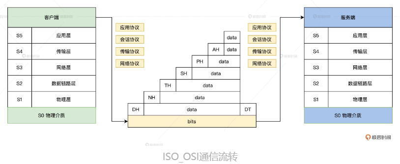
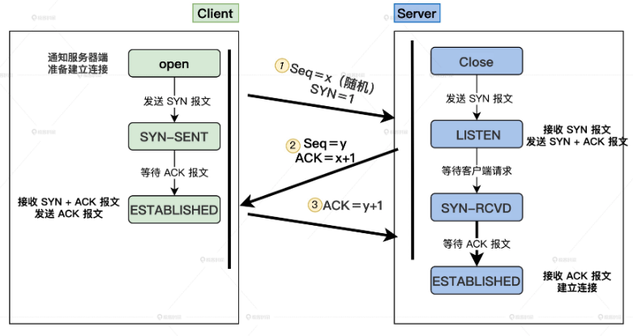
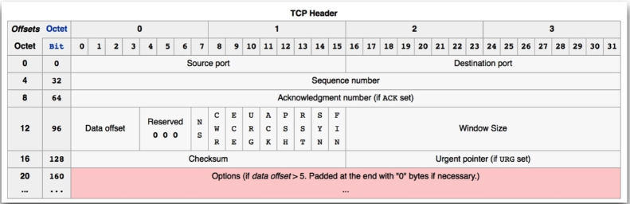
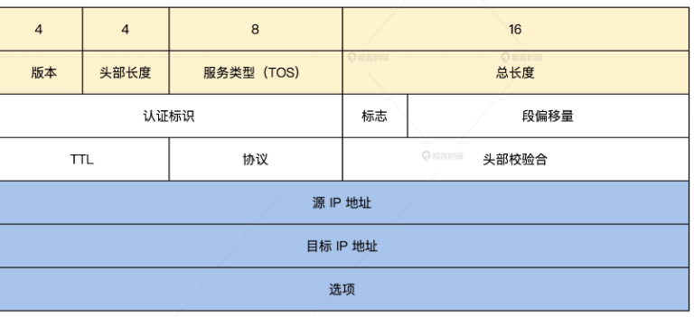
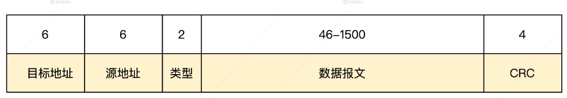
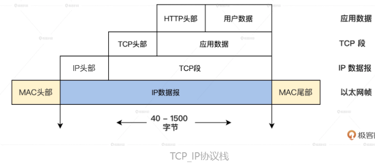
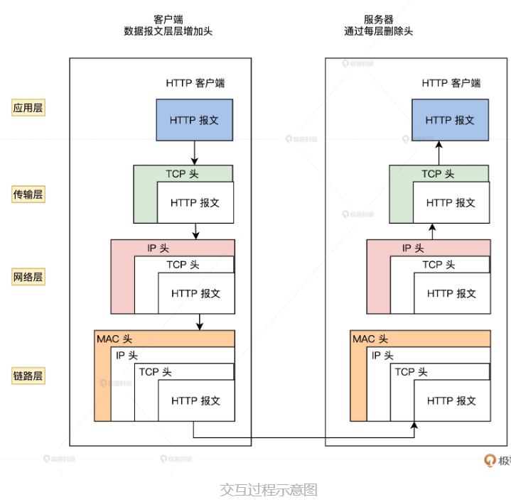

<!-- toc -->
从URL到网卡: 全局观察网络数据流动
- [一道经典的面试题--输入 URL，从一个请求到响应都发生了什么事？](#面试题)
- [网络分层和网络协议](#网络分层和网络协议)
- [发起请求阶段（应用层）](#发起请求阶段应用层)
    - [用户输入：在浏览器中输入URL](#用户输入在浏览器中输入-url)
    - [网络请求前：查看浏览器缓存](#网络请求前查看浏览器缓存)
    - [域名解析：DNS](#域名解析dns)
- [操作系统协议栈（传输层和网络层）](#操作系统协议栈传输层和网络层)
    - [可靠性传输：建立TCP连接](#可靠性传输建立tcp连接)
- [目的地定位：IP 层](#目的地定位ip-层)
- [点对点传输：MAC（链路层）](#点对点传输mac链路层)
- [电信号的出口：网卡（物理层）](#电信号的出口网卡物理层)
- [客户端服务端的持续数据交换（应用层）](#客户端服务端的持续数据交换应用层)
<!-- tocstop -->

# 面试题
输入 URL，从一个请求到响应都发生了什么事？  
1. 常规的网络交互过程是从客户端发起网络请求，用户态的应用程序（浏览器）会生成 HTTP 请求报文、并通过 DNS 协议查找到对应的远端 IP 地址。
2. 在套接字生成之后进入内核态，浏览器会委托操作系统内核协议栈中的上半部分，也就是 TCP/UDP 协议发起连接请求
3. 然后经由协议栈下半部分的 IP 协议进行封装，使数据包具有远程定位能力。
4. 经过 MAC 层处理，找到接收方的目标 MAC 地址。
5. 最终数据包在经过网卡转化成电信号经过交换机、路由器发送到服务端，服务端经过处理拿到数据，再通过各种网络协议把数据响应给客户端。
6. 客户端拿到数据进行渲染。
7. 客户端和服务端之间反复交换数据，客户端的页面数据就会发生变化。

# 网络分层和网络协议
为统一标准，国际标准化组织 ISO 推出了统一的 OSI 参考模型。当前网络主要遵循的 IEEE 802.3 标准，就是基于 OSI 模型提出的，主要定义的是物理层和数据链路层有线物理数据流传输的标准。  

**网络为什么要分层呢？**  
网络是复杂的。对于复杂的问题，我们自然要通过分层处理简化问题难度，降低复杂度，由于分层后的各层之间相互独立，我们可以把大问题分割成小问题。同样，分层也保证了网络的松耦合和相对的灵活，分层拆分后易于各层的实现和维护，也方便了各层的后续扩展。  
网络分层解决了网络复杂的问题，在网络中传输数据中，我们对不同设备之间的传输数据的格式，需要定义一个数据标准，所以就有了网络协议。  
  

# 发起请求阶段（应用层）
应⽤层就是⼯作在操作系统中的⽤户态。  
## 用户输入：在浏览器中输入 URL
浏览器会根据我们的输入内容，先匹配对应的 URL 以及关键词，给出输入建议，同时校验 URL 的合法性，并且会在 URL 前后补全 URL。例如我们以输入 cosmos.com 为例，首先浏览器会判断出这是一个合法的 URL，并且会补全为 http://www.cosmos.com。  
URI 一般语法由五个分层序列组成  
```t
URI = scheme:[//authority]path[?query][#fragment]  //URL 的格式

URI = 方案:[//授权]路径[?查询][#片段ID]   //行为说明
```
接着，浏览器从 URL 中会提取出网络的地址，也叫做主机名（host），一般主机名可以为域名或 IP 地址，此处使用域名。对 URL 进行解析之后，浏览器确定了服务器的主机名和请求路径，接下来就是根据这些信息来生成 HTTP 请求消息了。  
## 网络请求前：查看浏览器缓存
在请求发出之前，浏览器首先会检查保存在本地计算机中的缓存，如果访问过当前的 URL，会先进入缓存中查询是否有要请求的文件。此时存在的缓存有路由器缓存、DNS 缓存、浏览器缓存、Service Worker、Memory Cache、Disk Cache、Push Cache、系统缓存等。  
先看一下系统缓存，如果在浏览器缓存里没有命中缓存，浏览器会做一个系统调用获得系统缓存中的记录，就是我们的 gethostbyname 方法，它的作用是通过域名获取 IP 地址。这个方法会返回如下结构。  
```c
struct hostent
{
    char    *h_name;// 主机的别名.www.cosmos.com就是google他自己的别名  
    char    **h_aliases;// 主机ip地址的类型，到底是ipv4(AF_INET)，还是pv6(AF_INET6)
    int     h_addrtype;// 主机ip地址的类型
    int     h_length;// 主机ip地址的长度
    char    **h_addr_list; // 主机的ip地址，注意，这个是以网络字节序存储的
    #define h_addr h_addr_list[0] //这个函数，是将类型为af的网络地址结构src，转换成主机序的字符串形式，存放在长度为cnt的字符串中。返回指向dst的一个指针。如果函数调用错误，返回值是NULL
};
```
如果没有访问过当前的 URL，就会跳过缓存这一步，这时我们就会进入网络操作了。  
## 域名解析：DNS
浏览器确认了输入的 URL 之前没有访问，浏览器就会生成对应的 HTTP 请求，这时浏览器需要委托操作系统将 HTTP 报文发送到对应的服务端。  
在发送消息之前，还有一个工作需要做，就是查找服务端的 IP 地址，因为操作系统在发送消息时，必须知道对方的 IP 地址才可以发送。IP 地址由一串数字组成，不够语义化，为方便你记忆，我们将 IP 地址映射为域名，于是就有这样一个服务，维护了 IP 和域名的映射关系，它就是非常重要的基础设施——DNS 服务器。DNS 服务器是一个分布式数据库，分布在世界各地。DNS 是按照一定的结构进行组织的，不同层次之间按照英文句点. 来分割。  

在域名中，我们的层级关系是按照从左到右、从低到高排列的，不同层级由低到高维护了一个树形结构，最高一级的根节点为 root 节点，就是我们所谓的根域名服务器，因此 cosmos.com 完整的域名应该是 cosmos.com.，后面的 . 相当于.root。  
但是所有域名的顶级域名都一样，因此被省略；再下一级.com 为顶级域名；再下一级的 cosmos 为权威域名。  

因为这是一个树形结构，所以客户端只要请求到一个 DNS 服务器，就可以一层层递归和迭代查找到所有的 DNS 服务器了。按照由高到低的优先级，DNS 域名解析的过程排列如下。  
```t
DNS解析 > 浏览器DNS缓存 > hosts文件 > 本地DNS服务器 > ISP DNS服务器
```

# 操作系统协议栈（传输层和网络层）
我们已经根据 URL 拿到需要请求的唯一地址了，接下来就要委托操作系统将 HTTP 报文发送出去了，这个过程由操作系统中的协议栈负责处理（TCP/IP，LwIp）。  
协议栈的上半部分负责和应用层通过套接字（Socket）进行交互，它可以是 TCP 协议或 UDP 协议。应用层会委托协议栈的上部分完成收发数据的工作；而协议栈的下半部分则负责把数据发送给到指定方的 IP 协议，由 IP 协议连接下层的网卡驱动。  
## 可靠性传输：建立TCP连接
浏览器通过 DNS 解析拿到 Cosmos 的 IP 地址后， 浏览器取出 URL 的端口（HTTP 默认 80，HTTPS 默认 443）。随即浏览器会委托操作系统协议栈的上半部分创建新的套接字（Socket）向对应的 IP 发起 TCP 连接请求。  
**TCP的三次握手**  
  
1. 首先浏览器作为客户端会发送一个小的 TCP 分组，这个分组设置了一个特殊的 SYN 标记，用来表示这是一条连接请求。同时设置初始序列号为 x 赋值给 Seq （这次捕获组的数据为: SYN=1, Seq=1）。
2. 服务器接受到客户端的 SYN 连接后，会选择服务器初始序号 y。同时向客户端发送含有连接确认（SYN+ACK）、Seq=0（本例中的服务器初始序号）、Ack=1（客户端的序号 x +1）等信息的 TCP 分组。
3. 客户端收到了服务器的确定字段后，向服务器发送带有 ACK=1、Seq=1 (x+1)、Ack=1 （服务器 Ack 信息的拷贝）等字段的 TCP 分组给服务器。

**TCP 的包头**  
  
源端口号（Source port）和目标端口号（Destinantion port）是不可少的，如果没有这两个端口号，数据就不知道应该发给哪个应用。其次，你需要注意的是一串有序数字 Sequence number，这个序号保证了 TCP 报文是有序被接受的，解决网络包的乱序问题。之后的 Acknowledgement number 是确认号，只有对方确认收到，否则会一直重发，这个是防止数据包丢失的。紧接着还有一些状态位，由于 TCP 是有状态的，是用于维护双方连接的状态，状态发生变更会更新双方的连接状态。后面还有一个，窗口大小 Window Size，用于流量控制。  

# 目的地定位：IP 层
IP 协议是 TCP/IP 协议栈的核心，IP 协议中规定了在 Internet 上进行通信时应遵循的规则，包括 IP 数据包应如何构成、数据包的路由等，而 IP 层实现了网络上的点对点通信。  
网络数据包（无论输入数据包还是输出数据包）进入网络层后，IP 层协议的函数都要对网络数据包做后面这 5 步操作。  
1. 数据包校验和检验
2. 防火墙对数据包过滤
3. IP 选项处理
4. 数据分片和重组
5. 接收、发送和前送

IP 层被设计成三个部分，分别是 IP 寻址、路由和分包组包。  
IP 地址是以四组八位的组合进行约定，每组以. 号隔开，再转化为十进制的方式。这里要注意，IP 地址并不是以主机数目进行配置的，而是根据网卡数来进行。  
IP 层仍然是一个软件实现的功能逻辑层，那它如何完成通信呢，答案是不能直接完成通信，它只是把 IP 地址及相关信息组装成一个 IP 头，把这个 IP 头放在网络数据的前面，形成了 IP 包，最后把这个 IP 包发送给 IP 层的下一层组件就行了，IP 头的格式如下所示。  
  

# 点对点传输：MAC（链路层）
MAC 地址指的就是计算机网卡的物理地址  
需要对 IP 包加上 MAC 头，这个 MAC 头包括发送方的 MAC 头和接收方的 MAC 头，用于两个物理地址点对点的传输；此外还有一个头部字段为协议类型，在常规的 TCP/IP 协议中，MAC 头的协议类型只有 IP 和 ARP 两种。  
  
发送方的 MAC 头比较容易获取，读取当前设备网卡的 MAC 地址就可以获取，而接收方的 MAC 头则需要通过 ARP 协议在网络中携带 IP 地址，在一个网络中发送广播信息，这样就能获取这个网络中的 IP 地址对应的 MAC 地址  

# 电信号的出口：网卡（物理层）
数据包只是一串二进制数据，然而我们都知道，网络上的数据传送，是依赖电信号的，所以我们现在需要将数据包转化为电信号，才能在物理的网线上面传输。  
数据包通过网络协议栈的层层处理，最终得到了 MAC 数据包，这个 MAC 数据包会交给网卡驱动程序，而网卡驱动程序会将 MAC 数据包写入网卡的缓冲区（网卡上的内存）.然后，网卡会在 MAC 数据包的起止位置加入起止帧和校验序列，最后网卡会将加入起止帧和校验序列的 MAC 数据包转化为电信号，发送出去。  

# 客户端服务端的持续数据交换（应用层）
1. 我们的数据终于通过网卡离开了计算机，进入到局域网，通过局域网中的设备，集线器、交换机和路由器等，数据会进入到互联网，最终到达目标服务器。
2. 接着，服务器就会先取下数据包的 MAC 头部，查看是否匹配自己 MAC 地址。然后继续取下数据包的 IP 头，数据包中的目标 IP 地址和自己的 IP 地址匹配，再根据 IP 头中协议项，知道自己上层是 TCP 协议。
3. 之后，还要继续取下数据包 TCP 的头。完成一系列的顺序校验和状态变更后，TCP 头部里面还有端口号，此时我们的 HTTP 的 server 正在监听这个端口号，就把数据包再发给对应的 HTTP 进程。
4. HTTP 进程从服务器中拿到对应的资源（HTML 文件），再交给操作系统对数据进行处理。然后再重复上面的过程，层层携带 TCP、IP、MAC 头部。
5. 接下来数据从网卡出去，到达客户端，再重复刚才的过程拿到相应数据。客户端拿到对应的 HTML 资源，浏览器就可以开始解析渲染了，这步操作完成后，用户最终就能通过浏览器看到相应的页面。

  
  
我们可以看到，此时客户端和服务端之间通过 TCP 协议维护了一个连接状态，如果客户端需要关闭网络，那么会进行四次挥手，两边的网络传输过程至此完成。  